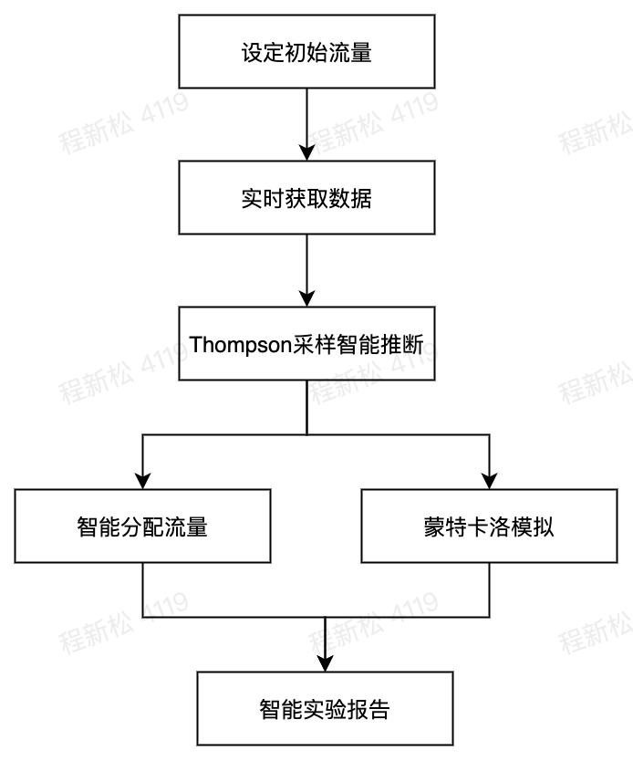

# MAB多臂老虎机智能调优的基本原理

## 一、MAB来源

一个赌徒，要去摇老虎机，走进赌场一看，一排老虎机，外观都一样，但是每个老虎机获取金币的概率可能不一样，并且你不知道每个老虎机获取金币的概率是什么？

> 那么问题来了，每次该选择哪个老虎机可以做到最大化收益呢？

**规则**：

（1）有n台机器，每次选取其中一台机器然后拉动杠杆，该机器提供一个随机的回报reward，比如是金币，每台机器reward服从特定的概率分布。

（2）一个赌徒有m次拉杠杆的机会，他的目标使得的回报reward最大化。现在要去确定这m次选择机器的顺序。最为聪明的赌徒，他会记录喜爱每一次得到的reward，试图找到最大的reward的那台机器，尽量多次数的去拉这个机器的杠杆。

（3）得到的收益叫reward，一般假设为伯努利分布(https://zh.wikipedia.org/wiki/%E4%BC%AF%E5%8A%AA%E5%88%A9%E5%88%86%E5%B8%83)，也就是0-1分布。得到收益与真实的最大收益之间的差值称为regret，也就是遗憾，（通过上帝视角，假设一开始就知道哪个收益reward最大，我就会去拉哪个手臂）

（4）最大的难处：寻找获取回报reward最高的机器 和 最大收益 的平衡

如上图所示，第二个机器Machine 2，是获取回报reward最高的机器，要想获取最大收益，就需要选择单个机器回报最高的Machine 2。

## 二、MAB是什么

MAB来源总结一下：一个赌徒来到赌场玩老虎机，每个老虎机中奖概率都不同，每一台玩一次需要一枚硬币，而赌徒只有T枚硬币，他要如何分配在每台老虎机上面的尝试次数，进而获得最高的期望收益呢？

不是说多臂老虎机吗？多臂从哪儿体现出来？

赌场的老虎机有一个绰号叫单臂强盗（single-armed bandit），因为它即使只有一只胳膊，也会把你的钱拿走。而多臂老虎机（或多臂强盗）就从这个绰号引申而来。假设你进入一个赌场，面对一排老虎机（所以是多个臂），由于不同老虎机的期望收益和期望损失不同，你采取什么老虎机选择策略来保证你的总收益最高呢？

给MAB定义一下：

MAB多臂老虎机（Multi-Armed Bandit）智能调优，也就是智能流量调优，基于贝叶斯理论的多臂老虎机的相关算法，定时循环推送，自动将分配的流量倾斜到核心指标表现最好的推送版本策略中，设置的版本流量权重将为初始比例，智能调优之后，将允许推送某个实验版本的用户出组，并推送到其他版本的策略。

太拗口，还是很迷惑？一句话来说清楚：

> 设置不同实验版本的流量权重，自动将分配的流量倾斜至核心指标表现最好的实验版本，从而产生优胜版本。

## 三、为什么引入MAB

AB实验依赖于统计显著性的经典统计检测。

当我们提出一个新的产品特性，我们可能想要在向整个用户群发布新特性之前测试这个新特性是否真的有用。

实施：我们有对照组和实验组（可以访问新特性），然后我们测量两个群体的关键指标：网站上平均停留时长（社交网络），平均支付时间（电子商务），点击率（在线广告），最后我们检验两个组之间的差异是否有统计学意义。

一个平衡的AB实验将分配相等的流量给每一个组，直到达到足够样本大小。但是我们不能在AB实验期间根据观察到的情况调整流量分配，这也是AB实验的缺点：如果实验组明显优于对照组，我们还需要在对照组上花费大量的流量，才能获取统计学意义。

所以MAB最大的优势体现出来：对于用户流量不足的早期初创公司，MAB实验效果更好，因为它需要更小的样本量，提前终止，比常规AB实验更敏捷。

## 四、收益和成本

在AB实验下，每台老虎机代表实验中的一个实验组，每次拉动臂杆代表该实验版本的一次曝光，累计回报代表核心指标的累计转化。

通过概率分布的思想找到最有可能成为最优解的实验版本，并加大分配的流量，实时计算实验收益，实时动态调节流量从而最大化实验收益。

需要考虑：**快速发现并收敛到高价值的版本** 和 **不放弃各种新的尝试** 这两者之间寻求平衡。

### 1、常规AB实验与MAB实验对比

通用的A/B实验与MAB智能实验的流量调优，如下两图所示：

### 2、哪些场景下使用MAB？

与传统的A / B实验相比，以下几种场景建议使用MAB智能流量调优实验：

-   **促销优惠**：此类场景更关注提高转化率。MAB多臂强盗智能实验，在促销期间将更多流量发送给效果较好的变体，而将较少流量发送给效果欠佳的变体，尽快拿到收益。
-   **推送策略**： 推送文案/标题是生命周期较为短暂的内容。固定的活动期间后，会失去相关性。多臂MAB智能实验，可以使策略最大程度地尽快发挥效用。
-   **落地页** **优化**： 尝试几种不同版本的目标落地页（landing page），提高网络研讨会/发布会、活动等注册率。

### 3、MAB存在的问题

MAB智能流量调优，有一定概率可能会拉长实验时间（大多数情况下也会提前终止）。一定要注意的，天下没有免费的午餐，更小的样本规模带来的便利是以更大的假阳性率为代价的。

说明：

-   假阳性率：在科学实验或检测当中，出现错误判断的几率

## 五、关键技术简介

### 1、Thompson采样

Thompson采样基于贝叶斯的智能推断，采样切断了多重比较和多次观察的犯错可能，简而言之，汤普森抽样是一种贪婪的方法，总是选择期望回报最大化的那条臂。

### 2、智能分配流量

最优分配实验流量，实时的数据获取服务，间隔30s扫描数据计算实验效果，采用智能分流算法实时分配最优流量到各个版本，将实验在表现（performance）和变现（monetization）上的成本都降到最低。

### 3、蒙特卡洛模拟

决策实验何时收敛，采用蒙特卡洛模拟。蒙特卡洛模拟的工作方式是多次从K个臂中随机抽取样本，然后经验地计算每一个臂获胜的频率。如果获胜的一方以足够大的优势击败另一方，实验就会终止。

### 4、智能实验报告

自动化的实验结论，实际是智能流量实验计算各个实验版本称为最优的概率，产生简单易懂的分析报告，并且提供收益评估，调优轮次，进组用户趋势，指标趋势，盒须快照，概率分布六类分析报告。

-   **收益评估**：展示智能调优每轮的收益(即相对于普通实验的收益值，pp指百分点），可清晰查看调优多轮后收益的收敛情况

<!---->

-   **进组用户趋势**：展示每天实验版本和对照版本的进组用户数变化趋势

<!---->

-   **天级趋势：** 展示分天的指标数据，每天实验版本和对照版本的指标值

<!---->

-   **概率分布：** 展示的是指标的取值及其出现的概率分布，实验组和对照组的概率分布对比，可辅助判断实验组和对照组的差异情况。

<!---->

-   **盒须快照：** 又称为箱型图，是通过数据的最大值、最小值、中位数和两个四分位数，反映原始数据分布特征。通过实验组和对照组的盒须快照对比，可以进行两组数据分布特征的比较。

<!---->

-   **累积趋势：** 指的是从实验开始截止到当前天的指标数据。

## 参考

-   https://arxiv.org/pdf/1707.02038.pdf
-   https://lilianweng.github.io/lil-log/2018/01/23/the-multi-armed-bandit-problem-and-its-solutions.html
-   [文档中心-火山引擎](https://www.volcengine.com/docs/6287/69102)
-   https://riverzzz.github.io/2019/03/31/bandit%E7%AE%97%E6%B3%95/
-   https://lumingdong.cn/exploration-and-exploitation-in-the-recommendation-system.html
-   https://github.com/im-iron-man/computational-advertising
-   http://mark.reid.name/code/bandits/

## 火山引擎：AB测试平台
> 欢迎👏试用AB实验平台DataTester：https://console.volcengine.com/datatester/app/164155/flight/list  如果试用中存在问题欢迎公众号下留言或者加我微信咨询使用问题。

#### 更多阅读
+ [【提前批】「松宝写代码」内推字节跳动2022校招研发提前批](https://mp.weixin.qq.com/s/lKsgF_PlemOdW6TJrVF84w)

+ [【字节急招】多地-前端开发工程师-抖音（北京/深圳/上海/杭州）](https://mp.weixin.qq.com/s/KpWtFVQsUgind9jugevFtg)

+ [【字节急招】多地-前端研发工程师-Data](https://mp.weixin.qq.com/s/1yhT4aon2qXXlcXSK-rbuA)

+ [【字节急招】南京-前端开发工程师—数据可视化](https://mp.weixin.qq.com/s/DY1b53FvcIM5CzbAFpj_Fw)

+ [AB实验基础-AB是什么？AB的价值？为什么使用AB实验？](https://mp.weixin.qq.com/s/UcwpNqRQ3we10S9z5cO53g)

+ [【每日一题】(57题)数组扁平化的方法有哪些？](https://mp.weixin.qq.com/s/sXIJ6bQj97bZTaYHQgJTIw)

+ [【每日一题】(56题)介绍下深度优先遍历和广度优先遍历，如何实现？](https://mp.weixin.qq.com/s/KkqdB4mWlMgZMcHVhZVZXQ)

+ [【每日一题】(55题)算法题：实现数组的全排列](https://mp.weixin.qq.com/s/0KKYgUXJpnJ2yIQ9DY8eJA)

+ [2020「松宝写代码」个人年终总结：未来可期](https://mp.weixin.qq.com/s/_ay6KfcC5DMoZu9XqS2NHA)

## 谢谢支持

1、文章喜欢的话**可以「分享，点赞，在看」三连**哦。

2、作者昵称：saucxs，songEagle，松宝写代码。「松宝写代码」公众号作者，每日一题，实验室等。一个爱好折腾，致力于全栈，正在努力成长的字节跳动工程师，星辰大海，未来可期。**内推字节跳动各个部门各个岗位**。

3、关注「松宝写代码」，是获取开发知识体系构建，精选文章，项目实战，实验室，**每日一道面试题**，进阶学习，思考职业发展，涉及到JavaScript，Node，Vue，React，浏览器，http，算法，端相关，小程序，AB实验，数据分析等领域，希望可以帮助到你，我们一起成长～

> 点击「阅读原文」，跳转到字节内推