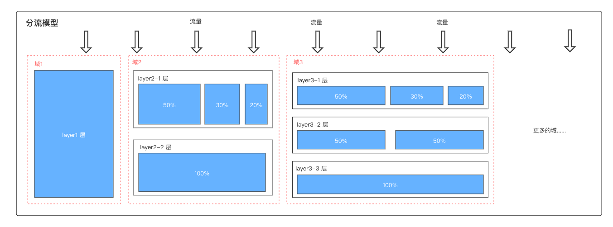

# AB实验基础-专有名词

## 前言

在互联网下半场竞争中实现科学增长，切实让AB实验发挥增长引擎的作用是应有之义。

注意：A/B测试，AB实验是同一个概念。

我们在上一篇中介绍《AB实验基础-AB是什么？AB的价值？为什么使用AB实验？》

## 一些专有名词

**应用名称**：应用可以是web，安卓，IOS，小程序，桌面端等，比如：抖音，今日头条等

**实验：** 一个AB实验Flight

**指标：** 主要是几个指标，根据上报的事件构成指标，便于数据计算统计和分析。比如：要分析注册按钮的点击率，直接在指标中可以选择按钮的点击事件和计算方式（算子）的【转化率】

**实验组：** 实验组Version，每个实验组都包含配置，代表要做实验的策略。

**实验策略**：参数，参数类型，参数值。开启一个实验的时候，通过「参数」随机下发，用户进组，然后通过「参数值」随机下发到对照组和实验组中。「参数类型」支持参数值可以是多种类型的数据类型，灵活运用。

**实验层**：layer，每个实验层都代表100%的线上流量

-   按不同hash策略，分为4种Layer类型

    -   uid层：按用户id分流，常见
    -   did层：按设备id分流，常见
    -   rid层：按请求id分流，少见，多用于广告业务
    -   uuid层：按用户id分流，极少，只有游戏业务用到

-   **互斥：** 同一层的实验之间，流量是互斥的，即用户之间没有overlap

-   **正交：** 不同层的流量和用户映射关系是完全随机的，随机带来的结果就是，其他层上的实验对另一个实验不同Version间的影响程度是打平的。这种现象一般说法就是不同层实验之间流量正交

**分桶**：每一个层中，使用独立hash对用户进行取模，将用户均匀分配到所有的实验桶中，桶与桶之间互斥。

**流量**：实验所占的线上流量Traffic，精度0.1%

**流量分配**：产品在快速迭代中，会有很多AB测试需要同时做，而且产品的流量有限，所以需要充分对流量进行分配。

**过滤条件**：实验过滤条件Filter，规定被实验命中的用户必须符合（或不符合）这些条件，进而达到缩小用户集群、精准找到用户的目的，只有满足条件的流量才会命中实验。

**白名单**：在实验正式开启之前，通常需要先选择几名用户进入测试阶段，观察实验是否能够正常获取想要收集的数据。

**命中进入实验**：用户经过随机分配后，进入实验组或对照组，参与到实验之中，即称为用户被实验“命中”；反之则为“未命中”。

**分流服务**：究竟是什么决定了哪些用户被实验命中，需要使用A/B实验分流服务。

-   分流服务会将总体流量中抽取部分流量，并将抽取的流量随机地分配进A组与B组之中，尽量减少抽样误差。

<!---->

-   当分流服务分流完成后，被选中进入实验的用户会被赋予一个“身份信息”ab_version(又称vid)，这个id标记着你究竟应该进入实验的哪一组中。

**SDK**：把SDK理解成一个小型工具包，来实现指定的功能，帮助我们解决指定的问题，集成「AB客户端SDK」的主要作用就是帮助实验者进行分流。

**方差和标准差**：

-   方差：方差是数据组中各数据值与中心值间距的平方和的平均值，方差的计算公式：公式中M为数据的平均数，n为数据的个数，s²为方差。

<!---->

-   标准差：标准差是方差的平方根，即s。

**假设检验：** 假设检验是用来判断样本与样本，样本与总体的差异是由抽样误差引起还是本质差别造成的统计推断方法。其基本原理是先对总体的特征作出某种假设，然后通过抽样研究的统计推理，对此假设应该被拒绝还是接受作出推断

**显著性水平：** 是假设检验中的一个概念，是指当原假设为正确时人们却把它拒绝了的概率或风险。它是公认的小概率事件的概率值，必须在每一次统计检验之前确定，通常取α＝0.05或α＝0.01。这表明，当作出接受原假设的决定时，其正确的可能性（概率）为95％或99％

**置信**：也称之为统计显著，统计上的显著性通常用p值来衡量，如果p值低于显著性水平(通常是<0.05)，我们就称之为统计显著(or置信)。

举个例子：我们现在开了一个实验来优化商品页面的用户购买率，其中采用了新策略B的实验组，购买率提升均值为5%，置信区间为[-3%，13%]。

分析：由于在A/B实验中我们采取小流量抽样的方式，样本不能完全代表总体，那么实际上策略B如果在总体流量中生效，不见得会获得5%的增长。如果我们设策略B在总体流量中推行所导致的真实增长率为μ，那么在这个案例中，μ的真实取值会在[-3%，13%]之间。

## 最后

了解一些AB实验的一些名词，便于我们更好理解实验，并且更好的实施AB实验。

AB实验对于增长团队来说是多么重要。但是A/B实验远没有这么简单，它有着复杂的原理和严谨的流程，其中秘密恐怕不能用一篇文章讲清。

AB实验到底怎么操作？AB实验到底有哪些应用场景？AB实验中开实验的过程中有哪些容易踩的坑？等等

后续为你深度解析AB实验，敬请期待吧！

> 总之，我们希望通过AB实验可以在快速迭代的试错之路上，大胆假设、小心求证。

#### 更多阅读
+ [【提前批】「松宝写代码」内推字节跳动2022校招研发提前批](https://mp.weixin.qq.com/s/lKsgF_PlemOdW6TJrVF84w)

+ [【字节急招】多地-前端开发工程师-抖音（北京/深圳/上海/杭州）](https://mp.weixin.qq.com/s/KpWtFVQsUgind9jugevFtg)

+ [【字节急招】多地-前端研发工程师-Data](https://mp.weixin.qq.com/s/1yhT4aon2qXXlcXSK-rbuA)

+ [【字节急招】南京-前端开发工程师—数据可视化](https://mp.weixin.qq.com/s/DY1b53FvcIM5CzbAFpj_Fw)

+ [AB实验基础-AB是什么？AB的价值？为什么使用AB实验？](https://mp.weixin.qq.com/s/UcwpNqRQ3we10S9z5cO53g)

+ [【每日一题】(57题)数组扁平化的方法有哪些？](https://mp.weixin.qq.com/s/sXIJ6bQj97bZTaYHQgJTIw)

+ [【每日一题】(56题)介绍下深度优先遍历和广度优先遍历，如何实现？](https://mp.weixin.qq.com/s/KkqdB4mWlMgZMcHVhZVZXQ)

+ [【每日一题】(55题)算法题：实现数组的全排列](https://mp.weixin.qq.com/s/0KKYgUXJpnJ2yIQ9DY8eJA)

+ [2020「松宝写代码」个人年终总结：未来可期](https://mp.weixin.qq.com/s/_ay6KfcC5DMoZu9XqS2NHA)

## 谢谢支持

1、文章喜欢的话**可以「分享，点赞，在看」三连**哦。

2、作者昵称：saucxs，songEagle，松宝写代码。「松宝写代码」公众号作者，每日一题，实验室等。一个爱好折腾，致力于全栈，正在努力成长的字节跳动工程师，星辰大海，未来可期。**内推字节跳动各个部门各个岗位**。

3、关注「松宝写代码」，是获取开发知识体系构建，精选文章，项目实战，实验室，**每日一道面试题**，进阶学习，思考职业发展，涉及到JavaScript，Node，Vue，React，浏览器，http，算法，端相关，小程序，AB实验，数据分析等领域，希望可以帮助到你，我们一起成长～

> 点击「阅读原文」，跳转到字节内推