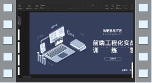

# Web进阶-前端工程化实战-资料包

你们有没有听说过「前端工程化」这个词？相信最近去大厂面试的朋友们一定不陌生，因为现在大厂面试都对「前端工程化」有要求。

## 为什么大厂会着重考察前端工程化？

随着前端技术的不断发展，前端的业务逻辑逐渐变得复杂，企业对于前端的应用功能要求不断提高，比如优化开发流程，提高编码效率，提高项目可维护性等等。

可以说`从项目搭建到部署上线的每一个过程都可以通过工程化，提高工作效率。`

**这也就是为什么大厂都要求前端工程化的一个重要原因。**

但是大多数人对于前端工程化的概念都是一知半解，如果想要冲击大厂，更是难上加难。

所以，真心给大家推荐一个`《前端工程化实战》资料包`，从`带你构建一个自己的组件库，到前端工程化实战及前沿技术Vite等讲解`，让你对前端工程化有系统性认识，解决你的前端进阶中的工程化难题。拿到这个资料包你至少能从3方面有所收获：

现在扫描下方二维码，0元就能领！

数量不多，先到先得

Ps.一定记得添加助教老师微信领取！

30分钟之内，老师将会添加你并把资料给到各位同学，数量不多，赶快扫码领取吧！

### 资料内容：

### 视频资料截图

体验组件库从0搭建到开源发布的全部流程，让你拥有自己组件库的同时，对前端工程化有基本的理解。

学习实战技术，比如快速剥离出新项目的脚手架，编写工程化CLI工具等，让你告别重复劳动！

从战略和前沿技术层面，开阔眼界，比如如何通过参加开源项目提高自己，如何让你的通用组件更受欢迎等等。

长按扫码`0元`获取

详细前端工程化实战资料

数量不多，先到先得

Ps.一定记得添加助教老师微信领取！

30分钟之内，老师将会添加你并把资料给到各位同学，数量不多，赶快扫码领取吧！