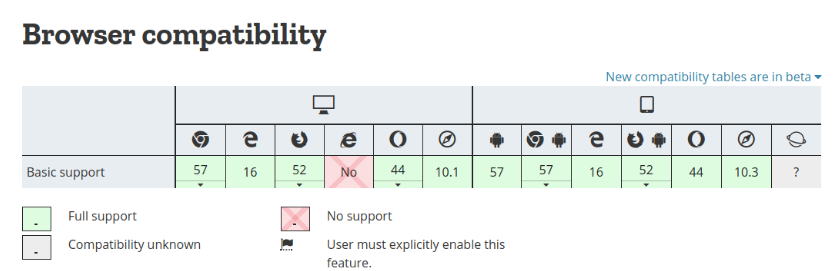
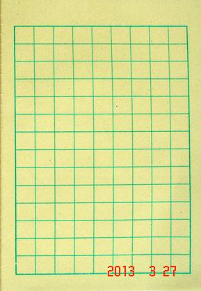
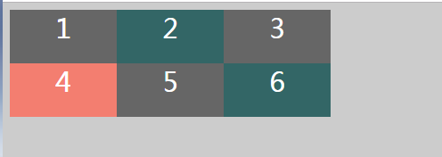
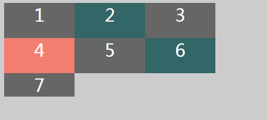
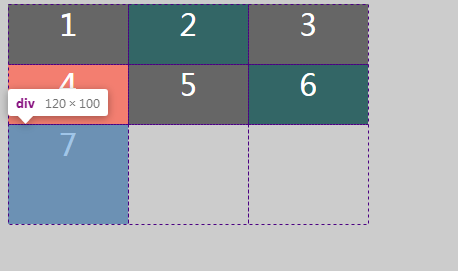
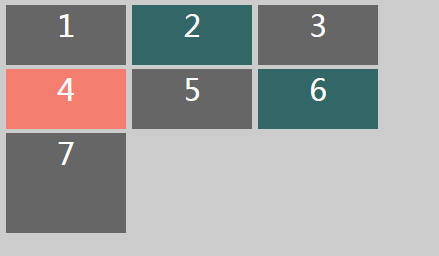
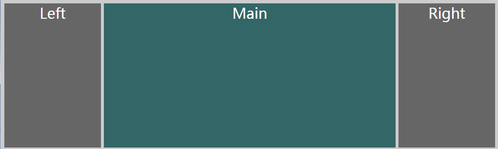

### Grid布局，你会了吗？
#### 一、前言
之前一直觉得flex弹性盒布局已经很可以了，缺点是浏览器兼容性差，IE9及以上。

#### 二、各种布局的梳理
##### 1、静态布局
静态布局也就是传统的布局，屏幕宽或者高变化的时候，盒子使用横向或者纵向滚动条来查看遮挡，
也就是说，不管浏览器的视窗大小变化，都是按照html语义标签排列的布局来布置。

##### 2、弹性布局
css3引入的弹性盒布局，flex布局，优点：入手很快，格局flex布局很容易达到布局效果，
缺点：浏览器兼容差，IE9及以上。

##### 3、自适应布局
分别为不同屏幕分辨率定义布局，每一个布局中，页面元素不随窗口大小的调整而发生改变。
当窗口达到一定分辨率时候变化一次。

##### 4、流式布局
页面元素的宽度按照屏幕的进行适配调整，元素的位置不变，大小变化。

##### 5、响应式布局
在head中加入meta标签
``html
<meta name="viewport" content="device-width,initial-scale=1.0,minimum-scale=1.0,maximum-scale=1.0,user-scalable=no">
``
页面元素宽度随着窗口调整自动适配。
解释：
+ name="vieport"，名称为视图。
+ width=device-width，页面宽度等于设备宽度。
+ initial-scale-初始化缩放比例。
+ minimum-scale-允许用户缩放的最小比例。
+ maxmum-scale-允许用户缩放的最大比例。
+ user-scalable-知否支持用户手动缩放

##### 6、网格布局Grid
二维布局系统，随意的定义每行每列的数目和大小，非常方便，兼容性还不错。

从上图可以知道：
PC端：chrome，edge，firefox，IE，Opera，Safari
移动端：android，chrome for android，edge Mobile，Firefox for android，opera，ios safari。

#### 三、基本概念
我们小时候学着写字的时候，网格。


我们简单介绍一下基本概念：
+ Container:网格容器，设置display：grid，这个容器就变成网格容器。
+ Item：网各项，设置网格容器的每一个子元素都是网格项。
+ Line：网格线，网格之间的分界线。
+ Track：网格轨道，两条相邻的网格线之间的空间。
+ Cell：网格单元，两个相邻的行列之间的区域，就好似上面每一个小格子
+ Area：网格区域，四条网格线包围起来的区域。

#### 三、基本用法
我们先来看一个简单的
```html
<head>
    <meta charset="UTF-8">
    <title>Grid布局 | saucxs | songEagle</title>
    <style>
        body{
            background: #ccc;
        }
        .container{
            display: grid;
            grid-template-columns: 120px 120px 120px;
            grid-template-rows: 60px 60px;
        }
        .container > div{
            font-size: 30px;
            color: #fff;
            text-align: center;
            background: #666666;
        }
        .container > div:nth-child(2n){
            background: #336666;
        }
        .container > div:nth-child(4n){
            background: #f37e70;
        }
    </style>
</head>
<body>
    <div class="container">
        <div>1</div>
        <div>2</div>
        <div>3</div>
        <div>4</div>
        <div>5</div>
        <div>6</div>
    </div>
</body>
```

分析：
+ grid-template-columns: 120px 120px 120px 将容器画成三列，每列120px。
+ grid-template-rows: 50px 50px 将画成2行，每行50px。

上面的这两个属性将容器加上了两条横线，三条竖线，这样就画好格子了，里面有6个格子，如果再加一个div呢？
最后变成这样

**其实grid里，有一个隐式网络轨道**，意思就是：当我们的网格项没有处于我们定义的网格部分，会有一个默认值。
通过grid-auto-columns和grid-auto-rows来定义行和列。

现在我们来定义一下隐式网络轨道
```css
.container{
   // 新增加
   grid-auto-columns: 300px;
   grid-auto-rows: 100px
}
```


发现隐式网格的宽度是300px没有生效。不知道原因？

发现可以使用minmax函数来自适应
```css
.container{
   // 新增加
   grid-auto-columns: minmax(300px, auto);
   grid-auto-rows: minmax(100px, auto)
}
```

格子之间紧紧挨着，加上间隔，我们可以使用grid-gap: 4px 6px。
```css
.container{
   // 新增加
   grid-gap: 4px 6px
}
```



#### 四、fr单位和repeat
**grid中的一个单位值fr**
fr表示自由空间中分配的一个单位，和flex的属性flex属性:flex-grow flex-shrink flex-basis，等分剩余空间。

比如说：容器宽度1000px，加入设置了grid-template-columns：200px 1fr 1fr 2fr。
这就表示分为4列，第一列200px，剩下的800px的剩余空间，800px/4=200px，2fr等于200px。

如果有多个重复的内容，我们可以使用repeat。
比如：
```css
 .container{
 // 修改
 grid-template-columns: 120px 120px 120px repeat(3, 1fr);
}
```

#### 五、网格线的应用
如果我们要实现一个三栏布局，左右200px，中间自适应
```html
<head>
    <meta charset="UTF-8">
    <title>Grid布局 | saucxs | songEagle</title>
    <style>
        body{
            background: #ccc;
        }
        .container{
            display: grid;
            grid-template-columns: 200px 1fr 200px;
            grid-template-rows: 300px;
            grid-auto-columns: minmax(300px, auto);
            grid-auto-rows: minmax(100px, auto);
            grid-gap: 4px 6px;

        }
        .container > div{
            font-size: 30px;
            color: #fff;
            text-align: center;
            background: #666666;
        }
        .container > div:nth-child(2n){
            background: #336666;
        }
        .container > div:nth-child(4n){
            background: #f37e70;
        }
    </style>
</head>
<body>
    <div class="container">
        <div>Left</div>
        <div>Main</div>
        <div>Right</div>
    </div>
</body>
```


如果现在要改需求，需要再加一个header和footer，宽度是main的宽度。

可以使用网格线名称，grid-template-columns属性和grid-template-rows属性追踪使用方括号[]，指定网格线的名称，方便引用。

首先修改html
```html
<div class="container">
  <div class="left">Left</div>
  <div class="main">Main</div>
  <div class="right">Right</div>
  <div class="footer">Footer</div>
</div>
```

然后修改css
```css
  .container{
            display: grid;
            grid-template-columns: [index-start] 200px [main-satrt] 1fr [main-end] 200px [index-end];
            grid-template-rows: 100px 500px 100px;
            grid-gap: 4px 6px;
            grid-auto-columns: minmax(300px, auto);
            grid-auto-rows: minmax(100px, auto);
        }
        .header {
            grid-column: index-start / index-end;
        }
        .left {
            grid-column: index-start / main-satrt;
        }
        .main {
            grid-column: main-satrt / main-end;
        }
        .right {
            grid-column: main-end / index-end;
        }
        .footer {
            grid-column: index-start / index-end;
        }
```
现在网格线来布局，横向布局4条网格线，纵向4条网格线，默认网格会为编号，从1开始，也可以自己命名网格线，

**同样可以使用横向向网格线。**

使用网格线将元素固定到它该有的位置上

最后说一下两个属性：
+ grid-column: 纵向网格名/纵向网格名
+ grid-row: 横向网格名/纵向网格名


#### 六、网格区域的应用
我们先来说一下两个属性
+ grid-template-areas
+ grid-area
我们还可以通过另外一种创建网格的方式来定位元素，和画图一样，上面的例子
```css
.container {
  display: grid;
  grid-template-columns: 200px 1fr 200px;
  grid-template-rows: 50px 300px 50px;
  grid-template-areas:
    '. h .'
    'l m r'
    '. f .';
  grid-gap: 4px 6px;
}

.header {
  grid-area: h;
}
.left {
  grid-area: l;
}
.right {
  grid-area: r;
}
.main {
  grid-area: m;
}
.footer {
  grid-area: f;
}
```
通过这种方式，我们也可以实现上面的需求。在grid-template-areas中的'.'代表这个位置空着。


