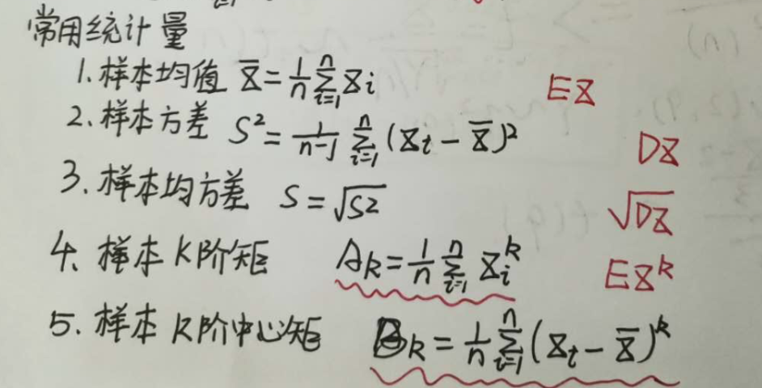

# AB实验背后的秘密：样本量计算
## 一、前言
- 背景：
ABTester实验是具有一定前瞻性，统计性，科学性的特点。用好了就实现了在大数据时代的充分利用数据分析问题，解决问题，为决策提供强有力的依据，但是有时候用户在使用ABTester时候，会出现一些痛点和疑惑。

- 痛点：
  - 每次实验需要多少流量
  - 实验时间开多长没有概念

- 解决问题：
  - 为了验证某一个功能特性，一个实验需要开多少流量。
  - 一个实验需要开多长时间

## 二、基础概念
### 1、研究对象
总体X：研究问题某个数量指标。

### 2、入手点
个体：总体中的一个元素xi 
样本：一部分个体Xi

### 3、工具--统计量

### 4、抽样分布
- 标准正态分布N(0, 1)
- Ka方分布
- t-分布
- F-分布

### 5、抽样定理
简单介绍几个

              
            

              
            

              
            

### 6、参数估计
通俗的说：样本参数去估计总体的参数。
举个🌰：
- 样本均值估计总体均值，
- 用样本比例去估计总体比例，
- 用样本方差估计总体方差

（1）分类：点估计和区间估计
- 点估计通俗的说：用样本的统计量的值直接作为总体参数的估计值。
- 区间估计通俗的说：在点估计的基础上，给出总体参数估计的一个区间范围。

（2）置信区间和置信水平
通俗的说：区间估计中，样本统计量构造的总体参数的估计区间，称为置信区间。
举个🌰：
- 100个样本，每一个样本构造一个置信区间，100个样本构造的总体参数的100个置信区间中，有95%的区间包含了总体参数的真值，5%则没有包含。

大样本下，样本均值的置信区间：

              
            

（3）总体均值的区间估计原理
大样本下，根据中心极限定理，可以得到的样本均值的抽样分布。

              
            

### 7、假设检验
我们来看一下一个简单的假设性检验的例子：
根据水稻长势，估计平均亩产310kg，收割时，抽取10块地，测平均亩产320kg，如水稻产量服从正态分布N(u, 144)，问所估计平均亩产是否正确？（a = 0.05，Z0.05 = 1.645，Z0.025 = 1.96）
分析：当方差已经的情况下，使用Z检验；未知的时候，使用t检验

              
            

## 三、一个简单并完整的ABTester例子
### 1、背景和设置
- 背景：有个web应用，接入了咱们sdk，上报各种事件埋点。
- 确认优化的目标：注册流程改版，从而提供注册转换率。
- 注册流程的A/B测试：之前是使用了图片校验码的方式，但是注册转化率偏低。提出设想：图片校验码方式改成短信校验码方式，是因为降低了用户输入的难度从而可以提高注册转换率。
- 我们设置
  - 核心指标：注册转化率
  - 设置版本：1个对照版本（图片校验码）。1个实验版本（短信验证码）。
  - 设置版本流量：总流量我们设置50%，各个版本均匀分配。
- web应用引入我们客户端分流sdk的，然后将版本代码插入到项目中。

### 2、结果分析
分别为两个版本分配了25%的用户流量，通过2个自然周左右的实验观察，数据显示。
结果：新版本（短信校验码）的注册转化率提升了接近10%，并且95%置信区间是[8%, 12%]，
分析：说明这个实验版本推广到全量用户之后，95%的概率下至少会有8%到12%的提升。
决策：基于这个实验结果，产品经理选择将新版本注册流程推送给全部用户，显著提升了注册转化率。

## 四、详细介绍样本量计算
### 1、注册流程改版例子🌰
实验运行后，用户开始进组。
1天后数据统计

              
            
这就能说明：短信验证码的功能有效提高注册转换率？

2天后数据统计

              
            
这就能说明：图片验证码的功能有效提高注册转换率？

那么到底，注册流程改版对于提高注册转换率是否有显著性提高呢？暂时是不能给出结论的，因为数据样本还不够大，不能充分说明。

理论上：样本量越多越好。
现实上：1、自身样本不够大；2、试错成本大。

选择样本数量是个技术活：样本量太小，有人骂娘；样本量太大，还是有人骂娘。那么问题来了：如何确定一个“最小”的样本数量，在保证实验“可靠性”的同时，不会浪费过多流量？

### 2、最小样本公式
统计学里有最小样本量计算的公式：

              
            
说明：
1、n是每组所需样本量，因为A/B测试一般至少2组，所以实验所需样本量为2n；
2、α和β分别称为第一类错误概率和第二类错误概率，一般分别取0.05和0.2；
3、Z为正态分布的分位数函数；
4、Δ为两组数值的差异，如注册转换率50%到60%，那么Δ就是10%；
5、σ为标准差，是数值波动性的衡量，σ越大表示数值波动越厉害。

从而可知：实验两组数值差异Δ越大或者数值波动性σ越小，所需要的样本量就越小。

### 3、方法一：假设两个转换率方差相等
条件：假设两个转换率的方差（可变性）相等。
上面公式转换为：

              
            
说明：
1、e1和e2是真实的注册转换率。
2、e 是合并方差估计量。
3、α是显著性水平（通常α = 0.05）
4、β是期望功效（通常β = 0.8）
5、Zβ和Zα/2针对给定参数的临界值α和β
固定值：α = 0.05时，Zα/2 = 1.96。β = 0.8时，Zβ = 0.84。

【注册流程改版例子🌰】具体计算过程：
（1）两个版本权重相等的情况
这里使用合并估计量作为方差。

              
            
如果我们不假设两个转换率的方差相等，则公式会略有不同，后边给出

代入公式，得到最终的样本的公式：

              
            

我们来真实计算一下：
1、注册转换率e1为50%，e2为60%
2、假设最小标准值为0.8的期望功效
3、显著性水平α为0.05

              
            
因此。每组（对照组和实验组）的最小样本量为385。

（2）两个版本的注册转换率权重不等的情况
这种情况下，第一步，假设各组大小相等，计算总样本量；然后，可以根据两组实际比率k来调整此总样本量大小N，而修改后的总样本大小N '，可以通过下面公式来计算：

              
            
以上两组中，每个样本的样本大小分别为N '/（1 + k）和kN '/（1 + k）。

### 4、方法二：使用假设性检验
适用范围：
- 假设性检验本身可以对单个总体参数或者两个总体参数进行。
- 假设的内容可以是双侧检验。比如参数是否等于某个值，还可以参数是否大于或者小于某个值。

AB实验背景下，我们通常使用的是双总体双侧检验。
具体实施
原假设：μ1=μ2
备择假设：μ1≠μ2

构造统计量
条件：两个样本间 相互独立 且样本量大
我们实际进行两总体均值差是否为0的双侧检验

              
            
实际计算中，总体方差可以用样本方差代替，原假设的背景下u1 - u2 = 0，所以计算统计量z，所需要的数据都可以依据样本得到。还有假设两组的总体方差相等的情况，实际上，AB实验中并不常见。

              
            
上图是概率密度曲线：
- 黄色是AA实验的均值差的分布，蓝色是AB实验（以指标提升为例）的均值差的分布。
- 两个红箭头分别标示  -1.96*指标标准差 +1.96指标标准差
- power 即 蓝色曲线在红色（右）箭头右侧的面积。
- delta是上图 蓝色的中轴位置，即 AB实验（以指标提升为例）的均值差的期望。

得出power的计算公式
power = 1 - norm.cdf( norm.ppf(1 - α / 2) - np.sqrt( sample_per_version * (delta ** 2)  /  2 * ( metric_variance ** 2 ) ) )

其中：
cdf  累积分布函数，是概率密度函数的积分，能完整描述一个实随机变量X的概率分布。
ppf   分位点函数
metric_variance  指标方差
delta  均值的差

反推出样本量
sample_per_version = 2 * (norm.ppf(1 - α / 2) - norm.ppf(β)) ** 2 * metric_variance / (delta ** 2)

其中：
ppf   分位点函数
norm.ppf正态分布的累计分布函数的逆函数，即下分位点。
alpha 默认5%，其中norm.ppf(1 - α / 2) = 1.96，norm.ppf(β)为映射值。
metric_variance   指标方差。
delta  均值的差。
