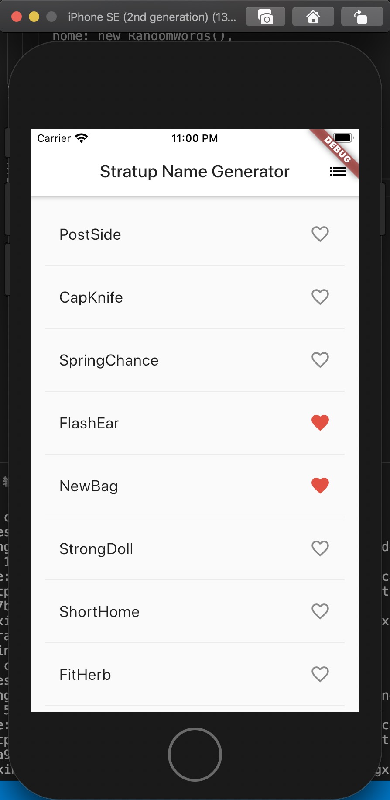

## 【flutter】手把手写flutter入门的例子（二）：无限滚动ListView添加交互和导航到新页面

### 一、前言
之前写了文章[【flutter】手把手写flutter入门的例子：无限滚动ListView](http://www.chengxinsong.cn/post/99)

接下来还是在这个无线滚动ListView中添加交互和导航到新页面。

### 二、ListView中添加交互
实现内容：在每一行添加一个可点击的心形icon，当用户点击列表中的条目，切换收藏状态时，将该单词对添加或者移除到收藏夹。

#### 第一步：添加一个_saved Set（集合）到RandomWordsState。这个集合中存储用户喜欢的单词对，Set比List更合适，因为Set中不允许重复的值。

```
class RandomWordsState extends State<RandomWords> {
  final _suggestions = <WordPair>[];
  final _saved = new Set<WordPair>();
  final _biggerFont = const TextStyle(fontSize: 18.0);
  ...
}
```

#### 第二步：在_buildRow方法中添加alreadySaved来检测单词对HIA没有添加到收藏夹中。

```
Widget _buildRow(WordPair pair) {
  final alreadySaved = _saved.contains(pair);
  ...
}
```

#### 第三步：同时在_buildRow()中，添加一个心形图片到ListTiles以启动收藏功能，接下来，你可以给心形添加交互能力。

```
Widget _buildRow(WordPair pair) {
  final alreadySaved = _saved.contains(pair);
  return new ListTile(
    title: new Text(
      pair.asPascalCase,
      style: _biggerFont,
    ),
    trailing: new Icon(
      alreadySaved ? Icons.favorite : Icons.favorite_border,
      color: alreadySaved ? Colors.red : null,
    ),
  );
}
```

#### 第四步：重新启动应用，你可以看到每行都有一个心形icon，但是还没有交互。

#### 第五步：在_buildRow中让心形icon变得可以点击。

如果单词对已经在收藏夹中，再次点击可以将其从收藏夹中移除，当心形点击时，函数调用setState()方法通知框架状态已经发生改变。

```
// build 行
  Widget _buildRow(WordPair pair) {
    final alreadySaved = _saved.contains(pair);
    return new ListTile(
      title: new Text(
        pair.asPascalCase,
        style: _biggerFont,
      ),
      trailing: new Icon(
        alreadySaved ? Icons.favorite : Icons.favorite_border,
        color: alreadySaved ? Colors.red : null,
      ),
      onTap: () {
        setState(() {
          if (alreadySaved) {
            _saved.remove(pair);
          } else {
            _saved.add(pair);
          }
        });
      },
    );
  }
```

热重载你的应用。点击任何一行收藏或移除。
PS：点击一行时会生成从心形 ❤️ 图标发出的水波动画.


### 三、跳转到新页面
实现内容：我们添加一个收藏夹的页面（新页面），通过flutter路由从主路由跳转到新路由。

flutter中，导航管理应用程序的路由栈，将路由栈push到导航器的栈中，页面将会更新为该路由页面，从导航器的栈中pop路由，将显示返回到前一个路由。

#### 第一步：在RandomWordsState的build方法中为AppBar添加icon
当用户点击收藏夹icon时，包含收藏夹的新路由页面入栈显示。

将该图标及其相应的操作添加到build方法中：

```
class RandomWordsState extends State<RandomWords> {
  ...
  @override
  Widget build(BuildContext context) {
    return new Scaffold(
      appBar: new AppBar(
        title: new Text('Startup Name Generator'),
        actions: <Widget>[
          new IconButton(icon: new Icon(Icons.list), onPressed: _pushSaved),
        ],
      ),
      body: _buildSuggestions(),
    );
  }
  ...
}
```

#### 第二步：向RandomWordsState类中添加一个_pushSaved()方法
热重载应用，列表图标将会出现在导航栏中。现在点击它不会有任何反应，因为 _pushSaved 函数还是空的。
```
class RandomWordsState extends State<RandomWords> {
  ...
  void _pushSaved() {
  }
}
```

#### 第三步：建立一个路由并将其推入到导航管理器栈中
当用户店家导航栏中icon，建立一个路由并将其推入到导航管理器栈中，此操作会切换页面显示新路由。

新页面的内容在MaterialPageRouter的build属性中构建，builder是一个匿名函数。

添加Navigator.push调用，这会使路由入栈（以后路由入栈均指推入到「导航管理器的栈」）

```
void _pushSaved() {
  Navigator.of(context).push(
  );
}
```

#### 第四步：添加MaterialPageRoute及其builder
现在，添加生成ListTile行的代码。ListTile的divideTiles()方法在每个ListTile之间添加一个1px的分割线，该divided变量持有最终的列表项。

```
void _pushSaved() {
  Navigator.of(context).push(
    new MaterialPageRoute(
      builder: (context) {
        final tiles = _saved.map(
          (pair) {
            return new ListTile(
              title: new Text(
                pair.asPascalCase,
                style: _biggerFont,
              ),
            );
          },
        );
        final divided = ListTile
          .divideTiles(
            context: context,
            tiles: tiles,
          )
          .toList();
      },
    ),
  );
}
```

#### 第五步：builder返回一个Scaffold
builder返回一个Scaffold，其中包含名为”Saved Suggestions“的新路由的应用栏。新路由的body由ListTiles行的ListView组成，每行之间都通过一个分割线分割。

```
void _pushSaved() {
  Navigator.of(context).push(
    new MaterialPageRoute(
      builder: (context) {
        final tiles = _saved.map(
          (pair) {
            return new ListTile(
              title: new Text(
                pair.asPascalCase,
                style: _biggerFont,
              ),
            );
          },
        );
        final divided = ListTile
          .divideTiles(
            context: context,
            tiles: tiles,
          )
          .toList();

        return new Scaffold(
          appBar: new AppBar(
            title: new Text('Saved Suggestions'),
          ),
          body: new ListView(children: divided),
        );
      },
    ),
  );
}
```

#### 第六步：热重载应用程序
收藏一些选项后，点击应用栏中的列表图表，在新路由页面中显示收藏的内容。导航器会在应用栏中添加一个返回的按钮。不必显式实现Vavigator.pop。点击后退返回到主页面路由。


### 四、使用主题更改UI
主题可以控制您应用程序的外观和风格，可以使用默认主题，该主题取决于物理设备或模拟器，也可以自定义主题以适用您的品牌。

+ 第1步：配置ThemeData类轻松更改应用程序的主题
我们将更改primary color颜色为白色。

下面代码就是将程序的主题颜色改为白色：

```
class MyApp extends StatelessWidget {
  // This widget is the root of your application.
  @override
  Widget build(BuildContext context) {
    // final wordPair = new WordPair.random();
    return new MaterialApp(
      title: 'welcome to start name Flutter Demo',
      theme: new ThemeData(
        primaryColor: Colors.white,
      ),
      home: new RandomWords(),
    );
  }
}
```

+ 第2步：热重载
整个背景将会变成为白色，包括应用栏。

android的模拟器展示：



ios的模拟器展示：


PS: ios模拟器开发配置：[flutter的Ios的环境配置](https://github.com/saucxs/full_stack_knowledge_list/blob/master/article/flutter/flutter-ios-config.md)

### 五、总结一下：
配置系列：
+ [mac安装flutter](https://github.com/saucxs/full_stack_knowledge_list/blob/master/article/flutter/install-flutter-1.md)
+ [mac安装android studio](https://github.com/saucxs/full_stack_knowledge_list/blob/master/article/flutter/install-android-studio.md)
+ [flutter的ios的环境配置](https://github.com/saucxs/full_stack_knowledge_list/blob/master/article/flutter/flutter-ios-config.md)

入门系列：
+ 第1篇文章：[【flutter】手把手写flutter入门的例子：无限滚动ListView](https://github.com/saucxs/full_stack_knowledge_list/blob/master/article/flutter/flutter-1-listView.md)
+ 第2篇文章：[【flutter】手把手写flutter入门的例子（二）：无限滚动ListView添加交互和导航到新页面](https://github.com/saucxs/full_stack_knowledge_list/blob/master/article/flutter/flutter-2-listView-jiaohu.md)

我们学习了：
+ mac配置android和ios的环境
+ 从头开始创建一个flutter应用程序
+ 编写dart代码
+ 利用第三方库
+ 使用热重载加速开发周期
+ 实现一个有状态的widget，增加应用的交互
+ 用ListView和ListTiles创建一个延迟加载的无限滚动列表
+ 创建一个路由，并且添加在主路由和新路由之间跳转逻辑
+ 使用主题改变应用UI的外观

### 六、欢迎关注
show me code：https://github.com/saucxs/flutter_learning/tree/master/hellotest

后续会出更多知识体系构建，技术分享，项目实战，实验室等，欢迎关注本公众号:**[松宝写代码]**


>微信公众号：**[松宝写代码]**
songEagle开发知识体系构建，技术分享，项目实战，实验室，带你一起学习新技术，总结学习过程，让你进阶到高级资深工程师，学习项目管理，思考职业发展，生活感悟，充实中成长起来。问题或建议，请公众号留言。

>微信群：**【写代码】研发进阶群**
一个成长交流的产研群，帮忙拉产研的同学们进群，聚聚人气😘😘。
每一个开发同学都应该形成自己的[知识体系](https://github.com/saucxs/full_stack_knowledge_list)，做到提纲挈领🧐🧐🧐

### 七、各种福利
关注微信公众号：**[松宝写代码]**，有各种福利。

**「字节跳动」内推福利：**

#### 1、社招内推


#### 2、实习生内推


#### 3、校招内推
官网地址，投递时候填写内推码：8J5ZSB8