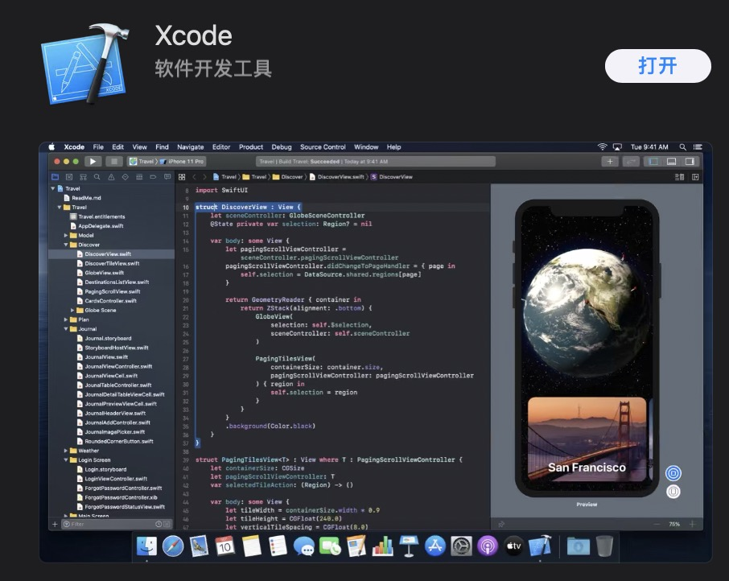
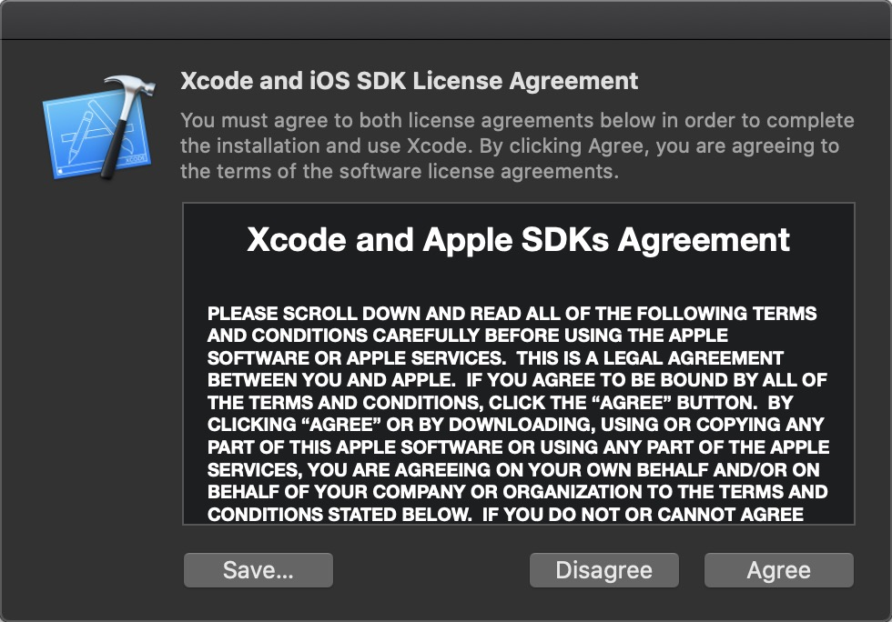
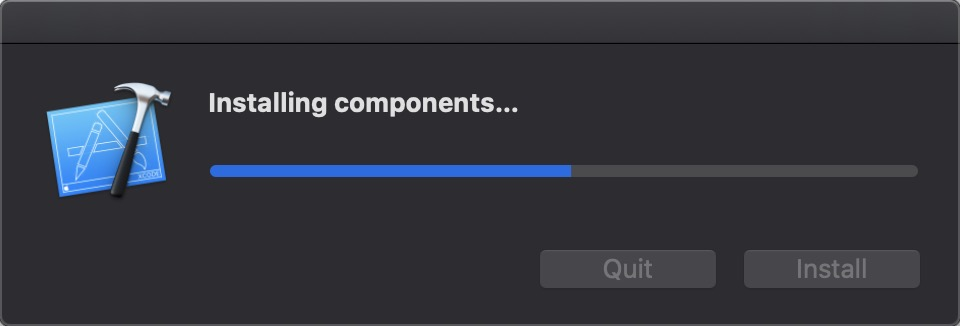
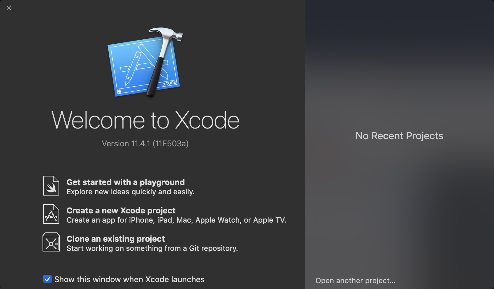
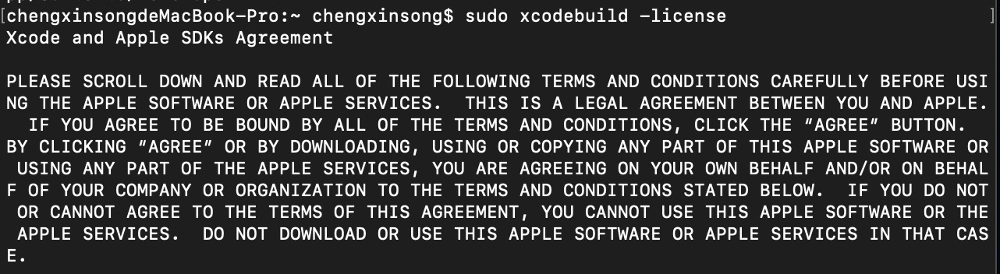
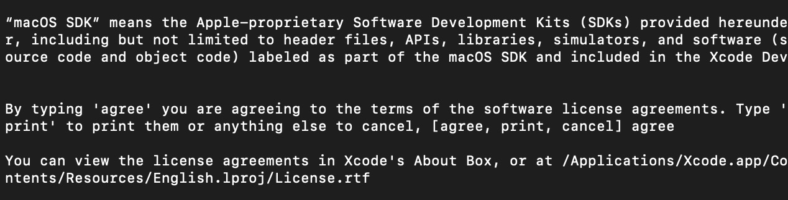
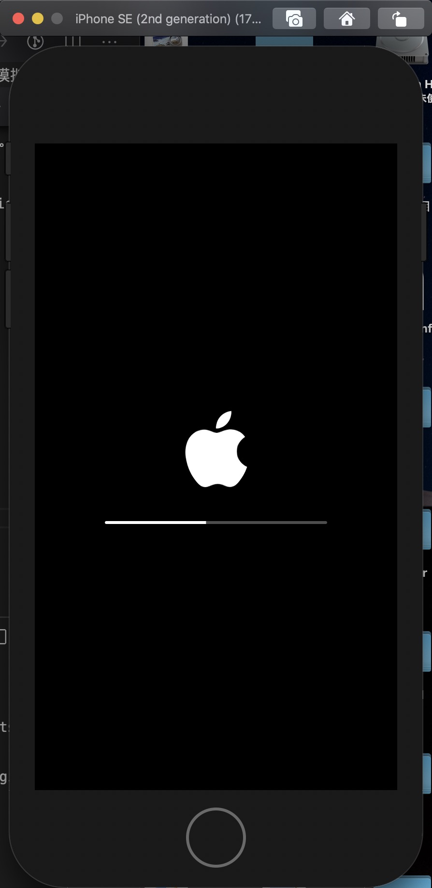
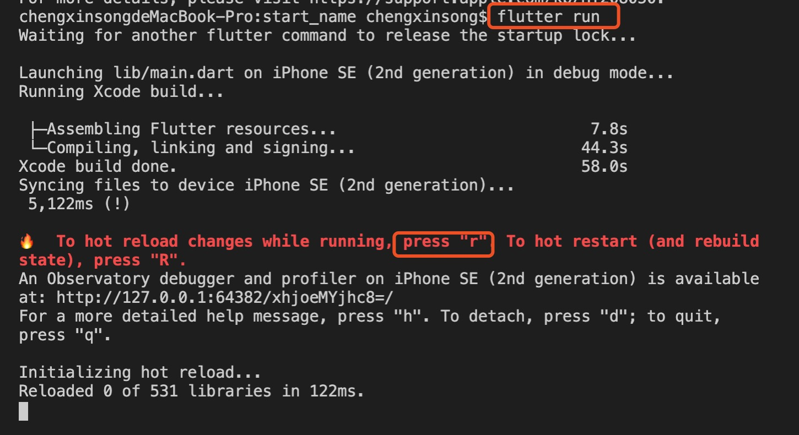
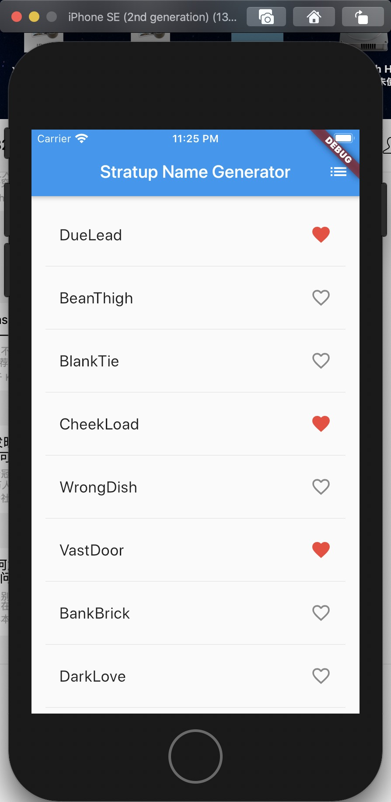

## flutter的Ios的环境配置
## 前言
macOS支持为iOS和Android开发Flutter应用程序。现在完成两个平台设置步骤中的至少一个，以便能够构建并运行您的第一个Flutter应用程序。

## 安卓设置
参考文章：http://www.chengxinsong.cn/post/93

## IOS设置
### 1、安装Xcode
要为IOS开发Fluuter应用程序，需要Xcode 7.2及以上版本。

+ 安装Xcode 7.2 或更高版本[链接下载](https://developer.apple.com/xcode/)
和[APP Store 下载Xcode](https://apps.apple.com/us/app/xcode/id497799835)









### 2、配置Xcode命令行工具
配置Xcode命令行工具以新安装的Xcode版本

```
sudo xcode-select --switch /Applications/Xcode.app/Contents/Developer
```
上述命令就是最新版本的xcode的正确路径，使用不同的版本，指定相应的路径。

### 3、确保Xcode许可协议
确保Xcode许可协议是通过打开一次Xcode或通过命令sudo xcodebuild -license同意过了.







### 4、设置ios模拟器
要准备在ios模拟器上运行并测试flutter，按照以下进行安装：
+ mac上，通过Spotlight或者使用命令找到模拟器
```
open -a Simulator
```



运行 flutter run启动您的应用.



ios的模拟器运行结果如下：

