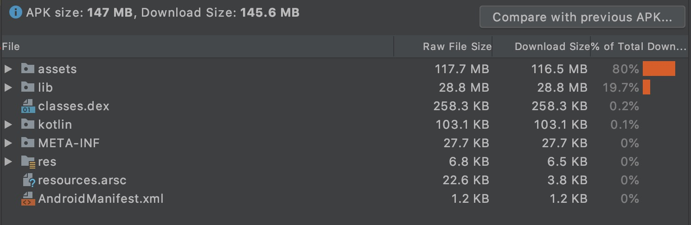
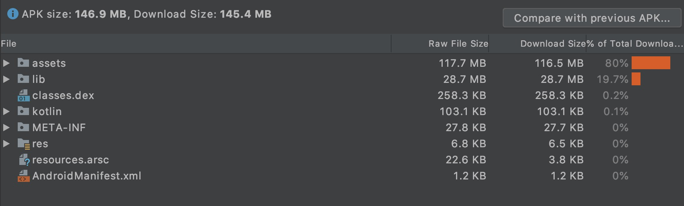
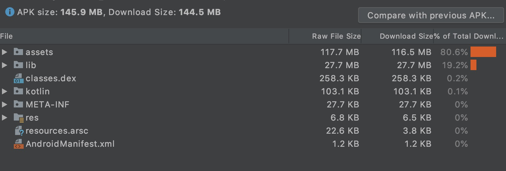
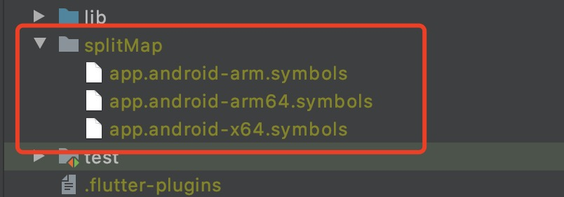
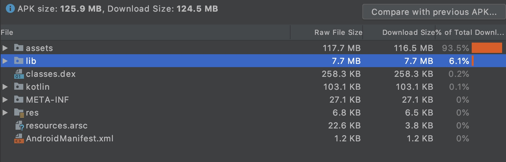

# 【手把手学习flutter】flutter打Android包基本配置和实践
## 前言
因为最近参加2020FEHackson，有个项目需要要快速上线，把打包过程和遇到的问题做个记录。

## 一、背景
在本地开发中，使用flutter run命令还是Android studio运行或者调试，flutter构建的是debug版本，也就是本地调试右上角出现debug标志。

当本地调试OK后，准备release版本，比如发布到应用商城，或者交付用户使用。

## 二、前期检查工作
### 1、检查AndroidManifest配置
在<app root>/android/app/src/main/中的AndroidManifest.xml文件，并验证这些属性是否正确，特别是：
+ application属性，这是应用的名称。
+ uses-permission属性，启用flutter工具和app应用进行通信，默认是开启，如果不开启，直接删除该属性这一行。

### 2、查看构建配置
在<app root>/android/app/build.gradle”，验证这些属性是否正确，
+ defaultConfig文件
  + applicationId：制定始终唯一的appid。
  + versionCode && versionName：app应用版本号和版本号字符串。
  + minSdkVersion && targetSdkVersion：指定最低的API级别以及应用程序设计运用的API级别。

### 3、app签名
创建keystore，如果之前已经创建过keystore，那就跳过，如果没有创建过，继续来看。

创建一个keystore，执行命令：

```
For more details, please visit https://support.apple.com/kb/HT208050.
chengxinsongdeMacBook-Pro:~ chengxinsong$ keytool -genkey -v -keystore ~/key.jks -keyalg RSA -keysize 2048 -validity 10000 -alias key
```

生成的文件是 key.jks
默认文件地址：/Users/你电脑名称/key.jks

注意：密钥是私密文件，不要加到git中。

下面是详细的执行过程

```
Last login: Mon Nov  2 14:17:41 on ttys005

The default interactive shell is now zsh.
To update your account to use zsh, please run `chsh -s /bin/zsh`.
For more details, please visit https://support.apple.com/kb/HT208050.
chengxinsongdeMacBook-Pro:~ chengxinsong$ keytool -genkey -v -keystore ~/key.jks -keyalg RSA -keysize 2048 -validity 10000 -alias key
输入密钥库口令:  
再次输入新口令: 
它们不匹配。请重试
输入密钥库口令:  
再次输入新口令: 
您的名字与姓氏是什么?
  [Unknown]:  cheng
您的组织单位名称是什么?
  [Unknown]:  byte
您的组织名称是什么?
  [Unknown]:  byte
您所在的城市或区域名称是什么?
  [Unknown]:  nj
您所在的省/市/自治区名称是什么?
  [Unknown]:  nj
该单位的双字母国家/地区代码是什么?
  [Unknown]:  cn
CN=cheng, OU=byte, O=byte, L=nj, ST=nj, C=cn是否正确?
  [否]:  y

正在为以下对象生成 2,048 位RSA密钥对和自签名证书 (SHA256withRSA) (有效期为 10,000 天):
	 CN=cheng, OU=byte, O=byte, L=nj, ST=nj, C=cn
输入 <key> 的密钥口令
	(如果和密钥库口令相同, 按回车):  
再次输入新口令: 
[正在存储/Users/chengxinsong/key.jks]

Warning:
JKS 密钥库使用专用格式。建议使用 "keytool -importkeystore -srckeystore /Users/chengxinsong/key.jks -destkeystore /Users/chengxinsong/key.jks -deststoretype pkcs12" 迁移到行业标准格式 PKCS12。
chengxinsongdeMacBook-Pro:~ chengxinsong$ 
```

### 4、应用中引入keystore
在<app dir>/android下新建key.properties的文件，其中包含对密钥库的引用：

```
storePassword=你输入的密码
keyPassword=你输入的密码
keyAlias=key
storeFile=/Users/你电脑名称/key.jks
```


### 5、在构建配置中添加签名
在<app dir>/android/app/build.gradle文件做修改：

```
...
apply from: "$flutterRoot/packages/flutter_tools/gradle/flutter.gradle"

// 新增的内容
def keystorePropertiesFile = rootProject.file("key.properties")
def keystoreProperties = new Properties()
keystoreProperties.load(new FileInputStream(keystorePropertiesFile))


android {
    compileSdkVersion 28

...
...

    defaultConfig {
        // TODO: Specify your own unique Application ID (https://developer.android.com/studio/build/application-id.html).
        applicationId "com.example.flutter_tester"
        minSdkVersion 18
        targetSdkVersion 28
        versionCode flutterVersionCode.toInteger()
        versionName flutterVersionName
    }

    // 新增内容 这块就是从
    signingConfigs {
        release {
            keyAlias keystoreProperties['keyAlias']
            keyPassword keystoreProperties['keyPassword']
            storeFile file(keystoreProperties['storeFile'])
            storePassword keystoreProperties['storePassword']
        }
    }
    // 新增内容
    buildTypes {
        release {
            // TODO: Add your own signing config for the release build.
            // Signing with the debug keys for now, so `flutter run --release` works.
            signingConfig signingConfigs.release
        }
    }
```
现在应用打包的release版本将自动进行签名。

## 三、打包命令

然后打包命令，构建发布版（release）APK。如果您完成了前一节中的签名步骤，则会对APK进行签名。

使用命令行:
```
cd <app dir> (<app dir> 为您的工程目录).
运行flutter build apk (flutter build 默认会包含 --release选项).
```
打包好的发布APK位于<app dir>/build/app/outputs/apk/app-release.apk。


## 四、包体积优化方法
发现flutter打包之后体积是有点大，我们来分析一下这个APK包的构成，我们主要来看不混淆的情况下。



一般静态资源文件占有大量内存，我们发现图片在apk占比为 80% + 0% = 80%
+ Flutter引用资源（assets文件夹） 80%
+ Android启动页背景和app的logo（res文件夹） 0%

主要是因为用了大量的图片，并且没有设置Android启动页背景和app的logo。

### (一)图片和代码优化

#### 1、处理图片资源使用外部服务
与其将图像资产捆绑在应用程序内，不如将图像托管在诸如firebase之类的外部服务上，并使用包cached_network_image在应用程序内调用这些图像。在首次启动应用程序时，程序包会从提供的URL中获取图像并对其进行缓存，因此您在随后使用该应用程序时会得到一个缓存的图像，因此这些图像不占用下载空间，因为它们没有捆绑在应用程序内。

#### 2、压缩png和jpg
如果有的图片不想从外部主机获取，必须从本地获取，所用的图片必须压缩png和jpg，因为高质量的png和jpg会占用应用程序的大小。

#### 3、使用svg格式图标
我们尽量使用矢量图svg，而不是使用png，因为svg可以兼容不同的dpi设备，并且能减少apk大小。

#### 4、去掉未使用的包
在pubspec.yaml文件中不需要或者根本没有使用的库或者包。

#### 5、特殊字体使用http缓存方式
字体也是程序大小的一个原因，当UX需要使用特定的字体，我们可以不用把字体文件，比如*.ttf或者.otf文件存储在应用程序中，并且映射到pubspec.yaml文件中，我们可以通过http获取一次，并缓存到应用程序的文件系统中。

#### 6、使用proguard优化器
proguard是java的优化器，优化器不会改变表现形式并且使用更紧凑的方式优化代码。
proguard混淆原始名称无所谓的类型，字段，方法名称，将长命替换为短字符串，比如换成a，b，c以提高效率。然而包和累的名称可能很长，但是不会影响效率。

我们在<app dir> /android/app/build.gradle中的构建类型与以下所示类似：

```
buildTypes { 
        release { 
            minifyEnabled true //添加proguard
            proguardFiles getDefaultProguardFile('proguard-android.txt'), 'proguard-rules.pro'   //添加proguard
            signingConfig signingConfigs.release     //这是发布的默认值
        } 
    }

```

在同一目录中，创建文件proguard-rules.pro并添加以下代码：

```
## Flutter wrapper 
 -keep class io.flutter.app.** { *; }
 -keep class io.flutter.plugin.** { *; }
 -keep class io.flutter.util.** { *; }
 -keep class io.flutter.view.** { *; }
 -keep class io.flutter.** { *; }
 -keep class io.flutter.plugins.** { *; }
# -keep class com.google.firebase.** { *; } // uncomment this if you are using firebase in the project
 -dontwarn io.flutter.embedding.**
 -ignorewarnings
```
最后我们在gradle.properties文件中添加：

```
extra-gen-snapshot-options=--obfuscate
```

#### 7、shrinkResources去掉无用代码
在 build.gradle 中

```
buildTypes {
        release {
            minifyEnabled true // added previously
            shrinkResources true // add this
            proguardFiles getDefaultProguardFile('proguard-android.txt'), 'proguard-rules.pro' // added previously
            signingConfig signingConfigs.release // added previously
        }
    }
```


PS：使用shrinkResource和proguard优化器，优化后，体积减少了0.1MB。



从147.0MB减少到146.9MB，减少的太少了。

### (二)so优化
针对 Flutter 打出的 Apk 包，排在第二位的是lib，28.7MB，占19.7%

将我们编写的 Dart 代码转化为不同架构下的 so 库，以供原生调用。

针对不同 CPU 架构所代表含义：

+ x86_64： Intel 64 位，一般用于平板或者模拟器，支持 x86 以及 x86_64 CPU 架构设备。
+ arm64-v8a： 第 8 代 64 位，包含 AArch32、AArch64 两个执行状态，且对应 32 、64 bit，并且支持 armeabi、armeabi-v7a 以及 arm64-v8a。
+ armeabi-v7a： 第 7 代 arm v7，使用硬件浮点运算，具有高级拓展功能，兼容 armeabi 以及 armeabi-v7a，而且目前大部分手机都是这个架构。

我们通过以下不同命令分别打包，构建制定的CPU架构的APK包，

```
flutter build apk --target-platform android-arm,android-arm64,android-x64 --split-per-abi
```
我们来解释一下这个：

+ flutter build apk 表示当前构建 release 包。
+ 后面 android-arm,andriod-arm64,andriod-x64 则表示生成制定的架构的release包。
+ 最后--split-per-abi 则表示按照不同架构分别打包，如果移除就包含所有CPU架构的apk包。


看看 app-armeabi-v7a-release.apk 包大小 126.2MB，爽啊，由 146.9 MB 直接减少到 126.2 MB。

我们看下对应的 apk 内容：


lib 占比也从原来的 19.7%，28.7 MB 直接减少为 6.4%，8 MB。


### (三)混淆优化
 Flutter 也为我们提供了混淆命令：

```
flutter build apk --obfuscate --split-debug-info=/<project-name>/<directory>
```

简单说明一下：
+ --obfuscate：开启混淆开关。
+ --split-debug-info：混淆生成的map符号表缓存到此位置。

我们先测试一下，构建完整的apk的大小。

执行

```
flutter build apk --obfuscate --split-debug-info=splitMap
```



大小从 146.9MB 降到 145.9MB，减少了1MB。

在项目根目录下生成了符号文件：



我们再试一下，直接针对不同 CPU 生成对应的 Apk 并添加混淆结果。

```
flutter build apk --obfuscate --split-debug-info=/<project-name>/<directory> --target-platform android-arm,android-arm64,android-x64 --split-per-abi
```

我们执行：

```
flutter build apk --obfuscate --split-debug-info=splitMap --target-platform android-arm,android-arm64,android-x64 --split-per-abi
```



未混淆的 v7a 大小与开启混淆相比，126.2MB 减少到 125.9MB 。开启混淆减少了 0.3 MB。

觉得差别不大。

## 五、总结
一旦打包的基础配置完事后，基本上不用怎么改，优化配置完事后，需要一个优化的打包命令。

觉得这是一个比较有用的打包命令：

```
flutter build apk --obfuscate --split-debug-info=splitMap --target-platform android-arm,android-arm64,android-x64 --split-per-abi
```
+ 不同CPU结构分别打包
+ 要混淆，生产的字符串Map在splitMap文件夹中

**「字节跳动」内推福利：**

#### 1、社招内推


#### 2、实习生内推


#### 3、校招内推
官网地址，投递时候填写内推码：8J5ZSB8