### mac安装android studio

#### 一、android studio安装的系统要求

1、Java Runtime Environment (JRE) 6或更高

2、Java Development Kit (JDK) 7 或更高

访问Oracle的java的jdk下载 https://www.oracle.com/technetwork/java/javase/downloads/jdk8-downloads-2133151.html

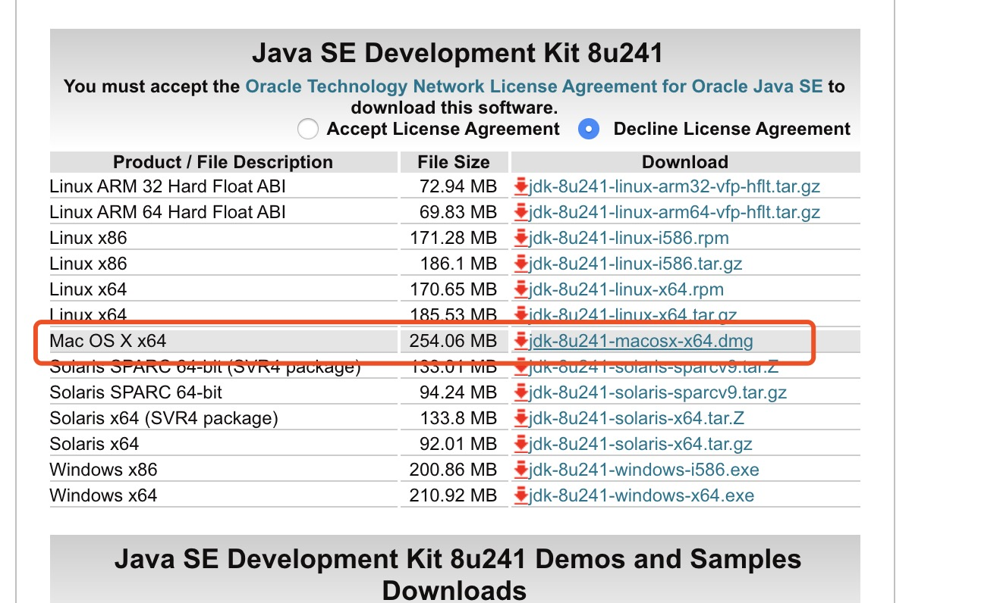

我这下载的是jdk8。

#### 二、安装jdk
##### 1、双击安装dmg

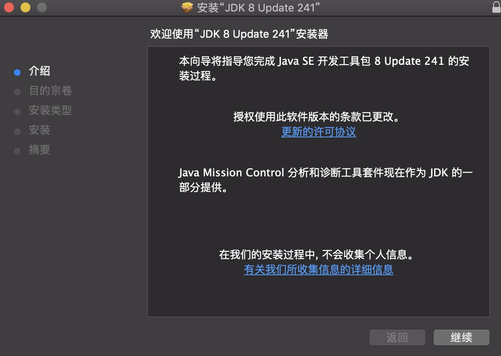

接下来就是next

安装成功提示

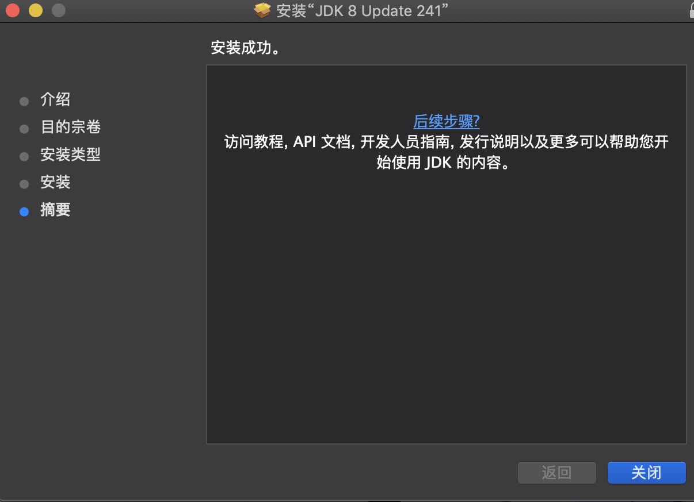

##### 2、在finder中找到安装路径
可以在下图所示的路径中找到安装好的jdk 1.8.0_241.jdk:

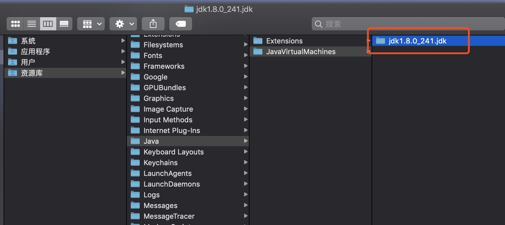

##### 3、找到jdk的根目录
其中Contents下的Home文件夹，是该JDK的根目录。

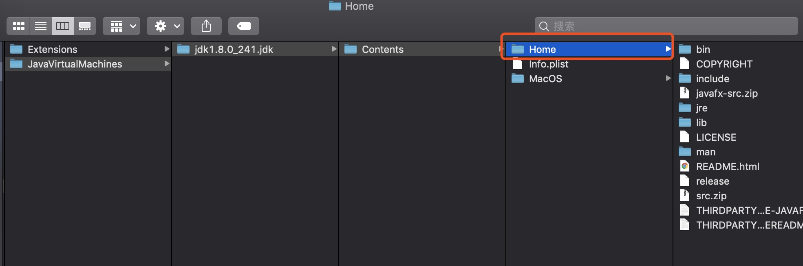

其中：

+ bin目录下存放JDK用于开发的一些终端命令工具。常见的工具如：

    + “javac”的作用是将java源文件编译为class文件(即自解码文件)；
    + “java”命令的作用是运行class文件。
 
+ db目录下是java开发的一个开源的关系型数据库；
 
+ include目录下是一些C语言的头文件；
 
+ jre目录下JDK所依赖的java运行时；
 
+ lib目录下存放JDK开发工具所依赖的一些库文件；
 
+ man目录下存放JDK开发工具的说明文档。

###### 4、验证是否安装正确
检查是否安装正确，在控制台输入
```class
java -version
```
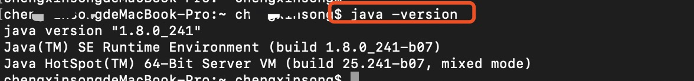


##### 5、配置jdk环境变量
输入 open -e .bash_profile命令

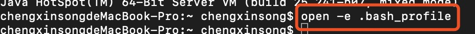

就会打开.bash_profile这个文件（如果没有请新建）

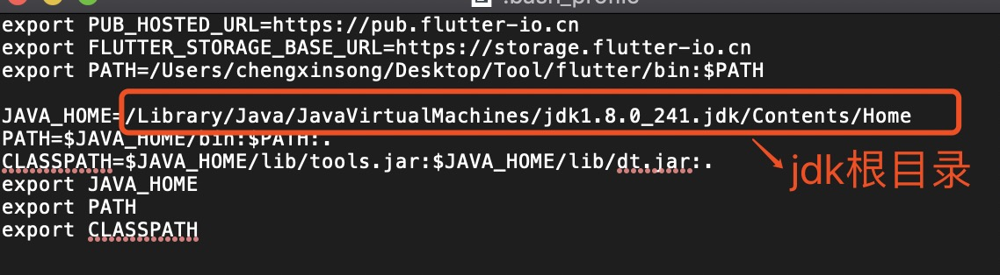

可以使用pwd显示当前的绝对路径


新增jdk的环境配置
```class
JAVA_HOME=/Library/Java/JavaVirtualMachines/jdk1.8.0_241.jdk/Contents/Home
PATH=$JAVA_HOME/bin:$PATH:.
CLASSPATH=$JAVA_HOME/lib/tools.jar:$JAVA_HOME/lib/dt.jar:.
export JAVA_HOME
export PATH
export CLASSPATH
```
command + s 保存文件

##### 6、jdk环境配置生效
输入命令
```class
source .bash_profile
```


检验是否生效
```bash
echo $JAVA_HOME
```
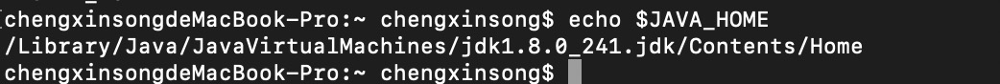


#### 三、安装android studio
##### 1、下载
新手建议下载安装版，比较简单一路Next就可以安装成功了。对于想要尝鲜的同学也可以去下载绿色版。绿色版分为分Canary版，Dev版，Beta版。建议使用Canary版本相对稳定一些。

官方下载（科学上网）：
+ 安装版：http://developer.android.com/sdk/index.html
+ 绿色版：http://tools.android.com/recent

其他（百度网盘）
+ 安装版:http://pan.baidu.com/s/1kV2dyrP密码: bn2r
+ 绿色版:http://pan.baidu.com/s/1o7Sf28i密码: hce7

##### 2、安装
（1）打开下载的dmg文件
（2）拖Android Studio到Application中
（3）选择标准模式安装
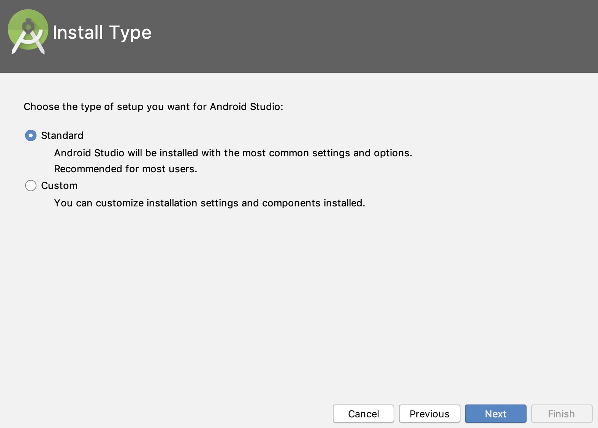

（4）验证设置，开始下载sdk
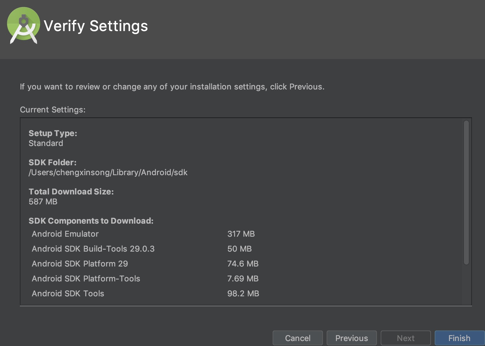

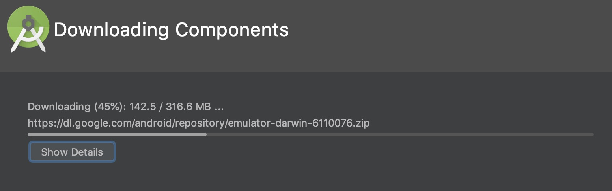

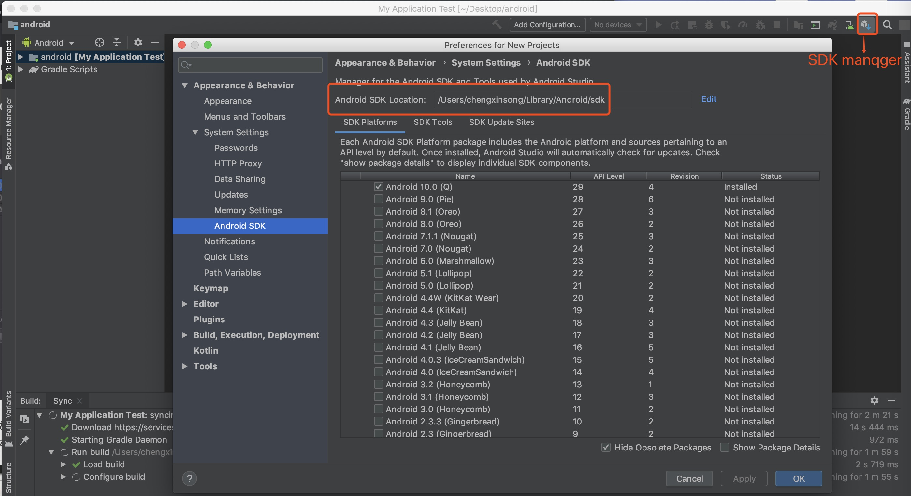


#### 四、下载安装SDK Manger
Android SDK手动下载配置

##### 1、下载

官方下载：http://dl.google.com/android/android-sdk_r24.4.1-macosx.zip(需要科学上网)

网盘下载:http://pan.baidu.com/s/1slxh1sp密码: fu8i 

##### 2、将下载的zip文件解压到~/Library/Android/sdk目录下，目录结构如下图：

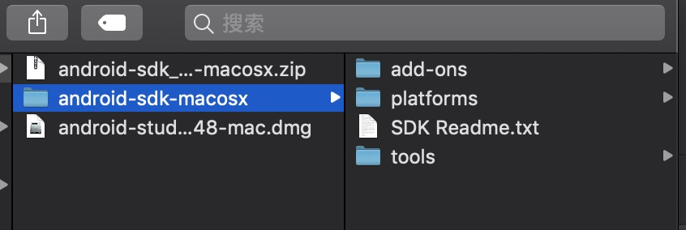

##### 3、运行sdk/tools/android启动Android SDK Manager
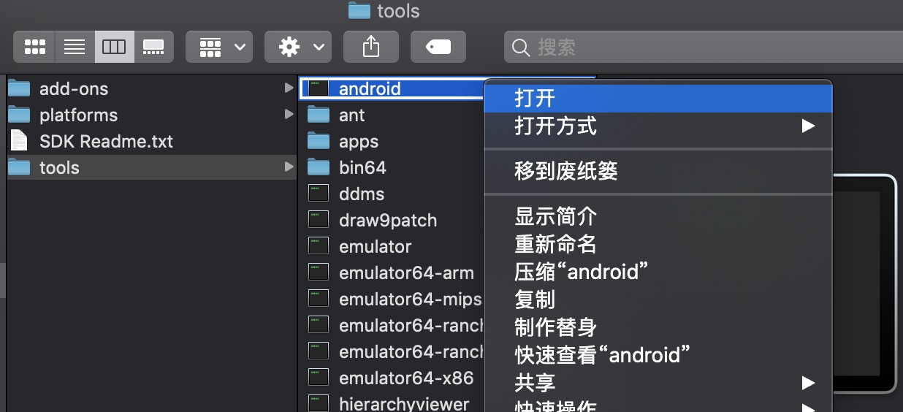
国内Android SDK更新下载时经常会遇到Fitch fail URL 或 Nothing was installed错误。
为了解决这类错误的出现并提高下载速度，可以设置http代理。
按Cmd+,快捷键打开Setting界面或按下图的方法打开Setting界面。

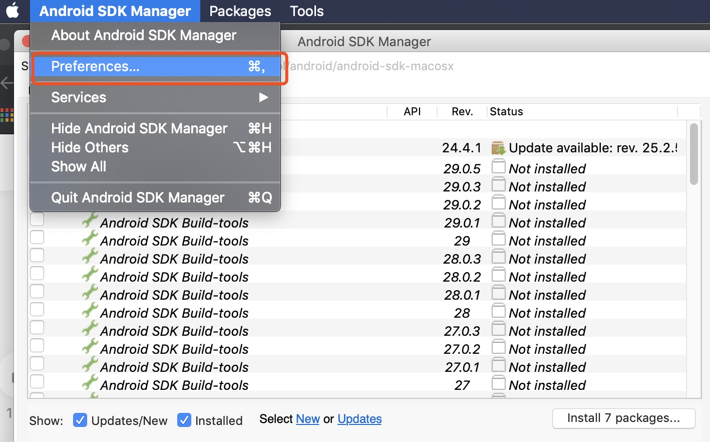

设置：
+ Http Proxy Server: mirrors.neusoft.edu.cn
+ Http Proxy Port: 80
+ 选中「Force https://... sources to be fetched usi。。。。

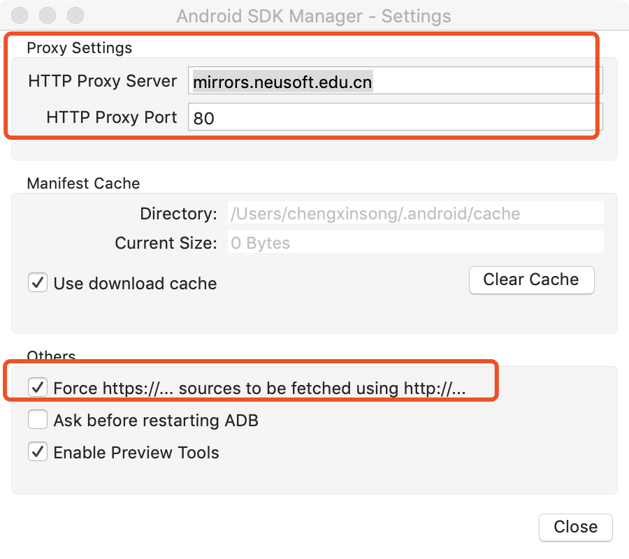


##### 4、下载必不可少的4个包
默认SDK Manager会自动帮我们选中需更新或它认为需要安装SDK，可以不用理会去除勾选。


#### 五、建立android studio的一个demo
打开android studio，选择一个模板，新建一个demo项目

编译成功之后

启动

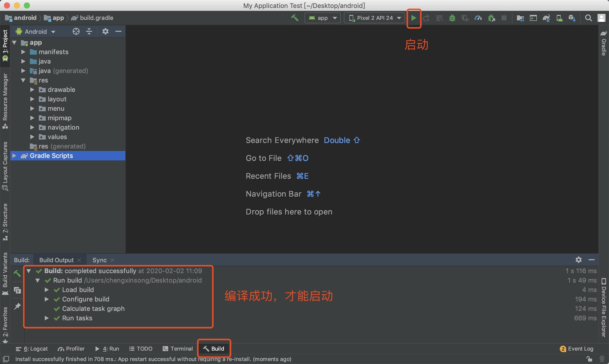

我使用的是默认的模拟器，没有使用Genymontion模拟器。

# 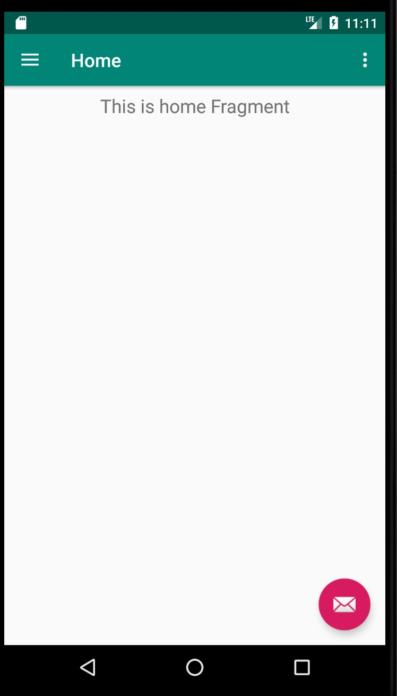

