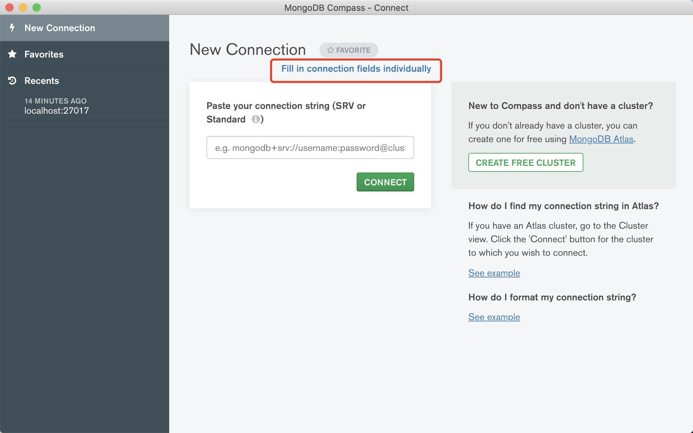
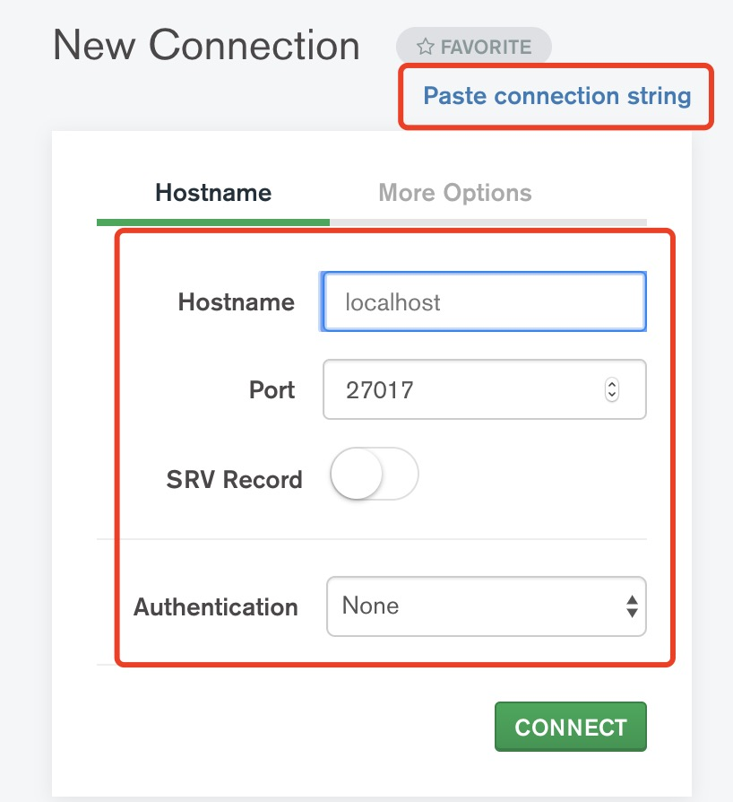
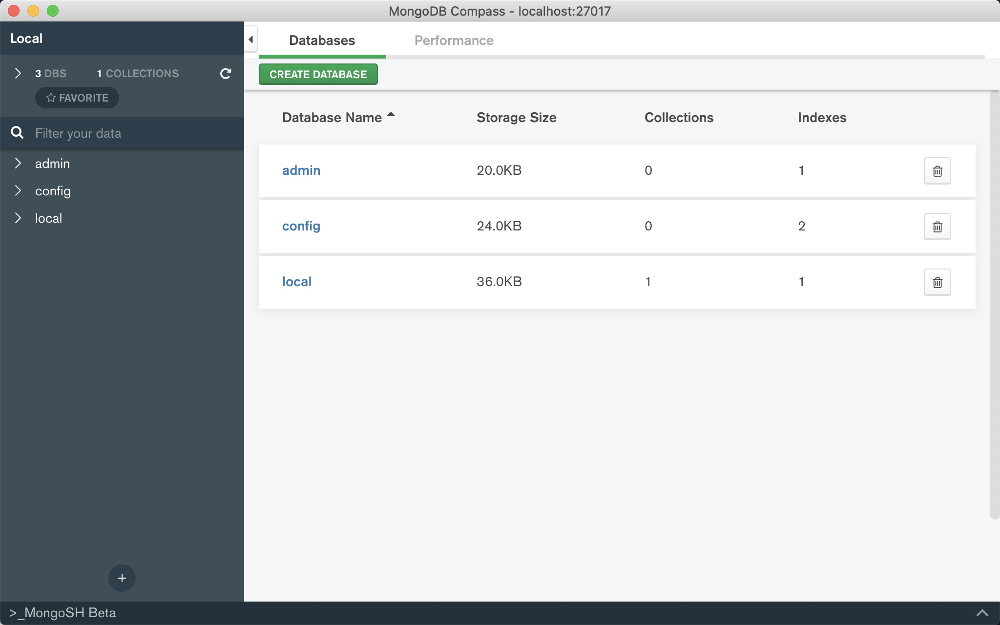
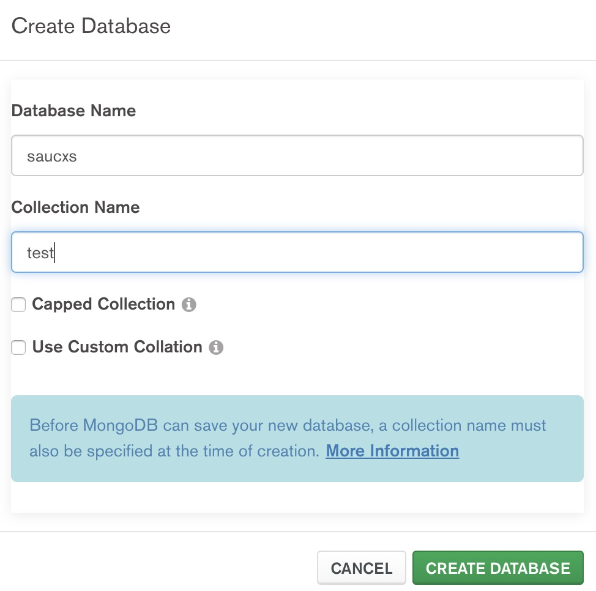
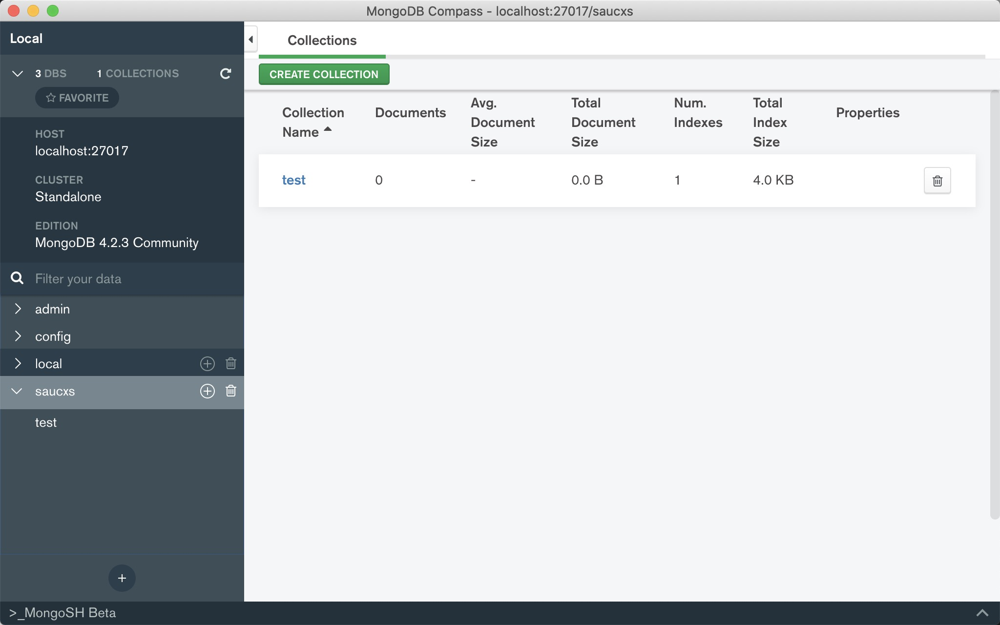
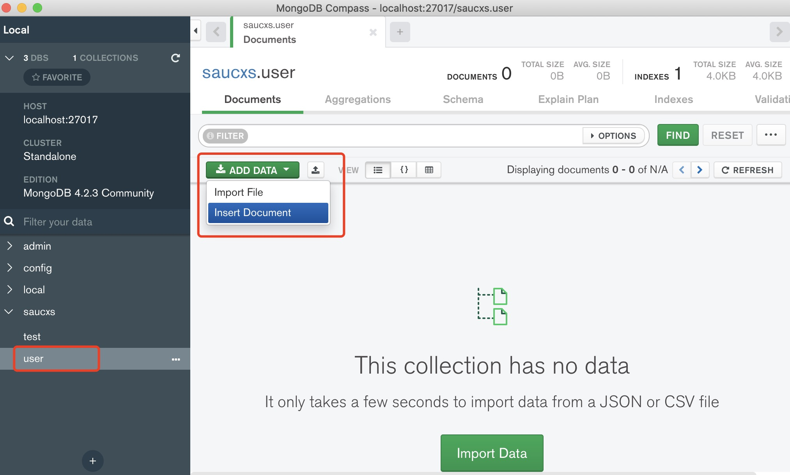
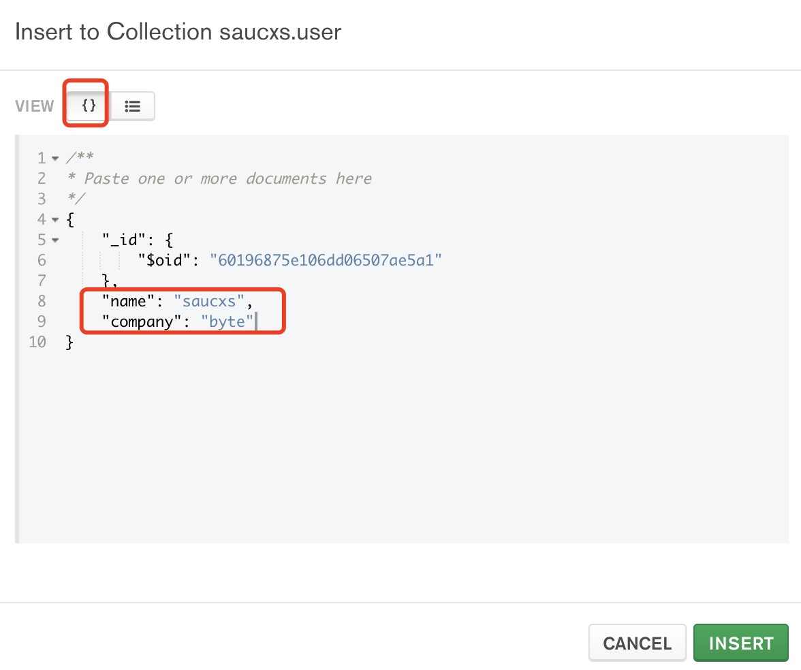
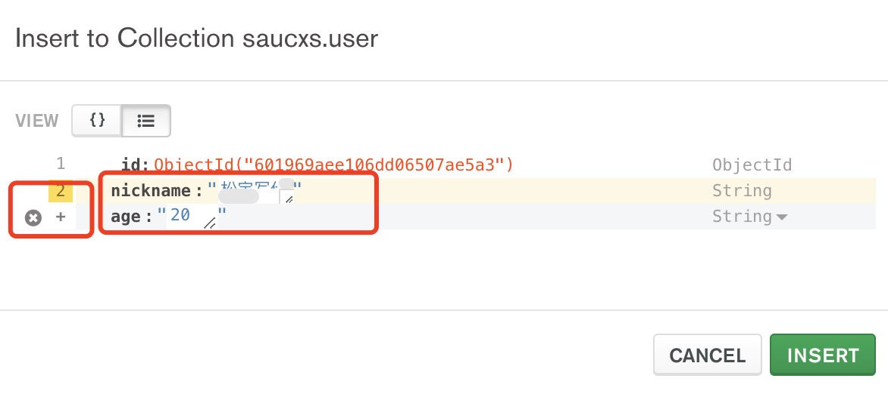
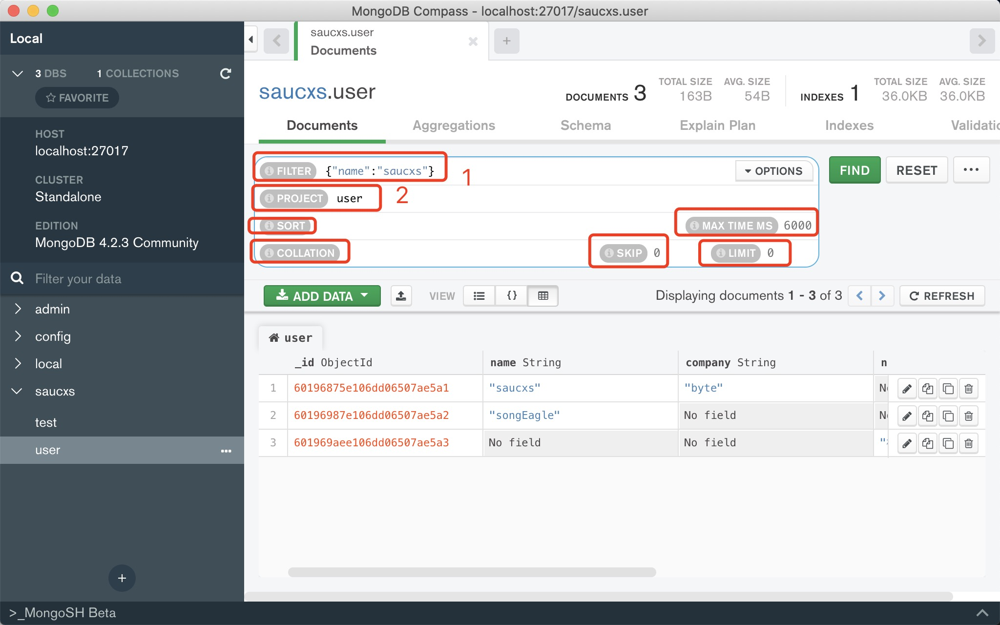
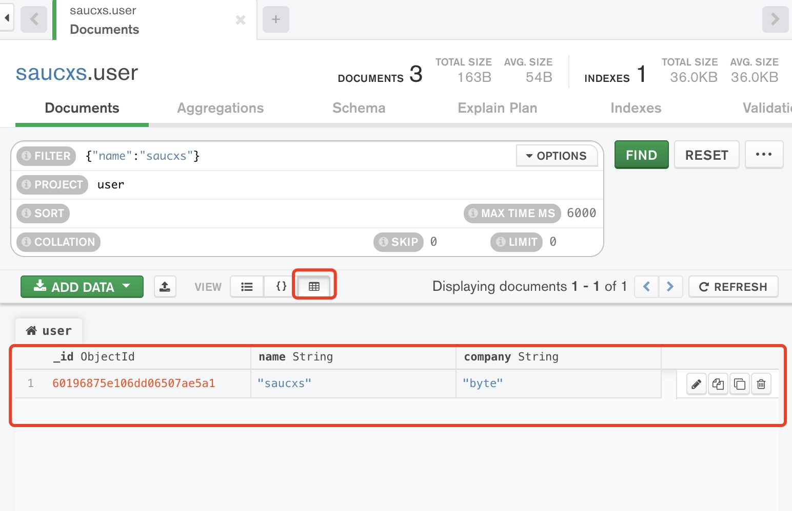

## 前言

## mongoDB的介绍

## 安装和使用

## 可视化工具使用
#### 1、下载MongoDBCompassCommunity
安装之后，进入时候需要加载会儿

进入到可视化页面，是不是需要熟悉一下页面各个模块。

#### 2、进入连接配置页面
点击Fill in connection fields individually

#### 3、配置地址和端口
其他默认选项，配置好后点击connect。

注意的地方：链接mongoDB数据库时候，首先确定启动了mongoDB服务器。

#### 4、正式进入数据库
出现admin，config，local三个文件。

#### 5、创建数据库

图中第一行是数据库名称
图中第二行是集合名称

#### 6、创建集合
数据库就创建成功了

点击Create Collection按钮，新建集合

#### 7、新增数据
点击左侧对应的数据库名，进入数据库（集合），

可以两种插入方式： 

+ 1、Import File
+ 2、Inset Document

我们首先来试一下，点击ADD DATA选择Insert Document

第一种方式：

当你进入插入数据页面的时候，这里页面会显示一片空白，那你就需要先点击上方的“{}”就会出现图片中红色方框显示文字，然后按照图片的格式添加字段，如果你想添加的字段完成了就可以插入数据了。

第二种方式：

#### 8、查询数据
填写完条件点击find就可以查询数据了
注意：序号标记的时每一栏的作用，并不是每次查询数据的时候都要填写

其中：
+ Filter 查询条件
+ project 项目名
+ sort 某个字段升序
+ collation 选择判断
+ skip 跳过前n条
+ limit 显示前n条数据
+ maxtimems 最大容量

