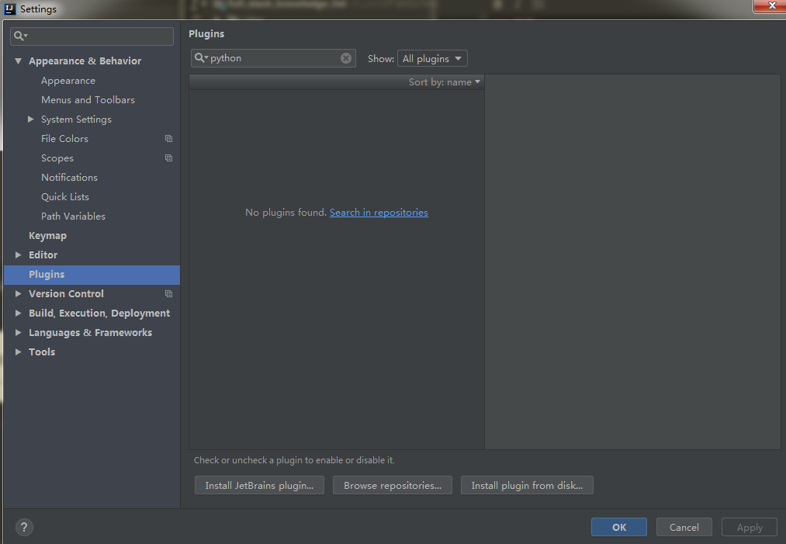
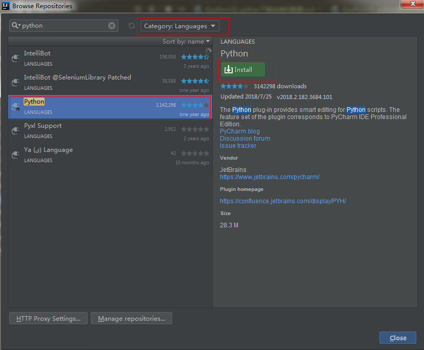
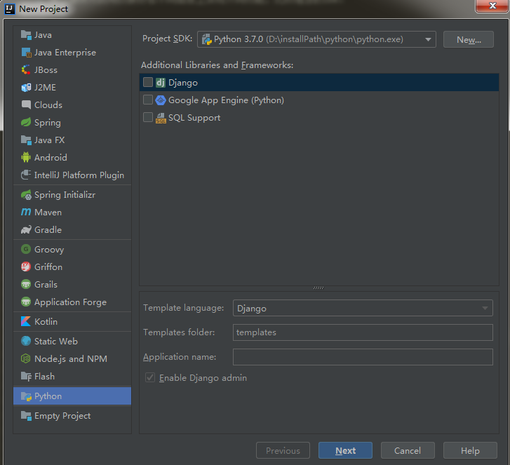
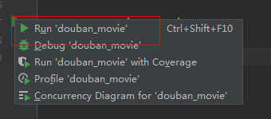
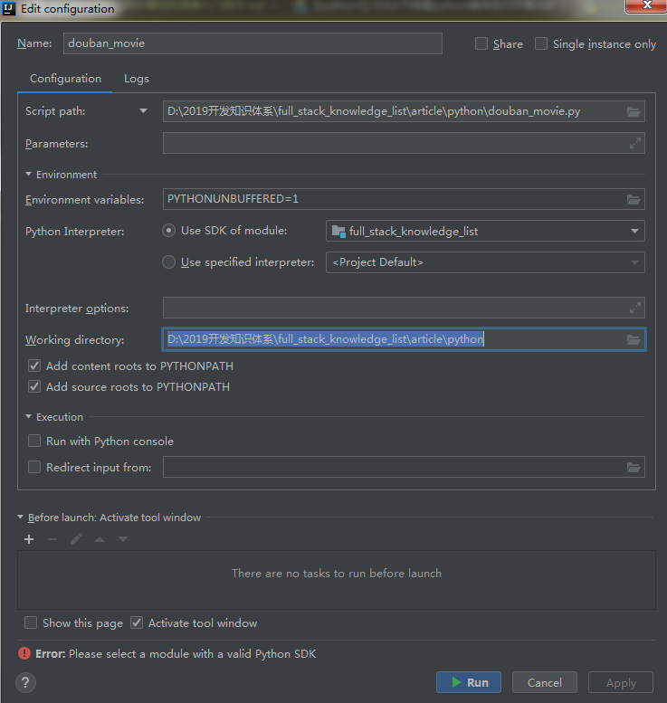

### 前言
自己平时用的是JetBrain家族的IDE，用的最顺手的是Intellij Idea，本身是java语言的开发继承环境。
通过插件方式可以很好在不同语言上实现不同功能，比较理想的IDE。

有疑问，为啥不用pycharm工具？
pycharm是非常好用的python的IDE，但是不想安装太多的开发工具，最少资源的进行多语言开发。

欢迎关注微信公众号“松宝写代码”。目的：songEagle开发知识体系构建，技术分享，项目实战，项目实验室，带你一起学习新技术，总结学习过程，让你进阶到高级资深工程师，学习项目管理，思考职业发展，生活感悟，充实中成长起来。

### 具体配置
点击File->Settings...->Plugins，在里面搜索python，如下图所示：

发现搜索并没有结果。我们点击search in repositories链接，
查询结果很多，哪个是我们需要的呢？由于我们所需要的是对一个语言（python）的支持，
于是就在搜索框旁边的category下拉栏中选择Languages一项，选择如下的插件安装：

点击旁边绿色的install，稍等片刻即可完成安装。
安装完成后原本的install按钮变成了restart，说明需要重启Intellij Idea。点击按键即可重启。

这样，python的插件就安装完成了。

### 项目配置方法
点击工具栏中的File->New->Project，可以看到左边的项目类型中多了一个python。点击它，如下图所示：

如果你的电脑中已经安装过了python的环境，它会自动检测SDK。如果没有安装，这里推荐使用Anaconda

### 注意地方
python文件必须要有明确的程序入口才能执行，不像自己随便写的print一样，也就是说
必须if __name__ == '__main__':才行。

在左边的行号栏就会出现运行符号，点击即可运行。

如果没有使用new project方式，直接新建.py的文件运行，会报这样的问题：

### 最后
**作者简介**

**昵称：saucxs | songEagle | 松宝写代码**

**github：https://github.com/saucxs**

**一、技术产品：**
+ 1、sau交流学习社区（https://www.mwcxs.top/）；
+ 2、程新松个人网站（http://www.chengxinsong.cn）；
+ 3、happyChat乐聊（https://chat.chengxinsong.cn）；
+ 4、weekly周报系统（http://weekly.mwcxs.top）；
+ 等等。

**二、开源作品：**
+ 1、watermark-dom水印插件（https://github.com/saucxs/watermark-dom）；
+ 2、captcha-mini验证码插件（https://github.com/saucxs/captcha-mini）；
+ 3、watermark-image图片水印（https://github.com/saucxs/watermark-image）；
+ 等等。
