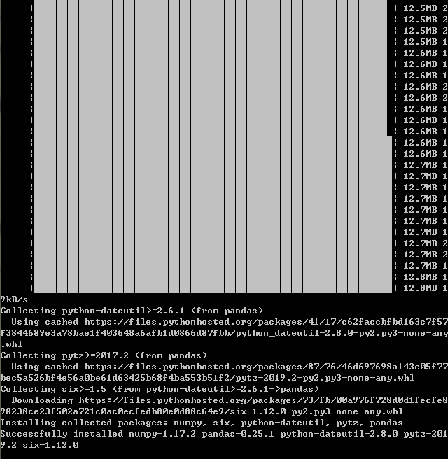

### 前言
最近在学习python，写写简单的爬虫，分析每一个现象背后的数据支撑，我选择python3，
python2已经官方废弃维护，很多项目也表示不支持python2。

### 目标分析
听说《哪吒》这部电影已经又一次延期下架，票房超高超高。

我也是去看了一次，真心觉得很不错，很值得看的片子，无论是哪个年龄阶段的人。


《哪吒》在豆瓣上的评分也到了 8.6 分以上（《大圣归来》的豆瓣评分是 8.3 分）。

大量票房背后的数据里又隐藏了哪些东西？

本文抓取了猫眼 20W+ 的短评，并进行了简单的数据分析，带大家一起看下，观众的真实想法。

### 技术分析
这个不仅仅是分析div结构和正则就行，需要做一下请求伪装等。

主要是：**请求伪装**，**数据分析库pandas**，

pandas库的DataFrame方法是一个表格型的数据结构，含有一组有序的列，每列可以是不同的值类型（数值，字符串，布尔等），
既有行索引也有列索引，可以看做是series组成的字典。

+ 首先确保正确安装pandas库，可以通过pip3这个包管理器工具来安装

安装命令：
```python
pip3 install pandas
```


不知道为啥总是超时，可能是网络不稳定。


### 实际爬取分析
#### 1、爬取源代码
提取的站点URL：https://movie.douban.com/cinema/nowplaying/nanjing/，打开之后便可以查看到正在上映的电影信息

页面显示的有效信息有影片名称，评分，图片等信息。我们就可以获取这个页面结果之后，再用正则表达式提取相应信息就可以。


接下来，我们实现爬取页面源代码过程：
+ 实现一个getPage方法，传入url作为参数，然后将爬取结果返回。
+ 再实现一个main方法，调用getPage方法。

大致代码：
```python
def getPage(url):
    try:
        response = requests.get(url)
        if response.status_code == 200:
            return response.text
        return None
    except RequestException:
        return None
       
        
def main():
    url = "https://movie.douban.com/cinema/nowplaying/beijing/"
    html = get_page(url)
    for item in parse_page(html):
        print(item)
        write_to_file(item)        
```

#### 2、正则提取电影信息
因为这个是后端返回的页面源码，为了SEO，实现服务端渲染。

我们在上图中有源码：前端div的div结构。

不要右键查看源码，因为这样的源码可能已经经过ja操作，与原始请求的页面不一样。
我们从network选项中看原始请求得到的源码。

我们看一下一个条目的源码div结构：


**分析**：我们发现一部电影信息对应源代码是一个li节点，我们使用正则表达式来提取这里的一些电影信息。
首先我们提取电影名称，电影名称信息在class为list-item的节点后，
所以我们利用非贪婪匹配提取data-title属性的信息，正则表达式：
```regexp
<li.*?list-item.*?data-title="(.*?)".*?>
```
我们使用相同判断方法提取data-score属性的信息，正则为：
```regexp
<li.*?list-item.*?data-title="(.*?)".*?data-score="(.*?)".*?>.&?
```
这样我们一个正则表达式可以匹配一部电影结果。含有3个信息。

接下来我们通过调用findall方法提取出所有的内容，实现一个regExpPage方法。如下：
```python
def regExpPage(html):
    pattern = re.compile('<li.*?list-item.*?data-title="(.*?)".*?data-score="(.*?)".*?>.*?', re.S)
    items = re.findall(pattern, html)
    for item in items:
        yield{
            'title': item[0],
            'score': item[1],
            'image': item[2],
        }
```

#### 3、写入文件
我们将爬取的结果写入文件，写入到一个文本中，通过json库的dumps()方法实现字典的序列化，指定
ensure_ascii 参数为 False，这样可以保证输出的结果是中文形式而不是 Unicode 编码。
```python
def writeToFile(content):
    with open('xiaoxi.txt', 'a', encoding='utf-8')as f:
        print(type(json.dumps(content)))
        f.write(json.dumps(content,ensure_ascii=False))
```
通过调用 write_to_json() 方法即可实现将字典写入到文本文件的过程，此处的 content 参数就是一部电影的提取结果，是一个字典。


### 完整的代码
```python
import json
import re
import requests
from requests import RequestException

def getPage(url):
    try:
        response = requests.get(url)
        if response.status_code == 200:
            return response.text
        return None
    except RequestException:
        return None

def regExpPage(html):
    pattern = re.compile('<li.*?list-item.*?data-title="(.*?)".*?data-score="(.*?)".*?>.*?', re.S)
    items = re.findall(pattern, html)
    for item in items:
        yield{
            'title': item[0],
            'score': item[1],
            'image': item[2],
        }

def writeToFile(content):
    with open('python_douban_movie.txt', 'a', encoding='utf-8')as f:
        # print(type(json.dumps(content)))
        f.write(json.dumps(content,sort_keys=True,indent=2,ensure_ascii=False))

def main():
    url = "https://movie.douban.com/cinema/nowplaying/nanjing/"
    html = getPage(url)
    for item in regExpPage(html):
        print(item)
        writeToFile(item)

if __name__ == '__main__':
    main()

```

### 运行结果


再看下文本文件，结果如图所示：


### 欢迎关注

欢迎关注微信公众号“松宝写代码”。目的：songEagle开发知识体系构建，技术分享，项目实战，项目实验室，带你一起学习新技术，总结学习过程，让你进阶到高级资深工程师，学习项目管理，思考职业发展，生活感悟，充实中成长起来。


### 最后
**作者简介**

**昵称：saucxs | songEagle | 松宝写代码**

**github：https://github.com/saucxs**

**一、技术产品：**
+ 1、sau交流学习社区（https://www.mwcxs.top/）；
+ 2、程新松个人网站（http://www.chengxinsong.cn）；
+ 3、happyChat乐聊（https://chat.chengxinsong.cn）；
+ 4、weekly周报系统（http://weekly.mwcxs.top）；
+ 等等。

**二、开源作品：**
+ 1、watermark-dom水印插件（https://github.com/saucxs/watermark-dom）；
+ 2、captcha-mini验证码插件（https://github.com/saucxs/captcha-mini）；
+ 3、watermark-image图片水印（https://github.com/saucxs/watermark-image）；
+ 等等。
