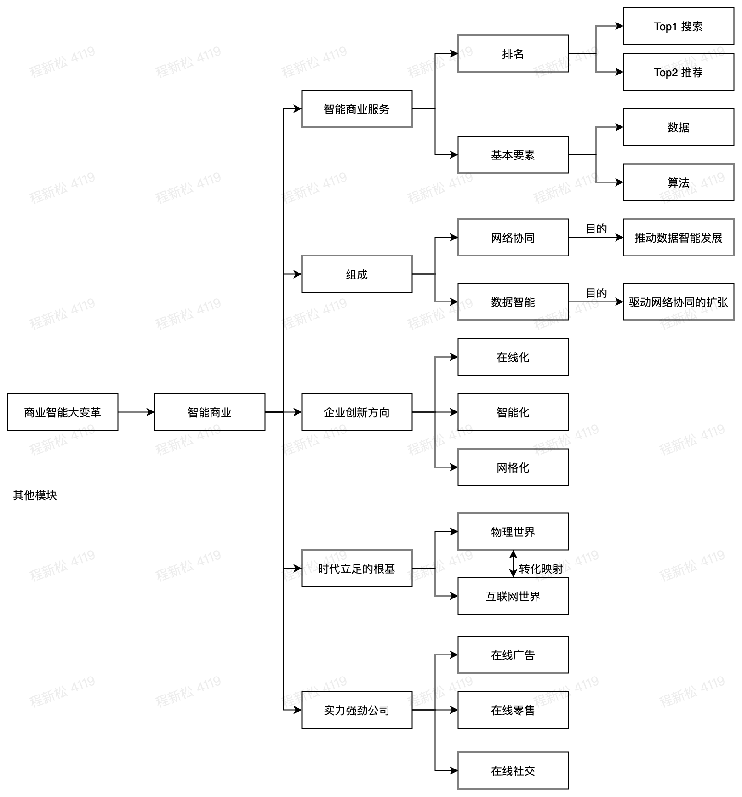
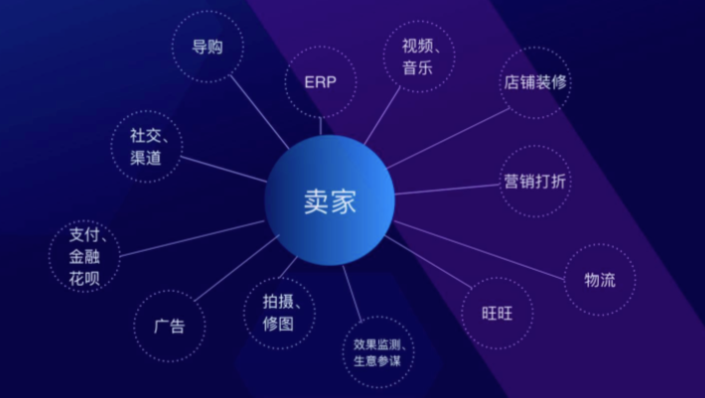

# 一、前言

之前我觉得商业化对于研发的同学来说距离还是很远，研发只关注自己的技术测，后来发现研发也需要去关注产品，培养产品sense，理解产品的目的和目标；运营策略，建立产品和用户联系；商业，如何用产品换钱等等。因为这样的思维培养，有利于研发的综合能力提升。

我听了2遍智能商业，然后觉得作者的对于商业模式的脑洞好大，觉得值得研读。

# 二、各章节理解

## 1、商业智能大变革

智能商业组成：网络协同，数据智能

网络协同目的：推动数据智能发展

数据智能目的：驱动网络协同的扩张

网络协同例子：淘宝

企业创新方向：在线化，智能化，网格化

物理世界转化映射到互联网世界，才能在这个时代立足根基。

商业智能服务基本要素：数据+算法

商业智能服务：top1 搜索。top2 推荐

机器学习都是基于反馈闭环。在未来，每一个企业都必须有一个和目标客户在线互动的界面。任何一个硬件制造商未来可能都会是这个服务组合中的一部分。制造不再会成为一个独立企业，而是成为他人服务闭环中的一个承载者，或者自己建立一个2C的沟通渠道。

实力强劲的公司

包括：在线广告，在线零售，在线社交

绝大部分的经济领域还是一片蓝海

## 2、网络协同

淘宝：双边市场扩展 => 复杂的多边市场 => 个性化需求

uber：复制原有模型远不及另一个领域创业者的爆发力

## 3、数据智能

数据化本质：现象转变为可量化形式的过程。

不仅仅是常见数据还包括一些可描述的量化。

数据化包括：算法+端和云+活数据

## 4、互联网1.0/2.0/3.0

互联网1.0：PC互联网

互联网2.0：移动互联网

互联网3.0：物联网

互联网最大的价值：支撑无数人同时互动。

智能商业过程：

-   产品和服务核心流程在线化
-   双向互动
-   形成可循环的生态

## 5、精+准

精准定义你：不仅是不同用户个性化服务，还需要掌握何时，何地，何种场景下需要什么样的服务。

## 6、黑洞效应

数据就像一个黑洞，它总想越变越大，触达的人越来越多。

世界三大核心资源：物质+能量+信息

未来智能世界：

物理连接

联结：创造力，知识，智慧

未来生活：网络化，场景化，流动化，碎片化

## 7、未来的核心商业模式：C2B→S2B2C

C2B：规模个性化定制，消费者提出要求，制造者据此设计消费品、装备品。

S2b2c：是C2B模式的一个变形，因为整个服务是通过小b和c（客户）的紧密互动而驱动的，S作为其中一个大的供应平台，聚合垂直细分领域海量的小b，小b只需要做好自己的本职工作：服务好c，S提供小b共同需要的某些服务。

## 8、新战略：高效反馈闭环，形成点—线—面—体

战略最核心的是：定位

## 9、组织变革：创造力革命

创造力革命：人工智能释放和激发奋斗创新力

智能生产力：人工智能和人类智能

###### 忘掉管理，拥抱赋能

赋能：如何让他人有更大的能力完成他们想要完成的事。

领导者目的：不是管理，而是支持；

团队成员的驱动力：不是传统的劳动报酬，而是成就感和社会价值。

###### 数据中台：

透明：清楚地知道其他平台参与者的工作，如做了什么、怎么做的、有什么特点和结果，以及如何复用和修改。

共创：创新在中后台的平台上沉淀，智能、技术、经验、模式都以这种机制日益丰富，共同迭代，从而行程难以被其他平台超越的创新堡垒。

## 10、关于未来

###### 网红时代的新品牌

传统品牌：通常先有战略，再有产品，然后是品牌定位和广告规划，最后广告投放传播，形成公众对品牌的认知，最后转化形成销售，消费者只能被动接收。

新品牌：是相反的，网红已经在粉丝心中形成认知，继而挑选产品，形成有了广告需求与规划，形成可溯源的销售转化。

新品牌打造的4大基点：

1.持续深度的互动；

2.个性化社交网络的触达；

3.人格化的表达形成情感共振（口碑、推荐）；

4.快速的反馈与融合

###### "互联网+"到"互联网x"

“互联网+”：就是要利用互联网的平台和信息通信技术，把互联网和包括传统行业在内的各行各业结合起来，在新的领域创造一种新的生态。

简而言之，“互联网＋”不是要颠覆传统行业，而是要通过于传统行业融合，产生1+1＞2的效果。

“互联网×”：不再是简单的技术模型，叠加粗暴的运营，我理解是：应用当前的互联网技术，打开新的封闭的经济模式。

# 三、总结

1.  ## 令你印象深刻的是什么?

商业智能本质是网络协同和数据智能，通过组织变革带来的创造力革命，使用互联网x方式，也就是应用当前的互联网技术，打开新的封闭的经济模式。

2.  ## 最想借鉴的是什么?

组织变革带来创造力的革命

3.  ## 想和其他同学探讨的是什么?

问题1：如何精准的掌握在何时何地何种场景下需要什么样的服务？

问题2: 数据化中的“活数据”到底是怎么产生，使用，分析活数据？

4.  ## 后续的行动点有哪些?

忘掉管理，拥抱赋能