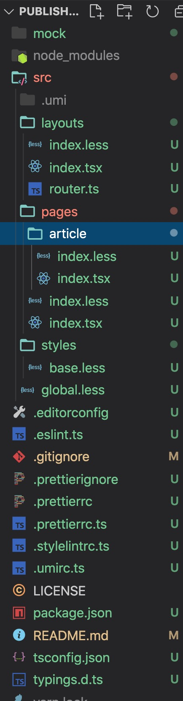

# Umi3+Antd搭建项目脚手架

## 一、功能点
+ 1、Umi3脚手架生成
+ 2、Antd4的ProComponents
+ 3、全局样式global.less
+ 4、全局路由定义
+ 5、eslint规则

## 二、目录结构



## 三、搭建过程
### 1、umi创建项目
```js
// 通过官方工具创建项目，
yarn create @umijs/umi-app

yarn

yarn start
```

项目已经启动，通过 http://localhost:8000 访问

### 2、Antd4的ProComponents
可以参考：https://procomponents.ant.design/components/layout

ProLayout定位：可以提供一个标准又不失灵活的中后台标准布局，同时提供一键切换布局形态，自动生成菜单等功能。与 PageContainer 配合使用可以自动生成面包屑，页面标题，并且提供低成本方案接入页脚工具栏。

路由router.ts文件
```js
const routers = [
  {
    path: '/article',
    name: '文章管理',
    icon: 'icon-shoucang1',
  },
  {
    key: 'test',
    name: 'test',
    icon: 'smile',
    path: '/test',
    exact: true,
  },
  {
    path: '/home/overview',
    name: 'FaceBook',
    icon: 'icon-facebook',
  },
  {
    path: '/home/search',
    name: 'Twitter',
    icon: 'icon-twitter',
  },
];

export default routers;
```

布局layouts下的index.tsx文件
```js
import React from 'react';
import ProLayout, {PageContainer} from '@ant-design/pro-layout';
import { UserOutlined } from '@ant-design/icons';
import layout from './index.less';
import routers from './router';
import { Link } from 'umi';
import { Avatar } from 'antd';

const Layout = (props: any) => {
  // 面包屑
  const translateBread = (allRouters: any) => {
    const finallyBread = allRouters.filter((item: any) => {
      return window.location.pathname.includes(item?.path)
    })
    .map((route: any) => {
      return {
        path: route.path,
        breadcrumbName: route.name,
      }
    })
    finallyBread.unshift(
      {
        path: '/',
        breadcrumbName: '首页',
      },
    );
    return finallyBread;
  };


  return (
    <div className={layout.layoutContainer}>
      <ProLayout
        location={{
          pathname: '/welcome',
        }}
        iconfontUrl="//at.alicdn.com/t/font_8d5l8fzk5b87iudi.js"
        route={{
          routes: routers
        }}
        menuItemRender={(menuItemProps, defaultDom) => {
          return <Link to={menuItemProps.path}>{defaultDom}</Link>;
        }}
        rightContentRender={() => (
          <div>
            <Avatar shape="square" size="small" icon={<UserOutlined />} />
          </div>
        )}
      >
        <PageContainer
          title="Editor"
          content="欢迎使用Editor"
          header={{
            breadcrumb: {
              routes: translateBread(routers)
            }
          }}
        >
          <div>{props.children}</div>
        </PageContainer>
    </ProLayout>
    </div>
  )
}

export default Layout;
```

ProLayout是组件内置的组件，支持各种自定义组件，PageContainer是详细内容的展示组件。


### 3、全局样式global.less
umi3 默认支持 less，如果需要 sass，需要安装 node-sass 依赖，推荐使用 less。
global.less 会默认引入，所以这里可以用来写一些全局样式。

我们在src 下建立 styles 目录，添加 base.less， base.less 可以作为导出各种变量，global.less是引入 base.less 文件。

全局global.less文件

```less
@import "~@/styles/base.less";

body {
  overflow: hidden;
  height: 100%;
}
```

base.less文件

```less
#root {
  height: 100%;
}
```

### 4、全局路由
在layouts文件夹下新建自定义路由router.ts

```js
const routers = [
  {
    path: '/article',
    name: '文章管理',
    icon: 'icon-shoucang1',
  },
  {
    key: 'test',
    name: 'test',
    icon: 'smile',
    path: '/test',
    exact: true,
  },
  {
    path: '/home/overview',
    name: 'FaceBook',
    icon: 'icon-facebook',
  },
  {
    path: '/home/search',
    name: 'Twitter',
    icon: 'icon-twitter',
  },
];

export default routers;
```


### 5、配置Eslint规则
umi 维护了一个 prettier，eslint，stylelint 的配置文件合集--umi-fabric
这里直接添加 .eslintrc.js、.prettierrc.js、.stylelintrc.js ，配置如下：

```js
//1、.eslintrc.js 配置
module.exports = {
  extends: [require.resolve('@umijs/fabric/dist/eslint')],
  rules: {
    'react/jsx-first-prop-new-line': 'error',
    semi: ['error', 'never'],
    indent: ['error', 2, { SwitchCase: 1 }],
    'no-plusplus': 'off',
    'react/sort-comp': 'off',
    'no-unused-expressions': 'off',
  },
}

// 2、.prettierrc.js 配置
const fabric = require('@umijs/fabric')

module.exports = {
  ...fabric.prettier,
  semi: false,
}


//3、.stylelintrc.js 配置
const fabric = require('@umijs/fabric')

module.exports = {
  ...fabric.stylelint,
}
```

vscode 要安装这三个同名扩展插件，这时候分别去更改 js、less 文件，会发现已经有风格校验了，保存会自动修复。

### 6、
