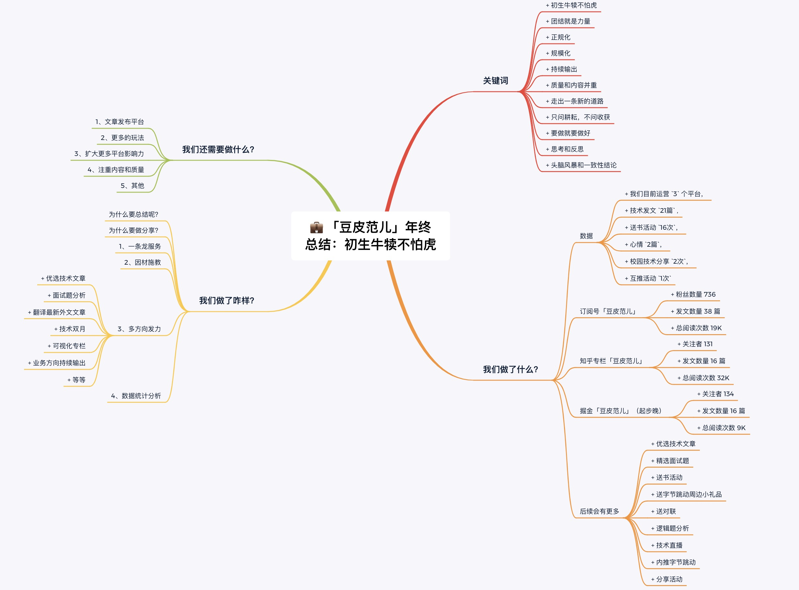

# 💼 「豆皮范儿」年终总结：初生牛犊不怕虎

**日期：2021月2日**

Hello，豆皮粉儿们，这段时间在写年终总结啦～

在这里祝小伙伴们，新年快乐，牛气冲天～

古人尚有“吾日三省吾身”，趁假期有时间也应该回顾与总结去年这一年。

> 作者：松宝写代码

言归正传，下面👇是我的总结和规划。

## 一、前言

每一年都有新的一年，都是崭新的一年，每一年都是需要我们用心经历，每一段经历都是最美好的经历。遇到即合理，合理即面对。

在这个中国的传统的节日：除夕。意味着上一年即将结束，我们可以坐下来唠唠家常，唠唠工作的开心与不开心，想想明年需要在哪方面做出改变，明年有哪些打算，明年要完成哪些事情，去哪旅游散散心，去哪个城市吃啥好吃的，等等。

同样，我们的`「豆皮范儿」`也需要总结和回望。

因为诞生在2020最后2个月里，完成从`0-1`过程，想到很多关键词：

+ 初生牛犊不怕虎
+ 团结就是力量
+ 正规化
+ 规模化
+ 持续输出
+ 质量和内容并重
+ 走出一条新的道路
+ 只问耕耘，不问收获
+ 要做就要做好
+ 思考和反思
+ 头脑风暴和一致性结论

## 二、我们做了什么？
对于一个妹子（确切的说是个程序媛妹子（更确切的说是个前端程序员妹子））来说，想要持续的写文章来总结自己的学习生活，那可真的是好难鸭。

从2020年11月开始打算做「豆皮范儿」，一个爱吃豆皮的女孩，我也是一个爱好广泛，多姿多彩，阳光灿烂，激情四射，有时多愁善感的妹子。

我们先来看一下数据：

+ 我们目前运营 `3` 个平台，
+ 技术发文 `21篇` , 
+ 送书活动 `16次`，
+ 心情 `2篇`，
+ 校园技术分享 `2次`，
+ 互推活动 `1次`

### 1、订阅号「豆皮范儿」
从公众号2020.11.20这第一天开始，直到2021.02.08
+ 粉丝数量 736
+ 发文数量 38 篇
+ 总阅读次数 19K

### 2、知乎专栏「豆皮范儿」
从公众号2020.1.20这第一天开始，直到2021.01.15，
+ 关注者 131
+ 发文数量 16 篇
+ 总阅读次数 32K

### 3、掘金「豆皮范儿」
目前介绍：微信搜索”豆皮范儿“|数据可视化，前端基础工程，跨端研发，webExcel，BI产品研发。

因为掘金是2021年1月份才开始运营，直到2021.02.10，
+ 关注者 134
+ 发文数量 16 篇
+ 总阅读次数 9K

### 4、后续会有更多
我们有更多的活动，比如：

+ 优选技术文章
+ 精选面试题
+ 送书活动
+ 送字节跳动周边小礼品
+ 送对联
+ 逻辑题分析
+ 技术直播
+ 内推字节跳动
+ 分享活动

## 三、我们做了咋样？

问一个`common`的问题：为什么要总结呢？

> 对于技术，自己懂和让别人懂是不一样的，尤其是让别人看着你的文字就能懂。在自我沉淀的过程中，你会发现有些地方理解的并不是很深入甚至是错误的。真正想做到深入浅出，是需要你有足够的积淀的，这是我要做总结和分享的重要原因。

那再问一个问题：为什么要做分享？

+ 1、分享出来可以得到大家的及时反馈，让更多的人来帮助我快速成长。同时，也希望读者在阅读我的内容的时候也能有所收获。

+ 2、分享还能收获志同道合的好友，对技术、生活、爱好、垃圾食品....有共同语言的人都可以成为朋友。

### 1、一条龙服务
文章内容生产到发布`一条龙服务`：

> 投稿细则 => 审稿细则 => 审核列表 => 发布文章

注重文章质量，选用高质量内容，激发小伙伴的创造，注重质量。文章的内容和质量决定了文章的层次，文章的影响力，从而侧面反应`「豆皮范儿」`的影响力。

### 2、因材施教
针对不同的平台采用不同的头部和尾部，便于形成我们的风格`style`。

目前有微信订阅号，知乎专栏，掘金等模板，便于维护。

### 3、多方向发力
不仅仅在文章创作上加大投入，同时我们还做以下多个方向沉淀和产出。

+ 优选技术文章
+ 面试题分析
+ 翻译最新外文文章
+ 技术双月
+ 可视化专栏
+ 业务方向持续输出
+ 等等

### 4、数据统计分析
那为啥要做数据分析？

> 数据分析的目的其实就是把隐藏在大批杂乱无章的数据中进行信息的集中、萃取和提炼出来，以便找出所研究对象的内在规律。 在实用中，数据分析可帮助人们作出判断，以便采取适当行动。

从`用户分析`的维度和`内容分析`的维度，对每周数据进行分析，以便于观察上周数据的变化，转化率，留存率等指标进行分析，看当前内容或者活动是否达到预期的效果，以及在哪方面需要进一步完善和优化。

## 四、我们还需要做什么？

### 1、文章发布平台
`Editor` 是一款简洁的 `Markdown` 编辑器，可以自动将md转成微信公众号图文，拥有一键发送到指定平台能力，支持独立平台独立配置， 支持md样式配置等功能。

### 2、更多的玩法
让我们有更多的玩法，带领我们一起冲冲冲，2021奥利给。

也可以给我们「豆皮范儿」公众号后台留言，说出你的想法或者玩法。

### 3、扩大更多平台影响力
扩大更多平台的影响力，也是横向扩展，扩宽更多的领域，下发更多的内容，建立以点带面的全面铺开「豆皮范儿」的影响力建设。

### 4、注重内容和质量
过去清零，重新出发。

> 鲁迅说过：内容才是核心和王牌。

如果内容很多，质量不好。给人感觉就是在滥竽充数，以次充好，味同嚼蜡，这样是很难达到我们需要新用户留存和转化，同时并没有做到分享的目的，背道而驰。

如果内容不多，质量不错。会反向觉得作者不勤勉，没有毅力，没有新鲜活跃氛围，每天爆炸的信息中，读者容易忘记还有这么一个技术品牌，需要促活和留存。

### 5、其他
省略N个字符

## 五、总结
下面这张图是根据上面具体内容做的总结，一张脑图胜千言，简单明了。

总结一下：

+ 失败他妈的确是成功，不多尝试多失败不可能成功。

+ 团队的动力的正面影响往往会超过物质的回报。而在强烈的团队动力驱动下，物质的回报只是一个副产品而已。
