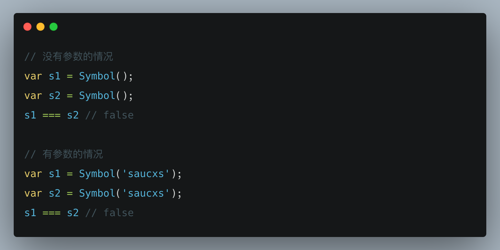

关注「松宝写代码」，精选好文，每日面试题

加入我们一起学习，day day up

>作者：saucxs ｜ songEagle

>来源：原创


## 一、前言

2020.12.23日刚立的flag，每日一题，题目类型不限制。

点击下面图片，查看第1道「一道面试题是如何引发深层次的灵魂拷问？」

[](https://mp.weixin.qq.com/s/O8j9gM5tD5rjLz1kdda3LA)

或者个人站点链接：

[一道面试题是如何引发深层次的灵魂拷问](http://www.chengxinsong.cn/post/63)

接下来是第2道：ES6中为什么要使用Symbol？

## 二、ES6中为什么要使用Symbol？

### 1、简述ES6中Symbol的概念
ES6中已经有6种数据类型：
+ Undefined
+ Null
+ 布尔值
+ 字符串
+ 数值
+ 对象

但是在ES6种新加入一种新的数据类型Symbol。

Symbol表示独一无二的值。

```
// 没有参数的情况
var s1 = Symbol();
var s2 = Symbol();
s1 === s2 // false

// 有参数的情况
var s1 = Symbol('saucxs');
var s2 = Symbol('saucxs');
s1 === s2 // false
```



需要说明一下：这里的字符'saucxs'是该Symbol的一个描述，但是并非两个参数都是'saucxs'。

### 2、简述Symbol的特性
+ 特性1：Symbol 值通过 Symbol 函数生成，使用 typeof，结果为 "symbol"
```
var a = Symbol();
console.log(typeof a); // "symbol"
```
+ 特性2：Symbol 函数前不能使用 new 命令，否则会报错。这是因为生成的 Symbol 是一个原始类型的值，不是对象。

+ 特性3：instanceof 的结果为 false
```
var a = Symbol('foo');
console.log(a instanceof Symbol); // false
```

+ 特性4：Symbol 函数可以接受一个字符串作为参数，表示对 Symbol 实例的描述，主要是为了在控制台显示，或者转为字符串时，比较容易区分。
```
var a = Symbol('saucxs');
console.log(a); // Symbol(saucxs)
```

+ 特性5：如果 Symbol 的参数是一个对象，就会调用该对象的 toString 方法，将其转为字符串，然后才生成一个 Symbol 值。

```
const obj = {
  toString() {
    return 'abc';
  }
};
const a = Symbol(obj);   // Symbol(abc)
```

+ 特性6：如果 Symbol 的参数是一个对象，就会调用该对象的 toString 方法，将其转为字符串，然后才生成一个 Symbol 值。

```
// 没有参数的情况
var s1 = Symbol();
var s2 = Symbol();
s1 === s2 // false

// 有参数的情况
var s1 = Symbol('saucxs');
var s2 = Symbol('saucxs');
s1 === s2 // false
```

+ 特性7：Symbol 值不能与其他类型的值进行运算，会报错。

```
var a = Symbol('saucxs');

console.log(`I am ${a}`); // TypeError: can't convert symbol to string
```


+ 特性8：Symbol 值可以显式转为字符串。

```
const f = Symbol('saucxs')
f.toString()    // "Symbol(saucxs)"
String(f)       // "Symbol(saucxs)"
```

+ 特性9：Symbol 值可以作为标识符，用于对象的属性名，可以保证不会出现同名的属性。

```
var mySymbol = Symbol();

// 第一种写法
var a = {};
a[mySymbol] = 'Hello!';

// 第二种写法
var a = {
  [mySymbol]: 'Hello!'
};

// 第三种写法
var a = {};
Object.defineProperty(a, mySymbol, { value: 'Hello!' });

// 以上写法都得到同样结果
console.log(a[mySymbol]); // "Hello!"
```


+ 特性10：Symbol 作为属性名，该属性不会出现在 for...in、for...of 循环中，也不会被 Object.keys()、Object.getOwnPropertyNames()、JSON.stringify() 返回。但是，它也不是私有属性，有一个 Object.getOwnPropertySymbols 方法，可以获取指定对象的所有 Symbol 属性名。

```
var obj = {};
var a = Symbol('a');
var b = Symbol('b');

obj[a] = 'Hello';
obj[b] = 'World';

var objectSymbols = Object.getOwnPropertySymbols(obj);

console.log(objectSymbols);
// [Symbol(a), Symbol(b)]
```

+ 特性11：使用同一个 Symbol 值，可以使用 Symbol.for。它接受一个字符串作为参数，然后搜索有没有以该参数作为名称的 Symbol 值。如果有，就返回这个 Symbol 值，否则就新建并返回一个以该字符串为名称的 Symbol 值。

```
var s1 = Symbol.for('saucxs');
var s2 = Symbol.for('saucxs');

console.log(s1 === s2); // true
```

+ 特性12： Symbol.keyFor 方法返回一个已登记的 Symbol 类型值的 key。

```
var s1 = Symbol.for("saucxs");
console.log(Symbol.keyFor(s1)); // "saucxs"

var s2 = Symbol("saucxs");
console.log(Symbol.keyFor(s2) ); // undefined
```

### 3、为什么要使用Symbol？
比如有这样一种场景，我们想区分两个属性，其实我们并不在意，这两个属性值究竟是什么，我们在意的是，这两个属性绝对要区分开来！
例如:

```
const shapeType = { triangle: 'Triangle'};
function getArea(shape, options) { 
    var area = 0; 
    switch (shape) { 
      case shapeType.triangle:
      area = .5 * options.width * options.height; 
      break; 
    } 
    return area;
}

getArea(shapeType.triangle, { width: 200, height: 200 });
```

这个时候，我们仅仅是想区分各种形状，因为不同的形状用不同的计算面积的公式。
这里使用的是triangle的名字叫做‘Triangle’，而是事实上我们不想对triangle去特地取个名，我们只想要区分triangle这个形状不同于任何其他形状，那么这个时候Symbol就派上用场啦！

```
const shapeType = {
   triangle: Symbol()
};
```

也就是说，我们不用非要去给变量赋一个字符串的值，去区分它和别的变量的值不同，因为去给每个变量取个语义化而又不同的值是一件伤脑子的事，当我们只需要知道每个变量的值都是百分百不同的即可，这时候我们就可以用Symbol。

还有可以运用在类的私有变量和私有方法中。


## 福利

### 1、内推福利

回复「校招」获取内推码

回复「社招」获取内推

回复「实习生」获取内推

后续会有更多福利


### 2、学习资料福利
回复「算法」获取算法学习资料

### 3、每日一题

+ 本文就是第2道「[ES6中为什么要使用Symbol？](http://www.chengxinsong.cn/post/112)」

+ 第1道「一道面试题是如何引发深层次的灵魂拷问？」

[](https://mp.weixin.qq.com/s/O8j9gM5tD5rjLz1kdda3LA)

或者个人站点链接：

[一道面试题是如何引发深层次的灵魂拷问](http://www.chengxinsong.cn/post/63)


## The End
如果你觉得这篇文章对你有帮助，有启发，我想请你帮我2个小忙：

1、点个「在看」，让更多的人也能看到这篇文章内容

2、关注「松宝写代码」，后台回复「加群」 加入我们一起学习。


songEagle开发知识体系构建，技术分享，项目实战，实验室，带你一起学习新技术，总结学习过程，让你进阶到高级资深工程师，学习项目管理，思考职业发展，生活感悟，充实中成长起来。问题或建议，请公众号留言。