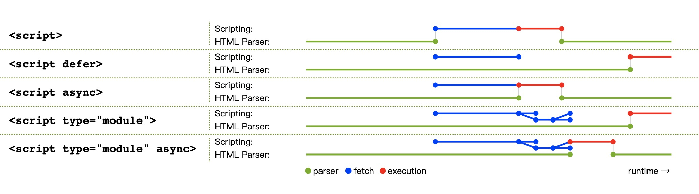

# 【每日一题】(39题)关于script标签，你可能不知道的地方？

关注「松宝写代码」，精选好文，每日一题

> 作者： saucxs

愿努力拼搏的你，都能在前进的道路上有所收获！

***

## 主要内容
+ 1、script标签默认会阻塞页面解析，并按照它们出现的顺序执行
+ 2、script标签的async和defer 属性
+ 3、type为module的script标签
+ 4、script标签的integrity属性
+ 5、script标签的crossorigin属性
+ 6、动态导入script
+ 7、script标签的onerror
+ 8、script标签与innerHTML


script标签用来在网页中执行JavaScript，它可以直接包含JavaScript代码，也可以直接通过src指向一个同域或者不同域的外链。

## 一、script标签默认会阻塞页面解析，并按照它们出现的顺序执行

```
<script src="a.js"></script>
<script>
  console.log('b')
</script>
<script src="b.js"></script>
```

浏览器在解析到上面的script标签时会阻止页面解析，并平行下载a.js, b.js，依次执行a.js, console.log('b'), b.js 后，再继续解析渲染页面。这也是为什么你会经常看到一些建议将需要DOM操作的js要放在body的最后，不阻塞页面html的解析。

## 二、script标签的async和defer 属性
async 仅适用于外链，规定脚本异步执行

下载不会阻塞页面解析

不会按照出现的顺序执行，先下载完成哪个就先执行哪个

执行的时候，有可能页面还没解析完成

defer仅适用于外链，规定脚本延迟执行

不会阻塞页面解析

在html解析完成后, DOMContentLoaded之前执行

会按照出现的顺序执行

## 三、type为module的script标签
相比传统script，<script type="module"></script>将被当作一个JavaScript模块对待，被称为module script，且不受charset和defer属性影响。

```
// app.js
import { assign } from "./utils.js"

var obj = Object.create(
  { foo: 1 }, 
  {
    bar: { value: 2 },
    baz: { value: 3, enumerable: true }
  },
)
var copy = assign({}, obj)
console.log(copy)
<script type="module" src="app.js"></script>
<script nomodule src="classic-app-bundle.js"></script>
```

上面的代码，可以这么理解：

支持module script的浏览器，不会执行拥有nomodule属性的script

不支持module script的浏览器，会忽略未知的type="module"的script，同时也会忽略传统script中不认识的nomodule属性，进而执行传统的bundle.js代码
module script以及其依赖所有文件（源文件中通过import声明导入的文件）都会被下载，一旦整个依赖的模块树都被导入，页面文档也完成解析，app.js将会被执行
但是如果module script里有async属性，比如<script type="module" src="util.js" async></script>，module script及其所有依赖都会异步下载，待整个依赖的模块树都被导入时会立即执行，而此时页面有可能还没有完成解析渲染。

传统script和module script如何被下载执行可以用下图来概括：



## 四、script标签的integrity属性

```
<script crossorigin="anonymous" integrity="sha256-PJJrxrJLzT6CCz1jDfQXTRWOO9zmemDQbmLtSlFQluc=" src="https://assets-cdn.github.com/assets/frameworks-3c926bc6b24bcd3e820b3d630df4174d158e3bdce67a60d06e62ed4a515096e7.js"></script>
```

integrity属性是资源完整性规范的一部分，它允许你为script提供一个hash，用来进行验签，检验加载的JavaScript文件是否完整。

上面的代码来自github源码， integrity="sha256-PJJrxrJLzT6CCz1jDfQXTRWOO9zmemDQbmLtSlFQluc="告诉浏览器，使用sha256签名算法对下载的js文件进行计算，并与intergrity提供的摘要签名对比，如果二者不一致，就不会执行这个资源。

intergrity的作用有：

+ 减少由【托管在CDN的资源被篡改】而引入的XSS 风险
+ 减少通信过程资源被篡改而引入的XSS风险（同时使用https会更保险）
+ 可以通过一些技术手段，不执行有脏数据的CDN资源，同时去源站下载对应资源

> 注意：启用 SRI 策略后，浏览器会对资源进行 CORS 校验，这就要求被请求的资源必须同域，或者配置了 Access-Control-Allow-Origin 响应头

## 五、script标签的crossorigin属性
crossorigin的属性值可以是anonymous、use-credentials，如果没有属性值或者非法属性值，会被浏览器默认做anonymous。crossorigin的作用有三个：

+ crossorigin会让浏览器启用CORS访问检查，检查http相应头的Access-Control-Allow-Origin
+ 对于传统script需要跨域获取的js资源，控制暴露出其报错的详细信息
+ 对于module script，控制用于跨域请求的[凭据模式](https://fetch.spec.whatwg.org/#concept-request-credentials-mode)

我们在收集错误日志的时候，通常会在window上注册一个方法来监测所有代码抛出的异常：

```
window.addEventListener('error', function(msg, url, lineno, colno, error) {
  var string = msg.toLowerCase()
  var substring = "script error"
  if (string.indexOf(substring) > -1){
    alert('Script Error: See Browser Console for Detail')
  } else {
    var message = {
      Message: msg,
      URL:  url,
      Line: lineNo,
      Column: columnNo,
      'Error object': JSON.stringify(error)
    }
    // send error log to server
    record(message)
  }
  return false
})
```

但是对于跨域js来说，只会给出很少的报错信息：'error: script error'，通过使用crossorigin属性可以使跨域js暴露出跟同域js同样的报错信息。但是，资源服务器必须返回一个Access-Control-Allow-Origin的header，否则资源无法访问。

## 六、动态导入script

```
function loadError (error) {
  throw new URIError(`The script ${error.target.src}  is not accessible.`)
}

function importScript (src, onLoad) {
  var script = document.createElement('script')
  script.onerror = loadError
  script.async = false
  if (onLoad) { script.onload = onLoad }
  document.header.appendChild(script)
  script.src = src
}
```

> 可以上面的方法动态加载js资源，但是要注意的是，默认append到文档中的script会异步执行（可以理解为默认拥有async属性，如果需要加载的js按顺序执行，需要设置async为false）

## 七、script标签的onerror
+ JavaScript运行时的错误（抛出的语法错误和异常）发生时，实现了ErrorEvent接口的error事件在window上触发，并且调用window.onerror(或者window.addEventListener('error, cb))的回调函数

+ 当资源（如  或 <script>）无法加载，或者启用SRI策略资源不完整时，使用Event接口的error事件在会在该资源元素处触发，元素上的onerror回调函数被调用

## 八、script标签与innerHTML
通过 innerHTML 动态添加到页面上的 script 标签则不会被执行

document.head.innerHTML += `<script>alert('不会执行')</script>`

## 参考资料：
+ [whatwg scripting](https://html.spec.whatwg.org/multipage/scripting.html)
+ [js-modules](https://blog.whatwg.org/js-modules)
+ [subResource intergrity](https://imququ.com/post/subresource-integrity.html)
+ [CORS settings attributes](https://developer.mozilla.org/en-US/docs/Web/HTML/Attributes/crossorigin)
+ [ErrorEvent](https://developer.mozilla.org/en-US/docs/Web/API/ErrorEvent)