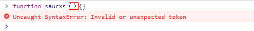
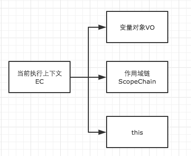
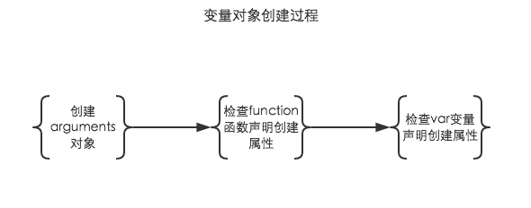
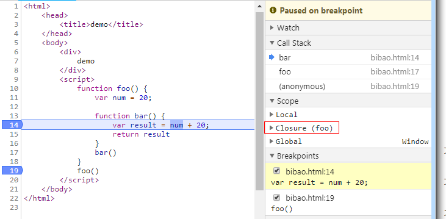

# [每日一题]面试官问：JS引擎的执行过程（一）
关注「松宝写代码」，精选好文，每日一题

>作者：saucxs ｜ songEagle


2020，实「鼠」不易

2021，「牛」转乾坤

风劲潮涌当扬帆，任重道远须奋蹄！

​时间永远是自己的

每分每秒也都是为自己的将来铺垫和增值

## 一、前言

2020.12.23 立的 flag，每日一题，题目类型不限制，涉及到JavaScript，Node，Vue，React，浏览器，http等领域。

本文是「每日一题」第 11 题：[每日一题]面试官问：JS引擎的执行过程

我们把这个分为2篇文章讲。

本篇讲：语法分析和预编译阶段。

下一篇讲：执行阶段。


往期「每日一题」：

+ 第 10 题[[每日一题]面试官问：详细说一下JS数据类型](https://mp.weixin.qq.com/s/wm0EGVXTTHoHMcdUxMQmKA)

+ 第 9 题[[每日一题]requestAnimationFrame不香吗？](https://mp.weixin.qq.com/s/4Ob_CEiZUyoHKxffAeAYdw)

+ 第 8 题[[每日一题]面试官问：谈谈你对ES6的proxy的理解？](https://mp.weixin.qq.com/s/8loJlarVrmj47XjgrZLI1w)

+ 第 7 题[[每日一题]面试官问：for in和for of 的区别和原理？](https://mp.weixin.qq.com/s/RsynH85UkAwAgIAzwxs-Ag)

+ 第 6 题[[每日一题]面试官问：Async/Await 如何通过同步的方式实现异步？](https://mp.weixin.qq.com/s/UAYBnQvekRugR8DVEUPB3Q)

+ 第 5 道[「每日一题」到底该如何回答：vue数据绑定的实现原理？](https://mp.weixin.qq.com/s/8eo4frdB-zMA7nD_1wdnLw)

+ 第 4 道[「每日一题」与面试官手撕代码：如何科学高效的寻找重复元素？](https://mp.weixin.qq.com/s/jFZ_2f272LhBBPuuLaWnyg)

+ 第 3 道[「「每日一题」面试官问你对 Promise 的理解？可能是需要你能手动实现各个特性」](https://mp.weixin.qq.com/s/QuuPd2KCp50snN7F2o3oYg)

+ 第 2 道[「[每日一题]ES6 中为什么要使用 Symbol？」](https://mp.weixin.qq.com/s/omeVJdtabo5MeN3DItDfWg)

+ 第 1 道[「一道面试题是如何引发深层次的灵魂拷问？」](https://mp.weixin.qq.com/s/O8j9gM5tD5rjLz1kdda3LA)


## 二、概述

js是一种非常灵活的语言，理解js引擎的执行过程对于我们学习js是非常有必要的。看了很多这方便文章，大多数是讲的是事件循环（event loop）或者变量提升的等，并没有全面分析其中的过程。所以觉得把这个js执行的详细过程整理一下，帮助更好的理解js。

### 1.1基础概念

js是单线程语言。

在浏览器中一个页面永远只有一个线程在执行js脚本代码

js是单线程怨言，但是代码解析是非常迅速的，不会发生解析阻塞。

js是异步执行的，通过实践循环（event loop）方式实现的


暂时我们不考虑事件循环（event loop），我们先来看这样一段代码，来确定我们是否理解js引擎的执行过程

console.log(person)

console.log(personFun)

var person = "saucxs";

console.log(person)

function personFun() {
    console.log(person)
    var person = "songEagle";
    console.log(person)
}

personFun()

console.log(person)
可以自己直接使用浏览器看出输出结果

首先我们来分析一下上面的代码，虽然很多开发人员基本上都能答出来，但是还是要啰嗦一下。

全面分析js引擎的执行过程，分为三个阶段

1、语法分析

2、预编译阶段

3、执行阶段

说明：
+ 浏览器先按照js的顺序加载script标签分隔的代码块，js代码块加载完毕之后，
+ 立刻进入到上面的三个阶段，
+ 然后再按照顺序找下一个代码块，
+ 再继续执行三个阶段，
+ 无论是外部脚本文件（不异步加载）还是内部脚本代码块，都是一样的，并且都在同一个全局作用域中。


## 三、语法分析

js的代码块加载完毕之后，会首先进入到语法分析阶段，该阶段的主要作用：

分析该js脚本代码块的语法是否正确，如果出现不正确会向外抛出一个语法错误（syntaxError），停止改js代码的执行，然后继续查找并加载下一个代码块；如果语法正确，则进入到预编译阶段。

类似的语法报错的如下图所示：




## 四、预编译阶段

js代码块通过语法分析阶段之后，语法都正确的下回进入预编译阶段。

在分析预编译阶段之前，我们先来了解一下js的运行环境，运行环境主要由三种：

1、全局环境（js代码加载完毕后，进入到预编译也就是进入到全局环境）

2、函数环境（函数调用的时候，进入到该函数环境，不同的函数，函数环境不同）

3、eval环境（不建议使用，存在安全、性能问题）


每进入到一个不同的运行环境都会创建 一个相应的执行上下文（execution context），那么在一段js程序中一般都会创建多个执行上下文，js引擎会以栈的数据结构对这些执行进行处理，形成函数调用栈（call stack），栈底永远是全局执行上下文（global execution context），栈顶则永远时当前的执行上下文。


### 4.1函数调用栈

什么是函数调用栈？

函数调用栈就是使用栈存取的方式进行管理运行环境，特点是先进后出，后进后出

我们来分析一下简答的js代码来理解函数调用栈：

```
function bar() {
    var B_context = "bar saucxs";

    function foo() {
        var f_context = "foo saucxs";
    }

    foo()
}

bar()
```

上面代码块通过语法分析后，进入预编译阶段，如图所示:


1、首先进入到全局环境，创建全局执行上下文（global Execution Context ），推入到stack中；

2、调用bar函数，进入bar函数运行环境，创建bar函数执行上下文（bar Execution Context），推入stack栈中；

3、在bar函数内部调用foo函数，则再进入到foo函数运行环境中，创建foo函数执行上下文（foo Execution Context），如上图，由于foo函数内部没有再调用其他函数，那么则开始出栈；

5、foo函数执行完毕之后，栈顶foo函数执行上下文（foo Execution Context）首先出栈；

6、bar函数执行完毕，bar函数执行上下文（bar Execution Context）出栈；

7、全局上下文（global Execution Cntext）在浏览器或者该标签关闭的时候出栈。

说明：不同的运行环境执行都会进入到代码预编译和执行两个阶段，语法分析则在代码块加载完毕时统一检查语法。


### 4.2创建执行上下文

执行上下文可以理解成当前的执行环境，与该运行环境相对应。创建执行上下文的过程中，主要是做了下面三件事，如图所示：



1、创建变量对象（variable object）

2、创建作用域链（scope chain）

3、确定this的指向


#### 4.2.1创建变量对象

创建变量对象主要是经过以下过程，如图所示：



1、创建arguments对象，检查当前上下文的参数，建立该对象的属性与属性值，仅在函数环境（非箭头函数）中进行的，全局环境没有此过程。

2、检查当前上下文的函数声明，按照代码顺序查找，将找到的函数提前声明，如果当前上下文的变量对象没有该函数名属性，则在该变量对象以函数名建立一个属性，属性值则指向该函数所在堆内存地址引用，如果存在，则会被新的引用覆盖掉。

3、检查当前上下文的变量声明，爱去哪找代码顺序查找，将找到的变量提前声明，如果当前上下文的变量对象没有变量名属性，则在该变量对象以变量名建立一个属性，属性值为undefined；如果存在，则忽略该变量声明。

说明：在全局环境中，window对象就是全局执行上下文的变量对象，所有的变量和函数都是window对象的属性方法。

所以函数声明提前和变量声明提升是在创建变量对象中进行的，且函数声明优先级高于变量声明。

下面我们再来分析这个简单代码

```
function fun(m,n){
    var saucxs = 1;

    function execution(){
        console.log(saucxs)
    }
}

fun(2,3)
```

这里我们在全局环境中调用fun函数，创建fun的执行上下文，这里暂时不说作用域链以及this指向的问题。

```
funEC = {
    //变量对象
    VO: {
        //arguments对象
        arguments: {
            m: undefined,
            n: undefined,
            length: 2
        },

        //execution函数
        execution: <execution reference>, 

        //num变量
        saucxs: undefined
    },

    //作用域链
    scopeChain:[],

    //this指向
    this: window
}
```

1、funEC表示fun函数的执行上下文（fun Execution Context 简写为funEC）；

2、funEC的变量对象中arguments属性，上面这样写只是为了理解，在浏览器中展示以类数组的方式展示的

3、<execution reference>表示的是execution函数在堆内存地址的引用

说明：创建变量对象发生在预编译阶段，还没有进入到执行阶段，该变量对象都不能访问的，因为此时的变量对象中的变量属性尚未赋值，值仍为undefined，只有在进行执行阶段，变量中的变量属性才进行赋值后，变量对象（Variable Object）转为活动对象（Active Object）后，才能进行访问，这个过程就是VO->AO过程。


#### 4.2.2创建作用域链

作用域链由当前执行环境的变量对象（未进入到执行阶段前）与上层环境的一系列活动对象组成，保证了当前执行还款对符合访问权限的变量和函数有序访问。

理解清楚作用域链可以帮助我们理解js很多问题包括闭包问题等，下面我们结合一个例子来理解一下作用域链。

```
var num = 30;

function test() {
    var a = 10;

    function innerTest() {
        var b = 20;

        return a + b
    }

    innerTest()
}

test()
```

在上面例子中，当执行到调用innerTest函数，进入到innerTest函数环境。全局执行上下文和test函数执行上下文已进入到执行阶段，innerTest函数执行上下文在预编译阶段创建变量对象，所以他们的活动对象和变量对象分别是AO（global），AO（test）和VO（innerTest），而innerTest的作用域链由当前执行环境的变量对象（未进入到执行阶段前）与上层环境的一系列活动对象组成，如下：

```
innerTestEC = {

    //变量对象
    VO: {b: undefined}, 

    //作用域链
    scopeChain: [VO(innerTest), AO(test), AO(global)],  
    
    //this指向
    this: window
}
```

我们这里可以直接使用数组表示作用域链，作用域链的活动对象或者变量对象可以直接理解成作用域。

1、作用域链的第一项永远是当前作用域（当前上下文的变量对象或者活动对象）；

2、最后一项永远是全局作用域（全局上下文的活动对象）；

3、作用域链保证了变量和函数的有序访问，查找方式是沿着作用域链从左至右查找变量或者函数，找到则会停止找，找不到则一直查找全局作用域，再找不到就会排除错误。


#### 4.2.3闭包

什么是闭包？思考一下

看一下简单的例子

```
function foo() {
    var num = 20;

    function bar() {
        var result = num + 20;

        return result
    }

    bar()
}

foo()
```

因为对于闭包的有很多的不同理解，包括我看一些书籍（js高级程序设计），我这直接以浏览器解析，以浏览器的闭包为准来分析闭包，如图:



如图所示，谷歌浏览器理解的闭包是foo，那么按照浏览器的标准是如何定义的闭包，自己总结为三点：

1、在函数内部定义新函数

2、新函数访问外层函数的局部变量，即访问外层函数环境的活动对象属性

3、新函数执行，创建新函数的执行上下文，外层函数即为闭包


#### 4.2.4确定this指向

1、在全局环境下，全局执行的上下文中变量对象的this属性指向为window；

2、在函数环境下的this指向比较灵活，需要根据执行环境和执行方法确定，列举典型例子来分析


## 五、总结

由于涉及到的内容过多，下一次将第三阶段（执行阶段）单独分离出来。另开出新文章详细分析，主要介绍js执行阶段中的同步任务执行和异步任务执行机制（事件循环（Event Loop））。


## 六、参考

你不知道的javascript(上卷)


## 各种福利

#### 1、字节内推福利
+ 回复「校招」获取内推码
+ 回复「社招」获取内推
+ 回复「实习生」获取内推

后续会有更多福利

#### 2、学习资料福利
回复「算法」获取算法学习资料

#### 3、每日一题

+ 第 10 题[[每日一题]面试官问：详细说一下JS数据类型](https://mp.weixin.qq.com/s/wm0EGVXTTHoHMcdUxMQmKA)

+ 第 9 题[[每日一题]requestAnimationFrame不香吗？](https://mp.weixin.qq.com/s/4Ob_CEiZUyoHKxffAeAYdw)

+ 第 8 题[[每日一题]面试官问：谈谈你对ES6的proxy的理解？](https://mp.weixin.qq.com/s/8loJlarVrmj47XjgrZLI1w)

+ 第 7 题[[每日一题]面试官问：for in和for of 的区别和原理？](https://mp.weixin.qq.com/s/RsynH85UkAwAgIAzwxs-Ag)

+ 第 6 题[[每日一题]面试官问：Async/Await 如何通过同步的方式实现异步？](https://mp.weixin.qq.com/s/UAYBnQvekRugR8DVEUPB3Q)

+ 第 5 道[「每日一题」到底该如何回答：vue数据绑定的实现原理？](https://mp.weixin.qq.com/s/8eo4frdB-zMA7nD_1wdnLw)

+ 第 4 道[「每日一题」与面试官手撕代码：如何科学高效的寻找重复元素？](https://mp.weixin.qq.com/s/jFZ_2f272LhBBPuuLaWnyg)

+ 第 3 道[「「每日一题」面试官问你对 Promise 的理解？可能是需要你能手动实现各个特性」](https://mp.weixin.qq.com/s/QuuPd2KCp50snN7F2o3oYg)

+ 第 2 道[「[每日一题]ES6 中为什么要使用 Symbol？」](https://mp.weixin.qq.com/s/omeVJdtabo5MeN3DItDfWg)

+ 第 1 道[「一道面试题是如何引发深层次的灵魂拷问？」](https://mp.weixin.qq.com/s/O8j9gM5tD5rjLz1kdda3LA)


## 谢谢支持
1、喜欢的话可以「分享，点赞，在看」三连哦。

2、作者昵称：saucxs，songEagle，松宝写代码。字节跳动的一枚前端工程师，一个正在努力成长的作者，星辰大海，未来可期，**内推字节跳动各个部门各个岗位。**

3、长按下面图片，关注「松宝写代码」，是获取开发知识体系构建，精选文章，项目实战，实验室，每日一道面试题，进阶学习，思考职业发展，涉及到JavaScript，Node，Vue，React，浏览器，http等领域，希望可以帮助到你，我们一起成长～


