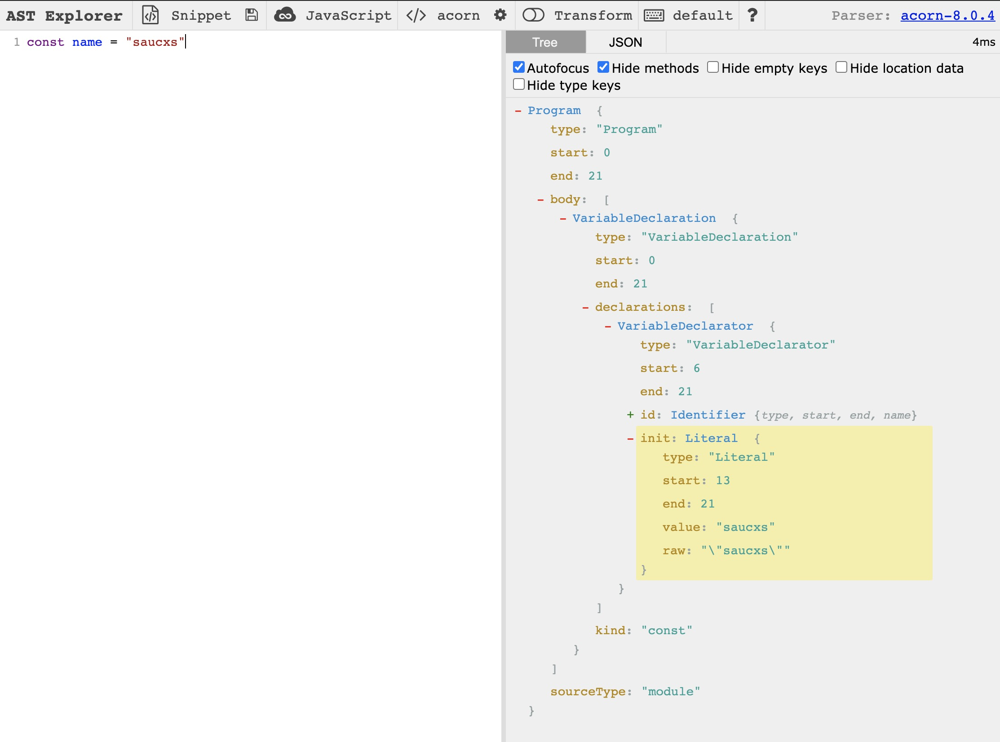

# 【每日一题】(41题)JS代码到底是如何被压缩的?

关注「松宝写代码」，精选好文，每日一题

> 作者： saucxs

愿努力拼搏的你，都能在前进的道路上有所收获！

> 大家通常都会认为，现在在网络时代，动不动就是10M光纤，100M光纤，拨号上网让人感觉是上个世纪的事情，说法是没有问题,但是,我们今天讨论的并不是终端下载速度，而是前端压缩对服务器有何好处和如何被压缩的？

***

## 一、前言

前端不断发展，特别是 `React`，`Vue` 等框架构造单页应用的兴起，项目的复杂度越来越大。此时的前端的静态资源也越来越庞大， `javascript` 资源已是前端的主体资源，所以对于压缩它的体积至为重要。

为什么说更小的体积很重要呢？
+ 更小的体积对于用户体验更丝滑
+ 更小的体积对于服务器压力更小

前端构建编译代码时，可以使用 `webpack` 中的 `optimization.minimizer` 来对代码进行压缩优化。

需要知其所以然？

需要了解如何它是压缩代码的，这样当在生产环境的控制台调试代码时更方便。

## 二、为什么要压缩js
+ 1、开发代码风格迥异
因为每个人开发者的书写习惯，定义参数习惯，已经使用习惯都不一样。所以相同的功能出自不同开发者代码各异，这里牵扯到一个代码所占空间。

+ 2、前端越来越重，更好的体验
现在的前端越来越重，富客户端方式让人有更好的体验，所以前端各种框架，插件空前盛行。我们普普通通引用一个第三方包或者开源插件，轻则几十K，重则上M，十几M 都很常见。如果一个客户端连接，服务器需要传输100K，那么如果同时有几百个，几千个客户端并发时，服务器输出带宽是多大?再想想租赁带宽一年费用多少? 

+ 3、页面加载优化
页面加载，我们通常的优化方案是把`css`放到`head`里面加载，把`javascript`放到`body`结束处加载。因为 `javascript`的运行机制是单线程，如果你把大量的`javascript`脚本放在 head 处加载，无形中影响了页面渲染速度。当然现在 html5 也在优化一些更优的方案。但是不论这没有，小文件的加载一定比大文件加载用户体验更好。


## 三、如何查看资源的体积

对于我们所编写的代码，它在操作系统中是一个文件，根据文件系统中的 `stat` 信息我们可以查看该文件的大小。

`stat` 命令用来打印文件系统的信息：

``` bash
chengxinsong$ stat index.tsx
16777220 110853260 -rw-r--r-- 1 chengxinsong staff 0 34183 "Feb  3 11:13:36 2021" "Feb  3 11:11:58 2021" "Feb  3 11:11:58 2021" "Feb  3 11:11:58 2021" 4096 72 0 index.tsx
```

`stat` 打印的信息比较多，如果只用来衡量体积，可以使用 `wc -c`

``` bash
chengxinsong$ wc -c index.tsx
34183 index.tsx
```

## 四、如何压缩代码体积？

我们开始介绍几种压缩代码体积的几种方案

### 4.1去除多余字符

``` javascript
// 对两个数求和
function add (a, b) {
  return a + b;
}
```

先把一个抽象的问题如何具体化，上面这段代码，那如何压缩它的体积呢:

此时文件大小是 `62 Byte`， 一般来说中文会占用更大的空间。

多余的空白字符会占用大量的体积，如空格，换行符，另外注释也会占用文件体积。当我们把所有的空白符合注释都去掉之后，代码体积会得到减少。

去掉多余字符之后，文件大小已经变为 `30 Byte`。 压缩后代码如下:

``` javascript
function add(a,b){return a+b}
```

替换掉多余字符后会有什么问题产生呢？有，比如多行代码压缩到一行时要注意行尾分号。 这就需要通过以下介绍的 AST 来解决。

### 4.2压缩变量名

``` javascript
function add (first, second) {
  return first + second;  
}
```

如以上 `first` 与 `second` 在函数的作用域中，在作用域外不会引用它，此时可以让它们的变量名称更短。但是如果这是一个 `module` 中，`sum` 这个函数也不会被导出呢？那可以把这个函数名也缩短。

``` javascript
// 压缩: 缩短变量名
function add (x, y) {
  return x + y;  
}

// 再压缩: 去除空余字符
function s(x,y){return x+y}
```

上面示例中，当完成代码压缩`compress`时，代码的混淆`mangle`也跟着完成。 但此时缩短变量的命名也需要 AST 支持，不至于在作用域中造成命名冲突。

### 4.3更简单的表达

合并声明的示例如下：

``` javascript
// 压缩前
const a = 5;
const b = 6;

// 压缩后
const a = 5, b = 6;
```

布尔值 简化的示例如下：

``` javascript
// 压缩前
!b && !c && !d && !e

// 压缩后
!(b||c||d||e)
```

这个示例更是需要解析 AST 了

## 五、AST抽象语法树

`AST`，抽象语法树，js 代码解析后的最小词法单元，而这个过程就是通过 Parser 来完成的。

那么 AST 可以做什么呢？

+ eslint: 校验你的代码风格
+ babel: 编译代码到 ES 低版本
+ taro/mpvue: 各种可以多端运行的小程序框架
+ GraphQL: 解析客户端查询

经常打交道的工具，比如：`eslint`，`babel`，都会涉及到 `js` 与代码中游走。不同的解析器会生成不同的抽象语法树，最常见的是babel使用的解析器`babylon`，而 `uglify` 在代码压缩中使用到的解析器是`UglifyJS`。

你可以在 [AST Explorer](https://astexplorer.net/) 中直观感受到，如下图：




那压缩代码的过程：
> code -> AST -> (transform)一颗更小的AST -> code，这与 `babel` 和 `eslint` 的流程一模一样。


## 六、UglifyJS

这儿有一个经典的代码压缩库: [UglifyJS3](https://github.com/mishoo/UglifyJS2)，一个用以代码压缩混淆的库。那它是如何完成一些压缩功能的，比如替换空白符，答案是 AST。

UglifyJS 功能：
+ 生成JS代码的抽象语法树(AST)，通过parse-js.js完成.
+ 遍历AST语法树，做各种操作，比如自动缩进、缩短变量名、删除块括号{}、去空格、常量表达式、连续变量声明、语块合并、去掉无法访问的代码等，通过process.js完成.

`webpack` 中内置的代码压缩插件就是使用了它，它的工作流程大致如下：

``` javascript
// 最初代码
const code = `const name = 'saucxs';`

// UglifyJS 把代码解析为 AST
const ast = UglifyJS.parse(code);
ast.figure_out_scope();


// 转化为更小的 AST 树
compressor = UglifyJS.Compressor();
ast = ast.transform(compressor);

// 再把 AST 转化为代码
code = ast.print_to_string();
```

使用它来压缩代码时，咱们面向配置编程，可以文档参考 [uglify 官方文档](https://github.com/mishoo/UglifyJS2#parse-options)

``` js
{
  {
    ecma: 8,
  },
  compress: {
    ecma: 5,
    warnings: false,
    comparisons: false,
    inline: 2,
  },
  output: {
    ecma: 5,
    comments: false,
    ascii_only: true,
  }
}
```

## 七、webpack 中压缩代码

在知道代码压缩是怎么完成的之后，我们终于可以把它搬到生产环境中去压缩代码。终于到了实践的时候了，虽然它只是简单的调用 API 并且调调参数。

一切与性能优化相关的都可以在 `optimization` 中找到，`TerserPlugin` 是一个底层基于 `uglifyjs` 的用来压缩 JS 的插件。

``` javascript
optimization: {
  minimize: isEnvProduction,
  minimizer: [
    new TerserPlugin({
      terserOptions: {
        parse: {
          ecma: 8,
        },
        compress: {
          ecma: 5,
          warnings: false,
          comparisons: false,
          inline: 2,
        },
        output: {
          ecma: 5,
          comments: false,
          ascii_only: true,
        },
      },
      sourceMap: true
    })
  ]
}
```


## 往期「每日一题」

### 1、JavaScript && ES6

+ 第 40 题：[【每日一题】(40题)关于script标签，你可能不知道的地方？](https://mp.weixin.qq.com/s/k42O6hbCD0TIc9IdC-sghg)

+ 第 39 题：[【每日一题】(39题)谈谈JS的函数扩展？](https://mp.weixin.qq.com/s/X8fgfydIjb2eOrVCAc3sDA)

+ 第 30 题：[【每日一题】(30题)面试官:ES6的解构赋值的理解？](https://mp.weixin.qq.com/s/-rWv24IAhGAq4WVqHY2jOg)

+ 第 28 题：[【每日一题】(28题)面试官:原型链与构造函数结合方法继承与原型式继承的区别？](https://mp.weixin.qq.com/s/uPUxo8gIGyHv-b_aWdgzaw)

+ 第 22 题：[【每日一题】(22题)面试官问：var与const,let的主要区别是什么？](https://mp.weixin.qq.com/s/wJ1cG7eQw85fpqpk_fHq7w)

+ 第 21 题：[【每日一题】(21题)面试官问：谈谈JS中的 this 的绑定？](https://mp.weixin.qq.com/s/WvDIjv_FNfDsD9OmB6SirA)

+ 第 20 题：[【每日一题】(20题)面试官问：谈谈JS中的 webSockets 的理解？](https://mp.weixin.qq.com/s/GA-Wl03ZDLhnBCAG0wTi0w)

+ 第 19 题：[【每日一题】面试官问：谈谈JS中的 XMLHttpRequest 对象的理解？](https://mp.weixin.qq.com/s/wxIEGJVmfxq0Q-8E4tbv1A)

+ 第 18 题：[【每日一题】面试官问：JS中的 Ajax 跨域与扩展 Comet ？](https://mp.weixin.qq.com/s/mb8TRlw1yzEOfDzMyYLW2g)

+ 第 17 题：[【每日一题】(17题)面试官问：JS中事件流，事件处理程序，事件对象的理解？](https://mp.weixin.qq.com/s/mb8TRlw1yzEOfDzMyYLW2g)

+ 第 16 题：[【每日一题】面试官问：JS中如何全面进行客户端检测？](https://mp.weixin.qq.com/s/-tNI1vwdK_SAxNGRQTCd1Q)

+ 第 15 题：[【每日一题】面试官问：JS类型判断有哪几种方法？](https://mp.weixin.qq.com/s/UwVgQMaVPg6Z0SVgn4kqwA)

+ 第 14 题：[【每日一题】面试官问：谈谈你对JS对象的创建和引申](https://mp.weixin.qq.com/s/-HTpVMFMRDu8sElNv-WqIw)

+ 第 13 题[[每日一题]面试官问：['1', '2', '3'].map(parseInt)输出，原因，以及延伸？](https://mp.weixin.qq.com/s/DJ6Av4tQgJpqa8hKAPk_uA)

+ 第 12 题[[每日一题]面试官问：JS引擎的执行过程（二）](https://mp.weixin.qq.com/s/CCUsCM2vzb6S1wcwIsjQuA)

+ 第 11 题[[每日一题]面试官问：JS引擎的执行过程（一）](https://mp.weixin.qq.com/s/Lhd5N5a1b8fAstWn5H3B3Q)

+ 第 10 题[[每日一题]面试官问：详细说一下JS数据类型](https://mp.weixin.qq.com/s/wm0EGVXTTHoHMcdUxMQmKA)

+ 第 8 题[[每日一题]面试官问：谈谈你对ES6的proxy的理解？](https://mp.weixin.qq.com/s/8loJlarVrmj47XjgrZLI1w)

+ 第 7 题[[每日一题]面试官问：for in和for of 的区别和原理？](https://mp.weixin.qq.com/s/RsynH85UkAwAgIAzwxs-Ag)

+ 第 6 题[[每日一题]面试官问：Async/Await 如何通过同步的方式实现异步？](https://mp.weixin.qq.com/s/UAYBnQvekRugR8DVEUPB3Q)

+ 第 3 道[「「每日一题」面试官问你对 Promise 的理解？可能是需要你能手动实现各个特性」](https://mp.weixin.qq.com/s/QuuPd2KCp50snN7F2o3oYg)

+ 第 2 道[「[每日一题]ES6 中为什么要使用 Symbol？」](https://mp.weixin.qq.com/s/omeVJdtabo5MeN3DItDfWg)

### 2、浏览器

+ 第 9 题[[每日一题]requestAnimationFrame不香吗？](https://mp.weixin.qq.com/s/4Ob_CEiZUyoHKxffAeAYdw)


### 3、Vue

+ 第 5 道[「每日一题」到底该如何回答：vue数据绑定的实现原理？](https://mp.weixin.qq.com/s/8eo4frdB-zMA7nD_1wdnLw)

### 4、React
+ 第 38 道[【每日一题】(38题)谈谈React Hooks 与Vue3.0 Function based API的对比？](https://mp.weixin.qq.com/s/7D8SvbS1r0oH60EjwowXSQ)

### 5、HTML5
+ 第 29 道[【每日一题】(29题)面试官:HTML-HTML5新增标签属性的理解？](https://mp.weixin.qq.com/s/Lx5-bF-xliB9TBuEtE7dLw)

### 6、算法
+ 第 37 道[【每日一题】(37题)面试官:你对图论了解多少？(七)](https://mp.weixin.qq.com/s/ukPZLrfsPsCxJtOQko8EJg)

+ 第 36 道[【每日一题】(36题)面试官:你对图论了解多少？(六)](https://mp.weixin.qq.com/s/BReGF1JB05W5Ge2ZeaEEYw)

+ 第 35 道[【每日一题】(35题)面试官:你对图论了解多少？(五)](https://mp.weixin.qq.com/s/_ICHDWO4ma_CbEbbemkxZw)

+ 第 34 道[【每日一题】(34题)面试官:你对图论了解多少？(四)](https://mp.weixin.qq.com/s/EJ_72u5S7KD4950IEO_CQg)

+ 第 33 道[【每日一题】(33题)面试官:你对图论了解多少？(三)](https://mp.weixin.qq.com/s/wRy1xAm4JzHCq1dRjMUuoA)

+ 第 32 道[【每日一题】(32题)面试官:你对图论了解多少？(二)](https://mp.weixin.qq.com/s/_aSMIEpBc2jvTFXxBaK7nQ)

+ 第 31 道[[【每日一题】(31题)面试官:你对图论了解多少？(一)](https://mp.weixin.qq.com/s/E6dh8A9dVxxB9jaRGm3kbg)

+ 第 27 道[【每日一题】(27题)算法题:如何使用多种解决方案来实现跳一跳游戏？](https://mp.weixin.qq.com/s/EY99dnyjjTvdBflpE5T2Fw)

+ 第 26 道[【每日一题】(26题)算法题:最长公共前缀？](https://mp.weixin.qq.com/s/1TzP0JgrzqXbQes1jzzwFg)

+ 第 25 道[【每日一题】(25题)算法题:堆数据结构-前 K 个高频元素？](https://mp.weixin.qq.com/s/desqLK9Wst9v7XPcNyvwlQ)

+ 第 24 道[【每日一题】(24题)算法题:贪心算法-环游世界之如何加油？](https://mp.weixin.qq.com/s/ST6pf00iBZiDs4GpGK0eOw)

+ 第 4 道[「每日一题」与面试官手撕代码：如何科学高效的寻找重复元素？](https://mp.weixin.qq.com/s/jFZ_2f272LhBBPuuLaWnyg)

### 7、Node

+ 第 23 道[【每日一题】(23题)面试官问：详细描述事件循环Event Loop？](https://mp.weixin.qq.com/s/hE-tK_PbSYkMms8P9b2H7A)

### 8、Http

+ 第 1 道[「一道面试题是如何引发深层次的灵魂拷问？」](https://mp.weixin.qq.com/s/O8j9gM5tD5rjLz1kdda3LA)


## 谢谢支持

1、文章喜欢的话**可以「分享，点赞，在看」三连**哦。

2、作者昵称：saucxs，songEagle，松宝写代码。「松宝写代码」公众号作者，每日一题，实验室等。一个爱好折腾，致力于全栈，正在努力成长的字节跳动工程师，星辰大海，未来可期。**内推字节跳动各个部门各个岗位**。

3、长按下面图片，关注「松宝写代码」，是获取开发知识体系构建，精选文章，项目实战，实验室，**每日一道面试题**，进阶学习，思考职业发展，涉及到JavaScript，Node，Vue，React，浏览器，http，算法，端相关，小程序等领域，希望可以帮助到你，我们一起成长～


