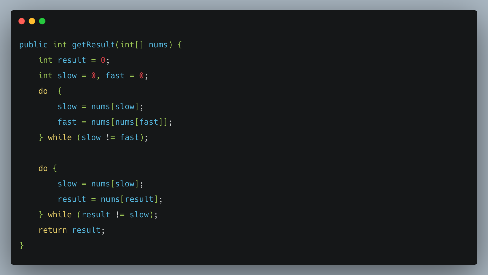
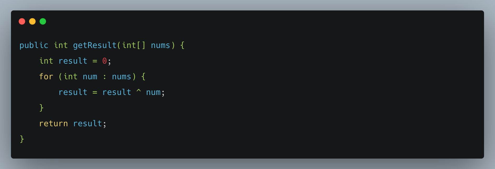
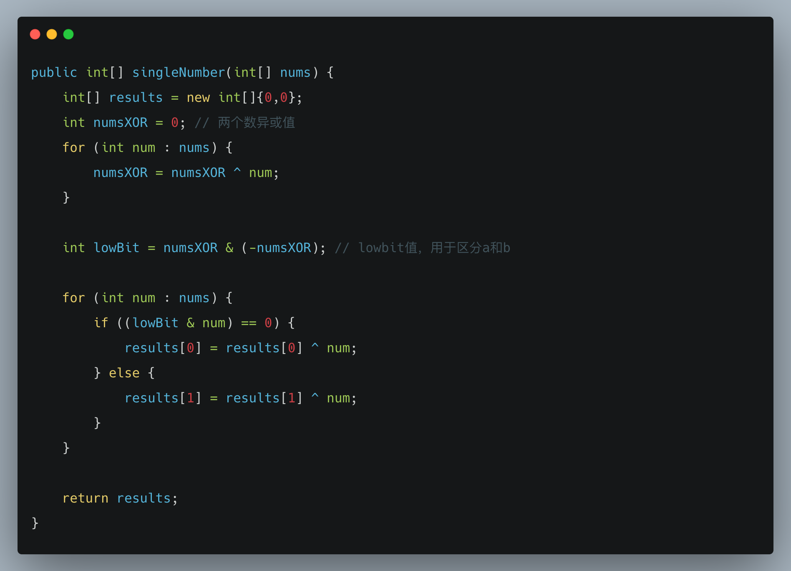

# 「每日一题」与面试官手撕代码：如何科学高效的寻找重复元素？

关注公众号「松宝写代码」，精选好文，每日一题

加入我们一起学习，day day up

经过三天时间，已经有小伙伴（xpf666）给我们贡献文章了，超级开心和激动，因为我们不是一个人在战斗，
不是一个人在努力提高自己，加入我们，

**如何加入我们？**

第一步：文章下面留言，留言内容：想写什么文章。

第二步：我们就会找到你

> 作者：xpf666

> 来源：原创

## 一、前言

2020.12.23 日刚立的 flag，每日一题，题目类型不限制，可以是：算法题，面试题，阐述题等等。

本文是「每日一题」第 4 题，由 xpf666 带来的文章：如何科学高效的寻找重复元素？


往期「每日一题」：

+ 第 3 道[「「每日一题」面试官问你对 Promise 的理解？可能是需要你能手动实现各个特性」https://mp.weixin.qq.com/s/QuuPd2KCp50snN7F2o3oYg](https://mp.weixin.qq.com/s/QuuPd2KCp50snN7F2o3oYg)

+ 第 2 道[「[每日一题]ES6 中为什么要使用 Symbol？」https://mp.weixin.qq.com/s/omeVJdtabo5MeN3DItDfWg](https://mp.weixin.qq.com/s/omeVJdtabo5MeN3DItDfWg)

+ 第 1 道[「一道面试题是如何引发深层次的灵魂拷问？」(https://mp.weixin.qq.com/s/O8j9gM5tD5rjLz1kdda3LA)](https://mp.weixin.qq.com/s/O8j9gM5tD5rjLz1kdda3LA)

## 二、寻找重复元素

1. **找出任意一个重复数字**

给定一个长度为 n 的数组 nums，判断是否有重复值。

示例：输入[1,2,3,2,1,4,5] 输出 1 或 2

思路：根据经验，基本上所有判断重复的需求，都可以通过 Set 或者 Map 解决，Set 解决方式就是判断 add 方法的返回是 true 还是 false，false 就证明之前已存在，也就是数据重复。Map 是通过 containsKey，true 就说明之前存在 key。

题解：

```
public int getResult(int[] nums) {
    Set<Integer> set = new HashSet<Integer>();
    int result = -1;
    for (int num : nums) {
        if (!set.add(num)) {
            result = num;
            break;
        }
    }
    return result;
}
```

如果上面代码格式出现问题，可以查看下面代码图片


遍历 n 次并且 Set 内容最多是 n 个字符，复杂度都是 O(n)

2. **找出任意一个重复数字**

给定一个长度为 n 的数组 nums，判断是否有重复值,并且两个重复值距离不超过 k。

示例：输入[1,2,3,2,1,4,5] ，k = 2 输出 true(两个 2)

思路：同问题一，只要多判断一次 Set 长度即可。

题解：
```
public boolean containsNearbyDuplicate(int[] nums, int k) {
    Set<Integer> set = new HashSet<Integer>();
    boolean result = false;
    for (int i = 0; i < nums.length; i++) {
        if (!set.add(nums[i])) {
            result = true;
            break;
        }

        if (set.size() > k) { // 超过长度就删除最远的一个数
            set.remove(nums[i-k]);
        }
    }
    return result;
}
```

如果上面代码格式出现问题，可以查看下面代码图片


遍历 n 次并且 k 最多 n 个字符，复杂度都是 O(n)

3. **寻找重复数**

给定一个包含 n + 1 个整数的数组 nums，其数字都在 1 到 n 之间（包括 1 和
n），只有一个重复的整数，找出这个重复的数字。

示例：输入[1,3,4,2,2] 输出 2

思路：可通过问题 1 方式解决。还可以通过快慢指针法解决：将数组看成一个链表，下标为当前指针（node），值指向下一指针(nextNode)，数组出现重复的数字意味着有两个指针的 nextNode 相同。然后通过快慢指针法解决。

题解：
```
public int getResult(int[] nums) {
    int result = 0;
    int slow = 0, fast = 0;
    do  {
        slow = nums[slow];
        fast = nums[nums[fast]];
    } while (slow != fast);

    do {
        slow = nums[slow];
        result = nums[result];
    } while (result != slow);
    return result;
}
```

如果上面代码格式出现问题，可以查看下面代码图片



遍历 2n 次时间复杂的是 O(n)，只用了常量个字符，空间复杂度是 O(1)

4. **只出现一次的数**

给定一个数组
nums，除了某个元素只出现一次以外，其余每个元素均出现两次。找出那个只出现了一次的元素。

示例：输入[1,1,4,2,2] 输出 4

思路：可通过问题 1 方式解决。还可以通过位运算解决，两个相同数异或后为 0，数组所有元素执行一次异或操作，剩下就是出现一次的数。

题解：
```
public int getResult(int[] nums) {
    int result = 0;
    for (int num : nums) {
        result = result ^ num;
    }
    return result;
}
```

如果上面代码格式出现问题，可以查看下面代码图片



遍历 n 次时间复杂的是 O(n)，只用了常量个字符，空间复杂度是 O(1)

5. **只出现一次的数**

给定一个数组
nums，除了两个元素只出现一次以外，其余每个元素均出现两次。找出那个只出现了一次的元素。

示例：输入[1,1,3,4,2,2] 输出[3,4]

思路：可通过问题 1 方式解决。还可以通过位运算解决，和题 4 区别是存在 2 个只出现一次的数，所以要想办法把这两个数区分出来。先将数组所有元素异或，得出的值是两个只出现一次元素 a,b 的异或值 numsXOR（如 10010）。numsXOR 二进制中 1 的位就是 a 和 b 差异位（因为不同的值异或才是 1），现在只需要找 lowbit(最右一位差异值，10)，然后通过 lowbit 和 a
, b
进行与运算（&），得出的值就一定不同，这样可以分出 a 和 b，最后按照异或运算就能得出结果（其他重复的不用管，不管分到哪一组，重复的数异或都是 0）

题解：
```
public int[] singleNumber(int[] nums) {
    int[] results = new int[]{0,0};
    int numsXOR = 0; // 两个数异或值
    for (int num : nums) {
        numsXOR = numsXOR ^ num;
    }

    int lowBit = numsXOR & (-numsXOR); // lowbit值，用于区分a和b

    for (int num : nums) {
        if ((lowBit & num) == 0) {
            results[0] = results[0] ^ num;
        } else {
            results[1] = results[1] ^ num;
        }
    }

    return results;
}
```

如果上面代码格式出现问题，可以查看下面代码图片



遍历 2n 次时间复杂的是 O(n)，只用了常量个字符，空间复杂度是 O(1)


## 各种福利


「松宝写代码」公众号：开发知识体系构建，技术分享，项目实战，实验室，每日一题，带你一起学习新技术，总结学习过程，让你进阶到高级资深工程师，学习项目管理，思考职业发展，生活感悟，充实中成长起来。问题或建议，请公众号留言。


### 1、字节内推福利

回复「校招」获取内推码

回复「社招」获取内推

回复「实习生」获取内推

后续会有更多福利


### 2、学习资料福利
回复「算法」获取算法学习资料

### 3、每日一题

+ 本文就是第4道：「每日一题」与面试官手撕代码：如何科学高效的寻找重复元素？

+ 第 3 道[「「每日一题」面试官问你对 Promise 的理解？可能是需要你能手动实现各个特性」https://mp.weixin.qq.com/s/QuuPd2KCp50snN7F2o3oYg](https://mp.weixin.qq.com/s/QuuPd2KCp50snN7F2o3oYg)

+ 第 2 道[「[每日一题]ES6 中为什么要使用 Symbol？」https://mp.weixin.qq.com/s/omeVJdtabo5MeN3DItDfWg](https://mp.weixin.qq.com/s/omeVJdtabo5MeN3DItDfWg)

+ 第 1 道[「一道面试题是如何引发深层次的灵魂拷问？」(https://mp.weixin.qq.com/s/O8j9gM5tD5rjLz1kdda3LA)](https://mp.weixin.qq.com/s/O8j9gM5tD5rjLz1kdda3LA)


## The End
如果你觉得这篇文章对你有帮助，有启发，可能帮助到更多的人，我想请你帮我几个小忙：

1、点个「在看」，让更多的人也能看到这篇文章内容。

2、点个「赞」，是对文章的肯定。

3、点个「分享」到朋友圈，是为了让更多的人知道你在学习提升自己。

4、关注「松宝写代码」，后台回复「加群」 加入我们一起学习。