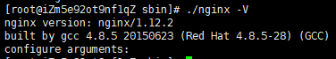
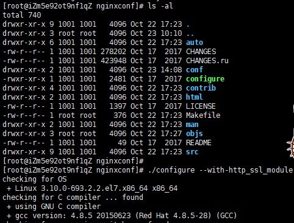
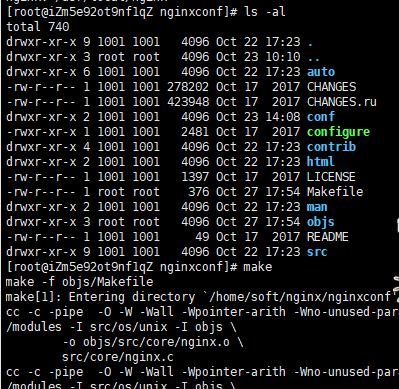
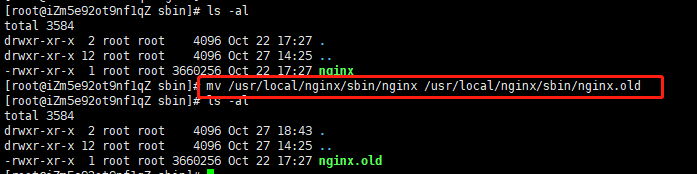
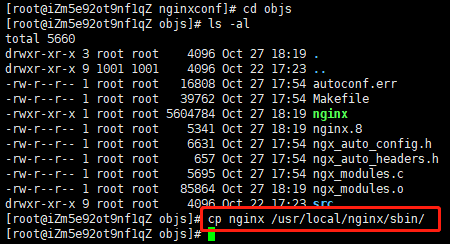
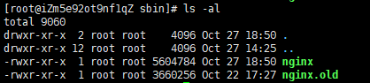
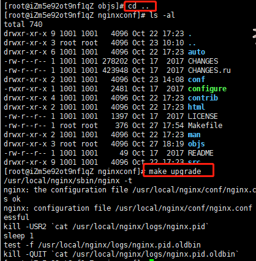
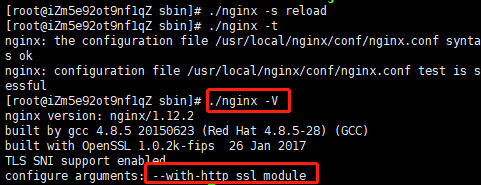

# 【每日一题】(43题)如何在项目中使用Http2.0?

关注「松宝写代码」，精选好文，每日一题

好好学习，day day up

上篇的每日一题讲到`Http2.0`的基础知识，如下：

[【每日一题】(42题)谈谈你对Http2.0的理解?](https://mp.weixin.qq.com/s/rTKqfMtdvBrNCssN5qa_0Q)

那我们这一期的每日一题，我们来说说如何用`nginx`来配置`Http2.0`，

本着实践出真知，我们一步一步来构建一个站点，从 `Http => Https => Http2.0`

也就是说，升级到`Http2.0`，必须是基于`Https`的基础上。

> 作者： saucxs

愿努力拼搏的你，都能在前进的道路上有所收获！

***

## 一、升级Https
最近想折腾一下服务器和`Http`，升级到`Http2.0`。

升级到`Http2.0`就必须先升级到`Https`

升级`Https`，我们需要先在下载或者购买SSL证书中，下载cert证书，然后放到nginx服务器上。


### 1、查看nginx是否支持ssl
```
./nginx -V
```



查看 configure arguments 信息中是否包含 -with-http_ssl_module 字样


### 2、配置ssl模块

找到之前安装 Nginx 时的解压目录，配置ssl模块：

```
./configure --with-http_ssl_module
```




### 3、重新编译一下nginx
因为我们在nginx的安装路径下，配置新的模块，需要重新编译一下nginx，这时候新的nginx才能拥有ssl模块。

在解压目录执行make

```
make
```


### 4、备份之前的nginx

这次是升级nginx，所以不需要执行 make install，首先备份原nginx执行脚本：

```
mv /usr/local/nginx/sbin/nginx /usr/local/nginx/sbin/nginx.old
```




### 5、移动编译好的nginx到安装路径下
把新编译的nginx执行脚本拷贝到相应的目录下：

```
cd objs
cp nginx /usr/local/nginx/sbin/
```





### 6、最后进行平滑升级

```
cd ..
make upgrade
```



### 7、再次检查nginx是否有https模块




## 二、直接从Http升级到Http2.0

官网有支持这个，那我们先来看看官网关于这个的配置。

详细的注释已经写在配置里：

```
# ssl写在443端口后面。这样http和https的链接都可以用
listen 443 ssl http2 default_server;
server_name chat.chengxinsong.cn;
		
# HSTS的合理使用，max-age表明HSTS在浏览器中的缓存时间，includeSubdomainscam参数指定应该在所有子域上启用HSTS，preload参数表示预加载，通过Strict-Transport-Security: max-age=0将缓存设置为0可以撤销HSTS

add_header Strict-Transport-Security "max-age=63072000; includeSubdomains; preload";
  
ssl_certificate  /usr/local/nginx/cert/2540136_chat.chengxinsong.cn.pem;
ssl_certificate_key  /usr/local/nginx/cert/2540136_chat.chengxinsong.cn.key;
  
# 分配20MB的共享内存缓存，不同工作进程共享TLS会话信息
# ssl_session_cache shared:SSL:20m;
  
# 设置会话缓存过期时间1h
ssl_session_timeout 60m;
  
# TLS协议的合理配置
# 指定TLS协议的版本，不安全的SSL2和SSL3要废弃掉
ssl_protocols TLSv1 TLSv1.1 TLSv1.2;
  
# 启用ssl_prefer_server_ciphers，用来告诉Nginx在TLS握手时启用服务器算法优先，由服务器选择适配算法而不是客户端
ssl_prefer_server_ciphers on;
  
# 优先选择支持前向加密的算法，且按照性能的优先顺序排列
ssl_ciphers ECDHE-RSA-AES128-GCM-SHA256:ECDHE:ECDH:AES:HIGH:!NULL:!aNULL:!MD5:!ADH:!RC4;
  
# 会话恢复的合理使用
# 配置会话票证，减少了TLS握手的开销
ssl_session_tickets on;
```
然后执行检查nginx配置。nginx -t


意思就是说：

http2.0缺少ngx_http_v2_module。nginx缺少http_ssl_module模块，编译安装的时候带上--with-http_ssl_module配置就行了。

## 三、查资料找原因

出现上面原因是nginx从1.9.5开始，已经用 http_v2_module 模块替换了 ngx_http_spdy_module ，并正式开始支持http2协议。

但是我的nginx是1.12.2。应该不是ngin版本问题


注意事项：

+ 1、并且需要openssl库的版本在1.0.2以上编译。1.要开启HTTP/2协议支持，需要在nginx 1.10以上版本并且需要openssl库的版本在1.0.2以上编译。

+ 2.http2.0只支持开启了https的网站。

可能是服务器的openssl库的版本，发现是1.0.2。


所以还是要升级到更高点。


## 四、升级OpenSSL
在http2.0协议中，涉及到ALPN(Application Layer Protocol Negotiation，应用层协议协商)的支持，目前所有主流的Unix服务器系统中内置的OpenSSL库都低于1.0.2版本。通过使用OpenSSL的命令行工具，可以检查当前的http2服务是否支持ALPN。

找一个安装目录

### 1、下载最新版的OpenSSL库编译安装

```
wget https://www.openssl.org/source/openssl-1.1.0f.tar.gz
tar xzf openssl-1.1.0f.tar.gz
cd openssl-1.1.0f
./config --prefix=/usr/local/openssl
make && make install
```

### 2.替换旧版本库

```
mv /usr/bin/openssl  /usr/bin/openssl.old
mv /usr/include/openssl /usr/include/openssl.old
ln -s /usr/local/openssl/bin/openssl /usr/bin/openssl
ln -s /usr/local/openssl/include/openssl /usr/include/openssl
#链接新库文件
ln -s /usr/local/openssl/lib/libssl.so /usr/local/lib64/libssl.so
ln -s /usr/local/openssl/lib/libcrypto.so /usr/local/lib64/libcrypto.so
#检查更新后的openssl依赖库是否是1.1.0f
strings /usr/local/lib64/libssl.so | grep OpenSSL
#显示结果表明已升级到最新版本链接库
OpenSSL 1.1.0f  25 May 2017

#配置openssl库文件的搜索路径
echo '/usr/local/openssl/lib' >> /etc/ld.so.conf
#使修改后的搜索路径生效
ldconfig -v
#查看openssl版本，结果显示升级成功
openssl version
OpenSSL 1.1.0f  25 May 2017
```

## 五、nginx开启ssl模块
默认编译的 Nginx 并不包含 h2 模块，我们需要加入参数来编译，截止发文，Nginx 1.9 开发版及以上版本源码需要自己加入编译参数，从软件源仓库下载的则默认编译。 Nginx 是不再支持 SPDY。

如果你编译的 Nginx 不支持，那么在 ./configure 中加入：--with-http_v2_module ，如果没有 SSL 支持，还需要加入 --with-http_ssl_module

### 1、找到源码包，查看configure中是否支持http2

这时候需要去下载的时候的源码文件夹中找到这个configure。注意：不是编译之后的文件夹。


在"./configure"配置中，"--with"表示启用模块，也就是说这些模块在编译时不会自动构建"--without"表示禁用模块，也就是说这些模块在编译时会自动构建，若你想Nginx轻量级运行，可以去除一些不必要的模块。

执行./configure --help


从上图知道了nginx在编译时不会自动构建http_ssl_module和http_v2_module。所以需要重新编译nginx。


### 2、加入参数编译

我们的新配置信息就应该这样写：

```
./configure --prefix=/usr/local/nginx --with-http_v2_module --with-http_ssl_module --with-openssl=/home/soft/openssl-1.1.0f
```
上面的/usr/local/nginx这个路径是我们编译之后的包路径。

那么在 ./configure 中加入：--with-http_v2_module ，如果没有 SSL 支持，还需要加入 --with-http_ssl_module，加上刚才更新的openssl到1.1.0，所以需要加上--with-openssl=/home/soft/openssl-1.1.0f。

运行上面的命令即可，等配置完

配置完成后，运行命令

```
make
```
这里不要进行make install，否则就是覆盖安装

### 3、备份和替换

（1）然后备份原有已安装好的nginx

```
cp /usr/local/nginx/sbin/nginx /usr/local/nginx/sbin/nginx_07_22.bak
```

（2）关闭nginx，然后将刚刚编译好的nginx覆盖掉原有的nginx

关闭nginx

```
./nginx -s quit
```

移动编译好的nginx到原有的nginx

```
cp ./objs/nginx /usr/local/nginx/sbin/
```

（3）启动nginx
```
./nginx
```

稍等1分钟作用，然后就可以看到http2.0的效果。


## 六、查看网站是否是http2.0
右键name，勾选protocol，这样就可以看到http协议。


上图截图网站地址：https://chat.chengxinsong.cn

上面的HappyChat已经支持Http2.0，速度是得到很大的提升。


对比一下http1.1的网站


上图截图网站地址：https://www.mwcxs.top


## 往期「每日一题」

### 1、JavaScript && ES6
+ 第 41 题：[【每日一题】(41题)JS代码到底是如何被压缩的?](https://mp.weixin.qq.com/s/EIep9wMuM7d5QRAqAcDHBg)
 
+ 第 40 题：[【每日一题】(40题)关于script标签，你可能不知道的地方？](https://mp.weixin.qq.com/s/k42O6hbCD0TIc9IdC-sghg)

+ 第 39 题：[【每日一题】(39题)谈谈JS的函数扩展？](https://mp.weixin.qq.com/s/X8fgfydIjb2eOrVCAc3sDA)

+ 第 30 题：[【每日一题】(30题)面试官:ES6的解构赋值的理解？](https://mp.weixin.qq.com/s/-rWv24IAhGAq4WVqHY2jOg)

+ 第 28 题：[【每日一题】(28题)面试官:原型链与构造函数结合方法继承与原型式继承的区别？](https://mp.weixin.qq.com/s/uPUxo8gIGyHv-b_aWdgzaw)

+ 第 22 题：[【每日一题】(22题)面试官问：var与const,let的主要区别是什么？](https://mp.weixin.qq.com/s/wJ1cG7eQw85fpqpk_fHq7w)

+ 第 21 题：[【每日一题】(21题)面试官问：谈谈JS中的 this 的绑定？](https://mp.weixin.qq.com/s/WvDIjv_FNfDsD9OmB6SirA)

+ 第 20 题：[【每日一题】(20题)面试官问：谈谈JS中的 webSockets 的理解？](https://mp.weixin.qq.com/s/GA-Wl03ZDLhnBCAG0wTi0w)

+ 第 19 题：[【每日一题】面试官问：谈谈JS中的 XMLHttpRequest 对象的理解？](https://mp.weixin.qq.com/s/wxIEGJVmfxq0Q-8E4tbv1A)

+ 第 18 题：[【每日一题】面试官问：JS中的 Ajax 跨域与扩展 Comet ？](https://mp.weixin.qq.com/s/mb8TRlw1yzEOfDzMyYLW2g)

+ 第 17 题：[【每日一题】(17题)面试官问：JS中事件流，事件处理程序，事件对象的理解？](https://mp.weixin.qq.com/s/mb8TRlw1yzEOfDzMyYLW2g)

+ 第 16 题：[【每日一题】面试官问：JS中如何全面进行客户端检测？](https://mp.weixin.qq.com/s/-tNI1vwdK_SAxNGRQTCd1Q)

+ 第 15 题：[【每日一题】面试官问：JS类型判断有哪几种方法？](https://mp.weixin.qq.com/s/UwVgQMaVPg6Z0SVgn4kqwA)

+ 第 14 题：[【每日一题】面试官问：谈谈你对JS对象的创建和引申](https://mp.weixin.qq.com/s/-HTpVMFMRDu8sElNv-WqIw)

+ 第 13 题[[每日一题]面试官问：['1', '2', '3'].map(parseInt)输出，原因，以及延伸？](https://mp.weixin.qq.com/s/DJ6Av4tQgJpqa8hKAPk_uA)

+ 第 12 题[[每日一题]面试官问：JS引擎的执行过程（二）](https://mp.weixin.qq.com/s/CCUsCM2vzb6S1wcwIsjQuA)

+ 第 11 题[[每日一题]面试官问：JS引擎的执行过程（一）](https://mp.weixin.qq.com/s/Lhd5N5a1b8fAstWn5H3B3Q)

+ 第 10 题[[每日一题]面试官问：详细说一下JS数据类型](https://mp.weixin.qq.com/s/wm0EGVXTTHoHMcdUxMQmKA)

+ 第 8 题[[每日一题]面试官问：谈谈你对ES6的proxy的理解？](https://mp.weixin.qq.com/s/8loJlarVrmj47XjgrZLI1w)

+ 第 7 题[[每日一题]面试官问：for in和for of 的区别和原理？](https://mp.weixin.qq.com/s/RsynH85UkAwAgIAzwxs-Ag)

+ 第 6 题[[每日一题]面试官问：Async/Await 如何通过同步的方式实现异步？](https://mp.weixin.qq.com/s/UAYBnQvekRugR8DVEUPB3Q)

+ 第 3 道[「「每日一题」面试官问你对 Promise 的理解？可能是需要你能手动实现各个特性」](https://mp.weixin.qq.com/s/QuuPd2KCp50snN7F2o3oYg)

+ 第 2 道[「[每日一题]ES6 中为什么要使用 Symbol？」](https://mp.weixin.qq.com/s/omeVJdtabo5MeN3DItDfWg)

### 2、浏览器

+ 第 9 题[[每日一题]requestAnimationFrame不香吗？](https://mp.weixin.qq.com/s/4Ob_CEiZUyoHKxffAeAYdw)


### 3、Vue

+ 第 5 道[「每日一题」到底该如何回答：vue数据绑定的实现原理？](https://mp.weixin.qq.com/s/8eo4frdB-zMA7nD_1wdnLw)

### 4、React
+ 第 38 道[【每日一题】(38题)谈谈React Hooks 与Vue3.0 Function based API的对比？](https://mp.weixin.qq.com/s/7D8SvbS1r0oH60EjwowXSQ)

### 5、HTML5
+ 第 29 道[【每日一题】(29题)面试官:HTML-HTML5新增标签属性的理解？](https://mp.weixin.qq.com/s/Lx5-bF-xliB9TBuEtE7dLw)

### 6、算法
+ 第 37 道[【每日一题】(37题)面试官:你对图论了解多少？(七)](https://mp.weixin.qq.com/s/ukPZLrfsPsCxJtOQko8EJg)

+ 第 36 道[【每日一题】(36题)面试官:你对图论了解多少？(六)](https://mp.weixin.qq.com/s/BReGF1JB05W5Ge2ZeaEEYw)

+ 第 35 道[【每日一题】(35题)面试官:你对图论了解多少？(五)](https://mp.weixin.qq.com/s/_ICHDWO4ma_CbEbbemkxZw)

+ 第 34 道[【每日一题】(34题)面试官:你对图论了解多少？(四)](https://mp.weixin.qq.com/s/EJ_72u5S7KD4950IEO_CQg)

+ 第 33 道[【每日一题】(33题)面试官:你对图论了解多少？(三)](https://mp.weixin.qq.com/s/wRy1xAm4JzHCq1dRjMUuoA)

+ 第 32 道[【每日一题】(32题)面试官:你对图论了解多少？(二)](https://mp.weixin.qq.com/s/_aSMIEpBc2jvTFXxBaK7nQ)

+ 第 31 道[[【每日一题】(31题)面试官:你对图论了解多少？(一)](https://mp.weixin.qq.com/s/E6dh8A9dVxxB9jaRGm3kbg)

+ 第 27 道[【每日一题】(27题)算法题:如何使用多种解决方案来实现跳一跳游戏？](https://mp.weixin.qq.com/s/EY99dnyjjTvdBflpE5T2Fw)

+ 第 26 道[【每日一题】(26题)算法题:最长公共前缀？](https://mp.weixin.qq.com/s/1TzP0JgrzqXbQes1jzzwFg)

+ 第 25 道[【每日一题】(25题)算法题:堆数据结构-前 K 个高频元素？](https://mp.weixin.qq.com/s/desqLK9Wst9v7XPcNyvwlQ)

+ 第 24 道[【每日一题】(24题)算法题:贪心算法-环游世界之如何加油？](https://mp.weixin.qq.com/s/ST6pf00iBZiDs4GpGK0eOw)

+ 第 4 道[「每日一题」与面试官手撕代码：如何科学高效的寻找重复元素？](https://mp.weixin.qq.com/s/jFZ_2f272LhBBPuuLaWnyg)

### 7、Node

+ 第 23 道[【每日一题】(23题)面试官问：详细描述事件循环Event Loop？](https://mp.weixin.qq.com/s/hE-tK_PbSYkMms8P9b2H7A)

### 8、Http

+ 第 1 道[「一道面试题是如何引发深层次的灵魂拷问？」](https://mp.weixin.qq.com/s/O8j9gM5tD5rjLz1kdda3LA)

+ 第 42 题[【每日一题】(42题)谈谈你对Http2.0的理解?](https://mp.weixin.qq.com/s/rTKqfMtdvBrNCssN5qa_0Q)


## 谢谢支持

1、文章喜欢的话**可以「分享，点赞，在看」三连**哦。

2、作者昵称：saucxs，songEagle，松宝写代码。「松宝写代码」公众号作者，每日一题，实验室等。一个爱好折腾，致力于全栈，正在努力成长的字节跳动工程师，星辰大海，未来可期。**内推字节跳动各个部门各个岗位**。

3、长按下面图片，关注「松宝写代码」，是获取开发知识体系构建，精选文章，项目实战，实验室，**每日一道面试题**，进阶学习，思考职业发展，涉及到JavaScript，Node，Vue，React，浏览器，http，算法，端相关，小程序等领域，希望可以帮助到你，我们一起成长～


