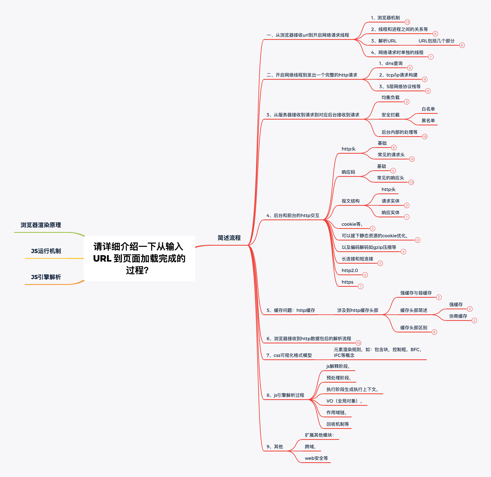

关注「松宝写代码」，精选好文，每日一题

​时间永远是自己的

每分每秒也都是为自己的将来铺垫和增值

>作者：saucxs ｜ songEagle

>来源：原创


## 一、前言

 有这么一道面试题，如下：

>  面试题：请详细介绍一下从输入 URL 到页面加载完成的过程 ？
> 这道题的覆盖面可以非常广，很适合作为一道承载知识体系的题目。

每一个前端人员，如果要往更高阶发展，必然会将自己的知识体系梳理一遍，没有牢固的知识体系，无法往更高处走！

你不信这道题承载的知识体系庞大？往下看

## 二、分析题干

在对于这道题上，如果对于面试官想要知道的是：简单叙述还是深入叙述 。

所以需要回答到关键词上，不然多而杂，效果不好，抓不住重点。

接下来我们从主干流程和深入的详细叙述分别介绍，我觉得这道面试题可能需要 15 分钟才能讲完。

主干流程回答：是基本功体现，知识归纳能力，面面俱到，点到为止 。

详细阐述：考察的各个知识点的掌握能力以及掌握到什么程度 。

我们先来看一下这个脑图，有个提纲挈领的知识点，每一项再细致的思考就会形成一个知识体系，可以全方位考察候选人。




## 三、主干流程

在将浏览器渲染原理、JS 运行机制、JS 引擎解析流程梳理一遍后，感觉就跟打通了任督二脉一样，有了一个整体的架构，以前的知识点都连贯起来了。

1、从浏览器接收 url 到开启网络请求线程（涉及到：浏览器机制，线程和进程之间的关系等）

2、开启网络线程到发出一个完整的 http 请求（涉及到：dns 查询，tcp/ip 请求，5 层网络协议栈等）

3、从服务器接收到请求到对应后台接收到请求（涉及到：均衡负载，安全拦截，后台内部的处理等）

4、后台和前台的 http 交互（涉及到：http 头，响应码，报文结构，cookie 等，可以提下静态资源的 cookie 优化，以及编码解码如 gzip 压缩等）

5、缓存问题：http 缓存（涉及到：涉及到 http 缓存头部，etag，expired，cache-control 等）

6、浏览器接收到 http 数据包后的解析流程（涉及到：html 的词法分析，然后解析成 dom 树，同时解析 css 生成 css 规则树，合并生成 render 树。然后 layout 布局、painting 渲染、复合图层的合成、GPU 绘制、外链接处理、loaded 和 documentloaded 等）

7、css 可视化格式模型（涉及到：元素渲染规则，如：包含块，控制框，BFC，IFC 等概念）

8、js 引擎解析过程（涉及到：js 解释阶段，预处理阶段，执行阶段生成执行上下文，VO（全局对象），作用域链，回收机制等）

9、其他（扩展其他模块：跨域，web 安全等）

## 四、从浏览器接收到 url 到开启网络请求线程

涉及到：浏览器的进程和线程模型，js 的运行机制。

### 1、浏览器是多进程的

（1）浏览器是多进程的；

（2）不同类型的标签页会开启一个新的进程；

（3）相同类型的标签页会合并到一个进程中。

浏览器中各个进程以及作用：

1、浏览器进程：只有 1 个进程，（1）负责管理各个标签的创建和销毁；（2）负责浏览器页面显示；（3）负责资源的管理和下载；

2、第三方插件进程：可以是多个进程，负责每一个第三方插件的使用，每一个第三方插件使用时候会创建一个对应的进程；

3、GPU 进程：最多 1 个进程，负责 3D 绘制和硬件加速；

4、浏览器渲染进程：可以是多个进程，浏览器的内核，每个 tab 页一个进程，主要负责 HTML、，css，js 等文件的解析，执行和渲染，以及事件处理等。

### 2、浏览器渲染进程（内核进程）

每一个 tab 页面是浏览器内核进程，然后这个每一个进程是多线程的，它有几大类子线程：

（1）GUI 线程；（2）JS 引擎线程；（3）事件触发线程；（4）定时器线程；（5）异步的 http 网络请求线程


可以看出来 JS 引擎是内核进程中的一个线程，所以常说 JS 引擎时单线程的。

### 3、解析 URL

输入 url 后，会进行解析（URL 是统一资源定位符）。

URL 包括几个部分：（1）protocol，协议头，比如 http，https，ftp 等；（2）host，主机域名或者 IP 地址；（3）port，端口号；（4）path，目录路径；（5）query，查询的参数；（6）fragment，#后边的 hash 值，用来定位某一个位置。

### 4、网络请求时单独的线程

每一次网络请求都是需要单独开辟单独的线程进行，比如 URL 解析到 http 协议，就会新建一个网络线程去处理资源下载。

因此浏览器会根据解析出得协议，开辟一个网络线程，前往请求资源。

## 五、开启网络线程到发出一个完整的 http 请求

包括：DNS 查询，tcp/ip 请求构建，五层互联网协议等等。

### 1、DNS 查询得到 IP

如果输入的域名，需要 DNS 解析成 IP，流程如下：

（1）浏览器有缓存，直接用浏览器缓存，没有就去本机缓存，没有就看是不是 host。

（2）如果还没有，就向 DNS 域名服务器查询（这个过程经过路由，路由也有缓存），查询到对应的 IP。

注意：1、域名查询的时候有可能经过 CDN 调度器（如果 CDN 有存储功能）；

2、DNS 解析是很耗时的，因此如果解析域名过多，首屏加载会变慢，可以考虑使用 dns-prefetch 优化。

### 2、tcp/ip 请求构建

http 的本质就是 tcp/ip 请求构建。需要 3 次握手规则简历连接，以及断开连接时候的 4 次挥手。

tcp 将 http 长报文划分为短报文，通过 3 次握手与服务端建立连接，进行可靠的传输。

3 次握手步骤：

客户端：hello，你是 server 么？
服务端：hello，我是 server，你是 client 么
客户端：yes，我是 client
建立成功之后，接下来就是正式传输数据。

然后，等到断开连接时，需要进行 4 次挥手（因为是全双工的，所以需要 4 次握手）。

4 次挥手步骤：

主动方：我已经关闭了向你那边的主动通道了，只能被动接收了
被动方：收到通道关闭的信息
被动方：那我也告诉你，我这边向你的主动通道也关闭了
主动方：最后收到数据，之后双方无法通信

tcp/ip 的并发限制

浏览器对同一域名下并发的 tcp 连接是有限制的（2-10 个不等）。而且在 http1.0 中往往一个资源下载就需要对应一个 tcp/ip 请求。所以针对这个瓶颈，又出现了很多的资源优化方案。

get 和 post 区别

get 和 post 本质都是 tcp/ip，但是除了 http 外层外，在 tcp/ip 层面也有区别。get 会产生 1 个 tcp 数据包，post 产生 2 个 tcp 数据包。

具体就是：

（1）get 请求时，浏览器会把 header 和 data 一起发送出去，服务器响应 200（返回数据）。

（2）post 请求时，浏览器首先发送 headers，服务器响应 100 continue，浏览器再发送 data，服务器响应 200（返回数据）。

### 3、五层网络协议栈

客户端发出 http 请求到服务器接收，中间会经过一系列的流程。

客户端发送请求具体：从应用层发动 http 请求，到传输层通过三次握手简历 tcp/ip 连接，再到网络层的 ip 寻址，再到数据链路层的封装成帧，最后在物理层通过物理介质传输。

服务端接收请求具体：反过来。

五层网络协议：

1、应用层（DNS，HTTP）：DNS 解析成 IP 并发送 http 请求；

2、传输层（TCP，UDP）：建立 TCP 连接（3 次握手）；

3、网络层（IP，ARP）：IP 寻址；

4、数据链路层（PPP）：封装成帧；

5、物理层（利用物理介质传输比特流）：物理传输（通过双绞线，电磁波等各种介质）。

其实也有一个完整的 OSI 七层框架，与之相比，多了会话层、表示层。

OSI 七层框架：物理层、数据链路层、网络层、传输层、会话层、表示层、应用层

表示层：主要处理两个通信系统中交互信息的表示方式，包括数据格式交换，数据加密和解密，数据压缩和终端类型转换等。

会话层：具体管理不同用户和进程之间的对话，如控制登录和注销过程。

## 六、从服务器接收请求到对应后台接收到请求

服务端接收到请求时，内部会有很多处理，其中最主要的是负载均衡和后台处理。

### 1、负载均衡

对于大型项目，并发访问很大，一台服务器吃不消，一般会有若干台服务器组成一个集群，然后配合反向代理实现均衡负载。均衡负载不止一种实现方式。

概括的说：用户发送的请求指向调度服务器（反向代理服务器，比如 nginx 的均衡负载），然后调度服务器根据实际的调度算法，分配不同的请求给对应的集群中的服务器执行，然后调度服务器等待实际服务器的 HTTP 响应，并且反馈给用户。

### 2、后台处理

一般后台都部署到容器中。过程如下：

（1）先是容器接收到请求（比如 tomcat 容器）；

（2）然后对应容器中的后台程序接收到请求（比如 java 程序）；

（3）然后就是后台自己的统一处理，处理完毕后响应结果。

具体概括一下：

（1）一般有的后端有统一的验证，比如安全拦截，跨域验证；

（2）如果不符合验证规则，就直接返回相应的 http 报文（拒绝请求等）；

（3）如果验证通过了，才会进入到实际的后台代码，此时程序接收到请求，然后执行查询数据库，大量计算等等；

（4）等程序执行完毕后，会返回一个 http 响应包（一般这一步会经过多层封装）；

（5）然后将这个数据包从后端返回到前端，完成交互。

## 七、后台和前台的 http 交互

前后端的交互，http 报文作为信息的载体。

### 1、http 报文结构

报文一般包括：通用头部，请求/响应头部，请求/响应体

1.1 通用头部

Request Url: 请求的 web 服务器地址

Request Method: 请求方式
（Get、POST、OPTIONS、PUT、HEAD、DELETE、CONNECT、TRACE）

Status Code: 请求的返回状态码，如 200 代表成功

Remote Address: 请求的远程服务器地址（会转为 IP）
比如跨区拒绝时，methord 为 option，状态码 404/405。

其中 method 分为两批次：

HTTP1.0 定义了三种请求方法： GET, POST 和 HEAD 方法。
以及几种 Additional Request Methods：PUT、DELETE、LINK、UNLINK

HTTP1.1 定义了八种请求方法：GET、POST、HEAD、OPTIONS, PUT, DELETE, TRACE 和 CONNECT 方法。
比如有些状态码来判断：

```
200——表明该请求被成功地完成，所请求的资源发送回客户端
304——自从上次请求后，请求的网页未修改过，请客户端使用本地缓存
400——客户端请求有错（譬如可以是安全模块拦截）
401——请求未经授权
403——禁止访问（譬如可以是未登录时禁止）
404——资源未找到
500——服务器内部错误
503——服务不可用
```

大致范围

```
1xx——指示信息，表示请求已接收，继续处理
2xx——成功，表示请求已被成功接收、理解、接受
3xx——重定向，要完成请求必须进行更进一步的操作
4xx——客户端错误，请求有语法错误或请求无法实现
5xx——服务器端错误，服务器未能实现合法的请求
```


1.2 请求头/响应头

常用的请求头（部分）

```
Accept: 接收类型，表示浏览器支持的MIME类型
（对标服务端返回的Content-Type）
Accept-Encoding：浏览器支持的压缩类型,如gzip等,超出类型不能接收
Content-Type：客户端发送出去实体内容的类型
Cache-Control: 指定请求和响应遵循的缓存机制，如no-cache
If-Modified-Since：对应服务端的Last-Modified，用来匹配看文件是否变动，只能精确到1s之内，http1.0中
Expires：缓存控制，在这个时间内不会请求，直接使用缓存，http1.0，而且是服务端时间
Max-age：代表资源在本地缓存多少秒，有效时间内不会请求，而是使用缓存，http1.1中
If-None-Match：对应服务端的ETag，用来匹配文件内容是否改变（非常精确），http1.1中
Cookie: 有cookie并且同域访问时会自动带上
Connection: 当浏览器与服务器通信时对于长连接如何进行处理,如keep-alive
Host：请求的服务器URL
Origin：最初的请求是从哪里发起的（只会精确到端口）,Origin比Referer更尊重隐私
Referer：该页面的来源URL(适用于所有类型的请求，会精确到详细页面地址，csrf拦截常用到这个字段)
User-Agent：用户客户端的一些必要信息，如UA头部等
```

常用的响应头（部分）

```
Access-Control-Allow-Headers: 服务器端允许的请求Headers
Access-Control-Allow-Methods: 服务器端允许的请求方法
Access-Control-Allow-Origin: 服务器端允许的请求Origin头部（譬如为*）
Content-Type：服务端返回的实体内容的类型
Date：数据从服务器发送的时间
Cache-Control：告诉浏览器或其他客户，什么环境可以安全的缓存文档
Last-Modified：请求资源的最后修改时间
Expires：应该在什么时候认为文档已经过期,从而不再缓存它
Max-age：客户端的本地资源应该缓存多少秒，开启了Cache-Control后有效
ETag：请求变量的实体标签的当前值
Set-Cookie：设置和页面关联的cookie，服务器通过这个头部把cookie传给客户端
Keep-Alive：如果客户端有keep-alive，服务端也会有响应（如timeout=38）
Server：服务器的一些相关信息
```

一般来说，请求头部和响应头部是匹配分析的。

比如：

（1）请求头部的 Accept 要和响应头部的 Content-Type 匹配，否则会报错；

（2）跨域请求中，请求头部的 Origin 要匹配响应头的 Access-Control-Allow-Origin，否则会报跨域错误；

（3）使用缓存，请求头部的 if-modified-since，if-none-match 分别和响应头的 Last-modified，etag 对应。

1.3 请求/响应实体

http 请求时，除了头部，还有消息实体。

请求实体中会将一些需要的参数都放入进入（用于 post 请求）。

比如：（1）实体中可以放参数的序列化形式（a=1&b=2 这种），或者直接放表单（Form Data 对象，上传时可以夹杂其他以及文件）等等。

响应实体中，就是服务端需要传给客户端的内容。

一般现在的接口请求时，实体中就是对应信息的 json 格式，而像页面请求这种，里面就是直接放一个 html 的字符串，然后浏览器自己解析并渲染。

1.4 CRLF

CRLF（Carriage-Return Line-Feed），意思是回车换行，一般作为分隔符存在。

请求头和实体消息之间有一个 CRLF 分隔，响应头部和响应实体之间用一个 CRLF 分隔。

下图是对某请求的 http 报文结构的简要分析：

### 2、 cookie 以及优化

cookie 是浏览器的一种本地存储方式，一般用来帮助客户端和服务端通信的，常用来进行身份校验，结合服务端的 session 使用。

```
在登陆页面，用户登陆了

此时，服务端会生成一个session，session中有对于用户的信息（如用户名、密码等）

然后会有一个sessionid（相当于是服务端的这个session对应的key）

然后服务端在登录页面中写入cookie，值就是:jsessionid=xxx

然后浏览器本地就有这个cookie了，以后访问同域名下的页面时，自动带上cookie，自动检验，在有效时间内无需二次登陆。
```

一般来说，cookie 是不允许存放敏感信息的（千万不要明文存储用户名、密码），因为非常不安全，如果一定要强行存储，首先，一定要在 cookie 中设置 httponly（这样就无法通过 js 操作了），另外可以考虑 rsa 等非对称加密（因为实际上，浏览器本地也是容易被攻克的，并不安全）

比如这样的场景：

```
客户端在域名A下有cookie（这个可以是登陆时由服务端写入的）

然后在域名A下有一个页面，页面中有很多依赖的静态资源（都是域名A的，譬如有20个静态资源）

此时就有一个问题，页面加载，请求这些静态资源时，浏览器会默认带上cookie

也就是说，这20个静态资源的http请求，每一个都得带上cookie，而实际上静态资源并不需要cookie验证

此时就造成了较为严重的浪费，而且也降低了访问速度（因为内容更多了）
```

当然了，针对这种场景，是有优化方案的（多域名拆分）。具体做法就是：

（1）将静态资源分组，分别放到不同的域名下（如 static.base.com）

（2）而 page.base.com（页面所在域名）下请求时，是不会带上 static.base.com 域名的 cookie 的，所以就避免了浪费

说到多域名拆分，还有一个问题？

（1）在移动端，如果请求的域名数过多，会降低请求速度（因为域名整套解析流程很浪费时间，而且移动端一般带宽比不上 PC）。

（2）这时候有个优化方案：dns-prefetch（这个是干嘛的？就是让浏览器空闲时提前解析 dns 域名，不过请合理使用）

关于 cookie 的交互，可以看下图总结


### 3、gzip 压缩

首先，gzip 是请求头里的 Accept-Encoding：浏览器支持的压缩类型之一。gzip 是一种压缩格式，需要浏览器支持才有效（一般浏览器都支持），而且 gzip 的压缩率很好（高达 70%）；

然后 gzip 一般是 apach，nginx，tomcat 等 web 服务器开启。

除了 gzip 的压缩格式，还有 deflate，没有 gzip 高效，不流行。

所以一般只需要在服务器上开启 gzip 压缩，然后之后的请求都是基于 gzip 压缩格式的，非常方便。

### 4、长连接和短连接

首先我们看一下 tcp/ip 的定义：

（1）长连接：一个 tcp/ip 连接上可以连续发送多个数据包，tcp 连接保持期间，如果乜有数据包发送，需要双方发检测包以维持此连接，一般需要自己做在线维持（类似于心跳包）。

（2）短连接：通信双方有数据交互是，简历一个 tcp 连接，数据发送完成后，则断开此 tcp 连接。

我们再看一下 http 层面上：

（1）http1.0 中，默认是使用的短连接，浏览器每进行一次 http 操作，就建立一次连接，任务结束就中断连接，比如每一个静态资源请求都是一个单独的连接

（2）http1.1 开始，默认是使用长连接，长连接会设置 connection: keep-alive，在长连接的情况下，当一个网页打开后，客户端和服务端之间用于传输 http 的 tcp 连接不会关闭，如果客户端再次访问服务器这个页面，会继续使用这一条已经建立起来的连接。

注意：kee-alive 不会永远保持，他有一个持续时间，一般服务中进行配置，另外长连接是需要客户端和服务器端都支持才有效。

### 5、http2.0

http2.0 不是 https，它相当于 http 的下一代规范（https 也可能是 http2.0 规范）

比较一下 http1.1 和 http2.0 显著不同地方：

（1）http1.1 中，每请求一个资源，都是需要开启一个 tcp/ip 连接的，所以对应的结果是：每一个资源对应一个 tcp/ip 请求，由于 tcp/ip 本身有个并发数的限制，资源一旦多了，速度会下降慢下来。

（2）http2.0 中，一个 tcp/ip 请求可以请求多个资源，也就说，只要一次 tcp/ip 请求，就可以请求多个资源，分隔成更小的帧请求，速度明显提升。

所以，如果 http2.0 全面应用的，很多 http1.1 中的优化方案无需用到（比如：精灵图，静态组员多域名拆分等）。

现在介绍一下 http2.0 的一些特性：

（1）多路复用（一个 tcp/ip 可以请求多个资源）；

（2）首部压缩（http 头部压缩，减少体积）；

（3）二进制分帧（在应用层跟传输层之间增加一个二进制分帧层，改进传输性能，实现低延迟和高吞吐）；

（4）服务器端推送（服务端可以对客户端的一个请求发出多个响应可以主动通知客户端）；

（5）请求优先级（如果流被赋予了优先级，就会基于这个优先级来处理，有服务器决定需要多少资源来处理该请求）

### 6、https

https 就是安全版本的 http，比如一些支付操作服务基本上都是基于 https 的，因为 http 请求的安全系数太低了。

简单来看，https 和 http 区别是：在请求前，会建立 ssl 链接，确保接下来的通信都是加密的，无法轻易截取分析。

一般来说，需要将网站升级到 https，需要后端支持（后端需要申请证书等），然后 https 的开销比 http 大（因为要额外的简历安全链接和加密等），所以一般来说 http2.0 配合 https 的体验更佳（http2.0 更快）。

主要关注的就是 SSL/TLS 的握手流程，如下（简述）：

（1）浏览器请求建立 SSL 链接，并向服务端发送一个随机数（client random）和客户端支持的加密方法，比如是 RSA 加密，此时是明文传输。

（2）服务端从中选出一组加密算法和 hash 算法，回复一个随机数（server random），并将自己的身份信息以证书的形式发回给浏览器（证书中包含了网站地址，非对称加密的公钥，以及证书颁发机构等信息）。

（3）浏览器收到服务端证书后：

1、首先验证证书的合法性（颁发机构是否合法，证书包含的网站是否和正在访问的一样），如果证书信任，浏览器会显示一个小头锁，否则会有提示。

2、用户接受到证书后（不管信任不信任），浏览器会产生一个新的随机数（Premaster secret），然后证书中的公钥以及制定的加密方法加密`Premaster secret`（预主密码），发送给服务器。

3、利用 client random，server random 和 premaster secret 通过一定的算法生成 HTTP 链接数据传输的对称加密 key-‘sessionkey’

4、使用约定好的 hash 算法计算握手消息，并使用生成的 session key 对消息进行加密，最后将之前生成的所有信息发送给服务端。

（4）服务端收到浏览器的回复

1、利用已知的加密方式与自己的私钥进行解密，获取 Premaster secret，

2、和浏览器相同规则生成 session key，

3、使用 session key 解密浏览器发来的握手消息，并验证 hash 是否与浏览器发来的一致，

4、使用 session key 加密一段握手消息，发送给浏览器

（5）浏览器解密并计算握手消息的 hash 值，如果与服务端发来的 hash 一致，此时握手结束。

之后所有的 https 通信数据将由之前浏览器生成的 session key 并利用对称加密算法进行加密

## 八、缓存问题：http 缓存

http 交互中，缓存很大程度上提升效率。

### 1、强缓存与弱缓存

缓存可以简单划分为两种类型：强缓存（200 from cache）与协商缓存（304）；

区别简介一下：

```
（1）强缓存（200 from cache）时，浏览器如果判断本地缓存未过期，就直接使用，无需发起http请求。

（2）协商缓存（304）时，浏览器会向服务器发起http请求，然后服务端告诉浏览器文件未改变，让浏览器使用户本地缓存。
```

对于协商缓存，可以使用 ctrl/command + F5 强制刷新，使得协商缓存无效。

对于强制缓存，在未过期，必须更新资源路径才能发送新的请求。

### 2、缓存头部简述

怎么在代码中区分强缓存和协商缓存？

通过不同的 http 的头部控制。

属于强制缓存的：

```
（http1.1）Cache-Control/Max-Age
（http1.0）Pragma/Expires
```

注意：cache_control 的值：public，private，no-store，no-cache，max-age

属于协商缓存的：

```
（http1.1）If-None-Match/E-tag
（http1.0）If-Modified-Since/Last-Modified
```

再提一点，其实 HTML 页面中也有一个 meta 标签可以控制缓存方案-Pragma

```
<META HTTP-EQUIV="Pragma" CONTENT="no-cache">
```

不过，这种方案还是比较少用到，因为支持情况不佳，譬如缓存代理服务器肯定不支持，所以不推荐。

### 3、缓存头部区别

在 http1.1 中，出现了一些新内容，弥补 http1.0 不足。

http1.0 中的缓存控制:

（1）Pragma：严格来说不算缓存控制的头部，设置了 no-cache 会让本地缓存失效（属于编译控制，来实现特定的指令）。

（2）Expires：服务端配置，属于强缓存，用来控制在规定的时间之前，浏览器不会发送大量请求，而直接使用本地缓存，注意：Expires 一般对应服务器端时间，比如：Expires：Fri, 30 Oct 1998 14:19:41

（3）If-Modified-Since/Last-modified：这两个是成对出现的，属于协商缓存。其中浏览器头部是 If-Modified-Since，而服务端是 Last-Modified，发送请求时，如果这两个匹配成功，代表服务器资源并没有改变，服务端不会返回资源实体，而是返回头部，告知浏览器使用本地缓存。Last-modifed 指文件最后的修改时间，只能精确到 1S 以内。

http1.1 中缓存的控制：

（1）cache-control ：缓存的控制头部，有 nocache，max-age 等多个取值。

（2）Max-Age：服务端配置的，用来控制强缓存的，在规定的时间内，浏览器不用发出请求，直接使用本地的缓存。Max-Age 是 cache-control 的值，比如：cache-control: max-age=60\*1000，值是绝对时间，浏览器自己计算。

（3）If-None-Match/E-tag：这两个是成对的出现的，属于协商缓存，其中浏览器头部是 If-None-Match，而服务端是 E-tag，同样，发出请求后，如果 If-None-Match 和 E-tag 匹配，代表内容没有变化，告诉浏览器使用本地缓存，和 Last-modified 不同，E-tag 更精确，它类似于指纹一样，基于 FileEtag INode Mtime Size 生成的，就是说文件变，指纹就会变，没有精确度的限制。

Cache-Control 相比 Expires？

1、都是强制缓存。

2、Expires 使用服务端时间，因为存在时区，和浏览器本地时间可以修改问题，在 http1.1 不推荐使用 Expires；Cache-Control 的 Max-Age 是浏览器端本地的绝对时间。

3、同时使用 Cache-Control 和 Expires，Cache_control 优先级高。

E-tag 相比 Last-Modified？

1、都是协商缓存。

2、Last-modified 指的是服务端文件最后改变时间，缺陷是精确只能到 1s，文件周期性的改变，导致缓存失效；E-tag 是一种指纹机制，文件指纹，只要文件改变，E-tag 立刻变，没有精度限制。

3、带有 E-tag 和 Last-modified 时候，E-tag 优先级高。

各大缓存头部的整体关系如下图


## 九、解析页面流程

前面提到是 http 交互，接下来是浏览器获取到 html，然后解析，渲染。

### 1、流程简述

浏览器内核拿到内容后，渲染大致分为以下几步：

（1）解析 html，构建 DOM 树；同时解析 CSS，生成 CSS 规则树。

（2）合并 DOM 树和 CSS 规则树，生成 Render 树。

（3）布局 Render 树（layout/reflow）,负责各元素的尺寸，位置计算。

（4）绘制 render 树（paint），绘制页面像素信息。

（5）浏览器会将各层的信息发给 GPU。GPU 会将各层合成（composite），显示在屏幕上。

如下图：


### 2、html 解析，构建 DOM

这一步的流程是这样的：浏览器解析 HTML，构建 DOM 树。实际上，稍微展开一下。

解析 html 到构建 dom 过程简述如下：

Bytes -> characters -> tokens -> nodes ->DOM
比如，有这样一个 html 页面：

```
<html>
  <head>
    <meta name="viewport" content="width=device-width,initial-scale=1">
    <link href="style.css" rel="stylesheet">
    <title>Critical Path</title>
  </head>
  <body>
    <p>Hello <span>web performance</span> students!</p>
    <div></div>
  </body>
</html>
```

浏览器的处理如下：


列举一下其中一些重点过程：

```
1. Conversion 转换：浏览器将获得的HTML内容（Bytes）基于他的编码转换为单个字符

2. Tokenizing 分词：浏览器按照HTML规范标准将这些字符转换为不同的标记token。每个token都有自己独特的含义以及规则集

3. Lexing 词法分析：分词的结果是得到一堆的token，此时把他们转换为对象，这些对象分别定义他们的属性和规则

4. DOM 构建：因为HTML标记定义的就是不同标签之间的关系，这个关系就像是一个树形结构一样
```

例如：body 对象的父节点就是 HTML 对象，然后段略 p 对象的父节点就是 body 对象
最后的 DOM 树：


### 3、css 解析，构建 css 规则树

CSS 规则树的生成也是类似

```
Bytes → characters → tokens → nodes → CSSOM
```

比如：style.css 内容如下：

```
body { font-size: 16px }
p { font-weight: bold }
span { color: red }
p span { display: none }
img { float: right }
```

最终的 CSSOM 树就是


### 4、构建渲染树

当 DOM 树和 CSSOM 都有了后，就要开始构建渲染树了。一般来说，渲染树和 DOM 树相对应的，但不是严格意义上的一一对应。

因为有一些不可见的 DOM 元素不会插入到渲染树中，如 head 这种不可见的标签或者 `display: none` 等


### 5、渲染

有了 render 树，接下来就是开始渲染，基本流程如下：


图中重要的四个步骤就是：

（1）计算 CSS 样式；

（2）构建渲染树；

（3）布局，主要定位坐标和大小，是否换行，各种 position overflow z-index 属性；

（4）绘制，将图像绘制出来。

然后，图中的线与箭头代表通过 js 动态修改了 DOM 或 CSS，导致了重新布局（Layout）或渲染（Repaint）

这里 Layout 和 Repaint 的概念是有区别的：

（1）Layout，也称为 Reflow，即回流。一般意味着元素的内容、结构、位置或尺寸发生了变化，需要重新计算样式和渲染树。

（2）Repaint，即重绘。意味着元素发生的改变只是影响了元素的一些外观之类的时候（例如，背景色，边框颜色，文字颜色等），此时只需要应用新样式绘制这个元素就可以了。

回流的成本开销要高于重绘，而且一个节点的回流往往回导致子节点以及同级节点的回流， 所以优化方案中一般都包括，尽量避免回流。

### 6、什么引起回流

1.页面渲染初始化

2.DOM 结构改变，比如删除了某个节点

3.render 树变化，比如减少了 padding

4.窗口 resize

5.最复杂的一种：获取某些属性，引发回流，
很多浏览器会对回流做优化，会等到数量足够时做一次批处理回流，
但是除了 render 树的直接变化，当获取一些属性时，浏览器为了获得正确的值也会触发回流，这样使得浏览器优化无效，包括

```
(1) offset(Top/Left/Width/Height)
(2) scroll(Top/Left/Width/Height)
(3) cilent(Top/Left/Width/Height)
(4) width,height
(5) 调用了getComputedStyle()或者IE的currentStyle
```

回流一定伴随着重绘，重绘却可以单独出现。

优化方案：

（1）减少逐项更改样式，做好一次性更改样式。或者将样式定义为 class，并一次性更新。

（2）避免循环操作 dom，创建一个 documentFragment 或 div，在他上面进行所有的 dom 操作，最后添加到 window.document 中。

（3）避免多次读取 offset 等属性，无法避免就将他们缓存到变量中。

（4）将复杂的元素绝对定位或者固定定位，使他们脱离文档流，否则回流代价很高。

注意：改变字体大小会引起回流。

再看一个例子：

```
var s = document.body.style;

s.padding = "2px"; // 回流+重绘
s.border = "1px solid red"; // 再一次 回流+重绘
s.color = "blue"; // 再一次重绘
s.backgroundColor = "#ccc"; // 再一次 重绘
s.fontSize = "14px"; // 再一次 回流+重绘
// 添加node，再一次 回流+重绘
document.body.appendChild(document.createTextNode('abc!'));
```

### 7、简单层和复合层

上述中的渲染中止步于绘制，但实际上绘制这一步也没有这么简单，它可以结合复合层和简单层的概念来讲。

简单介绍下：

（1）可以默认只有一个复合层，所有的 DOM 节点都是在这个复合图层下。

（2）如果开启了硬件加速功能，可以将某一个节点变成复合图层。

（3）复合图层之间的绘制互不干扰，直接 GPU 直接控制。

（4）简单图层中，就算是 absolute 等布局，变化时不影响整体回流，但是由于在同一个图层中，仍然会影响绘制的，因此做动画时候性能仍然很低。而且复合层是独立的，所以一般做动画推荐使用硬件加速。

更多参考：https://segmentfault.com/a/1190000012925872#articleHeader16

### 8、Chrome 的调试

Chrome 的开发者工具中，Performance 中可以看到详细的渲染过程：


### 9、资源外链的下载

上面介绍了 html 解析，渲染流程。但实际上，在解析 html 时，会遇到一些资源连接，此时就需要进行单独处理了。

简单起见，这里将遇到的静态资源分为一下几大类（未列举所有）：

1. 遇到外链的处理
2. css 样式资源
3. js 脚本资源
4. img 图片类资源

以下针对每种情况进行详细说明：

1. 遇到外链的处理

当遇到上述的外链时，会单独开启一个下载线程去下载资源（http1.1 中是每一个资源的下载都要开启一个 http 请求，对应一个 tcp/ip 链接）

2. 遇到 css 样式资源

css 资源处理特点：

（1）css 下载时异步的，不会阻塞浏览器构建 DOM 树；

（2）但是会阻塞渲染，也就是在构建 render 树时，等到 css 下载解析后才进行（与浏览器优化有关，防止 css 规则不断变化，避免重复的构建）

（3）有例外，遇到 media query 声明的 css 是不会阻塞构建 render 树

3. 遇到 js 脚本资源

JS 脚本资源的处理有几个特点：

（1）阻塞浏览器的解析，也就是说发现一个外链脚本时，需等待脚本下载完成并执行后才会继续解析 HTML。

（2）浏览器的优化，一般现代浏览器有优化，在脚本阻塞时，也会继续下载其它资源（当然有并发上限），但是虽然脚本可以并行下载，解析过程仍然是阻塞的，也就是说必须这个脚本执行完毕后才会接下来的解析，并行下载只是一种优化而已。

（3）defer 与 async，普通的脚本是会阻塞浏览器解析的，但是可以加上 defer 或 async 属性，这样脚本就变成异步了，可以等到解析完毕后再执行。

注意，defer 和 async 是有区别的：defer 是延迟执行，而 async 是异步执行。

简单的说：

（1）async 是异步执行，异步下载完毕后就会执行，不确保执行顺序，一定在 onload 前，但不确定在 DOMContentLoaded 事件的前或后。

（2）defer 是延迟执行，在浏览器看起来的效果像是将脚本放在了 body 后面一样（虽然按规范应该是在 DOMContentLoaded 事件前，但实际上不同浏览器的优化效果不一样，也有可能在它后面）。

4. 遇到 img 图片类资源

遇到图片等资源时，直接就是异步下载，不会阻塞解析，下载完毕后直接用图片替换原有 src 的地方

### 10、loaded 和 domcontentloaded

对比：

（1）DOMContentLoaded 事件触发时，仅当 DOM 加载完成，不包括样式表，图片(譬如如果有 async 加载的脚本就不一定完成)。

（2）load 事件触发时，页面上所有的 DOM，样式表，脚本，图片都已经加载完成了。

## 十、Reference

1、https://github.com/saucxs/full_stack_knowledge_list

2、https://blog.csdn.net/sinat_21455985/article/details/53508115

3、https://book.douban.com/subject/26960678/

4、https://github.com/kaola-fed/blog/issues/271

## 其他


「松宝写代码」：开发知识体系构建，技术分享，项目实战，实验室，每日一题，带你一起学习新技术，总结学习过程，让你进阶到高级资深工程师，学习项目管理，思考职业发展，生活感悟，充实中成长起来。问题或建议，请公众号留言。

## 关注福利

### 1、字节内推福利

回复「校招」获取内推码

回复「社招」获取内推

回复「实习生」获取内推

后续会有更多福利

### 2、学习资料福利
回复「算法」获取算法学习资料

### 3、每日一题
+ 第 4 道[「「每日一题」面试官问你对 Promise 的理解？可能是需要你能手动实现各个特性」](https://mp.weixin.qq.com/s/jFZ_2f272LhBBPuuLaWnyg)

+ 第 3 道[「「每日一题」面试官问你对 Promise 的理解？可能是需要你能手动实现各个特性」](https://mp.weixin.qq.com/s/QuuPd2KCp50snN7F2o3oYg)


+ 第 2 道[「[每日一题]ES6 中为什么要使用 Symbol？」](https://mp.weixin.qq.com/s/omeVJdtabo5MeN3DItDfWg)


+ 第 1 道[「一道面试题是如何引发深层次的灵魂拷问？」](https://mp.weixin.qq.com/s/O8j9gM5tD5rjLz1kdda3LA)