# JavaScript系列

## 1、手动实现一个new
理解new的详细过程：
1、新生成一个对象obj；
2、新建一个构造函数Con；
3、这个新对象链接到新构造函数的原型上，obj.__proro__ = Con..prototype;
4、绑定this，执行构造函数
5、确保new出来的是个对象

```js
function createNew(){
    /*1、创建一个空的对象*/
    let obj = new Object();
    /*2、新建构造函数*/
    let Con = [].shift.call(arguments);
    /*3、链接到原型*/
    obj.__proro__ = Con.prototype;
    /*4、绑定this，执行构造函数*/
    let result = Con.apply(obj, arguments);
    /*5、确保new返回出来的是对象*/
    return typeof result === 'object' ? result : obj;
}
```
我们来检测一下这个createNew方法。
```js
function Student(name, age){
    this.name = name;
    this.age = age;
};
Student.prototype.present = function(){
  console.log('我是'+ this.name + '，今年' + this.age + '。');  
};
function createNew(){
    /*1、创建一个空的对象*/
    let obj = new Object();
    /*2、新建构造函数*/
    let Con = [].shift.call(arguments);
    /*3、链接到原型*/
    obj.__proro__ = Con.prototype;
    /*4、绑定this，执行构造函数*/
    let result = Con.apply(obj, arguments);
    /*5、确保new返回出来的是对象*/
    return typeof result === 'object' ? result : obj;
}
/*我们测试一下我们手动写的new操作：*/
const saucxs = createNew(Student, 'saucxs', '18');
saucxs.__proro__.present()
```


## 2、手动实现一个instanceof
正确判断对象的类型，内部机制：通过判断对象的原型链中是否可以找到构造函数的原型。
```js
instance.[__proto__] === instance.constructor.prototype
```
举个例子
```js
console.log(instance instanceof Object);
```

我们手动实现一个
```js
function instanceofSame(left, Right){
    /*获取构造函数原型*/
    let rightPrototype = Right.prototype;
    /*对象的原型*/
    left = left.__proto__;
    while(true){
        if(left === rightPrototype) return true;
        if(left === null) return false;
        left = left.__proto__;
    }
}
```
我们来检测一下
```js
let saucxs = {name: 'saucxs'};
console.log(instanceofSame(saucxs, Object));   // true
```


## 3、继承
js的继承通常指的是原型链的继承，通过指定原型，并可以通过原型链继承原型的属性和方法。

### 3.1 原型链继承
思想：父类的实例作为子类的原型。（或者说：子类的原型指向父类的实例）
```js
function Father() {
  this.colors = ['red','blue','green'];
}

function Son() {};
Son.prototype = new Father();

var s1 = new Son();
s1.colors.push('black');
console.log(s1.colors); // 'red,blue,green,black'

var s2 = new Son();
console.log(s2.colors);  // 'red,blue,green,black'
```

缺点：

1、原型链中引用类型值的原型，被所有的实例共享

2、子类创建实例的时候，不能向超类的构造函数传递参数


### 3.2 经典继承(构造函数继承)
思想：不使用原型，在子类型的构造函数中调用超类型的构造函数。
```js
function Father() {
  this.colors = ['red','blue','green'];
};
function Son() {
  Father.call(this); //继承Father，向父类型传递参数
};
var s1 = new Son();
s1.colors.push('black');
console.log(s1.colors); //'red,blue,green,black'

var s2 = new Son();
console.log(s2.colors); //'red,blue,green'
```
优点：

1、保证了原型链中引用类型值的原型，不被所有实例共享。

2、子类型创建实例对象时，可以向超类型的构造函数传递参数。

缺点：

1、方法都定义在构造函数中，函数复用不可用。。


### 3.3 组合继承 (最常用的继承模式)
思想：原型链继承+构造函数继承，通过原型链实现原型属性和方法的继承，通过构造函数实现实例化对象属性的继承。
```js
function Father(name) {
  this.name = name;
  this.colors = ['red','blue','green'];
};
Father.prototype.sayName = function() {
  console.log(this.name);
};

function Son(name, age) {
  Father.call(this, name);  //继承实例属性，第一次调用Father()
  this.age = age;
};
Son.prototype = new Father();  //继承父类方法，第二次调用Father()
Son.prototype.sayAge = function() {
  console.log(this.age);
};

var s1 = new Son('saucxs',18);
s1.colors.push('black');
console.log(s1.colors); // 'red,blue,green,black'
s1.sayName();  // saucxs
s1.sayAge();  // 18

var s2 = new Son('gmw', 15);
console.log(s2.colors); // 'red,blue,green'
s2.sayName(); //gmw
s2.sayAge(); // 15
```
优点：

1、原型上定义方法实现函数复用

2、实例都有自己独立的属性

缺点：

1、调用了两次父类构造函数

2、父类的实例属性和方法在子类的实例中，又在子类的原型中。


### 3.4 原型式继承
思想：直接将某一个对象赋值给构造函数的原型。
```js
    /*object方法将传入的对象执行一次浅复制，将F的原型指向传入的对象*/
function objcetSame(obj) {
  function F() {};
  F.prototype = obj;
  return new F();
}

var person = {
    name: 'saucxs',
    friends: ['gmw', 'cc', 'cxs']
};

var p1 = objcetSame(person)
p1.name = 'SAUCXS';
p1.friends.push('ROB');
console.log(p1)  
// name: "SAUCXS"
// __proto__:
//    friends: (4) ["gmw", "cc", "cxs", "ROB"]
//    name: "saucxs"

var p2 = objcetSame(person);
p2.name = 'LINDA';
p2.friends.push("HEIHEI");
console.log(p2)  
// name: "LINDA"
// __proto__:
//    friends: (5) ["gmw", "cc", "cxs", "ROB", "HEIHEI"]
//    name: "saucxs"

console.log(person)  
// friends: (5) ["gmw", "cc", "cxs", "ROB", "HEIHEI"]
// name: "saucxs"
```
ES5中有Object.create()方法，替代上面objcetSame方法

缺点：

1、原型链上继承多个实例的引用类型，存在篡改的可能

2、子类创建实例的时候，无法向父类构造函数传递参数


### 3.5 寄生式继承
思想：在原型式继承的基础上，增强对象，返回构造函数。

```js
function creatwAnother(original) {
  var clone = Object.create(original);  // ES5的创建一个新对象
  clone.sayName = function(name) {     // 增强这个对象
    console.log(name)
  };
  return clone;
};

var person = {
    name: 'saucxs',
    friends: ['gmw', 'cc', 'cxs']
};

var p1 = creatwAnother(person);
p1.sayName(person.name);
```
缺点：

1、原型链继承多个实例的引用类型属性指向相同，存在篡改的可能

2、子类创建的时候，无法传递参数


### 3.6 寄生组合式继承
思想：结合构造函数传递参数+寄生式继承。
```js
function inheritPrototype(S1, F1) {
  var prototype = Object.create(F1.prototype);   // 创建对象
  prototype.constructor = S1;                    // 增强对象
  S1.prototype = prototype;                      // 指定对象
};

// 父类初始化实例属性和方法
function Father(name) {
  this.name = name;
  this.colors = ['red', 'blue', 'green'];
};
Father.prototype.sayName = function() {
  console.log(this.name);
};

// 借用构造函数床底增强子类实例属性
function Son(name, age){
    Father.call(this, name);
    this.age = age;
};

// 父类原型指向子类
inheritPrototype(Son, Father);

// 新增子类原型属性
Son.prototype.sayAge = function() {
  console.log(this.age);
};

var s1 = new Son('saucxs', 18);
s1.colors.push('black');
console.log(s1);   
// age: 18
// colors: (4) ["red", "blue", "green", "black"]
// name: "saucxs"
// __proto__: Father


var s2 = new Son('gmw', 15);
s2.colors.push('orange');
console.log(s2);

// age: 15
// colors: (4) ["red", "blue", "green", "orange"]
// name: "gmw"
// __proto__: Father
```
寄生组合继承集合了前面几种继承优点，几乎避免了上面继承方式的所有缺陷，是执行效率最高也是应用面最广的.

也是现在库实现的方法。


### 3.7 ES6类的extend方式
```js
// 长方形类
class Rectangle {
    /*constructor*/
    constructor(height,width){
        this.height = height;
        this.width = width;
    }
    
    /*getter*/
    get area() {
        return this.calcArea();
    }
    
    /*method*/
    calcArea(){
        return this.height * this.width;
    }
}

const rec = new Rectangle(10, 20);
console.log(rec.area);   //200

// 继承
class Square extends Rectangle {
    constructor(length){
        super(length, length);
         // 如果子类中存在构造函数，则需要在使用“this”之前首先调用 super()。
         this.name = 'Square';
    }
    
     get area() {
        return this.height * this.width;
      }
}
const square = new Square(10);
console.log(square.area);   // 100
```


## 4、闭包
例题1
```
function f1(){
　　　　var n=999;
　　　　nAdd=function(){n+=1}

　　　　function f2(){
　　　　　　alert(n);
　　　　}
　　　　return f2;
　　}

　　var result=f1();
　　result(); // 999
　　nAdd();
　　result(); // 1000
```

例题2
```
　　var name = "The Window";

　　var object = {
　　　　name : "My Object",
　　　　getNameFunc : function(){
　　　　　　return function(){
　　　　　　　　return this.name;
　　　　　　};
　　　　}
　　};
　　alert(object.getNameFunc()());
```

例题3
```
var name = "The Window";

　　var object = {
　　　　name : "My Object",
　　　　getNameFunc : function(){
　　　　　　var that = this;
　　　　　　return function(){
　　　　　　　　return that.name;
　　　　　　};
　　　　}
　　};
　　alert(object.getNameFunc()());
```


## 5、深浅拷贝
### 5.1 浅拷贝实现
思想：遍历对象，然后把属性和属性值都放在一个新的对象里。
```
var shallowCopy = function(obj) {
    // 只拷贝对象
    if (typeof obj !== 'object') return;
    // 根据obj的类型判断是新建一个数组还是对象
    var newObj = obj instanceof Array ? [] : {};
    // 遍历obj，并且判断是obj的属性才拷贝
    for (var key in obj) {
        if (obj.hasOwnProperty(key)) {
            newObj[key] = obj[key];
        }
    }
    return newObj;
}
```

### 5.2 深拷贝实现
思想：拷贝的时候判断一下属性值的类型，如果是对象，递归调用深拷贝函数。
```
var deepCopy = function(obj) {
    if (typeof obj !== 'object') return;
    var newObj = obj instanceof Array ? [] : {};
    for (var key in obj) {
        if (obj.hasOwnProperty(key)) {
            newObj[key] = typeof obj[key] === 'object' ? deepCopy(obj[key]) : obj[key];
        }
    }
    return newObj;
}
```


## 6、类型判断
+ 基本类型(null): 使用 String(null)
+ 基本类型(string / number / boolean / undefined) + function: 直接使用 typeof即可
+ 其余引用类型(Array / Date / RegExp Error): 调用toString后根据[object XXX]进行判断
很稳的判断封装:
```js
let class2type = {}
'Array Date RegExp Object Error'.split(' ').forEach(e => class2type[ '[object ' + e + ']' ] = e.toLowerCase()) 

function type(obj) {
    if (obj == null) return String(obj)
    return typeof obj === 'object' ? class2type[ Object.prototype.toString.call(obj) ] || 'object' : typeof obj
}
```


## 7、模块化
```js
//传统CommonJS写法
module.export = {
  field1: value1,
  field2: function(){
    //implements
  }
}
//ES6写法
//exportDefault.js
export default {
   field1: value1,
   field2: function(){
     //implements
   }
};
```

## 8、防抖和节流
### 8.1 防抖
防抖就是讲多次高频操作优化为只在最后一次执行，通常的场景是：用户输入完成之后，校验一下。
```js
// fn 回调函数， wait是时间间隔
function debounce(fn, wait, immediate) {
    /*缓存一个定时器*/
  let timer = null;
  return function() {
    let args = arguments;
    let context = this;
    
    if(immediate && !timer){
        fn.apply(context, args);
    }
    
    if(timer) clearTimeout(timer);
    
    timer = setTimeout(() => {
        fn.apply(context, args)
    }, wait)
    
  }
}
```
总结一下：
+ 对于按钮防点击来说：（1）如果函数立即执行的，立即调用；（2）如果函数是延迟执行的，就缓存上下文和参数，放到延迟函数中执行，一旦定时器开始了，我每点击一次都会重新计时，等你点累了，定时器时间到了，定时器重置为null，就可以再次点击。
+ 对于延迟执行函数来说：清除定时器，如果是延迟调用就调用函数。


### 8.2 节流
每隔一段时间后执行一次，就是降低频率，将高频操作有华为低频操作，通常使用场景：滚动条事件，或者resize事件，通常每隔100-500ms执行一次。
```js
function throttle(fn, wait, immediate) {
  let timer = null;
  let callNow = immediate;
  return function() {
    let context = this;
    let args = arguments;
    
    if(immediate){
        fn.apply(context, args);
        callNow = false;
    }
    
    if(!timer){
        timer = setTimeout(() => {
            fn.apply(context, args);
            timer = null;
        }, wait)
    }
    
  }
}
```


## 9、函数柯里化
在一个函数中，首先填充几个参数，然后再返回一个新的函数的技术，称为函数的柯里化。通常可用于在不侵入函数的前提下，为函数 预置通用参数，供多次重复调用。
```js
const add = function add(x) {
	return function (y) {
		return x + y
	}
}

const add1 = add(1)

add1(2) === 3
add1(20) === 21
```

## 10、数组扁平化
### 10.1 es6的flat方法
```js
let arr = [1,2,[3,4],[5,[6,7,[8]]]];
arr.flat(Infinity);   // [1, 2, 3, 4, 5, 6, 7, 8]
```

### 10.2 parse+stringify+正则
```js
let arr = [1,2,[3,4],[5,[6,7,[8]]]];
JSON.parse('[' + JSON.stringify(arr).replace(/\[|\]/g, '') + ']');   // [1, 2, 3, 4, 5, 6, 7, 8]
```

### 10.3 toString()+split
es6的flat实现原理
```js
Array.prototype.flat = function() {
    return this.toString().split(',').map(item => +item )
}
```

```js
let arr = [1,2,[3,4],[5,[6,7,[8]]]];
arr.toString().split(',').map(item => +item);  // [1, 2, 3, 4, 5, 6, 7, 8]
```

### 10.4 concat+递归
```js
let arr = [1,2,[3,4],[5,[6,7,[8]]]];
function flatten(arr1){
    var res = [];
    for(let i = 0; i < arr1.length; i++){
        if(Array.isArray(arr1[i])){
            res = res.concat(flatten(arr1[i]));
        }else{
            res.push(arr1[i]);
        }
    }
    return res;
}
flatten(arr);    // [1, 2, 3, 4, 5, 6, 7, 8]
```

### 10.5 concat+reduce+递归
```js
let arr = [1,2,[3,4],[5,[6,7,[8]]]];
function flatten(arr1) {
  return arr1.reduce((prev, cur) => prev.concat(Array.isArray(cur)?flatten(cur):cur),[])
}
flatten(arr);    // [1, 2, 3, 4, 5, 6, 7, 8]
```

## 11、为啥try中放return，finally还会执行？内部机制
try中，try将**返回结果**放置到局部变量中，执行到finally之后，从局部变量中取出**返回结果**。

因此需要对返回结果进行区分是否为基本类型和引用类型：

1、返回结果是基本类型，使用栈保存，即使在finally中操作了数值，返回值不会发生改变。

2、返回结果是引用类型，使用堆保存，在finally中操作了值，返回类型会发生变化。

总结：

1、影响返回结果，前提：非finally中有return，且为非基本类型

2、不影响返回结果，前提：非finally中有return，且为基本类型

**3、基本类型在栈中存储，返回的是真实的值，引用类型在堆存储，返回的是堆的地址**
### 11.1 返回结果是基本类型值
```js
// return 执行了但是没有立即返回，而是先执行了finally
function func(){
  var a = 'saucxs';
  try{
    a = 'gmw';
    return a;
  } catch(err) {
    console.log(err, 'error')
  } finally {
    a = 'test';
    console.log(a, 'finally');
  }
}
console.log(func(), 'console'); 
// test finally  
// gmw console
```

```js
// finally 中的 return 覆盖了 try 中的 return。
function func(){
  var a = 'saucxs';
  try{
    a = 'gmw'; 
    return a;
  } catch(err) {
    console.log(err, 'error')
  } finally {
    a = 'test'  
    return a;
  }
}

console.log(func(), 'console'); 
//  test console
```

### 11.2 返回结果是引用类型的值
```js
// return 执行了但是没有立即返回，而是先执行了finally
function func(){
  var obj = {name: 'saucxs'};
  try{
    obj.name = 'gmw';
    return obj;
  } catch(err) {
    console.log(err)
  } finally {
    obj.name = 'test';
    console.log(obj, 'finally');
  }
}
console.log(func(), 'console'); 
// {name: 'test'} finally  
// {name: 'test'} console
```

```js
// finally 中的 return 覆盖了 try 中的 return。
function func(){
  var obj = {name: 'saucxs'};
  try{
    obj.name = 'gmw'; 
    return obj;
  } catch(err) {
    console.log(err, 'error')
  } finally {
    obj.name = 'test'  
    return obj;
  }
}

console.log(func(), 'console'); 
// {name: 'test'} console
```

## 12、详细描述事件循环Event Loop
### 12.1 浏览器的事件循环
#### 1、宏任务（Macro-Task）队列和微任务（Micro-Task）队列
浏览器事件循环中的异步队列有两种：macro（宏任务）队列和micro（微任务）队列。宏任务队列可以是多个，微任务队列只有一个。

+ 常见的macro-task：script代码块，setTimeout，setInterval，setImmediate，requestAnimationFrame，I/O操作，UI rendering渲染页面等。
+ 常见的micro-task：process.nextTick，MutationObserver监听（h5新特性），Promise.then，async/await，ajax，axios，catch finally，Object.observe(方法废弃)等。

### 2、详细过程：
+ 1、浏览器按照js的顺序加载script标签分隔的代码块。
+ 2、script代码块加载完毕，首先进行语法分析，一旦语法错误，就会跳出当前的script代码块。
+ 3、语法分析正确之后，立即进行预编译阶段。
+ 4、预编译阶段：1、创建变量对象（创建arguments对象，函数声明提前，变量声明提升）；2、确定作用域链；3、this指向。
+ 5、然后进入执行阶段。
+ 6、当前执行栈为空，执行栈是一个函数调用的栈结构，先进后出的原则。微任务队列为空。宏任务队列只有一个script代码块。
+ 7、全局上下文被推入执行栈，同步代码执行。执行过程中，会判断同步还是异步，通过一些接口调用和定时器，I/O等，产生新的宏任务和微任务，然后分别推进各自的任务队列中。
同步代码执行完了，script代码块会被移出宏任务队列。这个过程就是队列的宏任务的执行和出队列过程。
+ 8、上一个出队是一个宏任务，这一步我们开始处理微任务。注意点：宏任务出队时，任务是**一个一个**执行，而微任务出队，任务是一队一队的执行。因此，我们开始处理微任务队列，会逐个执行队列中的任务，知道微任务队列被清空。
+ 9、执行渲染操作，更新页面。
+ 10、检查是否有web worker任务，如果有，对其处理。
+ 11、重复执行6--10过程，直到两个队列都被清空。
+ 12、重复执行1--11过程，直到所有代码块执行完毕。


### 12.2 Node的事件循环
#### 1、简介
Node的事件循环和浏览器的事件循环是完全不同的东西。Node是采用v8作为js的解析引擎，而I/O处理也是使用自己设计的libuv库。
libuv是一个基于事件驱动的跨平台抽象层，封装了不同操作系统的一些底层特性，对外提供统一的接口API，事件循环机制也是libuv里面的实现。

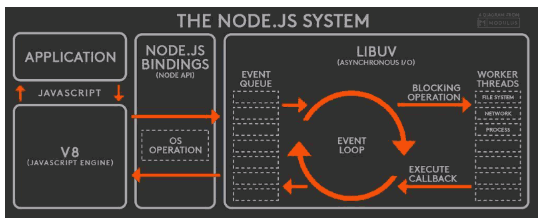

Node的运行机制：
+ V8引擎解析JavaScript脚本。
+ 解析代码后，调用Node API。
+ libuv库负责Node API的执行。它将不同的任务分配给不同的线程，形成一个Event Loop（事件循环），以异步的方式将任务结果返回给V8引擎。
+ V8引擎再将结果返回给用户。

#### 2、过程六个阶段
事件循环分为6个阶段，会按照顺序反复运行。每进入到某一个阶段，都会从对应的回调队列中取出函数去执行。
当队列为空或者执行的回调函数数量达到系统设定的阈值，就会进入到下一阶段。

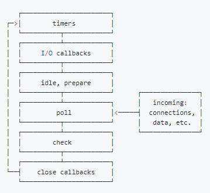

##### （1）node事件循环的顺序：

+ 外部输入数据 --》轮询阶段（poll）--》检查阶段（check）--》关闭事件回调阶段（close callback）--》定时器检测阶段（timers）--》I/O事件回调阶段（I/O callbacks）--》闲置阶段（idle，prepare）--》轮询阶段（按照顺序反复运行）

说明：
+ timers阶段：这个阶段执行timer（setTimeout，setInterval等）回调。
+ I/O callbacks阶段：处理一些上一轮循环中的少数未执行的I/O回调。
+ idle，prepare阶段： 仅node内部使用。
+ poll阶段：获取新的I/O事件，适当条件下node将阻塞在这里。
+ check阶段：执行setImmediate()的回调。
+ close callbacks阶段：执行socket的close事件回调。

注意：6个阶段不包括process.nextTick()

日常开发中，主要是timers阶段，poll阶段，check阶段包含了绝大部分异步任务。

##### （2）定时器检测阶段-timers阶段

timers阶段会执行setTimeout和setInterval回调，并且由轮询poll阶段控制。同样，在Node中定时器指定的时间也不是准确时间，只能尽快执行。

##### （3）轮询阶段--poll阶段

轮询poll阶段是一个重要阶段，主要做两件事情：

+ 1、回到timers阶段执行回调
+ 2、执行I/O回调

进入到这个阶段如果没有设定timer的话，会做个判断：

+ 1、如果poll队列不为空，会遍历回调队列并同步执行，知道队列为空或者达到系统限制。
+ 2、如果队列为空，会做个判断：
    + 如果有setImmediate回调需要执行，poll阶段会停止并且进入到check阶段执行回调。
    + 如果没有setImmediate回调，会等待回调被加入到队列中并立即执行回调，这里会有个超时时间设置防止一直等待下去

当然设定了timer，并且poll队列为空，会判断是否有timer超时，如果有的话回到timer阶段执行回调。

##### （4）检查阶段--check阶段
setImmediate的回调会被加到check队列中，从EventLoop阶段图知道，check阶段的执行顺序是在poll阶段之后。

我们看个栗子，更容易让我们理解：
```js
console.log('start')
setTimeout(() => {
  console.log('timer1')
  Promise.resolve().then(function() {
    console.log('promise1')
  })
}, 0)
setTimeout(() => {
  console.log('timer2')
  Promise.resolve().then(function() {
    console.log('promise2')
  })
}, 0)
Promise.resolve().then(function() {
  console.log('promise3')
})
console.log('end')
// start, 
// end, 
// promise3,  
// timer1,  
// timer2,  
// promise1,  
// promise2 
```
分析：
+ 1、一开始执行栈的同步任务（宏任务），执行完毕后，依次打出 start和end，并将2个timer依次放入timers队列。
+ 2、然后去执行微任务（和浏览器有点像），打印出promise3。
+ 3、然后进入到timers阶段，执行timer1的回调函数，打印timer1，并将promise.then回调放入微任务队列，同样的步骤执行timer2，打印timer2。(这个和浏览器差别最大的地方)，**timers阶段**有几个setTimeout/setInterval都会依次执行，并不像浏览器端，没执行一个宏任务后就去执行一个微任务队列。


#### 3、node的微任务和宏任务

Node端事件循环中的异步队列也是这两种：macro（宏任务）队列和 micro（微任务）队列。
+ 1、常见的 macro-task 比如：setTimeout、setInterval、 setImmediate、script（整体代码）、 I/O 操作等。
+ 2、常见的 micro-task 比如: process.nextTick、new Promise().then(回调)等。

#### 4、注意点
##### （1）setTimeout和setImmediate
二者比较相似，区别：调用的时机不同。
+ 1、setImmediate：设计在poll阶段完成时执行，也就是在check阶段执行。
+ 2、setTimeout：设计在poll阶段空闲的时候，设定的时间达到后执行，也就是在timer阶段执行。

```js
setTimeout(function timeout () {
    console.log('timeout');
},0);
setImmediate(function immediate () {
    console.log('immediate');
});
```
分析上述代码：
+ 执行之后，发现：setTimeout可能执行在前，也有可能执行在后。
+ 源码中，setTimeout(fn, 0) === setTimeout(fn, 1)，进入事件循环也是需要成本的，如果在准备时候花费大于1ms，timer阶段就会直接执行setTimeout回调。
+ 如果准备时间花费小于1ms，那么就setImmediate回调先执行。

但是如果两者在异步I/O callback内部调用，总是先执行setImmediate，再执行setTimeout。
```js
const fs = require('fs')
fs.readFile(__filename, () => {
    setTimeout(() => {
        console.log('timeout');
    }, 0)
    setImmediate(() => {
        console.log('immediate');
    })
})
// immediate
// timeout
```


##### （2）process.nextTick
process.nextTick这个函数其实是独立于Event Loop之外的，有自己的队列。当每个阶段完成后，如果存在nextTick队列，就会清空队列中的所有回调函数，并且优先于其他microtask执行。
```js
Promise.resolve().then(function() {
    console.log('promise0')
})

setTimeout(() => {
    console.log('timer1')
    Promise.resolve().then(function() {
        console.log('promise1')
    })
}, 100)

process.nextTick(() => {
    console.log('nextTick')
    process.nextTick(() => {
        console.log('nextTick')
        process.nextTick(() => {
            console.log('nextTick')
            process.nextTick(() => {
                console.log('nextTick')
            })
        })
    })
})

setTimeout(() => {
    console.log('timer2')
    Promise.resolve().then(function() {
        console.log('promise2')
    })
}, 1)

Promise.resolve().then(function() {
    console.log('promise3')
})


//  nextTick
//  nextTick
//  nextTick
//  nextTick
//  promise0
//  promise3
//  timer2
//  promise2
//  timer1
//  promise1
```


### 12.3 Node的事件循环与浏览器差异
+ 浏览器的Event loop是在HTML5中定义的规范，而node中则由libuv库实现。
+ 浏览器环境中，微任务的任务队列是在每一个宏任务执行完成之后执行。node中，微任务会在事件循环的各个阶段之间执行，也就是一个阶段执行完毕，就会去执行微任务队列的任务。

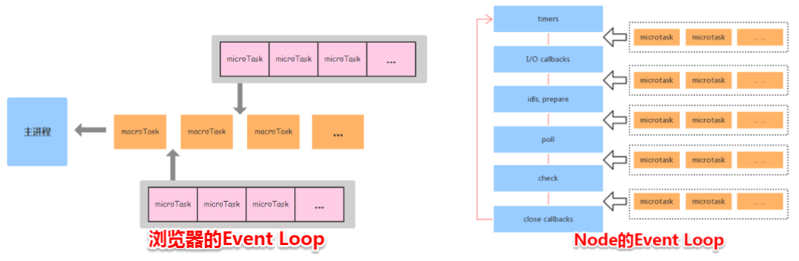

我们看一个栗子，来说明两者区别：
```js
setTimeout(()=>{
    console.log('timer1')
    Promise.resolve().then(function() {
        console.log('promise1')
    })
}, 0)
setTimeout(()=>{
    console.log('timer2')
    Promise.resolve().then(function() {
        console.log('promise2')
    })
}, 0)
```

#### 1、浏览器端运行情况
输出：
```js
// timer1
// promise1
// timer2
// promise2
```
浏览器端处理过程


#### 2、Node端运行情况
node端运行需要分为两种情况：
+ 如果node11版本及之后，一旦执行一个阶段里的宏任务(setTimeout,setInterval,setImmediate)就会立刻执行微任务队列，跟浏览器端运行一致。最后结果：
```js
// timer1
// promise1
// timer2
// promise2
```
+ 如果是node10及之前版本，要看第一个定时器执行完，第二定时器是否在完成队列中。
    - 如果第二个计时器未在完成队列中，结果为：
    ```js
    // timer1
    // promise1
    // timer2
    // promise2
    ```
     - 如果第二个计时器已经在完成队列中，结果为：
      ```js
         // timer1
         // timer2
         // promise1
         // promise2
      ```

我们来分析一下第二个计时器不在任务队列中的情况：

1、全局脚本main执行，将2个timer依次放入timer队列，main执行完后，调用栈为空闲，任务队列开始执行。

2、首先会进入timers阶段，执行timer1的回调函数，打印timer1，并将promsie1.then回调放入微任务队列。
同样的步骤执行timer2，打印timer2。

3、至此，timer阶段执行结束，EventLoop进入下一阶段之前，执行微任务队列的所有任务，依次打印promise1，promise2。

node端处理过程：

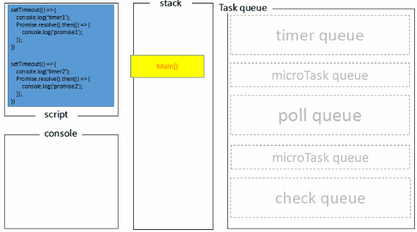


### 12.4 看看面试题
看个栗子

浏览器端和node端执行输出：
```js
console.log('1');

setTimeout(function() {
    console.log('2');
    process.nextTick(function() {
        console.log('3');
    })
    new Promise(function(resolve) {
        console.log('4');
        resolve();
    }).then(function() {
        console.log('5')
    })
})
process.nextTick(function() {
    console.log('6');
})
new Promise(function(resolve) {
    console.log('7');
    resolve();
}).then(function() {
    console.log('8')
})

setTimeout(function() {
    console.log('9');
    process.nextTick(function() {
        console.log('10');
    })
    new Promise(function(resolve) {
        console.log('11');
        resolve();
    }).then(function() {
        console.log('12')
    })
})
```
输出：1,7,6,8,2,4,3,5,9,11,10,12

一共三轮事件循环：

**第一轮**：

宏任务：输出1；new Promise同步任务，输出7。

微任务队列中：process.nextTick属于微任务，输出6；然后输出8。

第一轮结束，输出1,7,6,8

**第二轮**：

宏任务：输出2；new Promise同步任务，输出4。

微任务队列中：process.nextTick属于微任务，输出3；然后输出5。

**第三轮**：

宏任务：输出9；new Promise同步任务，输出11。

微任务队列中：process.nextTick属于微任务，输出10；然后输出12。


## 13、使用promise实现串行
什么是串行？依次有序的执行，应该可以理解成同步执行。

Promise串行队列一般情况下用的不多，因为串行会阻塞，用户交互是并行的。并行发请求，前端按串行顺序接收数据。

本质上：回调的串联。

### 13.1 async/await方案
```js
async function runPromiseByAwait(myPromise){
    for(let item of myPromise){
        await item();
    }
};
```
我们测试一下：
```js
async function runPromiseByAwait(myPromise){
    for(let item of myPromise){
        await item();
    }
};
const createPromise = (time, id) => () => new Promise(solve => setTimeout(() => {
    console.log('promise',id);
    solve();
}, time))

runPromiseByAwait([
  createPromise(3000, 1),
  createPromise(2000, 2),
  createPromise(1000, 3)
]);
```
输出结果：
```js
// promise 1
// promise 2
// promise 3
```

总结：async/await利用自身改造成一个异步函数，等待每一个promise执行完毕。


### 13.2 reduce方案
原理：每次reduce的返回值会作为下次reduce回调函数的第一个参数，知道队列循环完毕。
```js
function runPromiseByReduce(myPromise) {
  myPromise.reduce(
      (previousPromise, nextPromise) => previousPromise.then(() => nextPromise()),Promise.resolve()
  )
}
```
分析一下：当上一个Promise开始执行(previousPromise.then)，当其执行完毕后再调用下一个Promise，并作为一个新的Promise返回，下次迭代会继续这个循环。

```js
function runPromiseByReduce(myPromise) {
  myPromise.reduce(
      (previousPromise, nextPromise) => previousPromise.then(() => nextPromise()),Promise.resolve()
  )
}

const createPromise = (time, id) => () => new Promise(solve => setTimeout(() => {
    console.log('promise',id);
    solve();
}, time))

runPromiseByReduce([
  createPromise(3000, 1),
  createPromise(2000, 2),
  createPromise(1000, 3)
]);
```
输出结果：
```js
// promise 1
// promise 2
// promise 3
```
分析：reduce是同步执行，在一个事件循环中就会完成，在内存中快速构建Promise执行队列。
```js
new Promise((resolve, reject) => {
    resolve();
}).then(result => {
    return result;
}).then(result => {
    return result;
});
```
reduce作用就是在内存中生成上述的队列，这样精简了代码。

总结：reduce函数整体是个同步函数，自己先执行完毕构造Promise队列，然后在内存中异步执行。


## 14、如何保证页面运行流畅的情况下处理海量数据

### 14.1 根据可视区域进行渲染（懒加载）


### 14.2 documentFragment+requestAnimation+事件委托
比如：
```
10w 条记录的数组，一次性渲染到页面上，如何处理可以不冻结UI？
```
具体：页面上有个空的无序列表节点 ul ，其 id 为 list-with-big-data ，现需要往列表插入 10w 个 li ，每个列表项的文本内容可自行定义，且要求当每个 li 被单击时，通过 alert 显示列表项内的文本内容。

```html
<!DOCTYPE html>
<html lang="en">

<head>
  <meta charset="UTF-8">
  <meta name="viewport" content="width=device-width, initial-scale=1.0">
  <meta http-equiv="X-UA-Compatible" content="ie=edge">
  <title>页面加载海量数据</title>
</head>

<body>
  <ul id="list-with-big-data">100000 数据</ul>
  <script>
    // 此处添加你的代码逻辑
  </script>
</body>

</html>
```
分析：获取 ul 元素，然后新建 li 元素，并设置好 li 的文本内容和监听器绑定，然后在循环里对 ul 进行 append 操作。

```js
(function() {
  const ulBox = document.getElementById("list-width-big-data");
  if(!ulBox){
      return ;
  }
  for(let i = 0; i < 10000; i++){
      const liItem = document.createElement("li");
      liItem.innnerText = i + 1;
      liItem.addEventListener("click",function() {
        alert(this.innnerText)
      });
      ulBox.appendChild(liItem);
  }
})();
```
我们发现卡顿严重，原因：每次循环的饿时候，都会修改dom结构，数据量大，导致循环时间过长，浏览器渲染帧过低。

优化方向：

+ 减少dom操作次数。
+ 缩短循环时间，减少主线程阻塞的时间。

方案：

+ documentFragment，减少dom操作次数，降低回流对性能的影响。
+ requestAnimationFrame，分治的思想，分批插入到页面中，通过requestAnimationFrame在页面重绘前插入新的节点。
+ 时间绑定，使用时间委托，而不是使用事件监听，从而减少dom事件注册数量。

```js
(function() {
  const ulBox = document.getElementById("list-width-big-data");
  if(!ulBox) return ;
  const total = 100000;  // 数据总数
  const batchNum = 10;   // 每次插入节点数，数越小，页面卡顿感下降
  const batchCount = total/batchNum;   //批处理的次数
  let batchDone = 0;
  function appendItems() {
    const fragment = document.createDocumentFragment();
    for(let i = 0; i < batchNum; i++){
        const liItem = document.createElement("li");
        liItem.innerText = batchDone * batchNum + i + 1;
        fragment.appendChild(liItem);
    }
    /*每次批处理只修改一次dom*/
    ulBox.appendChild(fragment);
    batchDone++;
    doAppendBatch();
  };
  function doAppendBatch() {
    if(batchDone < batchCount){
        /*重绘之前。分批插入新节点*/
        window.requestAnimationFrame(appendItems)
    }
  };
  doAppendBatch();
  /*使用事件委托*/
  ulBox.addEventListener("click",function(e) {
    const target = e.target;
    if(target.tagName === "LI"){
        alert(target.innerText);
    }
  })
})
```

## 14、正则

### 1、邮箱
```
邮箱由英文字母，数字，英文句号，下划线，中划线组成，若干个
邮件名称：[a-zA-Z0-9_-]+
域名规则：【N级域名】【三级域名.】二级域名.顶级域名。等同于**.**.**.**
邮箱规则：名称@域名
最终 /^[\w+-]+@[\w+-]+(\.[\w+-]+)+$/

如果允许汉字，汉字在正则：[\u4e00-\u9fa5]
```


### 2、url解析
```
1、协议匹配(http://和https://): 
^(https|https):\/\/
2、主机名匹配(xxx.xxx.xxx 或 xxx.xxx 2种形式 由字母或数字组成。如：www.baidu.com  baidu.com  127.0.0.1)：
([0-9a-zA-Z.]+)
3、端口匹配（冒号开头+数值或者不显示，如：127.0.0.1:8080  127.0.0.0）：
(:[0-9]+)?
4、路径匹配（路径由字母，数字，斜杆，点，组成。但是首页是没有路径的。如：/xxx/xxxx/xxx.html 、 /xxx/xxx）：
([/0-9a-zA-Z.]+)?
5、查询字符串匹配（格式为：?xxx=1&ddd=2或者?xx=2）。这个不是必须项。
(\?[0-9a-zA-Z&=]+)?
6、信息片断匹配（信息片段由#，字母，数值组成，也不是必须项）
(#[0-9a-zA-Z]+)?
最终：/^(http|https):\/\/([0-9a-zA-Z.]+)(:[0-9]+)?([/0-9a-zA-Z.]+)?(\?[0-9a-zA-Z&=]+)?(#[0-9a-zA-Z]+)?/i
```

### 3、千分号
```
1、最后一个逗号：(?=\d{3}$)
2、多个逗号：(?=(\d{3})+$)
3、匹配的位置不能是开头：(?!^)(?=(\d{3})+$)
4、支持其他开头的，把^和结尾$，修改成\b：(?!\b)(?=(\d{3})+\b)
最终：/(?!\b)(?=(\d{3})+\b)/g
```


### 4、去重
主要是对字符串去重
```
/(.).*\1/g
```
```js
var demo="ababbba";
demo = demo.split(''); //把字符串转换为数组
demo = demo.sort().join(''); //首先进行排序，这样结果会把相同的字符放在一起，然后再转换为字符串
demo.replace(/(.).*\1/g,"$1")
```

## 15、ES6的数组方法
### 15.1 Array.from()
将set，map，array，字符串，类数组等转换为数组的功能。
语法：`Array.from(arrayLike[, mapFn[, thisArg]])``
#### 1、Map转换数组
```js
let map1 = new Map();
map1.set('a','程');
map1.set('b','新');
map1.set('c','松');
console.log(Array.from(map1));
//[["a","程"],["b","新"],["c","松"]]
```
#### 2、Set转换数组
```js
let set1 = new Set();
set1.add(1).add(2).add(3);
console.log(Array.from(set1));
// [1,2,3]
```
### 3、字符串转换数组
```js
console.log('%s', Array.from('hello world'));
// ["h", "e", "l", "l", "o", " ", "w", "o", "r", "l", "d"]
```
### 4、类数组对象转换
一个类数组对象必须有length属性，且它的属性名必须是数值或者可以转换成数值的字符。
```js
let obj = {
              0: '0',
              1: '1',
              3: '3',
              length:4
          };
console.log(Array.from(obj));
// ["0", "1", undefined, "3"]
```
1、属性名为数组的索引号，没有的话，就转成undefined

```js
let obj = {
              0: '0',
              1: '1',
              3: '3',
          };
console.log(Array.from(obj));
// []
```
2、不带length属性，数组为空

```js
let obj = {
              a: '0',
              b: '1',
              d: '3',
          };
console.log(Array.from(obj));
// []
```
3、对象书香门不能转换成索引，为空

### 5、mapFn函数转换

```js
function double(arr) {
    return Array.from(arguments, function(elem) {
        return elem * 2;
    });
}
const result = double(1, 2, 3, 4);
console.log(result);
// [2, 4, 6, 8]
```
### 6、处理dom对象的应用
处理Dom对象，针对对象进行循环迭代处理.dom对象是类数组，而非真实数组，我们通过Array.from转成数组处理。
```js
const arr = document.querySelectorAll('div');
/* arr.forEach( item => console.log(item.tagName) ) */ // => wrong
Array.from(arr).forEach( item => console.log(item.tagName) );
// correct”
```

### 15.2 Array.of()
在ES6之前，我们使用 Array(...)方法声明一个数组，此方法接收一个参数，即此参数代表数组的长度而不是一个包含此值的数组，声明后会构建一个此长度的空数组，有时候会产生难以发现的错误。

因此ES6推出了Array.of()用于解决此问题，成为数组的**推荐函数构造器**
```js
let arr1 = Array(2);
console.log(arr1.length);  //  2
console.log(arr1);         // [ <2 empty items> ]

let arr2 = Array.of(1,2,3);  
console.log(arr2.length);  // 3 
console.log(arr2);         // [1,2,3]
```

### 15.3 Array.fill()
将数值填充到指定数组的开始位置和结束位置，改变原数组。

语法：`Array.prototype.fill(value[, start[, end]])``

+ value：要填充的数值，必填
+ start：填充的开始位置，选填
+ end：填充的结束位置，不包含此项，选填

注意：
+ 1、如果只有value参数，数组中多有内容为此项
+ 2、没有end，默认长度是数组长度
+ 3、start或者end为负数，对应值为 当前数值+ 数组长度
```js
let arr1 = [1,2,3,4,5]
console.log(arr1.fill(6));   // [6,6,6,6,6]

let arr2 = [1,2,3,4,5]
console.log(arr2.fill(6, 3));   //[1,2,3,6,6]

let arr3 = [1,2,3,4,5]
console.log(arr3.fill(6, 3, 4));   //[1,2,3,6,5]

let arr4 = [1,2,3,4,5]
console.log(arr4.fill(6, -3, -1));   //[1,2,6,6,5]

let arr5 = [1,2,3,4,5]
console.log(arr5.fill(6, -3, -4));   //[1,2,3,4,5]
```


### 15.4 Array.inclues()
用来判断数组中是否含有某元素，如果存在返回true，否则false。
```js
const arr = [0, 1, 1, 2, 3, 5, 8, 13];
arr.includes(0); // true
arr.includes(13); // true
arr.includes(21); // false
```
这个与indexOf()方法的区别？

+ indexOf()如果存在返回的是数组的索引位置，如果不存在就返回-1。
+ indeOf()使用严格匹配(===)判断

```js
const arr = ['Some elements I like', NaN, 1337, true, false, 0017];
console.log(arr.includes(NaN));
// true
console.log(arr.indexOf(NaN) >= 0);
// false
```
我们看一下NaN
```js
console.log(NaN == NaN);   // false
console.log(NaN === NaN);  //false

```

### 15.5 Array.find() && Array.findIndex()
#### 1、Array.find()
只要找到一项内容就返回。数组中查找目标元素，找到就返回该元素，找到一个就返回，找不到返回undefined。

语法： `arr.find(callback[,thisArg]);`
+ callback：回调函数。
+ thisArg：执行回调时候的this指向，可选。
在callback回调函数上一共有三个参数：
+ element：每一次迭代查找的数组元素
+ index：每一次迭代查找的数组元素的索引
+ array： 数组本身

```js
const arr = [1, 2, 3, 4];
const result = arr.find(function(elem) { return elem > 2; });
console.log(result);
// 3
```


#### 2、Array.findIndex()
和find很类似，findIndex返回的是元素在数组中的索引。
```js
const arr = [1,2,3,4,5,6];
let index = arr.findIndex(item => item>=3);
console.log(index);  // 3的索引为2
// 2
```

### 15.6 Array.copyWithin()
浅复制数组的一部分到同一个数组的其他位置，覆盖原来位置的值。返回这个新数组，不会改变原数组长度。
语法：``arr.copyWithin(target[,start[,end]])`
+ 1、target：定义从什么位置开始复制的索引。数组大于数组长度，不会复制。
+ 2、start：选择要复制数组内动的起始索引。为负值，当前值+数组长度。
+ 3、end：选取要复制数组的结束索引，不包含此项内容。负值也是当前值+数组长度，可选，默认数组的长度。

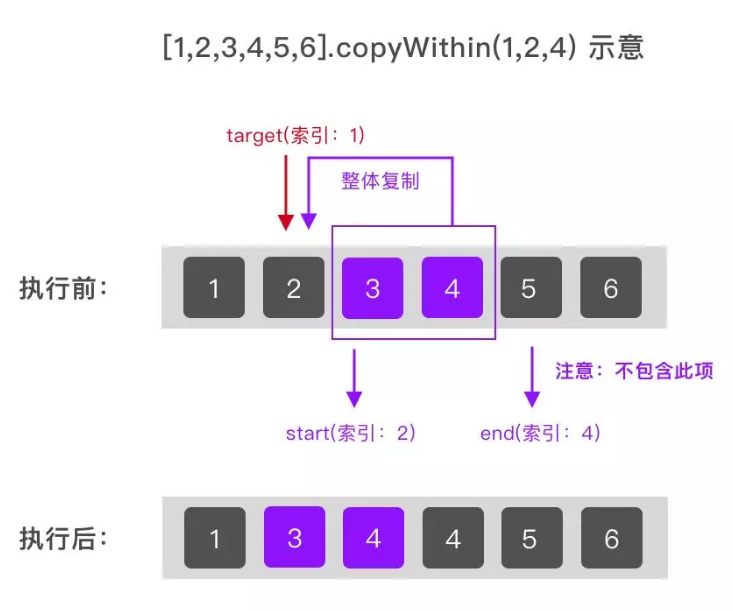
```js
const arr1 = [1,2,3,4,5];
console.log(arr1.copyWithin(1,3,4)); //[1,4,3,4,5]

const arr2 = [1,2,3,4,5];
console.log(arr2.copyWithin(1, -2, -3)); //[1,2,3,4,5]

const arr3 = [1,2,3,4,5];
console.log(arr3.copyWithin(1, -3, -2)); //[1,3,3,4,5]
```

### 15.6 Array.entries(),Array.keys(),Array.values()
+ Array.entries()返回一个Array Iterator对象，包含所有数组中每个索引的键值对，类似[key1,value1,key2,value2,key3,value3.....]
+ Array..keys()返回一个Array Iterator对象，包含所有的键。
+ Array.values()返回一个Array Iterator对象，包含所有的值。

```js
const arr = ['a', 'b', 'c'];
console.log(...arr.entries());   // [0, "a"] [1, "b"] [2, "c"]

console.log(...arr.keys());  // 0 1 2

console.log(...arr.values());  // a b c
```


## 16、npm的原理
npm成为世界最大的包管理器，原因：用户友好。

### 1、npm init
用来初始化一个简单的package.json文件。package.json文件用来定义一个package的描述文件。

**1、npm init的执行的默认行为**

执行`npm init --yes`，全部使用默认的值。

**2、 自定义npm init行为**

npm init命令的原理是：调用脚本，输出一个初始化的package.json文件。

获取用户输入使用prompt()方法。

### 2、依赖包安装
npm的核心功能：依赖管理。执行npm i从package.json中dependencies和devDependencies将依赖包安装到当前目录的node_modules文件夹中。

**1、package定义**

npm i <package>就可以安装一个包。通常package就是我们需要安装的包名，默认配置下npm会从默认的源（Registry）中查找该包名的对应的包地址，并且下载安装。
<package>还可以是一个指向有效包名的http url/git url/文件夹路径。

package的准确定义，符合以下a)到g)其中一个条件，他就是一个package：
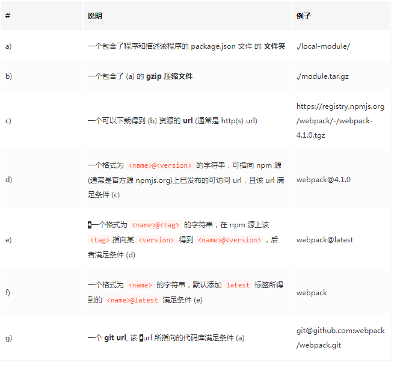

**2、安装本地包/远程git仓库包**

共享依赖包，并非非要把包发布到npm源上才能使用。

（1）场景1：本地模块引用

开发中避免不了模块之间调用，开发中，我们把频繁调用的配置模块放在根目录，然后如果有很多层级目录，后来引用

```
const config = require(''../../../../..config)
```
这样的路径引用不利于代码重构。这时候我们需要考虑把这个模块分离出来供其他模块共享。
比如config.js可以封装成一个package放到node_modules目录下。

不需要手动拷贝或者创建软连接到node_modules目录，npm 有自己的解决方案：

方案：

1、新增config文件夹，将config.js移入文件夹，名字修改为index.js，创建package.json定义config包

```json
{
    "name": "config",
    "main": "index.js",
    "version": "0.1.0"
}
```

2、在项目的package.json新增依赖项，然后执行npm i。
```json
{
  "dependencies": {
    "config":"file: ./config"
  }
}
```
查看 node_modules 目录我们会发现多出来一个名为 config，指向上层 config/ 文件夹的软链接。这是因为 npm 识别 file: 协议的url，得知这个包需要直接从文件系统中获取，会自动创建软链接到 node_modules 中，完成“安装”过程。

（2）场景2：私有git共享package

团队内会有一些代码/公用库需要在团队内不同项目间共享，但可能由于包含了敏感内容。

我们可以简单的将被依赖的包托管到私有的git仓库中，然后将git url保存到dependencies中。npm会直接调用系统的git命令从git仓库拉取包的内容到node_modules中。

npm支持的git url格式：
```
<protocol>://[<user>[:<password>]@]<hostname>[:<port>][:][/]<path>[#<commit-ish> | #semver:<semver>]
```
git 路径后可以使用 # 指定特定的 git branch/commit/tag, 也可以 #semver: 指定特定的 semver range.

比如：

```
git+ssh://git@github.com:npm/npm.git#v1.0.27
git+ssh://git@github.com:npm/npm#semver:^5.0
git+https://isaacs@github.com/npm/npm.git
git://github.com/npm/npm.git#v1.0.27

```

（3）场景3：开源package问题修复

此时我们可以手动进入 node_modules 目录下修改相应的包内容，也许修改了一行代码就修复了问题。但是这种做法非常不明智！

方案：

fork原作者的git库，在自己的repo修复问题，然后将dependencies中的相应依赖改为自己修复后版本的git url就可以解决问题。


### 3、npm install如何工作
npm i执行完毕，node_modules中看到所有的依赖包。开发人员无关注node_modules文件夹的结构细节，关注业务代码中引用依赖包。

理解node_modules结构帮助我们更好理解npm如何工作。npm2到npm5变化和改进。

#### 3.1 npm2
npm2在安装依赖包，采用的是简单的递归安装方法。每一个包都有自己的依赖包，每一个包的依赖都安装在自己的node_modules中，依赖关系层层递进，构成整个依赖树，这个依赖树与文件系统中的文件结构树一一对应。

最方便的**依赖树的方式**在根目录下执行npm ls。

优点：
+ 1、层级结构明显，便于傻瓜式管理。

缺点：
+ 1、复杂工程，目录结构可能太深，深层的文件路径过长触发window文件系统中文件路径不能超过260个字符长。
+ 2、部分被多个包依赖的包在很多地方重复安装，造成大量的冗余。

#### 3.2 npm3
npm3的node_modules目录改成更加扁平状层级结构。npm3在安装的时候遍历整个依赖树，计算最合理的文件夹安装方式，所有被重复依赖的包都可以去重安装。

npm来说，同名不同版本的包是两个独立的包。

npm3的依赖树结构不再与文件夹层级一一对应。

#### 3.3 npm5
沿用npm3的扁平化依赖包安装方式。最大的变化时增加package-lock.json文件。

package-lock.json作用：**锁定依赖安装结构，**发现node_modules目录文件层级结构是与json的结构一一对应。

npm5默认会在执行npm i后生成package-lock.json文件，提交到git/svn代码库。

要升级，不要使用 5.0版本。

注意：在 npm 5.0 中，如果已有 package-lock 文件存在，若手动在 package.json 文件新增一条依赖，再执行 npm install, 新增的依赖并不会被安装到 node_modules 中, package-lock.json 也不会做相应的更新。
  

### 4、依赖包版本管理
介绍依赖包升级管理相关知识。

#### 4.1 语义化版本semver
npm依赖管理的一个重要特性采用语义化版本（semver）规范，作为版本管理方案。

语义化版本号必须包含三个数字，格式：major.minor.patch。意思是：主版本号.小版本号.修改版本号。

我们需要在dependencies中使用semver约定的指定所需依赖包的版本号或者范围。

常用的规则如下图：

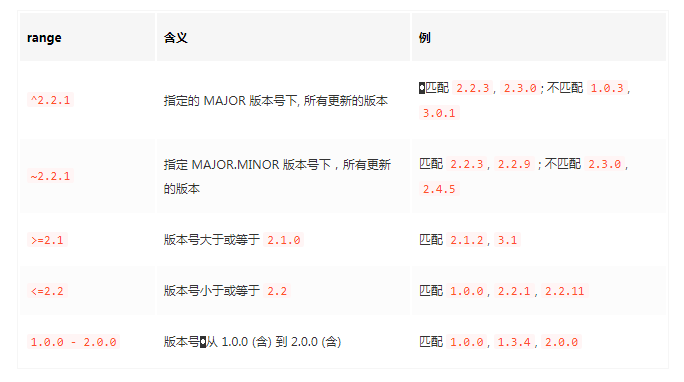

**1、任意两条规则，用空格连接起来，表示“与”逻辑，即为两个规则的交集。**

如 >=2.3.1 <=2.8.0 可以解读为: >=2.3.1 且 <=2.8.0
+ 可以匹配 2.3.1, 2.4.5, 2.8.0
+ 但不匹配 1.0.0, 2.3.0, 2.8.1, 3.0.0

**2、任意两条规则，用||连接起来，表示“或”逻辑，即为两条规则的并集。**

如 ^2 >=2.3.1 || ^3 >3.2
+ 可以匹配 2.3.1, 2,8.1, 3.3.1
+ 但不匹配 1.0.0, 2.2.0, 3.1.0, 4.0.0

**3、更直观的表示版本号范围的写法**
+ * 或 x 匹配所有主版本
+ 1 或 1.x 匹配 主版本号为 1 的所有版本
+ 1.2 或 1.2.x 匹配 版本号为 1.2 开头的所有版本

**4、在 MAJOR.MINOR.PATCH 后追加 - 后跟点号分隔的标签，作为预发布版本标签**
通常被视为不稳定、不建议生产使用的版本。
+ 1.0.0-alpha
+ 1.0.0-beta.1
+ 1.0.0-rc.3

#### 4.2 依赖版本升级
在安装完一个依赖包之后有新的版本发布了，如何使用npm进行版本升级呢？
+ npm i或者npm update，但是不同的npm版本，不同的package.json和package-lock.json文件，安装和升级表现是不同的。

使用npm3的结论：
+ 如果本地 node_modules 已安装，再次执行 install 不会更新包版本, 执行 update 才会更新; 而如果本地 node_modules 为空时，执行 install/update 都会直接安装更新包。
+ npm update 总是会把包更新到符合 package.json 中指定的 semver 的最新版本号——本例中符合 ^1.8.0 的最新版本为 1.15.0
+ 一旦给定 package.json, 无论后面执行 npm install 还是 update, package.json 中的 webpack 版本一直顽固地保持 一开始的 ^1.8.0 岿然不动

使用npm5的结论：
+ 无论何时执行 install, npm 都会优先按照 package-lock 中指定的版本来安装 webpack; 避免了 npm 3 表中情形 b) 的状况;
+ 无论何时完成安装/更新, package-lock 文件总会跟着 node_modules 更新 —— (因此可以视 package-lock 文件为 node_modules 的 JSON 表述)
+ 已安装 node_modules 后若执行 npm update，package.json 中的版本号也会随之更改为 ^1.15.0


#### 4.3 最佳实践
我常用的node是8.11.x，npm是5.6.0。
+ 使用npm >= 5.1 版本，保持package-lock.json文件默认开启配置。
+ 初始化，npm i  <package>安装依赖包，默认保存^X.Y.Z，项目提交package.json和package-lock.json。
+ 不要手动修改package-lock.json
+ 升级依赖包：
    + 升级小版本，执行npm update升级到新的小版本。
    + 升级大版本，执行npm install <package-name>@<version> 升级到新的大版本。
    + 手动修改package.json中的版本号，然后npm i。
    + 本地验证升级新版本后没有问题，提交新的package.json和package-lock.json文件。
+ 降级依赖包：
    + 正确：npm i <package-name>@<version>验证没有问题后，提交package.json和package-lock.json文件。
    + 错误：修改package.json中的版本号，执行npm i不会生效。因为package-lock.json锁定了版本。
+ 删除依赖包：
    + A计划：npm uninstall <package>。提交package.json和package-lock.json。
    + B计划：在package.json中删除对应的包，然后执行npm i，提交package.json和package-lock.json。
       
       
       
### 5、npm的sctipts
#### 5.1 基本使用
npm scripts是npm的一个重要的特性。在package.json中scripts字段定义一个脚本。

比如：
```json
{
    "scripts": {
        "echo": "echo HELLO WORLD"
    }
}
```
我们可以通过npm run echo 命令执行这段脚本，就像shell中执行echo HELLO WOLRD，终端是可以看到输出的。

总结如下：
+ npm run 命令执行时，会把./node_modules/.bin目录添加到执行环境的PATH变量中。全局的没有安装的包，在node_modules中安装了，通过npm run 可以调用该命令。
+ 执行npm 脚本时要传入参数，需要在命令后加 -- 表明，比如 npm run test -- --grep="pattern" 可以将--grep="pattern"参数传给test命令。
+ npm 还提供了pre和post两种钩子的机制，可以定义某个脚本前后的执行脚本。
+ 运行时变量：npm run 的脚本执行环境内，可以通过环境变量的方式获取更多的运行相关的信息。可以通过process.env对象访问获得：
    + npm_lifecycle_event：正在运行的脚本名称
    + npm_package_<key>：获取当前package.json中某一个字段的匹配值：如包名npm_package_name
    + npm_package_<key>_<sub-key>：package中的嵌套字段。

#### 5.2 node_modules/.bin目录
保存了依赖目录中所安装的可供调用的**命令行包**。本质是一个可执行文件到指定文件源的映射。

例如 webpack 就属于一个命令行包。如果我们在安装 webpack 时添加 --global 参数，就可以在终端直接输入 webpack 进行调用。

上一节所说，npm run 命令在执行时会把 ./node_modules/.bin 加入到 PATH 中，使我们可直接调用所有提供了命令行调用接口的依赖包。所以这里就引出了一个最佳实践：

+ 将项目依赖的命令行工具安装到项目依赖文件夹中，然后通过 npm scripts 调用；而非全局安装

**于是 npm 从5.2 开始自带了一个新的工具 npx.** 

#### 5.3 npx

npx 的使用很简单，就是执行 npx <command> 即可，这里的 <command> 默认就是 ./node_modules 目录中安装的可执行脚本名。例如上面本地安装好的 webpack 包，我们可以直接使用 npx webpack 执行即可。

#### 5.4 用法
+ 1、传入参数
```json
"scripts": {
  "serve": "vue-cli-service serve",
  "serve1": "vue-cli-service --serve1",
  "serve2": "vue-cli-service -serve2",
  "serve3": "vue-cli-service serve --mode=dev --mobile -config build/example.js"
}
```
除了第一个可执行的命令，以空格分割的任何字符串都是参数，并且都能通过process.argv属性访问。

比如执行npm run serve3命令，process.argv的具体内容为：
```
[ '/usr/local/Cellar/node/7.7.1_1/bin/node',
  '/Users/mac/Vue-projects/hao-cli/node_modules/.bin/vue-cli-service',
  'serve',
  '--mode=dev',
  '--mobile',
  '-config',
  'build/example.js'
]
```

+ 2、多命令运行
在启动时可能需要同时执行多个任务，多个任务的执行顺序决定了项目的表现。

（1）串行执行

串行执行，要求前一个任务执行成功之后才能执行下一个任务。使用 && 服务来连接。
```
npm run scipt1 && npm run script2
```
> 串行执行命令，只要一个命令执行失败，整个脚本会中止的。

（2）并行执行

并行执行，就是多个命令同时平行执行，使用 & 符号来连接。
```
npm run script1 & npm run script2
```

+ 3、env 环境变量
在执行npm run脚本时，npm会设置一些特殊的env环境变量。其中package.json中的所有字段，都会被设置为以npm_package_ 开头的环境变量。


+ 4、指令钩子
在执行npm scripts命令（无论是自定义还是内置）时，都经历了pre和post两个钩子，在这两个钩子中可以定义某个命令执行前后的命令。
比如在执行npm run serve命令时，会依次执行npm run preserve、npm run serve、npm run postserve，所以可以在这两个钩子中自定义一些动作：

```json
"scripts": {
  "preserve": "xxxxx",
  "serve": "cross-env NODE_ENV=production webpack",
  "postserve": "xxxxxx"
}
```
+ 5、常用脚本示例
```
// 删除目录
"clean": "rimraf dist/*",

// 本地搭建一个http服务
"server": "http-server -p 9090 dist/",

// 打开浏览器
"open:dev": "opener http://localhost:9090",

// 实时刷新
"livereload": "live-reload --port 9091 dist/",

// 构建 HTML 文件
"build:html": "jade index.jade > dist/index.html",

// 只要 CSS 文件有变动，就重新执行构建
"watch:css": "watch 'npm run build:css' assets/styles/",

// 只要 HTML 文件有变动，就重新执行构建
"watch:html": "watch 'npm run build:html' assets/html",

// 部署到 Amazon S3
"deploy:prod": "s3-cli sync ./dist/ s3://example-com/prod-site/",

// 构建 favicon
"build:favicon": "node scripts/favicon.js",
```


### 6 npm配置
#### 6.1 npm config
+ 通过npm config ls -l 可查看npm 的所有配置，包括默认配置。
+ 通过npm config set <key> <value>，常见配置：
    + proxy，https-proxy：指定npm使用的代理
    + registry：指定npm下载安装包时的源，默认是https://registry.npmjs.org。可以指定私有的registry源。
    + package-lock.json：指定是否默认生成package-lock.json，建议保持默认true。
    + save ：true/false指定是否在npm i之后保存包为dependencies，npm5开始默认为true。
+ 通过npm config delete <key> 删除指定的配置项。    


#### 6.2 npmrc文件
可以通过删除npm config命令修改配置，还可以通过npmrc文件直接修改配置。
+ npmrc文件优先级由高到低，包括：
    + 工程内配置文件：项目根目录下的.npmrc文件
    + 用户级配置文件：用户配置里
    + 全局配置文件
    + npm内置配置文件
我们可以在自己的团队中在根目录下创建一个.npmrc文件来共享需要在团队中共享的npm运行相关配置。

比如：我们在公司内网下需要代理才能访问默认源：https://registry.npmjs.org源；或者访问内网的registry，就可以在工作项目下新增.npmrc文件并提交代码库。

示例配置：
```
proxy = http://proxy.example.com/
https-proxy = http://proxy.example.com/
registry = http://registry.example.com/
```
这种在工程内配置文件的优先级最高，作用域在这个项目下，可以很好的隔离公司项目和学习研究的项目两种不同环境。

**将这个功能与 ~/.npm-init.js 配置相结合，可以将特定配置的 .npmrc 跟 .gitignore, README 之类文件一起做到 npm init 脚手架中，进一步减少手动配置。**

#### 6.3 node版本约束
一个团队中共享了相同的代码，但是每个人开发机器不一致，使用的node版本也不一致，服务端可能与开发环境不一致。

+ 这就带来了不一致的因素----方案：声明式约束+脚本限制。

+ 声明：通过package.json的engines属性声明应用运行所需的版本要求。例如我呢项目中使用了async，await特性，得知[node查阅兼容表格](https://node.green/)得知最低支持版本是7.6.0.因此指定engines配置为：
```json
{
  "engines": {"node": ">=7.6.0"}
}
```
+ 强约束(可选)：需要添加强约束，需要自己写脚本钩子，读取并解析engines字段的semver range并与运行环境做比对校验并适当提醒。

### 总结
+ npm init初始化新项目
+ 统一项目配置：需要团队共享npm config配置项，固化到.npmrc文件中
+ 统一运行环境：统一package.json，统一package-lock.json文件。
+ 合理使用多样化的源安装依赖包
+ 使用npm版本：>= 5.2版本
+ 使用npm scripts和npx管理相应脚本
+ 安全漏洞检查：npm audit fix修复安全漏洞的依赖包（本质：自动更新到兼容的安全版本）


## 17、babel
babel对于大多数前端开发人员来说，不陌生，但是背后的原理海慧寺黑盒。

我们需要了解babel背后的原理在我们开发中广泛应用。

### 17.1 babel简单应用
```
[1,2,3].map(n => n+1);
```
经过babel转译之后，代码变成这样
```
[1,2,3].map(function(n){
  return n + 1;
})
```
那我们应该知道了babel定位：babel将ES6新引进的语法转换为浏览器可以运行的ES5语法。

### 17.2 babel背后
babel过程：解析----转换---生成。

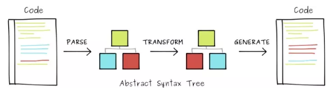

我们看到一个叫AST(抽象语法树)的东西。

主要三个过程：

+ 解析：将代码（字符串）转换为AST（抽象语法树）。
+ 转换：访问AST的节点进行变化操作生成新的AST。
+ 生成：以新的AST为基础生成代码

### 17.3 过程1：代码解析（parse）
代码解析（parse）将一段代码解析成一个数据结构。其中主要关键步骤：
+ 词法分析：代码（字符串）分割成token流。即语法单元组成的数组。
+ 语法分析：分析token流（生成的数组）生成AST。

#### 1.1词法分析
词法分析，首先明白JS中哪些属于语法单元？
+ 数字：js中科学计数法以及普通数组都是语法单元。
+ 括号：(和)只要出现，不管意义都算是语法单元。
+ 标识符：连续字符，常见变量，常量，关键字等等
+ 运算符：+，-，*，/等。
+ 注释和中括号。

我们来看一下简单的词法分析器（Tokenizer）
```
// 词法分析器,接收字符串返回token数组
export const tokenizer = (code) => {

    // 储存 token 的数组
    const tokens  = [];

    // 指针
    let current = 0;

    while (current < code.length) {
        // 获取指针指向的字符
        const char = code[current];

        // 我们先处理单字符的语法单元 类似于`;` `(` `)`等等这种
        if (char === '(' || char === ')') {
            tokens.push({
                type: 'parens',
                value: char,
            });

            current ++;

            continue;
        }

        // 我们接着处理标识符,标识符一般为以字母、_、$开头的连续字符
        if (/[a-zA-Z\$\_]/.test(char)) {
            let value = '';
            value += char;
            current ++;

            // 如果是连续字那么将其拼接在一起,随后指针后移
            while (/[a-zA-Z0-9\$\_]/.test(code[current]) && current < code.length) {
                value += code[current];
                current ++;
            }

            tokens.push({
                type: 'identifier',
                value,
            });

            continue;
        }


        // 处理空白字符
        if (/\s/.test(char)) {
            let value = '';
            value += char;
            current ++;

            //道理同上
            while (/\s]/.test(code[current]) && current < code.length) {
                value += code[current];
                current ++;
            }

            tokens.push({
                type: 'whitespace',
                value,
            });

            continue;
        }


        // 处理逗号分隔符
        if (/,/.test(char)) {

            tokens.push({
                type: ',',
                value: ',',
            });

            current ++;
            continue;
        }

        // 处理运算符
        if (/=|\+|>/.test(char)) {
            let value = '';
            value += char;
            current ++;

            while (/=|\+|>/.test(code[current])) {
                value += code[current];
                current ++;
            }

            // 当 = 后面有 > 时为箭头函数而非运算符
            if (value === '=>') {
                tokens.push({
                    type: 'ArrowFunctionExpression',
                    value,
                });
                continue;
            }

            tokens.push({
                type: 'operator',
                value,
            });

            continue;
        }

        // 如果碰到我们词法分析器以外的字符,则报错
        throw new TypeError('I dont know what this character is: ' + char);
    }

    return tokens;
};
```
上述的这个词法分析器：主要是针对例子的箭头函数。

#### 1.2语法分析
语法分析之所以复杂,是因为要分析各种语法的可能性,需要开发者根据token流(上一节我们生成的 token 数组)提供的信息来分析出代码之间的逻辑关系,只有经过词法分析 token 流才能成为有结构的抽象语法树.

做语法分析最好依照标准,大多数 JavaScript Parser 都遵循estree规范

1、语句(Statements): 语句是 JavaScript 中非常常见的语法,我们常见的循环、if 判断、异常处理语句、with 语句等等都属于语句。

2、表达式(Expressions): 表达式是一组代码的集合，它返回一个值,表达式是另一个十分常见的语法,函数表达式就是一种典型的表达式,如果你不理解什么是表达式, MDN上有很详细的解释.

3、声明(Declarations): 声明分为变量声明和函数声明,表达式(Expressions)中的函数表达式的例子用声明的写法就是下面这样.

```
const parser = tokens => {
    // 声明一个全时指针，它会一直存在
    let current = -1;

    // 声明一个暂存栈,用于存放临时指针
    const tem = [];

    // 指针指向的当前token
    let token = tokens[current];

    const parseDeclarations = () => {

        // 暂存当前指针
        setTem();

        // 指针后移
        next();

        // 如果字符为'const'可见是一个声明
        if (token.type === 'identifier' && token.value === 'const') {
            const declarations = {
                type: 'VariableDeclaration',
                kind: token.value
            };

            next();

            // const 后面要跟变量的,如果不是则报错
            if (token.type !== 'identifier') {
                throw new Error('Expected Variable after const');
            }

            // 我们获取到了变量名称
            declarations.identifierName = token.value;

            next();

            // 如果跟着 '=' 那么后面应该是个表达式或者常量之类的,额外判断的代码就忽略了,直接解析函数表达式
            if (token.type === 'operator' && token.value === '=') {
                declarations.init = parseFunctionExpression();
            }

            return declarations;
        }
    };

    const parseFunctionExpression = () => {
        next();

        let init;
        // 如果 '=' 后面跟着括号或者字符那基本判断是一个表达式
        if (
            (token.type === 'parens' && token.value === '(') ||
            token.type === 'identifier'
        ) {
            setTem();
            next();
            while (token.type === 'identifier' || token.type === ',') {
                next();
            }

            // 如果括号后跟着箭头,那么判断是箭头函数表达式
            if (token.type === 'parens' && token.value === ')') {
                next();
                if (token.type === 'ArrowFunctionExpression') {
                    init = {
                        type: 'ArrowFunctionExpression',
                        params: [],
                        body: {}
                    };

                    backTem();

                    // 解析箭头函数的参数
                    init.params = parseParams();

                    // 解析箭头函数的函数主体
                    init.body = parseExpression();
                } else {
                    backTem();
                }
            }
        }

        return init;
    };

    const parseParams = () => {
        const params = [];
        if (token.type === 'parens' && token.value === '(') {
            next();
            while (token.type !== 'parens' && token.value !== ')') {
                if (token.type === 'identifier') {
                    params.push({
                        type: token.type,
                        identifierName: token.value
                    });
                }
                next();
            }
        }

        return params;
    };

    const parseExpression = () => {
        next();
        let body;
        while (token.type === 'ArrowFunctionExpression') {
            next();
        }

        // 如果以(开头或者变量开头说明不是 BlockStatement,我们以二元表达式来解析
        if (token.type === 'identifier') {
            body = {
                type: 'BinaryExpression',
                left: {
                    type: 'identifier',
                    identifierName: token.value
                },
                operator: '',
                right: {
                    type: '',
                    identifierName: ''
                }
            };
            next();

            if (token.type === 'operator') {
                body.operator = token.value;
            }

            next();

            if (token.type === 'identifier') {
                body.right = {
                    type: 'identifier',
                    identifierName: token.value
                };
            }
        }

        return body;
    };

    // 指针后移的函数
    const next = () => {
        do {
            ++current;
            token = tokens[current]
                ? tokens[current]
                : { type: 'eof', value: '' };
        } while (token.type === 'whitespace');
    };

    // 指针暂存的函数
    const setTem = () => {
        tem.push(current);
    };

    // 指针回退的函数
    const backTem = () => {
        current = tem.pop();
        token = tokens[current];
    };

    const ast = {
        type: 'Program',
        body: []
    };

    while (current < tokens.length) {
        const statement = parseDeclarations();
        if (!statement) {
            break;
        }
        ast.body.push(statement);
    }
    return ast;
};
```

### 17.4 过程2：代码转换
+ 代码解析和代码生成是babel。
+ 代码转换是babel插件

比如taro就是用babel完成小程序语法转换。

代码转换的关键是根据当前的抽象语法树，以我们定义的规则生成新的抽象语法树。转换的过程就是新的抽象语法树生成过程。

代码转换的具体过程：
+ 遍历抽象语法树（实现遍历器traverser）
+ 代码转换（实现转换器transformer）


### 17.5 过程3：代码转换生成代码（实现生成器generator）
生成代码这一步实际上是根据我们转换后的抽象语法树来生成新的代码,我们会实现一个函数, 他接受一个对象( ast),通过递归生成最终的代码

### 17.6 核心原理
Babel 的核心代码是 babel-core 这个 package，Babel 开放了接口，让我们可以自定义 Visitor，在AST转换时被调用。所以 Babel 的仓库中还包括了很多插件，真正实现语法转换的其实是这些插件，而不是 babel-core 本身。


## 18、webpack

可以参考这个：http://www.chengxinsong.cn/post/57

## 19、nginx
### 19.1 正向代理
+ 正向代理是客户端和源服务器之间的服务器。
+ 影藏客户端：由代理服务器去访问源服务器。
+ 每一次请求都是到代理服务器，代理转发真实请求到源服务器并获取结果返回给客户端。

> 作用
+ 1、翻墙：绕过无法访问的节点。
+ 2、缓存：数据缓存在failing服务器上，客户端请求内容在缓存中，就不会访问源服务器。
+ 3、权限控制：防火墙授权代理服务器权限，客户端可以使用正向代理通过防火墙。
+ 4、影藏访问者：通过配置，源服务器无法获取真实的客户端信息。

### 19.2 反向代理
+ 对于客户端，反向代理服务器是源服务器
+ 影藏真实的服务器：代理服务器代替源服务器去接受并返回客户端请求。

> 作用
+ 1、影藏真实服务器：防止服务器被恶意攻击。
+ 2、缓存作用：数据婚存在代理服务器上，客户端请求的内容在职缓存中不去访问源服务器。
+ 3、均衡负载，nginx的均衡负载

### 19.3 正向代理和反向代理区别
正向代理：代理的是客户端。反向代理：代理的是服务端。

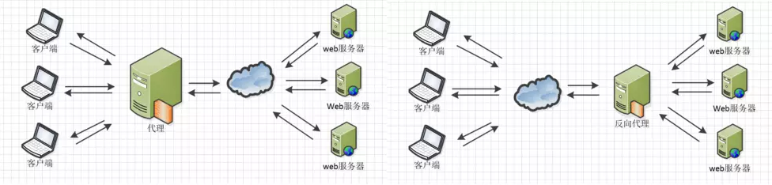

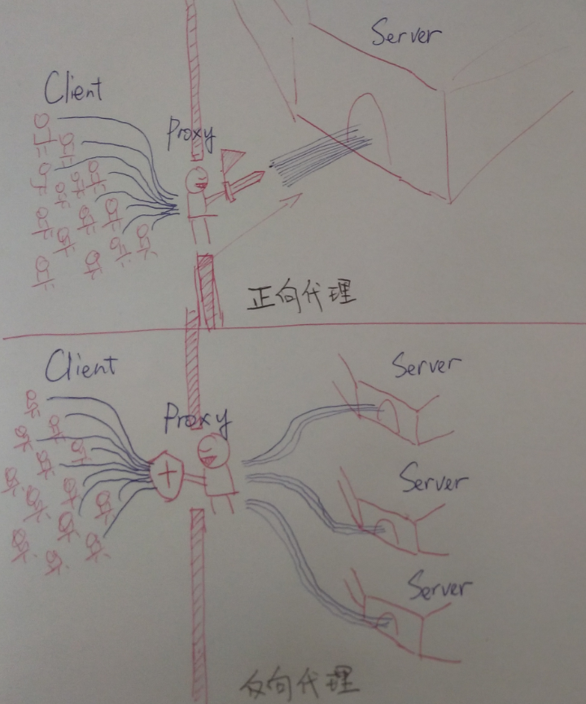

### 19.3 nginx在前端用途
#### 1、快速实现简单的访问限制
经常希望网站让某些特定的用户群体（比如公司内网）访问，或者不让某一个IP访问。
```
location / {
    deny 192.168.1.100;
    allow 192.168.1.10/200;
    allow 10.110.50.16;
    deny all;
}
```
其实deny和allow是ngx_http_access_module模块（已内置）中的语法。采用的是从上到下匹配方式，匹配到就跳出不再继续匹配。

上述配置的意思就是，首先禁止192.168.1.100访问，然后允许192.168.1.10-200 ip段内的访问（排除192.168.1.100），同时允许10.110.50.16这个单独ip的访问，剩下未匹配到的全部禁止访问。

实际生产中，经常和ngx_http_geo_module模块（可以更好地管理ip地址表，已内置）配合使用。

#### 2、解决跨域
 使用Nginx可以纯前端解决请求跨域问题。
 
 同时约定一个url规则来表明代理请求的身份，然后Nginx通过匹配该规则，将请求代理回原来的域。

```
 #请求跨域，这里约定代理请求url path是以/apis/开头
 location ^~/apis/ {
    # 这里重写了请求，将正则匹配中的第一个()中$1的path，拼接到真正的请求后面，并用break停止后续匹配
    rewrite ^/apis/(.*)$ /$1 break;
    proxy_pass http://www.chengxinsong.cn/;
 }  
```

## 20、CDN
CDN是内容分发网络。原理：对域名设置CNAME，将CNAME指向CDN服务商，在DNS解析的时候全局均衡负载DNS解析，根据地理位置信息解析对应的IP地址，用户就近访问。

解决的问题：
+ 解决网络堵塞的状况
+ 用户就近取所需内容
+ 提高网站访问的速度


## 21、git
### 21.1 git背后原理
git中存在4中对象来帮助我们进行版本管理，分别：
+ blob对象：存放文件内容
+ tree对象：存放目录和文件信息
+ commit对象：存放每个commit的信息
+ tag对象：存放跟标签有关信息

原理：git只关心文件内容，git不管文件存放位置和文件名字，只要两个文件内容一模一样的，那背后只有一个blob对象，这个特性使得git
使用快照功能而不用担心存放内容过大，每次新的commit只要内容不变，我们只需要指向之前的blob对象，而不需要重新建立一个新的blob对象。

.git文件夹下面有objects文件夹，存放着我们刚才说的4个对象等文件，文件名其实就是警告sha1算法获取的一串id，而内容就是我们对象内容经过压缩算法后的结果。


### 21.2 git文件状态
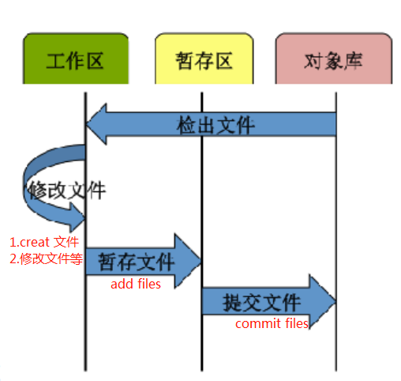
+ 工作区：进行创建文件，修改文件，删除文件等操作。
+ 暂存区：通过git add就将工作区变动文件送进暂存区，不变的文件保留快照。
+ 对象库（本地库）：通过git commit将暂存区的文件送进本地库。
注意点：（1）commit的时候必须加描述message，描述不能为空。

设置暂存区的原因：
+ 实现部分提交到本地库
+ 工作区职能是文件内容操作，如果还需要维护一些待提交文件，违反了单一职责原则。

### 21.3 commit
使用git log查看之前的一些commit信息
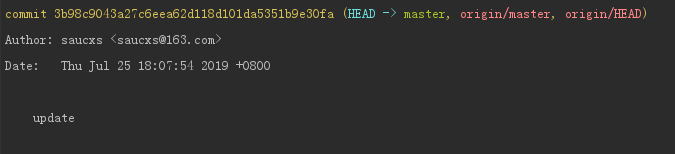
我们发现commit后边的数字字母串，就是commit对象的sha1值。因为git采用的分布式的版本控制系统，使用税数字会出现不同人提交的
出现id都是1,2,3等重复的情况，造成冲突。

commit下面还有作者和邮箱，可以咋子三个地方配置：
+ 1、/etc/gitconfig，通过git config --system设置
+ 2、~/.gitconfig通过git config --global设置
+ 3、针对特定项目，在.git/config文件中，通过git config --local设置
3只会在特定项目生效，2只会在当前主机用户的文件系统中生效，1是全局生效。设置的地方优先级：3 > 2 > 1。

### 21.4 指令
#### 1、查看git log
+ git log -3 查看最近3条commit
+ git log --author='saucxs' 查找一位作者叫saucxs的相关commit
+ git log --grep='saucxs' 查找commit信息包含saucxs的相关commit

等

#### 2、查看当前的git配置，包括用户名，邮箱等
+ git config --list


#### 3、删除掉.gitignore里面过滤的文件
+ git clean -fX

#### 4、git add .和git add *区别
+ git add . 会被本地所有untrack文件加入暂存区，并且根据.gitignore做过滤
+ git add * 会忽略.gitgnore把任何文件都加入


#### 5、分支相关
+ git branch 查看分支列表
+ git branch -a 查看所有分支，包括远程分支
+ git status 查看当前在哪个分支
+ git branch 分支名 创建新的分支
+ git checkout 分支名 切换分支
+ git branch -d 分支名 删除分支
+ git merge 分支名 将该分支合并到当前分支
+ git branch -m 原分支名 新分支名

#### 6、工作区相关
+ git stash 将工作区保存
+ git stash list 列出所有的保存

#### 7、回退
+ git reset --hard HEAD^ 回退到**上一次**的提交
+ git reset --hard HEAD^^ 回退到**上上一次**的提交
+ git reset --hard HEAD~n 回退到当前分钟至上的前n次提交
+ git reset --hard commit-id 信息的前几位 回退到指定commit
+ git reflog 查看我们执行了回退，但是我们又想回到该版本之后的commit id，reflog记录着Head指针的改变历史

#### 8、裁减掉当前远程分支
+ git remote prune origin 把远程被删的分支删掉

#### 9、git checkout commit-id与git reset --hard commit-id区别
两个都是可以回到对应的commit点，但是checkout的是处于游离状态，任何修改不提交的话会有警告，所以我们一般是创建新的分支。

#### 10、仓库
+ git remote rename 仓库名 仓库名2 把远程仓库名从origin重命名为origin2
+ git remote rm 仓库名 删除远程仓库名

#### 11、git pull会多一个merge commmit的情况，为什么？
git pull，会先执行git fetch，接着执行git merge，因为合并产生额外的commit，这时候就可以使用git pull --rebase来解决问题。

#### 12、git rebase
直接使用根基分支的修改：当我们执行rebase时，当遇到冲突时，我们除了可以手动的去解决冲突外，还可以通过执行git rebase --skip直接的使用根基分支的修改。

与git merge区别：git rebase会将两条分支变成同一条commit链，而merge依然可以看到分叉的commit信息，原理：rebase修改了git的提交历史，把之前分支上的commit一个个接到另外一条分支上。

执行git reset commit-id --hard就可以回到rebase前的状态了。
另外在每次做rebase前，git都会为我们创建一个ORIG_HEAD记录rebase前的状态让我们不需要reflog就可以快速切回去，所以就可以直接执行git reset ORIG_HEAD --hard

#### 13、开发中有个线上bug，功能写了一半，不能提交，怎么处置？
使用git stash将工作区的内容存储起来，然后切换新分支完成bug修复，在切换到未完成的分支，执行git stash pop将未完成的工作区还原到工作区。


## 22、Vue
Vue框架的入口就是vue实例，其实是框架中的View Model ，他包含了页面中的业务处理逻辑，数据模型，生命周期中多个事件钩子。

Vue实例虽然没有完全遵循MVVM模型，但是收到MVVM的启发。

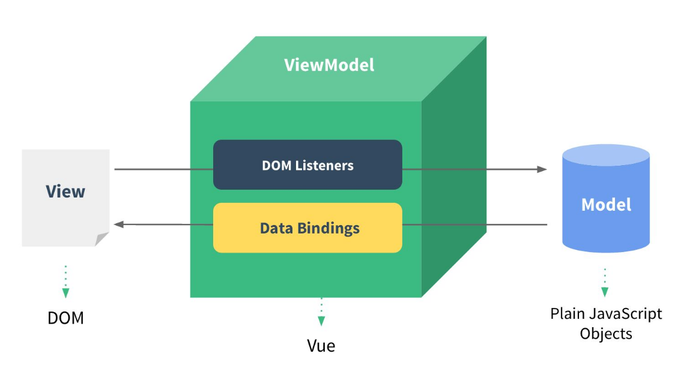
从图中知道：vue实际就是MVVM中的VM，就是ViewModel，所以看到文档中的vm这个变量其实就是Vue实例。
```js
let app = new Vue({
    el: '#app',
    date() {
        return {
            name: 'saucxs',
            count: 0
        }
    },
    method: {
        addNumber: function() {
          this.count++
        }
    }
})
```
上面代码中el: '#app'牵着View，data:{}牵着Model，而methods充当controller，可以修改Model的值。

### 22.1 全局API
#### 1、Vue.extend 扩展实例的构造器
Vue.extend(对象)返回的是一个**扩展实例的构造器**。作用：服务于Vue.component，用来生成组件。
可以理解成：
> 在模板中遇到该组件名称作为自定义的元素标签时，会自动调用扩展实例构造器来生产组件实例，并挂载到自定元素上。
+ data 选项是特例，需要注意 - 在 Vue.extend() 中data必须是函数
```html
<div id="mount-place"></div>
```
```js
var ExtendPlace = Vue.extend({
    template: '<p>welcome {{firstName}} {{lastName}} to {{place}}</p>',
    data: function() {
      return {
          firstName: 'Cheng',
          lastName: 'Xinsong',
          place: 'sau交流学习社区'
      }
    }
})
// 创建ExtendPlace实例，并挂载到一个元素上，不挂载没有效果
new ExtendPlace().$mount('#mount-place')   // 用自定义标签<extendplace></extendplace>的使用：  new Profile().$mount('extendplace')
```
运行结果：<p>welcome Cheng Xinsong to sau交流学习社区</p>

注意：还有一种写法
```html
<div id="mount-place">
    <mountplace></mountplace>
</div>
```
```js
var ExtendPlace = Vue.extend({
    template: '<p>welcome {{firstName}} {{lastName}} to {{place}}</p>',
    data(){
        return {
           firstName: 'Cheng',
           lastName: 'Xinsong',
           place: 'sau交流学习社区'
        }
    }
})
Vue.component('mountplace', ExtendPlace);
var vm = new Vue({
    el: '#mount-place'
})
```


（1）使用propsData
```js
var ExtendPlace = Vue.extend({
    template: '<p>welcome {{firstName}} {{lastName}} to {{place}}</p>',
    data: function() {
      return{
        firstName: 'Cheng',
        lastName: 'Xinsong',
      }
    },
    props : ['place']
})
new ExtendPlace({
    propsData: {
       place: 'sau交流学习社区'
    }
}).$mount('#mount-place')
```
运行结果：<p>welcome Cheng Xinsong to sau交流学习社区</p>

综上所述：extend创建的是Vue构造器，并不是我们平时写的组件实例，所以不可以直接new Vue({component: ExtendPlace})直接使用，
需要使用new ExtendPlace().$mount('#mount-place')指定挂载元素。

为什么要使用extend？
vue中页面基本上，可以使用import来进行组件的局部注册，但是import注册的组件有缺点：
+ （1）组件模板都是提前定义好的，如果接口动态渲染组件怎么处理。
+ （2）如何实现一个全局调用组件

#### 2、Vue.nextTick DOM的异步更新
下次更新DOM更新循环结束之后执行延迟回调，在修改数据之后立即使用这个方法，获取**更新后的DOM**。
我们看个栗子
```html
  <div class="app">
        <div ref="msgDiv">{{msg}}</div>
        <div v-if="msg1">outside $nextTick: {{msg1}}</div>
        <div v-if="msg2">inside $nextTick: {{msg2}}</div>
        <div v-if="msg3">outside $nextTick: {{msg3}}</div>
        <button @click="changeMsg">改变</button>
  </div>
```
```js
 new Vue({
        el: '.app',
        data: {
            msg: 'Hello Vue.',
            msg1: '',
            msg2: '',
            msg3: ''
        },
        methods: {
            changeMsg() {
                this.msg = "Hello world."
                this.msg1 = this.$refs.msgDiv.innerHTML
                this.$nextTick(() => {
                    this.msg2 = this.$refs.msgDiv.innerHTML
                })
                this.msg3 = this.$refs.msgDiv.innerHTML
            }
        }
    })
```
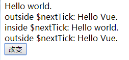

##### 应用场景
+ Vue生命周期的created()钩子函数进行DOM操作一定要放在Vue.nextTick()回调函数中。
created函数执行的时候，DOM并没有进行任何渲染，mounted()函数，此时DOM挂载和渲染已经完成，此时操作DOM没有问题。
+ 数据变化后要执行某个操作，这个操作需要使用随数据变化而变化的DOM结构，这个操作需要放进Vue.nextTick()回调函数中。
Vue异步执行DOM更新，只要观察数据变化，Vue会开启一个队列，并缓冲在同一个事件循环中发生的所有数据变化，如果多个watcher被多次
触发，只会被推入到队列中一次，这种缓冲时去除重复数据对于避免不必要的计算和DOM操作非常重要。然后在下一个事件循环“tick”中，
Vue刷新队列并执行实际工作。Vue在内部尝试对异步队列使用原生的Promise.then和MessageChannel，如果环境不支持，会采用setTimeout代替。


##### 源码浅析
Vue.nextTick用于延迟执行一段代码，他接受2个参数（回调函数和执行回调的上下文环境），如果没有提供回调函数，那将返回promise对象。
```js
/**
 * Defer a task to execute it asynchronously.
 */
export const nextTick = (function () {
  const callbacks = []
  let pending = false
  let timerFunc

  function nextTickHandler () {
    pending = false
    const copies = callbacks.slice(0)
    callbacks.length = 0
    for (let i = 0; i < copies.length; i++) {
      copies[i]()
    }
  }

  // the nextTick behavior leverages the microtask queue, which can be accessed
  // via either native Promise.then or MutationObserver.
  // MutationObserver has wider support, however it is seriously bugged in
  // UIWebView in iOS >= 9.3.3 when triggered in touch event handlers. It
  // completely stops working after triggering a few times... so, if native
  // Promise is available, we will use it:
  /* istanbul ignore if */
  if (typeof Promise !== 'undefined' && isNative(Promise)) {
    var p = Promise.resolve()
    var logError = err => { console.error(err) }
    timerFunc = () => {
      p.then(nextTickHandler).catch(logError)
      // in problematic UIWebViews, Promise.then doesn't completely break, but
      // it can get stuck in a weird state where callbacks are pushed into the
      // microtask queue but the queue isn't being flushed, until the browser
      // needs to do some other work, e.g. handle a timer. Therefore we can
      // "force" the microtask queue to be flushed by adding an empty timer.
      if (isIOS) setTimeout(noop)
    }
  } else if (!isIE && typeof MutationObserver !== 'undefined' && (
    isNative(MutationObserver) ||
    // PhantomJS and iOS 7.x
    MutationObserver.toString() === '[object MutationObserverConstructor]'
  )) {
    // use MutationObserver where native Promise is not available,
    // e.g. PhantomJS, iOS7, Android 4.4
    var counter = 1
    var observer = new MutationObserver(nextTickHandler)
    var textNode = document.createTextNode(String(counter))
    observer.observe(textNode, {
      characterData: true
    })
    timerFunc = () => {
      counter = (counter + 1) % 2
      textNode.data = String(counter)
    }
  } else {
    // fallback to setTimeout
    /* istanbul ignore next */
    timerFunc = () => {
      setTimeout(nextTickHandler, 0)
    }
  }

  return function queueNextTick (cb?: Function, ctx?: Object) {
    let _resolve
    callbacks.push(() => {
      if (cb) {
        try {
          cb.call(ctx)
        } catch (e) {
          handleError(e, ctx, 'nextTick')
        }
      } else if (_resolve) {
        _resolve(ctx)
      }
    })
    if (!pending) {
      pending = true
      timerFunc()
    }
    if (!cb && typeof Promise !== 'undefined') {
      return new Promise((resolve, reject) => {
        _resolve = resolve
      })
    }
  }
})()
```
1、三个重要变量：
+ callbacks 存储所有需要执行的回调函数
+ pending 标志是否正在执行回调函数
+ timeDunc 用来触发回调函数

2、nextTickHandle()函数
+ 作用：用来执行callbacks里存储的所有回调函数。

3、触发方式赋值给timerFunc
+ 先判断是原生支持promise，支持就用promise来触发执行回调函数
+ 否则，是否支持MutationObserver，则实例化一个观察者对象，观察文本节点发生改变，触发所有回调函数。
+ 如果上述都不支持，则利用setTimeout设置延迟为0

4、queueNextTick函数
nextTick是一个即时函数，所以queueNextTick函数返回的函数，接受用户传入的参数，用来往callbacks存入回调函数。

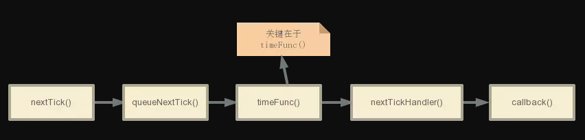
整个执行流程，关键在于timeFunc()，该函数起到延迟执行的作用。

timeFunc一共3种实现方式：
+ promise
+ MutationObserver
+ setTimeout
promise和setTimeout很好理解是一个异步任务，会在同步执行，以及更新DOM，异步才执行的具体函数。

然而MutationObserver是HTML5中新API，用来监听DOM变动的接口。能监听到DOM对象的发生子节点删除，属性修改，文本内容修改等。
```js
var mo = new MutationObserver(callback)
```
通过给MutationObserver的构造函数传入一个回调，得到一个MutationObserver实例，回调就会在实例监听到变动时触发。

具体监听哪个DOM、监听节点删除还是监听属性修改，还没有设置。而调用他的observer方法就可以完成这一步:
```js
var domTarget = 你想要监听的dom节点
mo.observe(domTarget, {
      characterData: true //说明监听文本内容的修改。
})
```

#### 3、Vue.set 对象新增属性
遇到这种情况，vue的data声明或者已经赋值过的对象或者数组（数组里的值是对象），向对象中添加新的属性，更新属性值，视图确没有更新。
官方文档定义：如果在实例创建之后添加新的属性到实例上，它不会触发视图更新。

看个栗子：
```html
 <div class="app">
    <div>
      <p style="border:1px solid #5579ee" @click="add_d(obj)">{{obj.d}}</p>
      <p style="border:1px solid #5579ee" @click="add_e(obj)"> {{obj.e}}</p>
    </div>
 </div>
```
```js
 new Vue({
        el: '.app',
        data: {
           obj: {}
        },
        mounted() {
            this.obj = {d: 0};  
            this.obj.e = 0;
            console.log('新增e属性的set方法', this.obj)
        },
        methods: {
            add_d(item){
                item.d = item.d + 1;
                console.log('d属性的值改变', item)
            },
            add_e(item){
                item.e = item.e + 1;
                console.log('e属性的值改变', item)
            }
        }
    })
```
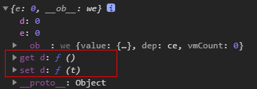
看图可知d属性是有get和set方法，新增的e属性是没有的。

点击三次add_d方法，值跟着变了，视图跟着变了。
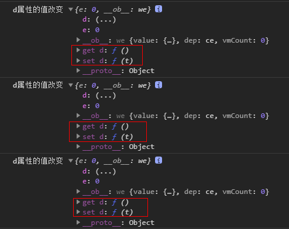

点击三次add_e方法，值跟着变，视图没有变。
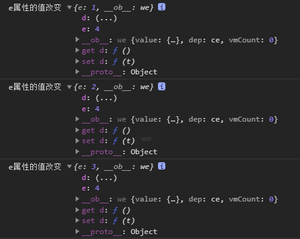

##### 解决方案
vue的官方定义：vue不允许在已经创建实例上动态添加新的根级响应式属性，然而可以使用Vue.set(object, key, value)方法将响应式属性添加到嵌套的对象中。

比如上面的e属性的添加，可以这样写
```js
Vue.set(vm.obj, 'e',0)
```
还可以使用 vm.$set 实例方法，这也是全局 Vue.set 方法的别名：
```js
this.$set(this.obj, 'e', 0)
```
然后mounted方法中修改后
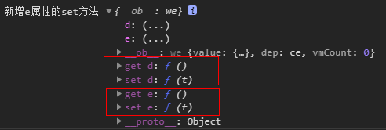


#### 4、Vue.delete 对象删除属性
删除对象的属性。如果对象是响应式的，确保删除能触发更新视图。这个方法主要用于避开 Vue 不能检测到属性被删除的限制。

为什么要用delete？
> 因为ES6之前，js没有提供方法来侦测一个属性被删除，如果我们通过delete删除一个属性，vue是检测不到，因此不会触发数据响应式。

```html
<div class="app">
        <div>
            名字: {{ user.name }} 年纪: {{ user.age }}
            <button @click="addUserAgeField">删除一个年纪字段</button>
        </div>
    </div>
```
```js
const app = new Vue({
        el: ".app",
        data: {
            user: {
                name: "test",
                age: 10
            }
        },
        mounted() { },
        methods: {
            addUserAgeField() {
                // delete this.user.age; // js方法 这样是不起作用, 不会触发数据响应式更新
                this.$delete(this.user, 'age') // vue方法 响应式起作用
            }
        }
    });
```

#### 5、Vue.directive 自定义vue指令
vue提供了很多指令，比如：v-model， v-on， v-show等。而且还提供了自定义directive属性来自定义指令。
+ 本质：vue.directive是一种特殊的html元素属性

提供两种注册方法：
+ 全局注册
+ 局部注册

#### 为什么要用VueDirective
我们在vue中也是可以操作dom，为啥要用vue的directive来封装dom操作。
+ 因为vue已经实现了MVVM的架构，实现了view和viewModel分离，我们必须封装dom操作，vue是数据驱动的，属于vieModel层，不应该出现view层上的dom操作。
+ vue的directive是在dom元素创建，销毁绑定的，vue的directive能让我们更优雅的进行dom操作。


#### 全局注册
在Vue.directive中定义组件的名字和相关指令操作
```js
Vue.directive('my-directive', {
    // 一些option，提供hook function定义具体操作，比如inserted，bind等
    bind: function() {
        
    },
    inserted: function(el) {
    //  指令插入元素后的操作
    },
    update: function() {
      
    },
    componentUpdates: function() {
      
    },
    unbild: function() {
      
    }
})
```
我们来实现一个简单的指令：实现页面加载时，input元素获取焦点。
```js
Vue.directive('focus', {
    // 被绑定的元素插入到DOM中
    inserted: function(el) {
      // 聚焦元素
      el.focus()
    }
})
```
我们再来实现一个简单的指令：用户滚动到页面底部请求更多数据。
 1、将dom操作封装到指定的option中
 ```js
let scrollCallback = function(callback) {
  if(document.body.scrollHeight < 1000) {
      return ;
  }
  if(document.body.scrollHeight - window.scrollY - 100 <= document.body.clientHeight){
      callback();
  }
}
let callBackWarpped;
export default {
    bind: function(el, binding, vnode) {
      callBackWarpped = scrollCallback.bind({}, binding.value);
      window.addEventListener("scroll", callBackWarpped, true)
    },
    unbind: function() {
      window.removeEventListener("scroll", callBackWarpped, true)
    }
}
```
首先需要监听页面的滚动，如果触发了scroll事件就要执行回调函数，由于解除绑定的时候也要将监听事件从window上移除，所以必须给回调函数取一个名字，
比如例子的scrollCallback，在unbind函数中将监听移除，因此scrollCallback的具体定义在对象外执行。

并且回调函数应该在页面滑动到底端才执行，也就是说不是马上执行binding.value，如何实现bind.value作为函数的参数传进scrollCallback，先判断，满足条件的时候调用

 2、导入directive的option，并且注册vue指令
 在入口文件main.js中
 ```js
/* scroll全局置顶scroll */
import scrollDirective from '../src/utils/scroll';
Vue.directive('scroll', scrollDirective)
```

3、在相应的dom上加上指令
```html
<ul v-scroll = "onScroll"></ul>
```


#### 6、Vue.filter 自定义过滤器
过滤器可以用在两个地方：双花括号插值和 v-bind 表达式。
```html
<!-- 在双花括号中 -->
{{ message | capitalize }}

<!-- 在 `v-bind` 中 -->
<div v-bind:id="rawId | formatId"></div>
```
有两种定义方式：
+ 组件选项中通过filters定义本地的过滤器
+ Vue.filter定义全局的过滤器

**1、局部过滤**
```js
filters: {
  capitalize: function (value) {
    if (!value) return ''
    value = value.toString()
    return value.charAt(0).toUpperCase() + value.slice(1)
  }
}
```


**2、全局过滤**
```js
// 首字母大写的过滤器
Vue.filter('capitalize', function (value) {
        if (!value) return ''
        value = value.toString()
        return value.charAt(0).toUpperCase() + value.slice(1)
})
```

**3、过滤器串联**
```js
{{ message | filterA | filterB }}
```
filterA 被定义为接收单个参数的过滤器函数，表达式 message 的值将作为参数传入到函数中。然后继续调用同样被定义为接收单个参数的过滤器函数 filterB，将 filterA 的结果传递到 filterB 中。

**4、接收多个参数**
```js
{{ message | filterA('arg1', arg2) }}
```
注意：filterA 被定义为接收三个参数的过滤器函数。其中 message 的值作为第一个参数，普通字符串 'arg1' 作为第二个参数，表达式 arg2 的值作为第三个参数。

#### 7、Vue.component 注册或者获取全局组件
官方定义：注册或获取全局组件。注册还会自动使用给定的id设置组件的名称。

```js
// 注册组件，传入一个扩展过的构造器
Vue.component('my-component', Vue.extend({ /* content */ }));

// 注册组件，传入一个选项对象（自动调用Vue.extend）
Vue.component('my-component', { /* content */})

// 获取注册的组件（始终返回构造器）
var MyComponent = Vue.component('my-component')
```
写一个组件实例：
```js
// 定义一个名为 button-counter 的新组件
Vue.component('button-counter', {
  data: function () {
    return {
      count: 0
    }
  },
  template: '<button v-on:click="count++">You clicked me {{ count }} times.</button>'
})
```
组件是可复用的vue实例，且带有一个名字，我们可以通过创建vue跟实例，把这个组件作为自定义元素来使用。
```html
<div id="components-demo">
  <button-counter></button-counter>
</div>
```
```js
new Vue({
    el: '#components-demo'
})
```
因为**组件是可复用的Vue实例**，所以组件与new Vue接收相同的选项，例如：
data，computed，watch，methods以及生命周期钩子等。区别**el这样的跟市里特有的选项**。

总的来说：
+ 通过Vue.extend生成的扩展实例构造器是一个**全局组件**，参数可以是扩展实例，也可以是一个对象（自动调用extend方法）。
+ 两个参数，一个组件名，一个extend构造器或者对象。
```js
var obj = {
    props: [],
    tempalte: '<div><p>{{}extendData}}</p></div>',
    data: function() {
      return {
          extendData: 'Vue.component传入vue.extend注册的组件'
      }
    }
}

var bigObj = Vue.extend(obj);

// 2、注册组件方法1：传入Vue.extend扩展过的构造器
Vue.component('component-one', bigObj);

// 3、注册组件方法2：直接传入
Vue.component('component-two', obj);

// 3、挂载
new Vue({
    el: '#app'
})

// 获取注册的组件（始终返回构造器）
var oneComponent = Vue.component('component-one');
oneComponent === bigObj   //true，返回bigObj构造器
```


#### 8、Vue.use 安装vue插件
官方解释：安装vue插件。本质上是执行了install方法，install方法由开发者定义。
+ 如果插件是一个对象，必须使用install方法
+ 如果插件是一个函数，会被作为install方法
install方法调用，会将vue作为参数传入

install必须用在new Vue()之前被调用

install方法被同一个插件多次调用，插件只会安装一次。

vue插件应该暴露一个install方法，方法的第一个参数是vue构造器，第二个是可选的选项对象。
```js
const MyPlugin = {
    install: function(Vue, options){
         // 1. 添加全局方法或属性
          Vue.myGlobalMethod = function () {
            // 逻辑...
          }
          
            // 2. 添加全局资源
            Vue.directive('my-directive', {
              bind (el, binding, vnode, oldVnode) {
                // 逻辑...
              }
            })
            
             // 3. 注入组件选项
              Vue.mixin({
                created: function () {
                  // 逻辑...
                }
                ...
              })
            
              // 4. 添加实例方法
              Vue.prototype.$myMethod = function (methodOptions) {
                // 比如
                hide: () => {
                   // 逻辑...
                  }
              }
          
    }
}

export default { MyPlugin }
```
在new Vue之前使用
```js
import MyPlugin from 'MyPlugin';
Vue.use(MyPlugin)
```
在具体页面的使用实例方法：
```js
this.$myMethod.hide()
```

总结：
+ vue插件是一个对象
+ 插件对象必须有install字段
+ install字段是一个函数
+ 初始化插件对象需要使用Vue.use()

vue官方提供一些插件，比如vue-router，在检测vue是可访问全局变量时会自动调用Vue.use()
```js
// 用 Browserify 或 webpack 提供的 CommonJS 模块环境时
var Vue = require('vue')
var VueRouter = require('vue-router')

// 不要忘了调用此方法
Vue.use(VueRouter)
```


#### 9、Vue.mixin 全局注册实例，但是会影响后边每一个实例
官方介绍：全局注册一个混入，影响注册之后所有创建的每一个vue实例。
**注意**：插件开发可以混入，向组件注入自定义行为，不推荐在应用代码中使用。

值可以是一个混合对象数组，混合实例包括选项，将在extend将相同的选项合并mixin代码：
```js
  var mixin = {
    data: {mixinData:'我是mixin的data'},
    created: function(){
      console.log('这是mixin的created');
    },
    methods: {
      getSum: function(){
        console.log('这是mixin的getSum里面的方法');
      }
    }
  }

  var mixinTwo = {
    data: {mixinData:'我是mixinTwo的data'},
    created: function(){
      console.log('这是mixinTwo的created');
    },
    methods: {
      getSum: function(){
        console.log('这是mixinTwo的getSum里面的方法');
      }
    }
  } 

  var vm = new Vue({
    el: '#app',
    data: {mixinData:'我是vue实例的data'},
    created: function(){
      console.log('这是vue实例的created');
    },
    methods: {
      getSum: function(){
        console.log('这是vue实例里面getSum的方法');
      }
    },
    mixins: [mixin,mixinTwo]
  })
  
// 打印结果为:
// 这是mixin的created
// 这是mixinTwo的created
// 这是vue实例的created
// 这是vue实例里面getSum的方法
```
总结：
+ mixins执行顺序mixins > mixinTwo > created（实例的）。
+ 选项中的data，methods，后面的执行会覆盖前面的，而生命周期钩子都会执行。


#### 10、Vue.compile 将模板转换为一个render函数
官方解释：在render函数中编译模板字符串

我的理解：将模板转换为render函数。

vue大多数情况下，使用模板来创建你的html，然而在一些场景中，可以使用渲染函数，他比模板更接近编译器。

##### 例子
比如我们要生成一些带描点的标题
```html
<div id="app">
  <header>
    <h1>I am a template!</h1>
  </header>
  <p v-if="message">
    {{ message }}
  </p>
  <p v-else>
    No message.
  </p>
</div>
```
方法会返回一个对象，对象中有 render 和 staticRenderFns 两个值。看一下生成的 render函数
```js
// render
(function() {
  with(this){
    return _c('div',{   //创建一个 div 元素
      attrs:{"id":"app"}  //div 添加属性 id
      },[
        _m(0),  //静态节点 header，此处对应 staticRenderFns 数组索引为 0 的 render 函数
        _v(" "), //空的文本节点
        (message) //三元表达式，判断 message 是否存在
         //如果存在，创建 p 元素，元素里面有文本，值为 toString(message)
        ?_c('p',[_v("\n    "+_s(message)+"\n  ")])
        //如果不存在，创建 p 元素，元素里面有文本，值为 No message. 
        :_c('p',[_v("\n    No message.\n  ")])
      ]
    )
  }
})
```
要看懂上面的 render函数，只需要了解 _c，_m，_v，_s 这几个函数的定义，其中 _c 是 createElement（创建元素），_m 是 renderStatic（渲染静态节点），_v 是 createTextVNode（创建文本dom），_s 是 toString （转换为字符串）

除了 render 函数，还有一个 staticRenderFns 数组，这个数组中的函数与 VDOM 中的 diff 算法优化相关，我们会在编译阶段给后面不会发生变化的 VNode 节点打上 static 为 true 的标签，那些被标记为静态节点的 VNode 就会单独生成 staticRenderFns 函数


解释：
**1、$mount函数**：主要是获取template，然后进入compileToFunctions函数

**2、compileToFunction函数**：主要是将template编译成render函数。首先读取缓存，没有缓存就调用compile
方法拿到render函数的字符串形式，在通过new Function的方式生成render函数。

```js
// 有缓存的话就直接在缓存里面拿
const key = options && options.delimiters
            ? String(options.delimiters) + template
            : template
if (cache[key]) {
    return cache[key]
}
const res = {}
const compiled = compile(template, options) // compile 后面会详细讲
res.render = makeFunction(compiled.render) //通过 new Function 的方式生成 render 函数并缓存
const l = compiled.staticRenderFns.length
res.staticRenderFns = new Array(l)
for (let i = 0; i < l; i++) {
    res.staticRenderFns[i] = makeFunction(compiled.staticRenderFns[i])
}
......
}
return (cache[key] = res) // 记录至缓存中
```

**3、compile函数**：将template编译成render函数的字符串形式。后面我们主要讲解render

完成render方法生成后，会进入到mount进行DOM更新。该方法核心逻辑如下：

```js
// 触发 beforeMount 生命周期钩子
callHook(vm, 'beforeMount')
// 重点：新建一个 Watcher 并赋值给 vm._watcher
vm._watcher = new Watcher(vm, function updateComponent () {
  vm._update(vm._render(), hydrating)
}, noop)
hydrating = false
// manually mounted instance, call mounted on self
// mounted is called for render-created child components in its inserted hook
if (vm.$vnode == null) {
  vm._isMounted = true
  callHook(vm, 'mounted')
}
return vm
```
首先会new一个watcher对象（主要是将模板与数据建立联系），在watcher对象创建后，
会运行传入的方法 vm._update(vm._render(), hydrating) 。
其中的vm._render()主要作用就是运行前面compiler生成的render方法，并返回一个vNode对象。
vm.update() 则会对比新的 vdom 和当前 vdom，并把差异的部分渲染到真正的 DOM 树上。
（watcher背后的实现原理：vue2.0的响应式原理）

上面提到的compile就是将template编译成render函数的字符串形式。核心代码如下：
```js
export function compile (
  template: string,
  options: CompilerOptions
): CompiledResult {
  const AST = parse(template.trim(), options) //1. parse
  optimize(AST, options)  //2.optimize
  const code = generate(AST, options) //3.generate
  return {
    AST,
    render: code.render,
    staticRenderFns: code.staticRenderFns
  }
}
```

compile这个函数主要有三个步骤组成：parse，optimize 和 generate，
分别输出一个包含 AST，staticRenderFns 的对象和 render函数 的字符串。

+ parse函数：主要功能是**将template字符串解析成AST（抽象语法树）**。
前面定义的ASTElement的数据结构，parse函数就是将template里的结构（指令，属性，标签）
转换为AST形式存进ASTElement中，最后解析生成AST。

+ optimize函数（src/compiler/optomizer.js）:主要功能是**标记静态节点**。
后面patch过程中对比新旧VNode树形结构做优化。被标记为static的节点在后面的diff算法中会被直接忽略，不做详细比较。

+ generate函数（src/compiler/codegen/index.js）:主要功能**根据AST结构拼接生成render函数的字符串**。
```js
const code = AST ? genElement(AST) : '_c("div")' 
staticRenderFns = prevStaticRenderFns
onceCount = prevOnceCount
return {
    render: `with(this){return ${code}}`, //最外层包一个 with(this) 之后返回
    staticRenderFns: currentStaticRenderFns
}
```
其中genElement函数（src/compiler/codgen/index.js）是根据AST的属性调用不同的方法生成字符串返回。

**以上**:就是compile函数中三个核心步骤介绍，compile之后我们得到render函数的字符串形式，
后面通过new Function得到真正的渲染函数。数据发生变化后，会执行watcher中的_update函数（src/core/instance/lifecycle.js），
_update函数会执行这个渲染函数，输出一个新的VNode树形结构的数据。然后调用patch函数，拿到这个新的
VNode与旧的VNode进行对比，只有反生了变化的节点才会被更新到新的真实DOM树上。


**4、patch函数**：就是新旧VNode对比的diff函数，主要是为了优化dom，通过算法使操作dom的行为降低到最低，
diff算法来源于snabbdom，是VDOM思想的核心。snabbdom的算法是为了DOM操作跨级增删节点较少的这一目标进行优化，
它只会在同层级进行，不会跨层级比较。


**总结**：
+ compile函数主要是将template转换为AST，优化AST，再将AST转换为render函数的字符串形式。
+ 再通过new Function得到真正的render函数，render函数与数据通过Watcher产生关联。
+ 在数据反生变化的时候调用patch函数，执行render函数，生成新的VNode，与旧的VNode进行diff，最终更新DOM树。


### 22.2 vue的生命周期理解
+ 版本：2.6.1

如果有人说：谈谈你对vue的生命周期的理解？
> 如果你说：beforCreate，created，beforeMount，mounted，beforeUpdate，updated，beforeDestroy，destroyed，
这8个生命周期的钩子函数。创建->挂载->更新->摧毁。

我觉的这样的回答面试初级前端还是可以的。如果这几个钩子不深入阐述，总觉得没有说到理解的层面。

正常先官网的图：

这个图把一些基本生命周期，大致了解。

现在如何说出生命周期的亮点：

#### 1、init初始化

+ 首先，我们需要创建一个实例，也就是new Vue()的对象的过程中，首先执行init（init是vue组件中默认去执行的）
+ 在init过程中，首先生命周期（init lifeCycle）和初始化事件（init Events），模板变量初始化（initRender）
+ 执行beforeCreate方法
+ 父组件的依赖初始化（initInjections）
+ 初始化数据（initState）
+ 子组件的依赖初始化（initProvide）
+ 执行created方法

> 不要在beforeCreate中去修改data，因为数据还没有初始化，所以最早也要在created中修改data。

生命周期源码（/src/core/instance/init.js）[初始化init](https://github.com/vuejs/vue/blob/dev/src/core/instance/init.js#L51)
```js
    // expose real self
    vm._self = vm
    initLifecycle(vm)    // vm的生命周期相关变量初始化
    initEvents(vm)       // vm的事件监听初始化
    initRender(vm)       // 模板解析变量初始化
    callHook(vm, 'beforeCreate')
    initInjections(vm)   // resolve injections before data/props
    initState(vm)        // vm的prop/data/computed/method/watch状态都在初始化
    initProvide(vm)      // resolve provide after data/props
    callHook(vm, 'created')
    ...
    if (vm.$options.el) {
       vm.$mount(vm.$options.el)   // 模板编译入口
    }
```
##### （1）initLifeCycle主要是初始化vm实例上的一些参数。
##### （2）initEvents是事件监听的初始化。
##### （3）initRender是模板解析变量初始化

>vue1.0使用[documentFragment](https://developer.mozilla.org/en-US/docs/Web/API/DocumentFragment)进行模板解析，
vue2.0使用的是[HTML Parser](https://github.com/vuejs/vue/blob/dev/src/compiler/parser/html-parser.js)将模板解析成都直接执行的render函数，模板预编译是服务端SSR前提。

##### （4）callHook(vm, 'beforeCreate')是执行钩子，是你在vue实例写的beforeCreate方法。

##### （5）initInjections(vm) 数据初始化之前，父组件初始化注入

##### （6）initState  vm的prop/data/computed/method/watch状态都在初始化

源码地址[initState](https://github.com/vuejs/vue/blob/dev/src/core/instance/state.js#L48)
```js
export function initState (vm: Component) {
  vm._watchers = []      // 新建一个订阅者列表
  const opts = vm.$options
  if (opts.props) initProps(vm, opts.props)   // 初始化props，与initData差不多
  if (opts.methods) initMethods(vm, opts.methods)   // 初始化Methods，就是作用域的重新绑定
  if (opts.data) {
    initData(vm)    // 初始化Data，响应式关键地方
  } else {
    observe(vm._data = {}, true /* asRootData */)    // 如果没有data，则观察一个空对象
  }
  if (opts.computed) initComputed(vm, opts.computed)   // 初始化computed，涉及到Watcher类以及依赖收集，computed本质就是特殊的Watcher
  if (opts.watch && opts.watch !== nativeWatch) {
    initWatch(vm, opts.watch)       // 初始化watch，这部分会涉及到Watcher类以及依赖收集
  }
}
```
这些初始化每一步都有注释，这些初始化都涉及到数据转换为Observer对象的过程，我们以initData来讲响应式

我们讲一下**initData**（/src/core/instance/state.js）这个方法（https://github.com/vuejs/vue/blob/dev/src/core/instance/state.js#L112）：
```js
function initData (vm: Component) {
  let data = vm.$options.data
  data = vm._data = typeof data === 'function'
    ? getData(data, vm)
    : data || {}
  if (!isPlainObject(data)) {  // 保证data必须是纯对象
    ...
  }
  // proxy data on instance
  const keys = Object.keys(data)
  const props = vm.$options.props
  const methods = vm.$options.methods
  let i = keys.length
  while (i--) {
    const key = keys[i]
    if (process.env.NODE_ENV !== 'production') {
      if (methods && hasOwn(methods, key)) {   // 是methods，则不代理
        // ...   // 如果methods里面的变量重了，会抛出warning
      }
    }
    if (props && hasOwn(props, key)) {    // 是props，则不代理
        // ...  // 如果props里面的变量重了，会抛出warning
    } else if (!isReserved(key)) {   // 否则将属性代理的vm上，这样就可以通过vm.xx访问到vm._data.xx
      proxy(vm, `_data`, key)    // proxy方法遍历data的key，把data上的属性代理到vm实例上
    }
  }
  // observe data
  observe(data, true /* asRootData */)    // 关键，来对data做监听
}
```
这个函数作用：
+ 保证data是纯对象
+ 判断与methods里的属性是否有重复，有就报错
+ 进行数据代理，方便数据读取，代理后我们可以使用vm.key，而不需要vm._data.key
+ 调用observe方法，这是响应式的关键


observe 方法会为传进来的 value 值创建一个 Observer 对象，
observe 方法主要就是判断 value 是否已经是 Observer 对象，
如果是直接返回；否则，若干个判断条件成立则将这个对象转化为 Observer 对象。


##### （7）initProvide  数据初始化之后，子组件初始化注入

##### （8）callHook(vm, 'Created')是执行钩子，是你在vue实例写的Created方法。


#### 2、created之后，经历beforeMount，经历mounted

+ 判断是否有el的option选项

created完成之后，会去判断实例（instance）是否包含el的option选项，
如果没有，就会调用vm.$mount(el)这个方法，然后执行下一步，
如果有直接执行下一步。

+ 判断是否有template选项

判断玩el的options选项之后，会去判断是否含有实例内部template选项
如果有，将实例内部template解析成一个render function（渲染函数），是template编译过程，结果是解析成render函数的字符串形式。
如果没有，将调用外部html。
内部template属性比外部的优先级高

render函数发生在beforeMount和mounted之间，beforeMount的时候，$el还只是我们html里面写的节点，
然后mounted的时候，他就把渲染出来的内容挂载到DOM节点上，中间过程其实是执行render function（渲染函数）的内容。

我们在写.vue开发中，写template模板，经过vue-loader处理之后，变成render function（渲染函数），
最终放到vue-loader解析过的文件里。为啥要这样做，因为解析template变成render function过程，
非常耗时，vue-loader帮我们提前做了，这样页面执行vue代码，效率会变得更好。

执行完render function（渲染函数）执行完毕，，就会走到mounted这里，mounted挂载完毕，这个实例算走完流程了。

**疑问**：
+ 1、为什么el属性判断在判断template之前？因为el属性是一个选择器，vue实例需要用这个选择器el去template中寻找对应的。
+ 2、vue实例中有一种render选项
+ 3、渲染优先级：render函数 > template属性 > 外部html
+ 4、vue的编译过程：将template编译成render函数过程
+ beforeMount到mounted过程：vue实例的$el去代替渲染函数中html内的el属性

#### 3、beforeUpdate和updated
外部触发比如：数据变化，会调用beforeUpdate，经过Virtual DOM，最后Updated更新完毕。

这个更新过程：数据变化-->导致虚拟DOM改变-->调用这个两个钩子改变视图

> 这个数据只有和模板中数据绑定了才会发生更新

**响应式原理**
关键：Object.defineProperty。一个普通的js对象传给vue实例的data，
vue将遍历此对象的所有属性，并且使用Object.defineProperty把这些属性全部
转换为getter/setter。Object.defineProperty是ES5支持，且无法shim，
这就是为啥vue不支持IE8以及更低版本浏览器原因。

+ Object.defineProperty与angular的脏检查不一样的实现方式。

重点提及的是 descriptor 中 get 和 set 方法：
```js
var obj = {};
var a;
Object.defineProperty(obj, 'a', {
  get: function() {
    console.log('get val');　
    return a;
  },
  set: function(newVal) {
    console.log('set val:' + newVal);
    a = newVal;
  }
});
obj.a;     // get val 
obj.a = 'saucxs'    //set val
```
示例代码中 Object.defineProperty 把 obj 的 a 属性转化为 getter 和 setter，
可以实现 obj.a 的数据监控。这个转化是 Vue.js 响应式的基石。

vue的响应式原理设计三个重要对象：Observer，Watcher，Dep。
+ Observer对象：vue中的数据对象在初始化过程中转换为Observer对象。
+ Watcher对象：将模板和Observer对象结合在一起纽带，Watcher是订阅者中的订阅者。
+ Dep对象：Watcher对象和Observer对象之间纽带，每一个Observer都有一个Dep实例，用来存储订阅者Watcher。

当属性变化会执行主题对象Observer的dep.notify方法，
这个方法会遍历订阅者Watcher列表向其发送消息，
Watcher会执行run方法去更新视图。

依赖关系图：

模板编译过程中的指令和数据绑定都会生成Watcher实例，实例中的watch属性也会生成Watcher实例。

**总结响应式原理**

+ 在生命周期的initState方法中将data，prop，method，computed，watch中的数据劫持，
通过observe方法与Object.defineProperty方法将相关对象转为换Observer对象。
+ 然后在initRender方法中解析模板，通过Watcher对象，Dep对象与观察者模式将模板中的
指令与对象的数据建立依赖关系，使用全局对象Dep.target实现依赖收集。
+ 当数据变化时，触发Object.defineProperty方法中的dep.notify方法，
遍历该数据依赖列表，执行器update方法通知Watcher进行视图更新。
+ vue是无法检测到对象属性的添加和删除，但是可以使用全局Vue.set方法（或vm.$set实例方法）。
+ vue无法检测利用索引设置数组，但是可以使用全局Vue.set方法（或vm.$set实例方法）。
+ 无法检测直接修改数组长度，但是可以使用splice


**亮点回答：**
+ Vue还提供了了renderError方法，只有在开发的时候被调用，打包上线不会被调用，rendereError帮助我们调试render中的一些错误。
+ beforecreate：全局加一个loading事件，
+ created：结束loading，初始化数据获取


#### 3、beforeDestroy和destroyed
当组件被销毁的时候，会调用beforeDestroy和destroyed。


#### 4、不常用的生命钩子
+ activated：当组件激活的时候调用
+ deactivated：组件停用的时候调用
+ errorCaptured：vue2.5之后出现，捕获子孙组件错误被调用


