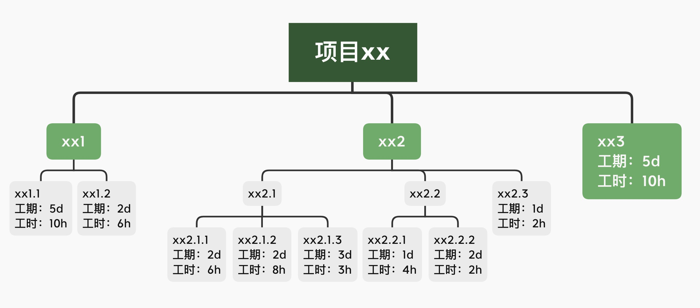
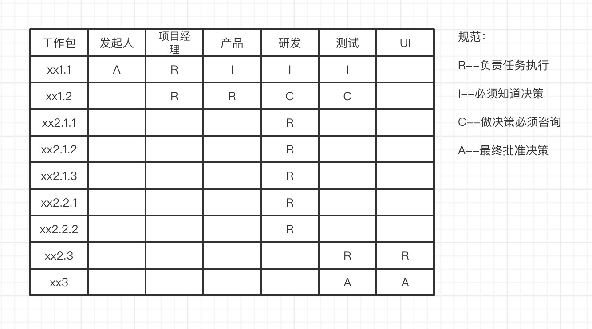

# 项目管理培训有感

> 最近有个项目管理培训：实现商业价值的项目管理。学习之后，受益匪浅，但是觉得实际中不该照搬使用，而是灵活使用，按需使用，不能为了使用而使用。

## 项目经理应该是一个什么样的人？
+ 时间管理
+ 进度管理
+ 善于沟通
+ 工作紧迫感
+ 善于捕捉问题
+ 思路清晰
+ 用数据说话
+ 果断
+ 背锅
+ 判断力
+ 态度
...

## 一、基础概念
### 1、什么是项目？
项目是一个**临时性**的工作，创造的是独特的**产品，服务或者结果**。

### 2、什么是成功项目
让各个利益相关方满意

有个问题：如何让利益相关方**都**满意？

### 3、平衡限制三角形
三角形的特点：稳定，牢固。

顺带我们来证明一下：三角形的内角和为啥是180度？

最初的平衡限制三角形是等边三角形。分别是：
+ 时间
+ 成本
+ 质量

+ 如果时间被压缩，时间的那条边变短，要不就成本增加，要不质量变低，或者两样都在变化。
+ 无论是那一条边变化，都会影响到附近的2条边产生变化。

### 4、项目发起人和项目经理
+ 项目发起人：有足够的权利对项目的结果负全部责任，一般是资源，金钱的提供者。
+ 项目经理：负责项目交付和项目质量的人，一般是三头六臂的执行者。

好的项目经理具有特点：
+ 责任：要有担当
+ 尊重：要聆听
+ 公平：要公平对待
+ 诚实：实事求是

## 二、项目定义
### 1、工作陈述SOW
SOW的目的：对齐各个利益相关方的信息。

工作陈述SOW至少需要包含5个方面的内容：

+ 项目目的
+ 项目目标
+ 范围称述
+ 交付成果
+ 成本和进度估算

### 2、项目章程
项目章程的目的：给项目经理充分授权。

主要包含以下内容：
+ 项目名称
+ 发起人姓名
+ 目的
+ 项目经理名字
+ 利益相关方确认签字

## 三、项目计划
### 1、工作拆解WBS
wbs工作包是实际的执行任务。

工作拆解WBS将总的项目任务按照层级**拆解**交给项目组执行，主要就是拆成一个个的工作包，取保工作包找全，找齐工作包，所有工作包做完了就代表项目完成，变成可交付的状态。

重点：
+ wbs对项目范围的完成描述
+ wbs的工作包对每一项任务命名
+ wbs工作包都有相应的标准

### 2、网络图
网络图也叫**定义任务关系**。

**任务**主要找的是叶子节点，完成了叶子节点也就完成了项目。

首先我们需要梳理**前导关系表**：

| 工作包 ｜ 前导 ｜
| ------- ｜ ------- ｜
| xx2.1.1 | xx1.2 |
| xx2.1.2 | xx1.2 |
| xx2.1.3 | xx1.2 |
| xx2.3 | xx2.1.2,xx2.1.3 |
| xx3 | xx2.3,xx2.2.2 |

**注意**：只需要找当前的工作包的前导，不需要找工作包的前导的前导。

根据这个前导关系表，画网络图：

### 3、工作包估算

任务（**叶子节点的工作包**）的都需要进行评估工时和工期。

+ 工时：代表的是成本
+ 工期：代表的是进度

### 4、关键路径
关键路径是累计工期最长的路径。

我们根据我们对工作包估算，得到网络图中的工作包**工期**。

如下图所示：

关键路径是 xx1.2 =》 xx2.1.3 =》 xx2.3 =》xx3

工期：11d

+ 关键路径是累计工期最长的路径
+ 关键路径有可能不止1条
+ 关键路径不是一成不变
+ 压缩项目总工期，优先考虑压缩关键路径的工期，常见的两种方式：
  - 赶工。增加成本，风险：成本超支
  - 快速跟进。风险：返工
+ 压缩关键路径，是否产生新的关键路径

## 四、沟通
### 1、确定项目利益相关方
在一个项目中有很多的利益相关方，但是要想让所有的利益相关方都满意，还是很难的，总会在平衡三角中有舍有得。所以我们需要在利益相关方中找到主要的利益相关方，从而尽量达到主要利益相关方的满意。

### 2、力/度 方格
那什么是 「力/度」方格？就是利益相关方的分析。

就是通过四个方格，找出主要的项目利益相关方。

找的主要是令其满意，重点关注的利益相关方

### 3、RACI
责任矩阵RACI非常适合跨部门合作。

### 4、沟通列表
主动沟通和充分沟通

主动沟通：

+ 谁需要信息？
+ 需要什么信息？
+ 什么时候需要信息？
+ 等等

有效沟通：

+ 了解项目中存在的沟通障碍
+ 使用多种沟通方式
+ 建立项目例会
+ 沟通预期
+ 实事求是，告知每一个人
+ 等等

## 五、复盘总结
每一个项目的管理对我们而言都是非常宝贵。为了能有效管理项目，在项目结束后需要做项目复盘，分析不同项目的各个环节，总结项目的成功和失败之处、产品性能、项目质量等，为以后的项目提供参考。

## 后记
> 实际中的项目远比这个复杂，但是万变不离其宗，灵活运用这些项目管理的工具，不生搬硬套，多做项目，积累应对各种情况的经验，项目才会越做越好。

哈哈，发一张培训结束之后的一张证书

#### 更多阅读
+ [【字节急招】多地-前端研发工程师-Data](https://mp.weixin.qq.com/s/1yhT4aon2qXXlcXSK-rbuA)

+ [【字节急招】南京-前端开发工程师—数据可视化](https://mp.weixin.qq.com/s/DY1b53FvcIM5CzbAFpj_Fw)

+ [AB实验基础-专有名词](https://mp.weixin.qq.com/s/TXzuf_98yMojVAFlDv0CCQ)

+ [AB实验基础-AB是什么？AB的价值？为什么使用AB实验？](https://mp.weixin.qq.com/s/UcwpNqRQ3we10S9z5cO53g)

+ [【每日一题】(57题)数组扁平化的方法有哪些？](https://mp.weixin.qq.com/s/sXIJ6bQj97bZTaYHQgJTIw)

+ [【每日一题】(56题)介绍下深度优先遍历和广度优先遍历，如何实现？](https://mp.weixin.qq.com/s/KkqdB4mWlMgZMcHVhZVZXQ)

+ [2020「松宝写代码」个人年终总结：未来可期](https://mp.weixin.qq.com/s/_ay6KfcC5DMoZu9XqS2NHA)

## 谢谢支持

1、文章喜欢的话**可以「分享，点赞，在看」三连**哦。

2、作者昵称：saucxs，songEagle，松宝写代码。「松宝写代码」公众号作者，每日一题，实验室等。一个爱好折腾，致力于全栈，正在努力成长的字节跳动工程师，星辰大海，未来可期。**内推字节跳动各个部门各个岗位**。

3、关注「松宝写代码」，是获取开发知识体系构建，精选文章，项目实战，实验室，**每日一道面试题**，进阶学习，思考职业发展，涉及到JavaScript，Node，Vue，React，浏览器，http，算法，端相关，小程序，AB实验，数据分析等领域，希望可以帮助到你，我们一起成长～

> 点击「阅读原文」，跳转到字节内推

