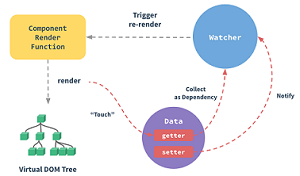

你好，我叫程新松，目前就职于东方财富南京研发中心，曾就职于苏宁数据云，百分点等公司。自己是一个喜欢折腾的工程师，致力于全栈开发。
目前技术栈：vue+vuex+ssr+jq+koa+thinkjs+nginx+redis+websocket+mysql+小程序等。

在东方财富南京研发中心，主要负责公司内部系统的前端研发，东方贷外围系统开发，前端框架技术选型，项目结构搭建，
与后端探讨技术实现方案，协助其他人员解决问题，攻坚项目中技术难点。
**逐渐理解**web应用的结构和数据传递流程，形成web开发性能优化和可维护组件高复用的意识。
以及根据模块功能特性对前端页面分块管理和优化。

在苏宁数据云，主要负责苏宁云商城系统前端开发，理解业务并采用合适的前端技术，根据设计图进行重构和页面美化，支持业务快速迭代，
优化渲染和制程node中间层开发。
**学会**Node框架thinkjs的使用，对客户端请求的分发，转发，过滤以及数据包装，可以最大化实现并发请求，

在百分点，主要负责根据设计图实现UI界面，分类整理系统UI组件并封装高复用UI组件，根据数据接口实现界面状态管理。
**学习**并掌握了UI组件的封装复用技巧，样式重构理念，形成编写可维护性代码的意识。

大学期间，以第一作者发表一篇国际会议5GWN论文，获得最佳论文奖。并且获得发明专利一项，已授权。

-- **自我介绍到这儿** --

##### 东方财富工作职责和内容
主要内容：南京团队基础技术支持，包含构建流程，新技术探索等，接入Vuex实现前端状态管理，全局路由控制，
约定前端开发规范，配置小组内静态资源服务器简单实现均衡负载，缓存策略，图片处理等。

逐渐理解web应用的结构和数据传递流程，形成web开发性能优化和可维护组件高复用的意识。
以及根据模块功能特性对前端页面分块管理和优化。

+ 协助人员解决问题？
小贷组在南京只有2个前端，我一个和另外一个是后端女生转的前端，她不会的我都会取协助解决，并且约定前端开发规范。

+ 攻坚项目中技术难点？
1、比如我们做了一个看板系统，在看板的详情页中，需要在不同泳道，不同列中都是可以随意拖拽的，
后端的数据接口：需要调用一个接口，把所有数据都一把给我，前端进行遍历和判断返回到页面。

拖拽是难点：
+ 1、涉及到vue的异步更新DOM问题；
+ 2、多个小组人员同时操作同一个卡片的问题；
+ 3、当泳道和列很多的时候，接口容易出现超时问题

最终经过技术讨论和分析：
+ vue的异步更新DOM问题使用Vue.nextTick()解决
+ 多个小组同时操作同一个卡片的问题，使用websocket实现数据双向通信，最后一个人释放卡片的位置为卡片最终位置。
+ 后端接口改造，一个接口变三个接口，查泳道，查列，查泳道和列下对应的卡片。

再一次优化
+ 之前是websocket告诉我数据是否变化，我请求接口。后来我们采用websocket直接返回变化的数据，减少http请求。

##### 苏宁数据云工作职责和内容

**遇到比较难的项目：**
在苏宁的时候做过一个比较难的项目。数据云要做一个品加商城，项目难点：TOC的场景，购物车和选商品环节操作业务复杂，浏览器兼容到IE10，时间紧。
最终前端的方案：
+ 考虑到TOC场景，以及浏览器兼容性，使用thinkjs3+jq+artTemplate做基础页面，
+ 考虑到购物车和选商品参数业务复杂，使用vue嵌入，双向数据绑定页面更流畅，
+ 考虑到高并发，将node的框架thinkjs作为中间层，路由转发，拦截，数据组装发给中台系统。

我收获到，根据不同的业务场景，node作为中间层是有必要的，IO操作是线程池做，计算任务是主线程做。
node优势就是把I/O操作放到主线程外，这样主线程才能腾出手处理更多的请求。node线程池基于libuv这个库，这个库提供跨平台，线程池，事件池，异步I/O等。

最终团队加班，项目快速实现了0-1，按时完成上线，最后拿了个季度优。

##### 汽车发动机预警系统中的神经网络问题？
+ 使用传感器对汽车发动机的运行状态的实时监控，从而预测发动机未来的运行状态。
+ 工具是matlab和spss，建立SOM自组织神经网络，概率神经网络PNN，Elman神经网络。
+ 拥有发明专利一项，专利已经授权，获得2017年5GWN国际会议论文最佳论文奖。

SOM自组织神经网络：主要是用来降维和分类的，提出没有实际意义的项，将30维度降到8项.

Elman神经网络：主要是用来做元数据的预测，一部分用来训练，一部分用来检验。

PNN概率神经网络：主要用来做映射，将不同种类的故障映射到10多项的维度上，形成一个自主判断的系统，判断不同的实例的发动机状态。

+ 项目难点及解决：
  + 数据的处理：数据的维度有40多项，数据量有10万左右。数据是参加比赛的时候拿到的脱敏数据，使用的是matlab和spss处理数据。
  + 一次性取数据量过大容易崩溃，分批次去取和计算。
  + 有时候会出现过渡拟合和过渡分散，不断的调试不同的参数。

##### 一、你觉得你做过的项目或者优化最有价值的是哪个？为什么？对业务帮助？优势什么？
+ 最有价值：watermark-dom水印插件，其实可以设置成隐水印。因为这个使用最广，而且苏宁的一些内部管理系统也是使用这个，有一种成就感。
+ 业务上帮助：主要是避免有些人拍照或者截图将一些管理系统敏感数据发到社交，这样谁泄露谁负责，而且可以设置成隐水印。
对比现有的方案：
+ qq音乐前端团队：他们使用canvas或者svg生成base64图片。
+ 阿里月饼知道隐水印，轻松还原截图：他们利用的是对RGB中最低位进行操作，
+ 优势：（1）简单易操作，配置容易，支持本地引用和npm引入。（2）避免截屏，拍照，都可以追回。（3）使用setInterval可以实现避免删除dom元素。

##### 二、你做的东西可以复用与其他团队吗？
因为这个watermark-dom使用起来很简单，支持本地引用，支持UMD，支持commonjs，支持es6，支持amd。

##### 三、需要监听那种频繁发生的事件，你有那些优化么？
+ 最基本方案：加定时器，延迟执行，实质是防抖，**任务触发的间隔超过指定间隔才执行**。但是现在也有一种防抖是立即执行，后续的触发的执行被清除
+ 节流，只允许一个函数在500ms内执行一次，**指定时间间隔，间隔内只会执行一次任务**。比如图片懒加载


##### 四、埋点的实现思路？
根据不同的需求采用不同的埋点方案。
+ 页面访问量：PV（人次），UV（人数）
+ 功能点击量

页面访问量，影响因素：内容，入口，页面位置，主页面深度。采集页面加载from，to获取用户的访问路径。

比如vue的单页面的时候，可以使用Router.beforeEach方法，也可以使用beforeRouterEnter和beforeRouterLeave。

如果是vue的多页面，封装公用的逻辑

如果是ssr应用，直接统计调用模板的次数就知道PV（人次）


##### 五、文件上传断点，续传？
上传大文件的时候，必须具备文件断点续传，不然用户体验会很差。

+ 传统的方法是使用formData文件整块的提交，服务端取到文件在转移，重命名。因此无法实时保存文件已上传的部分。

原因是：http协议下，浏览器无法与服务端长连接，不能以文件流的形式来提交。

方案：
+ 选择一个文件后，获取该文件在服务器上的大小，
+ 根据已上传文件大小切割文件，不断向服务器提交文件片，服务器不断追加文件内容。
+ 当上传文件大小达到文件总大小，上传结束。

+ 首先：文件分隔中，h5新增Blob数据类型，提供了分割数据方法slice，可以截取二进制文件的一部分。
+ 文件片保存和追加：后端使用node
+ 服务器端实时保存已上传文件大小，以便下次上传前准确切割


##### 六、vue的生命周期
**简单的说：**
- 如果你说：beforCreate，created，beforeMount，mounted，beforeUpdate，updated，beforeDestroy，destroyed，
这8个生命周期的钩子函数。创建->挂载->更新->摧毁。

###### 1、init各种初始化
首先，我们需要创建一个实例，也就是new Vue()的对象的过程中，首先执行init（init是vue组件中默认去执行的）

+ （1）首先生命周期（init lifeCycle）：初始化vm实例上的一些参数
+ （2）事件监听的初始化（init Events）
+ （3）模板解析变量的初始化（initRender）
+ （4）执行beforeCreate方法
+ （5）父组件初始化注入（initInjections）：数据初始化之前
+ （6）初始化数据（initState） vm上的prop/data/computed/method/watch状态在初始化。初始化initData方法
+ （7）子组件初始化注入（initProvide）：数据初始化之后
+ （8）执行created方法

- 不要在beforeCreate中去修改data，因为数据还没有初始化，所以最早也要在created中修改data。

- vue1.0使用documentFragment进行模板解析， vue2.0使用的是HTML Parser将模板解析成都直接执行的render函数，模板预编译是服务端SSR前提。

###### 2、beforeMount和mounted

+ （1）判断是否有el的option选项

created完成之后，会去判断实例（instance）是否包含el的option选项，
如果没有，就会调用**vm.$mount(el)**这个方法挂载模板，然后执行下一步，
如果有，直接执行下一步。

+ （2）判断是否有template选项

判断玩el的options选项之后，会去判断是否含有实例内部template选项
如果有，将实例内部template解析成一个render function（渲染函数），是template编译过程，结果是解析成render函数的字符串形式。
如果没有，将调用外部html。

+ （3）beforeMount钩子函数：将已经完成的html挂载到对应的虚拟DOM上，$el还只是我们html里面写的节点。

+ （4）虚拟DOM替换真实DOM：也就是将编译好的html替换el属性指向的DOM。编译过程是render function（渲染函数）

+ （5）mounted钩子函数：完成真实DOM的挂载，做一些异步请求数据，mounted在实例中只执行一次。

我们在写.vue开发中，写template模板，经过vue-loader处理之后，变成render function（渲染函数），
最终放到vue-loader解析过的文件里。为啥要这样做，因为解析template变成render function过程，
非常耗时，vue-loader帮我们提前做了，这样页面执行vue代码，效率会变得更好。

mounted挂载完毕，这个实例算走完流程了。

**疑问**：
+ 1、为什么el属性判断在判断template之前？因为el属性是一个选择器，vue实例需要用这个选择器el去template中寻找对应的。
+ 2、vue实例中有一种render选项
+ 3、渲染优先级：render函数 > template属性 > 外部html
+ 4、vue的编译过程：将template编译成render函数过程
+ beforeMount到mounted过程：vue实例的$el去代替渲染函数中html内的el属性

###### 3、数据变化，更新DOM
这个更新过程：数据变化-->导致虚拟DOM改变-->调用这个两个钩子改变视图

+ （1）监听数据变化
+ （2）beforeUpdate钩子函数：数据更新之前
+ （3）渲染新的虚拟DOM，拿新的虚拟DOM与之前虚拟DOM比较，使用diff算法，然后更新视图
+ （4）updated钩子函数：更新视图之后

**关键**：Object.defineProperty。一个普通的js对象传给vue实例的data，
vue将遍历此对象的所有属性，并且使用Object.defineProperty把这些属性全部
转换为getter/setter。

**vue的响应式原理设计三个重要对象：Observer，Watcher，Dep。**
+ Observer对象：vue中的数据对象在初始化过程中转换为Observer对象。
+ Watcher对象：将模板和Observer对象结合在一起生成Watcher实例，Watcher是订阅者中的订阅者。
+ Dep对象：Watcher对象和Observer对象之间纽带，每一个Observer都有一个Dep实例，用来存储订阅者Watcher。

###### 4、实例销毁
+ （1）beforeDestroy钩子函数：实例销毁之前
+ （2）拆除数据监听，子组件，事件监听
+ （3）destroyed钩子函数：实例销毁完成后

###### 5、不常用的生命周期钩子
+ activated：当组件激活的时候调用
+ deactivated：组件停用的时候调用
+ errorCaptured：vue2.5之后出现，捕获子孙组件错误被调用


##### 七、vue的响应式设计
**总结响应式原理**



+ 在生命周期的initState方法中将data，prop，method，computed，watch中的数据劫持，
通过observe方法与Object.defineProperty方法将相关对象转为换Observer对象。
+ 然后在initRender方法中解析模板，通过Watcher对象，Dep对象与观察者模式将模板中的
指令与对象的数据建立依赖关系，使用全局对象Dep.target实现依赖收集。
+ 当数据变化时，setter被调用，触发Object.defineProperty方法中的dep.notify方法，
遍历该数据依赖列表，执行器update方法通知Watcher进行视图更新。
+ vue是无法检测到对象属性的添加和删除，但是可以使用全局Vue.set方法（或vm.$set实例方法）。
+ vue无法检测利用索引设置数组，但是可以使用全局Vue.set方法（或vm.$set实例方法）。
+ 无法检测直接修改数组长度，但是可以使用splice

##### 八、为啥vue3.0之后要用proxy？
肯定是vue2.x里的检测机制不全，因为Object.defineProperty最大局限是只能针对单例属性做监听，
vue2.x中对data属性做了遍历和递归，为每一个属性设置getter和setter。

而proxy可以理解成，在目标对象之前设置一层拦截，外界对该对象的访问，都必须通过这层拦截，所以提供了一种机制，对外界的访问进行过滤和改写。
也就是说，proxy监听的一个对象，这个对象的所有操作都会监听，这就可以实现代理所有的属性。

Object.defineProperty具体局限：
+ 对属性的添加，删除的检测
+ 对数组基于下标的修改，对.length修改检测
+ 对Map，Set，WeakMap，weakSet的支持

proxy的特性：
+ 默认为惰性检测：2.x中任何响应式数据都会被检测，3.x中，只有初始化可见部分所用到的数据会检测
+ 更精准的变动通知：2.x中Vue.set会导致依赖的watch都会执行一次，3.x中，依赖这个具体属性watch函数会被通知。
+ 不可变检测对象：阻止对他修改包括嵌套属性，类似于vuex状态树。

proxy设计模式：
+ 单一职责原则：面向对象设计中鼓励将不同职责分布到细粒度的对象中，proxy对原对象的基础上进行功能的衍生而不影响原对象，符合松耦合高内聚的设计理念。
+ 开发-封闭原则：代理可以随时从程序中去掉，而不用对其他代码进行修改。

proxy代理模式的使用场景：
+ 缓存代理
+ 验证代理
+ 实现私有属性

使用proxy监听
```js
  var data = {
        sum: 0
    }
    var proxy = new Proxy(data, {
        get(target, property) {
            return target[property]
        },
        set(target, property, value) {
            target[property] += value
        }
    })
```


##### 九、vuex的理解
vue的开发复杂的应用的时候，经常会遇到多个组件共享一个状态，或者多个组件更新同一个状态。
代码少的时候，可以使用组件之间的通信去维护修改数据。
随着系统的庞大，代码变得很难维护，父组件通过props传递多层嵌套数据由于层级过深显得很脆弱，业务交错复杂，难以搞懂交错负责关系的数据传递关系。

将数据层和组件层抽离出来，把数据层放到全局形成单一的Store，组件变得更薄，专门用来数据展示和操作。
所有数据变更都必须经过全局Store进行，从而形成单向数据流，使数据变化变得可预测。

vuex是专门为vue框架设计的，对vue的状态管理的库，借鉴redux的基本思想，将共享数据抽离到全局，以一个单例存放，
同时利用vue的响应式机制来进行高效的状态管理和更新。


分析上图：
vuex实现的是一个单向的数据流，全局拥有一个State对象存放数据，所有的修改Satte操作必须通过Mutation进行，
Mutation同时提供订阅者模式供外部插件调用获取State数据的更新。所有的异步接口需要走Action，常见于调用后端
接口异步获取更新数据。

**总的来说:**vuex运行依赖于vue内部数据双向绑定机制，需要new一个vue对象实现响应式机制。


##### 十、js面向对象的理解和感悟？
###### 1、什么是面向对象，面向对象的特点及解释？
+ 定义：万物皆对象，任何事物都有自己的特征（属性）和动作（方法），面向对象就是使用对象，使用对象开发封装属性和方法。
+ 特点（特性）：
（1）抽象性：用对象描述数据，抽象对象的核心属性和方法。
（2）封装性：用对象将数据和功能组合在一起
（3）继承性：自己没有的但是别人有，拿过来就是集成，集成是实现代码复用的一种手段。

###### 2、继承方式有哪些？
js的继承通常指的是原型链的继承，通过指定原型，可以通过原型链继承原型的属性和方法。

###### 2.1 原型链继承
原理：父类的实例作为子类的原型
```js
function Father() {
  this.colors = ['red','blue','green'];
}

function Son() {};
Son.prototype = new Father();

var s1 = new Son();
s1.colors.push('black');
console.log(s1.colors); // 'red,blue,green,black'

var s2 = new Son();
console.log(s2.colors);  // 'red,blue,green,black'
```
缺点：
+ 1、引用类型值的原型，被所有的实例共享
+ 2、子类创建实例，不能向超类构造函数传递参数

###### 2.2 构造函数继承（经典继承）
原理：不使用原型，在子类型的构造函数中调用超类构造函数。
```js
function Father() {
  this.colors = ['red','blue','green'];
};
function Son() {
  Father.call(this); //继承Father，向父类型传递参数
};
var s1 = new Son();
s1.colors.push('black');
console.log(s1.colors); //'red,blue,green,black'

var s2 = new Son();
console.log(s2.colors); //'red,blue,green'
```
缺点：
+ 1、方法都定义在构造函数中，函数不可复用。

###### 2.3 组合继承（最常用继承）
原理：原型链继承+构造函数继承，通过原型链实现原型的属性和方法继承，通过构造函数实现实例化对象属性的继承。
```js
function Father(name) {
  this.name = name;
  this.colors = ['red','blue','green'];
};
Father.prototype.sayName = function() {
  console.log(this.name);
};

function Son(name, age) {
  Father.call(this, name);  //继承实例属性，第一次调用Father()
  this.age = age;
};
Son.prototype = new Father();  //继承父类方法，第二次调用Father()
Son.prototype.sayAge = function() {
  console.log(this.age);
};

var s1 = new Son('saucxs',18);
s1.colors.push('black');
console.log(s1.colors); // 'red,blue,green,black'
s1.sayName();  // saucxs
s1.sayAge();  // 18

var s2 = new Son('gmw', 15);
console.log(s2.colors); // 'red,blue,green'
s2.sayName(); //gmw
s2.sayAge(); // 15
```
缺点：
+ 1、调用了两次父类构造函数
+ 2、父类的实例属性和方法在子类的实例中，鱼仔子类的原型中。

###### 2.4 原型式继承
原理：直接将对象赋值给构造函数的原型。
```js
    /*object方法将传入的对象执行一次浅复制，将F的原型指向传入的对象*/
function objcetSame(obj) {
  function F() {};
  F.prototype = obj;
  return new F();
}

var person = {
    name: 'saucxs',
    friends: ['gmw', 'cc', 'cxs']
};

var p1 = objcetSame(person)
p1.name = 'SAUCXS';
p1.friends.push('ROB');
console.log(p1)  
// name: "SAUCXS"
// __proto__:
//    friends: (4) ["gmw", "cc", "cxs", "ROB"]
//    name: "saucxs"

var p2 = objcetSame(person);
p2.name = 'LINDA';
p2.friends.push("HEIHEI");
console.log(p2)  
// name: "LINDA"
// __proto__:
//    friends: (5) ["gmw", "cc", "cxs", "ROB", "HEIHEI"]
//    name: "saucxs"

console.log(person)  
// friends: (5) ["gmw", "cc", "cxs", "ROB", "HEIHEI"]
// name: "saucxs"
```
ES5中有Object.create()方法，替代上面objcetSame方法。

缺点：
+ 1、引用类型值的原型，被所有的实例共享
+ 2、子类创建实例时，无法向父类构造函数传递参数

###### 2.5 寄生式继承
原理：原型式继承基础上，增强对象，返回构造函数。
```js
function creatwAnother(original) {
  var clone = Object.create(original);  // ES5的创建一个新对象
  clone.sayName = function(name) {     // 增强这个对象
    console.log(name)
  };
  return clone;
};

var person = {
    name: 'saucxs',
    friends: ['gmw', 'cc', 'cxs']
};

var p1 = creatwAnother(person);
p1.sayName(person.name);
```
缺点：
+ 1、引用类型值的原型，被所有的实例共享
+ 2、子类创建实例时，无法向父类构造函数传递参数

###### 2.6 寄生式组合继承
原理：构造函数继承传递阐述+寄生式继承
```js
function inheritPrototype(S1, F1) {
  var prototype = Object.create(F1.prototype);   // 创建对象
  prototype.constructor = S1;                    // 增强对象
  S1.prototype = prototype;                      // 指定对象
};

// 父类初始化实例属性和方法
function Father(name) {
  this.name = name;
  this.colors = ['red', 'blue', 'green'];
};
Father.prototype.sayName = function() {
  console.log(this.name);
};

// 借用构造函数床底增强子类实例属性
function Son(name, age){
    Father.call(this, name);
    this.age = age;
};

// 父类原型指向子类
inheritPrototype(Son, Father);

// 新增子类原型属性
Son.prototype.sayAge = function() {
  console.log(this.age);
};

var s1 = new Son('saucxs', 18);
s1.colors.push('black');
console.log(s1);   
// age: 18
// colors: (4) ["red", "blue", "green", "black"]
// name: "saucxs"
// __proto__: Father


var s2 = new Son('gmw', 15);
s2.colors.push('orange');
console.log(s2);

// age: 15
// colors: (4) ["red", "blue", "green", "orange"]
// name: "gmw"
// __proto__: Father
```

库的实现方式


###### 2.7 ES6的类式继承
```js
// 长方形类
class Rectangle {
    /*constructor*/
    constructor(height,width){
        this.height = height;
        this.width = width;
    }
    
    /*getter*/
    get area() {
        return this.calcArea();
    }
    
    /*method*/
    calcArea(){
        return this.height * this.width;
    }
}

const rec = new Rectangle(10, 20);
console.log(rec.area);   //200

// 继承
class Square extends Rectangle {
    constructor(length){
        super(length, length);
         // 如果子类中存在构造函数，则需要在使用“this”之前首先调用 super()。
         this.name = 'Square';
    }
    
     get area() {
        return this.height * this.width;
      }
}
const square = new Square(10);
console.log(square.area);   // 100
```

####### 总结
因为有了面向对象编程，代码更加整洁，易维护，实现了代码的复用，
这也是前端开发中需要设计的高内聚，低耦合的原则。


##### 十一、浏览器输入 url 到页面的展现，发生了哪些事情？
###### 主干流程：
+ （1）从浏览器接收url --> 开启网络请求线程（涉及到：浏览器机制，线程和进程关系等）
+ （2）开启网络请求线程 --> 发出一个完整的http请求（涉及到：DNS查询，TCP/IP请求。5层网络协议栈）
+ （3）服务器接收请求 --> 对应后台接收到请求（涉及到：均衡负载，安全拦截，后台内部处理）
+ （4）后台和前台交互（涉及到http头，响应码，报文结构，cookie等，cookie优化，编码解码如gzip压缩等）
+ （5）缓存问题：http缓存（涉及到http缓存头部，etag，expired，cache-control等）
+ （6）浏览器接收http数据包 --> 解析流程（涉及到：html词法分析，构建dom树，同时解析css生成css规则树，合成render树。然后布局layout，painting渲染，符合图层合成，GPU绘制，外链接处理，loaded等）
+ （7）css可视化格式模型（涉及到：元素渲染规则，比如：块，控制框，BFC等）
+ （8）js引擎执行过程（涉及到：js解释阶段，预处理阶段，执行阶段生成执行上下文，VO全局对象，作用域链，回收机制等）
+ （9）其他（扩展其他模块：跨域，web安全等） 

细节的地方，参考这个：http://www.chengxinsong.cn/post/63

##### 十二、开发中性能优化的方案：
+ 1、网络性能优化：
    + (1)DNS预解析，预先获取域名对应的IP
    + (2)缓存：强缓存和协商缓存。
    + (3)强缓存：表示缓存期间不需要请求，通过响应头设置Expires和cache-control。
    + (4)协商缓存：如果缓存过期，我们需要使用协商缓存来解决问题，协商缓存需要请求，缓存有效返回304；协商缓存客户端和服务端共同实现；Etag和IF-None-Match，Etag类似
    指纹，有变动就将新资源返回。
    + (5)合适的缓存策略：大部分场景就可以使用强缓存配合协商缓存解决，还有特殊的缓存策略。比如不需要缓存的资源，使用cache-control：no-store。
    对于频繁变动的资源，cache-control：np-cache配合Etag使用，表示资源被缓存，但是每次都会发请求询问资源是都更新。
    + (6)使用htttp2.0：http1.1，每一个请求都需要建立和断开，消耗好几个RTT时间，并且由于TCP慢启动的原因，加载体积大的文件需要消耗更多时间。
    http2.0引入多路复用，能够让多个请求使用同一个TCP链接，极大的加快了网页的加载速度，支持header压缩，减少请求数据大小。
    + (7)预加载：比如有的资源不需要马上用，但是需要尽早获取，预加载其实是声明式的fetch，强制浏览器请求资源，并且不会阻塞onload事件。在link标签中使用rel属性preload。
    + (8)预渲染：将下载的文件预先在后台渲染，提高页面的加载速度。    
+ 2、渲染优化：
    + (1)懒执行：将某些逻辑延迟到使用时再计算。首屏优化，把耗时的逻辑不在首屏中使用，使用懒执行，一般通过定时器或者事件调用唤醒。
    + (2)懒加载：将不关键的资源延后加载。原理就是只加载自定义区域内需要加载的东西，比如常见图片懒加载和视频懒加载
+ 3、文件优化：
    + (1)图片大小优化：减少像素点和减少像素点能够显示的颜色
    + (2)图片加载优化：1、不用修饰类图片，使用css去代替。2、移动端图片，不用原图，用cdn加载，计算适配宽度，请求相应裁剪好的图片。3、小图使用base64格式。4、多个图标文件合并到一张图中。
    5、使用正确的图片格式，优先使用webp，小图使用png或者svg代替，照片使用jpg。
    + (3)其他文件优化：1、css放在head中。2、服务端开启文件压缩功能。3、script放在body底部，js执行会阻止渲染，价格defer会并行下载，但是不会执行，等到html解析完成后顺序执行，没有任何依赖的可以加async，表示渲染和js下载和执行并行进行。
    4、js代码过长会卡住渲染，可以考虑使用webworker,新开线程执行脚本不会影响渲染。    
     + (4)CDN：静态资源尽量使用CDN加载
+ 4、使用webpack优化项目：
    + webpack4，打包项目使用production模式，会自动开启代码压缩
    + 使用ES6的模块开启tree shaking，移除没有使用的代码
    + 优化图片，小图使用base64写入文件中
    + 按照路由拆分代码，实现按需加载
    + 给打包出来的文件名添加哈希，实现浏览器缓存文件


##### 十三、代码习惯
+ codeView：阅读别人代码，以别人代码为镜，更好提高自己，同时提醒自己如何写好代码让别人读。
+ 项目直觉：根据项目的需求这块，希望自己的东西得到认可，不是一味的去做，而是去思考，产品经理的这样设计的是否合理并且提出自己的解决方案。
+ 代码精致简单：过渡封装，黑盒子都是调试的杀手
+ 编码之前先设计一下思路再写

##### 十四、反问问题
+ 我比较在意自己的技术方向和职业发展，能够简单介绍下如果我面试上贵公司职位，我以后的工作内容和在团队的价值么？
+ 了解下公司对于前端的重视程度以及在大前端时代，团队对于技术的思考。

##### 十五、为啥换工作
+ 知道职业发展重要性，寻找更好更大的平台，将自己的能力发挥出来。


##### 十六、异步编程
核心目的：降低异步编程的复杂性。
###### 1、Promise
+ 原理：promise内部有一个状态管理器，只有三种状态：等待中（pending），已完成（resolved），拒绝（refected）。
+ 特点：1、一旦从等待中状态变成其他状态就永远不能更改状态；2、Promise解决回调地狱的问题；
3、实现链式调用；4、Promise的then方法的参数期望是函数，传入非函数则会发生值穿透
5、 Promise 构造函数只执行一次。
+ 缺点：无法取消Promise，错误需要通过回调函数捕获。
+ Promise构造函数和then函数区别：构造函数内部是宏任务中的同步任务，then函数是微任务。
+ Promise实现链式调用的原理：每一个调用then函数之后都会返回一个全新的Promise，如果你在then中使用return，return的值会被Promise.resolve()包装。
+ 方法：1、then方法是回调函数，2、catch方法捕获then中发生的异常，3、resolve方法返回resolved状态的promise，reject方法返回rejected状态的promise；
4、all方法，一旦有一个状态为rejected，返回值为rejected，当所有状态都resolved时，返回一个数组。
5、race方法，一旦有一个状态改变，就会返回该状态的值
+ 错误捕获问题：1、reject后一定会进入then中的第二个回调，如果没有第二回调，会进入到catch中。
2、resolve后一定会进入到第一个回调中，肯定不会进入到catch中。
3、网络异常（比如断网），会直接进入到catch中，而不会进入到then的第二个回调。
4、catch捕获不了异常：1、异步异常，2、未手动调用resolve或者reject

```js
new Promise((resolve, reject) => {
    reject('fail')
}).then(item => {
    console.log(item,'1')
},(err) => {
    console.log(err, '2')
})
```
链式调用
```js
var fn = new Promise(function (resolve, reject) {
  let num = Math.ceil(Math.random() * 10)
  if (num > 5) {
    resolve(num)
  } else {
    reject(num)
  }
})
// 第一次回调
fn.then((res)=>{
  console.log(`res==>${res}`)
  return new Promise((resolve,reject)=>{
    if(2*res>15){
      resolve(2*res)
    }else{
      reject(2*res)
    }
  })
},(err)=>{
  console.log(`err==>${err}`)
}).then((res)=>{ // 第二次回调
  console.log(res)
},(err)=>{
  console.log(`err==>${err}`)
})
```

+ 实现简单promise
```js
function PromiseA(fn){
  var status = 'pending';
  var successArray = []
  var failArray = []
  function successNotify(){
      status = 'fulfilled'//状态变为fulfilled
      toDoThen.apply(undefined, arguments)//执行回调
  }
  function failNotify(){
      status = 'rejected'//状态变为rejected
      toDoThen.apply(undefined, arguments)//执行回调
  }
  fn.call(undefined, successNotify, failNotify)
  function toDoThen(){
      setTimeout(()=>{ // 保证回调是异步执行的
          if(status === 'fulfilled'){
              for(let i =0; i< successArray.length;i ++)    {
                  successArray[i].apply(undefined, arguments)//执行then里面的回掉函数
              }
          }else if(status === 'rejected'){
              for(let i =0; i< failArray.length;i ++)    {
                  failArray[i].apply(undefined, arguments)//执行then里面的回掉函数
              }
          }
      })
  }
  return {
      then: function(successFn, failFn){
          successArray.push(successFn)
          failArray.push(failFn)
          return undefined // 此处应该返回一个Promise
      }
  }
}
```

###### 2、async和await
js的异步的终极解决方案。
+ 基本原理：async的parrllel和waterfall实现
+ 本质：async函数返回值使用Promise。resolve()包裹，跟then处理返回值一样。

async函数是Generator函数的语法糖，函数内部使用await表示异步。

对比async和Generator？
+ Generator函数必须依赖执行器，async函数自带执行器
+ async和await比* yield更语义化
+ async返回的是promise对象，使用then更方便，Generator返回是Iterator对象

对比async和Promise？
+ 优势：在于处理then的调用链写一堆then也很烦。
+ 缺点：await将异步代码变成同步代码，会导致性能下降。


```js
fn = () => {
  return new Promise((resolve, reject) => {
    setTimeout(() => {
      resolve(1)
    }, 2000)
  })
}
const Fn = async () => {
  await fn().then((res) => {
    console.log(res)
  })
}
Fn()
console.log(2)
```
先输出2,2秒后输出1

##### 十七、常用的定时器函数
setTimeout、setInterval、requestAnimationFrame 各有什么特点？

+ setTimeout并不是多久后执行，而是多久后会将执行回调加入到任务队列中。
+ setInterval，和setTimeout一样并不能保证逾期的时间执行，他存在执行积累的问题。
+ requestAnimationFrame，循环定时器的需求，自带节流功能，基本可以保证在16.6毫秒内执行一次，延时效果是精确的。


##### 十八、call，apply，bind方法的作用和区别？
+ 共同点：改变函数的this的指向，改变函数的执行上下文。
+ 不同点：1、call和apply是对象的方法，通过调用方法间接调用函数；2、bind是将方法绑定在某个对象上。

##### 十九、Node.js
###### 1、如何实现高并发，讲讲异步I/O、事件循环以及其优先级
+ 实现高并发：主线程处理逻辑，线程池（IO线程）处理I/O，线程池是V8的libuv实现，主线程有更多的能力去处理更多的请求。
+ 异步I/O：I/O密集型处理是Node的强项。I/O请求主要有：sql查询请求，文件流操作，http请求等。主线程不用等待结果返回，只要发出指令，就可以继续做其他事情。
+ 事件循环：异步的执行机制，浏览器的时间循环和Node事件循环。
+ I/O操作开启多线程：所有的线程都是基于node服务进程开启的，并不能充分利用cpu资源。
+ pm2进程管理器：充分利用cpu资源,pm2是一个带有均衡负载的Node应用的进程管理器。

###### 2、Node后台影响性能的瓶颈，如何避免，如何实现扩展
+ Node的性能瓶颈：不擅长cpu密集型操作，比如复杂运算，图片操作等。因为是单线程所以不擅长。

###### 3、Node模块加载的机制
+ 模块加载会经历3个阶段：路径分析，文件定位，编译执行。
+ 按照模块分类，模块加载优先级：
1、**系统缓存**；
2、**系统模块**；省略路径分析，文件定位，直接加载内存中；
3、**文件模块**；优先加载 . 和 .. 和 /开头的
4、**目录作为模块**；
5、**node_module目录模块**；对于系统模块，路径模块都找不到，从


###### 4、选择用哪个框架的标准是什么？
node框架很多：express，koa，thinkjs，egg等

+ 1、express是使用最多的框架，适合新手入门框架。不对Node已有的特性进行二次封装，只扩展web应用所需基本功能：封装路由，静态资源托管，中间件。内置jade和ejs模板引擎。
适合小型项目，不适合大型企业项目。

+ 2、koa2，是expres原班人马打造。koa解决最大问题，利用async await新语法特性，解决回调地狱问题。
特点：（1）回调处理，koa是async await没有回调，expres是普通回调。
（2）koa是洋葱中间件模式，执行到next时候，会去调用下一个中间件，下一个中间件执行完再接着执行上个中间next下面代码。
（3）koa将request和response封装在同一个上下文对象content中

+ 3、thinkjs企业框架，360团队推出的，整合了大量项目最佳实践，框架底层是koa2.x实现，兼容koa2.x所有功能。

+ egg企业框架，阿里推出的，按照约定进行开发，约定大于配置，基于koa2开发，async避免回调地狱，洋葱式中间件架构更容易后置逻辑，
内置多进程管理帮助更好利用服务器性能。

##### 二十、网络
###### 1、说说RestfulAPI的规范
总结：用URL定位资源，用Http描述操作。

+ rest描述的是网络中客户端和服务端的一种交互形式，需要看如何设计RestFul API。
+ 服务端提供的Restful API中，URL中只能使用名词来指定资源，原则上不使用动词

为什么要用RestFul api结构呢？
+ 各种客户端层出不穷，restFul通过统一的接口为web，安卓，ios提供服务。

如何科学设计RestFul呢？
+ 设置在URL的根目录
+ URL使用名词不用动词
+ 保证HEAD和GET方法安全，不会对资源状态有所改变
+ 资源地址推荐使用嵌套结构
+ 返回结果明确易懂
+ 安全，使用https，https在无线网络中不稳定。


###### 2、讲一下https和http2.0协议
###### http
http是个无状态的协议，不会保存状态。
###### http里的get请求和post请求
get请求多用于无副作用的场景，post请求多用于有副作用的场景。
区别：
+ get请求能缓存，post请求不能缓存
+ post请求比get请求安全，因为get请求都包含url里，会被浏览器保存历史记录，post不会。
+ post请求request body传输比get更多的数据，get没有
+ URL长度限制。是因为浏览器和服务器的限制，而不是http限制。比如谷歌浏览器的URL的8182个字符，
IE浏览器URL最大限制是2083个字符，等等，所以URL长度不要超过IE规定的最大长度2083个字符。
中文的utf8的最终编码的字符长度是9个字符。
+ post类型支持更多的编码类型且不对数据类型限制
###### http首部
###### 通用字段
+ Cache-Control：控制缓存行为
+ Connection：浏览器想要优先使用的连接类型，比如keep-alive，服务器配置和客户端支持
+ Data：创建报文时间
+ Pragma：报文指令
+ Via：代理服务器相关信息
+ Transfer-Encoding：传输编码方式
+ Upgrade：要求客户端升级协议
+ Warning：内容中可能存在错误

###### 请求字段
+ Accept：能正确接收的媒体类型
+ Accept-Charset：能正确接收的字符集
+ Accept-Encoding：能正确接收的编码格式列表，比如gzip
+ Host：服务器域名
+ If-Match：两端资源标记比较
+ If-Modified-Since：本地资源未修改返回304（比较时间）
+ If-None-Match：本地资源未修改返回304（比较标记）
+ User-Agent：客户端信息
+ Referer：浏览器访问的前一个页面

###### 响应字段
+ Age：资源在dialing缓存中存在的时间
+ Etag：资源标识
+ Server：服务器名字

###### 实体字段
+ Allow：资源正确的请求方式
+ Content-Encoding：内容的编码格式
+ Content-Length：request body长度
+ Expires：内容的过期时间
+ Last-modified：内容最后的修改时间


###### https
https还是通过http传输信息，但是信息是通过TLS协议进行加密。

五层网络协议：
+ 1、应用层（DNS，HTTP）：DNS解析成IP，并发送http请求，
+ 2、传输层（TCP，UDP）：建立TCP连接，
+ 3、网络层（IP，ARP）：IP寻址，
+ 4、数据链路层（PPP）：封装成帧
+ 5、物理层：传输介质

TLS协议位于应用层下，传输层上。

TLS1.2首次进行TLS协议传输需要两个RTT，接下来通过缓存会减少一个RTT。
TLS1.3首次建立只需要一个RTT，后面恢复连接不需要RTT。

TLS中使用两种加密技术，分别为：对称加密和非对称加密。

###### http2.0
http2.0位于应用层
为啥引入http2.0原因：浏览器限制同一个域名下的请求数量，当页面有需要请求很多资源的时候，
队头阻塞会导致达到最大请求数量，剩余资源要等到其他资源加载完毕后才能发起请求。

http2.0核心：
+ 二进制传输：之前传输方式文本传输，http2.0新的编码机制，传输数据都被分隔，并采用二进制格式编码。
+ 多路复用：在一个TCP中可以存在多个流，就是多个请求公用同一个TCP连接，本质是：通过帧中的标识知道属于哪个请求，避免了队头阻塞问题，极大提高传输性能。
+ Header压缩：对传输的haeder进行压缩，两端维护索引表，记录出现的header，通过键名找到对应的值。
+ QUIC协议：基于UDP实现的传输层协议，替换TCP协议。

##### 二十一、规范

###### 1、用到哪些设计模式？
java是静态编译型语言。无法动态给已存在的对象添加职责，一般使用包装类实现装饰者模式。
js是动态解释型语言。给函数动态添加职责。

1、工厂模式

工厂模式创建对象是最常用的设计模式，不暴露对象具体逻辑，将逻辑封装在一个函数中。
这个函数就是一个工厂。分为：简单工厂

(1)简单工厂
+ 优点：只需要一个正确的参数，就可以获得你所需要的对象，不用关心创建细节。
+ 缺点：对象如果很复杂，这个创建函数会变得很庞大，难以维护。。

(2)抽象工厂方法
+ 实例化对象的工厂类，在原型中设置所有对象的构造函数。

2、单例模式

保证一个类只有一个实例，并且提供访问它的全局访问点。

+ 优点：1、划分命名空间，减少全局变量的数量。2、只能被实例化一次，再次实例化生成的也是第一个实例
+ 适合场景：线程池，全局缓存，window对象，各种浮窗等


3、代理模式

代理模式主要是为其他对象提供一种代理以控制对这个对象的访问，主要解决在直接访问上带来的问题。
代理模式最基本的形式：对访问进行控制。

虚拟代理用于对那种创建开销很大本体访问，本体的实例化推迟到方法被调用的时候。

+使用场景：图片的懒加载，使用的就是虚拟代理。

4、观察者模式

很多MVVM框架都使用观察者模式的思想，观察者模式也称为发布-订阅模式。

定义对象间的一对多的依赖关系，当一个对象的状态改变时，所有依赖于它的对象都将得到通知和更新，
观察者模式提供一个订阅模型，其中对象订阅事件并在发生时得到通知，有利于面向对象设计和编程。

+ 优点：时间上解耦，对象之间解耦

实现：

(1)指定好谁充当发布者；
(2)给发布者添加一个缓存列表，用于存放回调函数以便通知订阅者；
(3)发布消息时，发布者会遍历这个缓存列表，依次触发里面存放的订阅者回调函数。

5、策略模式

将算法的实现和算法的使用分离开，避免多重判断条件，具有很好的扩展性


###### 2、设计模式的六大原则？
+ 1、开闭原则：扩展开放，修改关闭。
+ 2、里氏代换原则：是开闭原则的补充，实现关键步骤是抽象化。
+ 3、依赖倒装原则：是开闭原则的基础，针对接口编程，依赖于抽象而不依赖于具体。
+ 4、接口隔离原则：多个隔离的接口，比单个接口好，降低类之间的耦合度。强调降低依赖，降低耦合。
+ 5、最少知道原则：一个实体尽量少于其他实体之间发生相互作用，使功能模块相对独立。
+ 6、合成复用原则：尽量使用合成/聚合方式，而不是使用继承


##### 二十二、webpack
1、什么是webpack

打包模块化的工具，通过loader转换文件，通过plugin扩展功能，最终输出多个模块组合的文件。

2、webpack入口文件配置，多个入口怎么配置？

在entry配置入口文件，web-webpack-plugin插件的WebPlugin会为entry生成一个包含这个入口所有依赖文件的chunk。

单页面，需要配置一个entry指明执行入口

多页面，为每一个entry配置webPlugin太麻烦，配置页面入口目录。

3、代码分隔优化？

代码分隔优化对浏览器首屏效果提升很大。

首先将抽出基础库，与业务代码分离；
然后通过commonChunkPlugin提取多个代码块都依赖的代码为一个单独chunk。

4、什么是模块更新？

修改代码，不用手动刷新浏览器就可以更新。

原理：webpack-dev-server启动一个服务，使用watch监控文件变化，重新打包，通过websocket建立
浏览器和webpack服务的双向通信，根据新旧模块的hash值来进行模块热替换，然后通过jsonp请求获取
最新模块代码，然后浏览器进行热更新模块。如果热更新失败，会回退，进行浏览器刷新获取最新打包代码。。

5、webpack构建流程？（webpack原理）

webpack运行流程时一个串行过程。
+ (1)初始化参数：从配置文件和shell中读取合并参数，得到最终参数。
+ (2)开始编译：上一步参数初始化Compiler对象，加载所有配置的插件，执行对象的run方法执行编译
+ (3)确定入口：根据配置的entry找到入口文件，开始解析文件构建AST语法树，找出依赖，递归执行。
+ (4)编译模块：从入口文件开始，调用所有配置的loader对模块进行编译，找出模块依赖的模块，再递归，
直到找到入口依赖文件都经过本步骤的处理。
+ (5)完成模块编译：编译模块结束后，得到每一个模块编译后的最终内容，以及他们之间的依赖关系。
+ (6)输出资源：根据入口和模块之间关系，组装一个个包含多个模块的chunk，再把chunk转换成单独的文件输出列表
+ (7)输出完成：确定好输出内容后，根据配置输出路径和文件名，吧输出列表内容写入到文件系统中。


6、如何利用webpack优化前端性能？

+ (1)压缩代码。使用uglifyPlugin和paralleUglifyPlugin压缩js，cssnano压缩css，webpack4使用production模式，自动开启代码压缩。
+ (2)利用CDN加速。将静态资源路径修改为CDN对应路径，修改loader的publicPath修改资源路径。
+ (3)Tree Shaking。使用webpack追加参数或者使用es6模块开启Tree Shaking
+ (4)优化图片，小图用base64，修饰图使用css实现
+ (5)按照路由拆分代码，实现按需加载，提取公共代码
+ (6)给打包出来文件名添加哈希，实现浏览器缓存文件。

7、如何提高webpack的构建速度？

+ (1)多入口，使用commonsChunkPlugin提取公共代码
+ (2)通过external配置提取常用库
+ (3)使用happypack实现多线程加速编译
+ (4)使用webpack-uglify-parallel提升uglifyPlugin压缩速度，因为uglify-parallel采用多核并行压缩提升速度。
+ (5)使用tree-shaking提出多余代码

8、webpack的loader的原理，plugin的原理？对比分析一下？
+ loader原理：
其实是一个nodejs的模块，导出一个函数，主要是使用正则进行转换。
功能：传入内容，转换内容，返回内容。webpack还提供了一些API给loader调用。
loader只能处理一个个单独的文件而不能处理代码块
```js
const sass = require('node-sass');
module.exports = function(source) {
  // source 为 compiler 传递给 Loader 的一个文件的原内容
  return sass(source);
};
```
+ plugin原理：
plugin在webpack的运行的生命周期中，监听事件，通过webpack提供API改变输出结果。
涉及到两个方法：（1）compiler存放webpack的配置。
（2）compilation：webpack监听文件变化自动编译机制。

+ 不同：
（1）作用不同
（2）用法不同：loader在rule中配置，类型是数组，每一项是Object；
plugin是单独配置，类型是数组，每一项都是plugin实例。

9、webpack的plugin里的UglifyJsPlugin的作用？

压缩js，减少体积，但是会拖慢webpack编译速度，开发的时候关闭，部署时候再打开。

10、webpack中的webpack-bundle-analyzer插件作用？

查看项目打包后每一个包的体积，以及一些包里面的情况，然后从而找到需要优化的地方。

11、webpack-merge插件作用？

当项目变大的时候，需要进行配置分离，webpack-merge是用来合并配置分离的部分，连接数组，合并对象。

12、extract-text-webpack-plugin插件作用？

抽离css样式，防止样式打包在js中。

13、optimize-css-assets-webpack-plugin插件作用？

用于压缩优化css资源。

##### 二十三、babel
1、babel中将ES6转成ES5的原理是什么？
如果是转换新语法，主要是babel-preset-es2015。
如果是转换新API，新增原型方法，原生对象等，主要是babel-polyfill。

babel的工作原理：

babel的转译过程分为三个阶段：parsing（解析），transforming（转译），generating（生成）。

比如 ES6的转换为ES5：

ES6代码输入-->babylon进行词法解析，得到AST-->plugin用babel-traverse对AST进行遍历转译
-->得到新的AST-->用babel-generator通过AST生成ES5代码

+ plugins
所以这些plugin插件主要是咋子babel的第二阶段生效。

+ presets
自行配置转译麻烦，presets是babel官方预设的插件集。

+ polyfill
针对ES2015+环境的shim模拟。实际babel-polyfill把core-js和regenerator runtime包装。

+ babel核心包

(1)babel-core：babel转译器本身，提供babel的转译API，比如babel.transform。

(2)babylon：js的词法解析器

(3)babel-traverse：用于对AST的遍历，主要给plugin

(4)babel-generator：根据AST生成代码


2、babel的plugins里的transform-runtime以及stage-0，stage-1，stage-2的作用？

这个写在根目录的.babelrc文件里。

+ transform-runtime作用：babel转译后要实现源代码同样的功能需要借助一些帮助函数，这样导致编译后体积变大，
babel提供单独的包babel-runtime**供编译模块复用工具函数**。
+ stage-0作用：支持ES7的一些提案的支持；包含stage-0，1,2,3所有的功能，还支持一些插件。
+ stage-1作用：包含stage-2和3的所有功能，还支持一些插件，比如支持jsx的写if表达式，使用::操作符快速切换上下文。
+ stage-2作用：包含stage-3的所有功能，还支持一些插件，比如ES6的解构赋值扩展。尾逗号函数功能。
+ stage-3作用：支持async、await，支持**进行幂运算

3、babel的plugin里的babel-polyfill的作用？

babel默认只转新的js语法，不转新API。比如：Iterator，Generator，Set，Maps，Proxy，Reflect，Symbol，Promise等
全局对象和比如Object.assign等全局方法都不会转译。如果想用，可以使用babel-polyfill。


##### 二十四、js
###### 1、DOM事件的绑定的几种方式
事件捕获，目标事件，事件冒泡

+ html属性（onclick方法）
+ dom元素属性（onclick方法）DOM level 0
+ DOM level 2，比如addEventListener和jq的on，jq的click

###### 2、DOM事件中target和currentTarget的区别
+ event.target返回触发事件的元素
+ event.currentTarget返回绑定事件的元素

###### 3、平时自己怎么解决跨域的？
+ 1、nginx的代理跨域：add_header 为Access-Control-Allow-Origin *。同源策略是浏览器安全策略，不是htttp协议。服务端使用http协议，不会执行js脚本。
+ 2、跨域资源共享CORS：服务端设置Access-Control-Allow-Origin，如果需要cookie请求，前后端都需要设置。
+ 3、node中间件代理跨域：原理和nginx的相同，启动一个代理服务器，实现数据的转发。
+ 4、jsonp跨域：核心是动态添加，利用js标签的src这个属性有跨域特性，只能用get请求，
+ 5、postMessage跨域：H5中新增的API，postMessage(data,origin)方法接受两个参数
+ 6、webSocket协议跨域：H5的新协议，实现浏览器和服务器双向通信，允许跨域通讯，
websocket API使用不方便，使用socketio，很好封装webSocket，简单灵活的接口，提供了浏览器向下兼容。
+ 7、iframe跨域，可以document.domain，以及location.hash，以及window.name。

###### 4、类型判断
基本类型（**存储在栈中，按值访问**）：String、Number、Boolean、Symbol、Undefined、Null 

引用类型（**存储在堆中，按址访问**）：Object，还包括 Function 、Array、RegExp、Date 

(1)typeof
```js
typeof('saucxs')    //'string'
typeof 'saucxs'   //'string'
typeof function(){console.log('saucxs')}   //'function'
typeof ['saucxs','songEagle',1,2,'a']    //'object'
typeof {name: 'saucxs'}    //'object'
typeof 1   //'number'
typeof undefined     //'undefined'
typeof null    //'object'
typeof /^\d/   //'object'
typeof Symbol   // 'function'
typeof new Date()  // 'object'
typeof new Error()  // 'object'
```
(2)instanceof检测原型

用来检测对象类型。A instanceof B用来判断A是否为B的实例
```js
[] instanceof Array    //true
[] instanceof Object    //true
new Array([1,43,6]) instanceof Array    // true
new Array([1,43,6]) instanceof Object   // true

{} instanceof Object   // 原型上没有定义  Uncaught SyntaxError: Unexpected token instanceof
({})  instanceof Object;   //true
Object.create({'name': 'saucxs'}) instanceof  Object   //true
Object.create(null) instanceof  Object    //false  一种创建对象的方法，这种方法创建的对象不是Object的一个实例

new Date() instanceof Date   //true
new Date() instanceof Object   //true

'saucxs' instanceof Object   //false
'saucxs' instanceof String  //false
new String("saucxs") instanceof Object  //true
new String("saucxs") instanceof String  //true

1 instanceof Object   //false
1 instanceof Number   //false
new Number(1) instanceof Object  //true
new Number(1) instanceof Number  //true

true instanceof Object   //false
true instanceof Boolean   //false
new Boolean(true) instanceof Object  //true
new Boolean(true) instanceof Boolean   //true

null instanceof Object    //false
undefined instanceof Object  //false
Symbol() instanceof Symbol   //false
```
(3)数组检测

ES5 提供了 Array.isArray() 方法

(4)Object.prototype.toString

至少识别11种类型
```js
var number = 1;          // [object Number]
var string = '123';      // [object String]
var boolean = true;      // [object Boolean]
var und = undefined;     // [object Undefined]
var nul = null;          // [object Null]
var obj = {a: 1}         // [object Object]
var array = [1, 2, 3];   // [object Array]
var date = new Date();   // [object Date]
var error = new Error(); // [object Error]
var reg = /a/g;          // [object RegExp]
var func = function a(){}; // [object Function]
Math    //[object Math]
JSON  //[object JSON]
```

(5)判断是不是DOM元素
```js
isElement = function(obj) {
    return !!(obj && obj.nodeType === 1);
};
```

(6)判断空对象

for循环一旦执行，就说明有属性
```js
function isEmptyObject( obj ) {
        var name;
        for ( name in obj ) { return false; }
        return true;
}
```

(7)判断window对象

有一个window属性指向自身
```js
function isWindow(obj) {
    return !!(window && obj === window)
}
```

###### 5、数组方法
(1)不改变原数组
+ concat() 连接两个或者多个数组
+ join() 把数组中所有元素放到字符串中
+ slice() 开始到结束（不包括）浅拷贝到新数组
+ map() 创建新数组并返回
+ every() 对数组中每一个元素执行回调,直到返回false
+ some() 对数组中每一个元素执行回调,直到返回true
+ filter() 创建新数组，过滤

(2)改变原数组
+ forEach() 循环，会改变元素组
+ pop() 删除数组最后一个元素
+ push() 数组末尾添加元素
+ reverse() 颠倒数组中元素位置
+ shift() 删除数组中的第一个元素
+ unshift() 向数组开头添加元素
+ sort() 对数组进行排序
+ splice() 向数组添加/删除元素
```js
var a  = [1,2,3,4,5];
a.splice(0,1);     //删除从0位置开始的1个   返回[1]   a为[2,3,4,5] 
a.splice(1,0,99)   //在1的位置插入99   [2,99,3,4,5]
a.splice(1,1,88)   //99替换为88  [2,88,3,4,5]
```
+ for in 获取属性名，包括原型链
+ object.key() 获取属性名，不包括原型链
+ for of 获取属性值
+ object.values() 获取属性值，不包括原型链

(3)ES6新数组方法
+ Array.from() 将set，map，array，字符串，类数组等转换为数组的功能。
+ Array.of() 数组的**推荐函数构造器**
+ Array.fill() 将数值填充到指定数组的开始位置和结束位置，改变原数组。
+ Array.inclues()  用来判断数组中是否含有某元素
+ Array.find()  只要找到一项内容就返回。
+ Array.findIndex()  findIndex返回的是元素在数组中的索引。
+ Array.copyWithin()  浅复制数组的一部分到同一个数组的其他位置，覆盖原来位置的值,返回新数组。
+ Array.entries()返回一个Array Iterator对象，包含所有数组中每个索引的键值对，类似[key1,value1,key2,value2,key3,value3.....]
+ Array..keys()返回一个Array Iterator对象，包含所有的键。
+ Array.values()返回一个Array Iterator对象，包含所有的值。

######  5、深浅拷贝
浅拷贝方法：Object.assign()，展开语法Spread，Array.prototype.slice()，array.prototype.concat()。

深拷贝方法：JSON.parse(JSON.stringify(object))，对于undefined，symbol和函数的会直接忽略。
###### 5.1 浅拷贝实现
思想：遍历对象，然后把属性和属性值都放在一个新的对象里。
```
var shallowCopy = function(obj) {
    // 只拷贝对象
    if (typeof obj !== 'object') return;
    // 根据obj的类型判断是新建一个数组还是对象
    var newObj = obj instanceof Array ? [] : {};
    // 遍历obj，并且判断是obj的属性才拷贝
    for (var key in obj) {
        if (obj.hasOwnProperty(key)) {
            newObj[key] = obj[key];
        }
    }
    return newObj;
}
```

######  5.2 深拷贝实现
思想：拷贝的时候判断一下属性值的类型，如果是对象，递归调用深拷贝函数。
```
var deepCopy = function(obj) {
    if (typeof obj !== 'object') return;
    var newObj = obj instanceof Array ? [] : {};
    for (var key in obj) {
        if (obj.hasOwnProperty(key)) {
            newObj[key] = typeof obj[key] === 'object' ? deepCopy(obj[key]) : obj[key];
        }
    }
    return newObj;
}
```

######  6、什么是函数柯里化？JS的api哪些用到了函数柯里化的实现？
通俗的说：在一个函数中，首先传入一部分参数，然后再返回一个新的函数去处理剩下的参数的技术。

实际的应用：

+ 延迟计算
+ bind函数，promise实现。bind函数用来改变函数的执行上下文，本身不执行，本质还是延迟计算。
+ 动态创建函数。每次调用函数都需要进行一次判断，第一次判断之后，后续调用就不需要再次判断，实现：
第一次判断之后，动态创建一个新函数处理后续传入的参数，并返回这个新函数。
+ 参数复用。比如类型判断中Object.prototype.toString.call(obj)来判断，参数复用之后：
```js
const toStr = Function.prototype.call.bind(Object.prototype.toString);
toStr([1,2,3]) // "[Object Array]"
```

###### 7、ES6的箭头函数this问题，以及拓展运算符。
箭头函数this指向：在定义时执行器上下文的this的指向，忽略块级作用域中的this。

this指向的固化，并不是因为箭头函数内部又绑定this的机制，实际是箭头函数没有自己的this。
导致内部的this就是外层代码块的this，所以不能作为构造函数。

注意的问题：
+ 箭头函数不会在其作用域生成this。
+ 箭头函数没有prototype。
+ 箭头函数补发作为构造器（new构造）或者生成器（但是可以被async修饰）。
+ 箭头函数作用域内不会生成arguments

扩展运算符（...）
+ 化参数为数组
+ 化数组为参数
+ 化可迭代对象为数组
```js
//字符串转化为数组
[..."ABCDEFG"] //["A", "B", "C", "D", "E", "F", "G"]
//解构赋值也可以这么用
var [a,b,c] = [...'123']//a = 1;b = 2;c = 3
//一行去重数组ver2:
[...new Set([1,1,2,3,3,4,4,4])] //1 , 2 , 3 ,4
//倒序参数
function reverseArgs(){
  return [...arguments].reverse()//现在可以调用数组方法了
}
reverseArgs(1,2,3,4,5)//[5, 4, 3, 2, 1]
```
+ 扩展对象
```js
var o = {a:1,b:2}
var p = Object.assign({},o)
console.log(o === p) //false
```


###### 8、JS模块化Commonjs,AMD,CMD,UMD规范的了解，以及ES6的模块化跟其他几种的区别，以及出现的意义。
模块化的历史：原始开发方式-->commonjs-->AMD-->CMD-->UMD-->ES6Module

(1)commmonjs(同步加载模块)： 以服务器第一原则，同步加载模块，模块无需包装，BravoJS遵循commonjs规范。
命令：require加载其他模块，module.exports或者exports输出，输出的一个值的拷贝，输出后不可改变，会被缓存。

(2)AMD(异步加载模块)：以浏览器第一原则，异步加载模块，requirejs是前端模块管理工具库，遵循AMD规范。
所有依赖某些模块的语句放在回调函数中，定义一个全局变量define的函数。
命令：require加载其他模块，return规范模块对外的接口。

(3)CMD(通用模块)：一个模块就是一个文件，在Node和浏览器都可以运行，seajs遵循CMD规范。
命令：require加载其他模块，exports向外提供接口。

(4)UMD：AMD+commonjs，希望解决AMD和commonJs不能通用的问题，还支持老式的全局变量规范，
先判断是否支持Node(exports是否存在)，则使用commonjs规范同步加载模块；
然后判断是否支持AMD(define是否存在)，则使用AMD规范异步加载模块。

(5)ES6Module：新的模块加载方式。
+ 它是标准，很方便在浏览器中使用。
+ 兼容Node环境。
+ 模块通过export和import来确定。
+ 可以和commonjs混合使用
+ commonjs输出值拷贝，ES6Module输出是值的引用，加载时做静态优化。
+ commonjs运行加载确定输出接口，ES6Module编译时确定输出接口。

```js
// 正常命令
import { name, year } from './module.js' //后缀.js不能省略

// 如果遇到export default命令导出的模块
import ed from './export-default.js'
```

AMD与CMD的区别：
+ 对模块依赖，AMD提前执行（requirejs2.0可以配置延迟执行），CMD是延迟执行。
+ AMD推荐依赖前置，CMD推荐依赖就近
+ AMD的API，一个当多个用。CMD的API严格区分，职责单一。

Commonjs与ES6Module区别：
+ commonjs导出的是值的拷贝，ES6Module导出的是引用的拷贝。
+ commonjs只能一次导出一个值，ES6Module导出可以是多个
+ commonjs是动态语法，ES6Module是静态语法
+ commonjs的this是当前模块，ES6Module的this是undefined

###### 8、事件委托（事件代理）理解
事件监听是addEventListener，这是在有确定的dom的时候使用。

事件委托的作用：
+ 支持同一个DOM元素注册多个同类型事件。
+ 可以分为事件捕获和事件冒泡。

事件委托的优点：
+ 提高性能。每一个函数都会占用内存空间，只需要添加一个事件处理程序，占用内存空间更少。
+ 动态监听。自动绑定动态添加的元素

```js
<script>
    window.onload = function(){
        let div = document.getElementById('div');
        div.addEventListener('click',function(e){
            console.log(e.target)
        })
        let div3 = document.createElement('div');
        div3.setAttribute('class','div3')
        div3.innerHTML = 'div3';
        div.appendChild(div3)
    }
</script>
<body>
    <div id="div">
        <div class="div1">div1</div>
        <div class="div2">div2</div>
    </div>
</body>
```

事件委托不是越靠近顶层越好，事件冒泡过程也需要耗时。


###### 9、正则
+ 邮箱
```
邮箱由英文字母，数字，英文句号，下划线，中划线组成，若干个
邮件名称：[a-zA-Z0-9_-]+
域名规则：【N级域名】【三级域名.】二级域名.顶级域名。等同于**.**.**.**
邮箱规则：名称@域名
最终 /^[\w+-]+@[\w+-]+(\.[\w+-]+)+$/

如果允许汉字，汉字在正则：[\u4e00-\u9fa5]
```
+ url解析
```
1、协议匹配(http://和https://): 
^(https|https):\/\/
2、主机名匹配(xxx.xxx.xxx 或 xxx.xxx 2种形式 由字母或数字组成。如：www.baidu.com  baidu.com  127.0.0.1)：
([0-9a-zA-Z.]+)
3、端口匹配（冒号开头+数值或者不显示，如：127.0.0.1:8080  127.0.0.0）：
(:[0-9]+)?
4、路径匹配（路径由字母，数字，斜杆，点，组成。但是首页是没有路径的。如：/xxx/xxxx/xxx.html 、 /xxx/xxx）：
([/0-9a-zA-Z.]+)?
5、查询字符串匹配（格式为：?xxx=1&ddd=2或者?xx=2）。这个不是必须项。
(\?[0-9a-zA-Z&=]+)?
6、信息片断匹配（信息片段由#，字母，数值组成，也不是必须项）
(#[0-9a-zA-Z]+)?
最终：/^(http|https):\/\/([0-9a-zA-Z.]+)(:[0-9]+)?([/0-9a-zA-Z.]+)?(\?[0-9a-zA-Z&=]+)?(#[0-9a-zA-Z]+)?/i
```
+ 千分号
```
1、最后一个逗号：(?=\d{3}$)
2、多个逗号：(?=(\d{3})+$)
3、匹配的位置不能是开头：(?!^)(?=(\d{3})+$)
4、支持其他开头的，把^和结尾$，修改成\b：(?!\b)(?=(\d{3})+\b)
最终：/(?!\b)(?=(\d{3})+\b)/g
```
+ 去重

主要是对字符串去重
```
/(.).*\1/g
```
```js
var demo="ababbba";
demo = demo.split(''); //把字符串转换为数组
demo = demo.sort().join(''); //首先进行排序，这样结果会把相同的字符放在一起，然后再转换为字符串
demo.replace(/(.).*\1/g,"$1")
```


##### 二十五、你怎么怎么权衡这vue react两个框架,分析一下。
(1)react是facebook开源js UI框架，推广了虚拟DOM，**新语法JSX**。
(2)vue是尤雨溪开源js UI框架，**使用模板系统**。

相同点：
+ 创建UI的js框架
+ 快速轻便
+ 基于组件的架构
+ 虚拟DOM
+ 可以用于单个Html，也可以用于webpack打包的项目
+ 独立的路由器和状态管理库
+ 都有props校验机制

不同点（vue使用html模板文件，react使用jsx）：
+ vue组件分为全局注册和局部注册；react使用import导入组件。
+ vue的props是可以动态变化，子组件实时更新；react建议props输入和输出一致对应，不建议使用props来更改视图。
+ vue子组件需要显式调用props；react不必需。
+ vue实例实现了事件接口，方便父子组件通信；react必须自己实现。
+ vue有指令系统，让模板更丰富；react只能使用jsx语法。
+ vue中computed和watch方法；react需要自己写一套逻辑实现。
+ vue是双向绑定，声明式写法；react整体思路是函数式，推崇纯组件，单向数据流，双向数据流也可以实现

总的来说：

vue优势
+ 模板和渲染函数弹性选择
+ 简单语法和项目创建
+ 更快渲染速度和更小体积

react优势：
+ 更适合大型应用和更好的可测试性
+ 同时适合web端和原生APP
+ 更大的生态圈

想通部分：
+ 使用虚拟DOM实现快速渲染
+ 轻量级
+ 响应式组件
+ 服务端渲染
+ 集成路由工具，打包工具，状态管理工具
+ 优秀社区支持


###### 算法题（数组）
###### 1、数组去重
+ 双重循环
+ indexOf简化内层循环
```js
// 方法二：indexOf简化内层循环
var array = [1,1,'1','2','1',1,2]
function unique(arr){
    // res 存结果
    var res = [];
    for(var i = 0, length = arr.length; i < length; i++){
       var current = arr[i];
       if(res.indexOf(current) === -1){
           res.push(current);
       }
    }
    return res;
}
unique(array);   //[1, "1", "2", 2]
```
+ filter简化外层循环
```js
// 方法三：filter + indexOf
var array = [1,1,'1','2','1',1,2]
function unique(arr){
    // res 存结果
    var res = arr.filter(function(item, index, arr){
        return arr.indexOf(item) === index;
    })
    return res;
}
unique(array);   //[1, "1", "2", 2]
```
+ Object键值对
思路：利用一个空的Object对象，把数组的值存成Object的key，比如就是Object[value] = true;循环判断的时候，如果Object[value]存在，说明这个值重复了。
事件复杂度降到O(n)
Object键值对，实质是hasOwnProperty的hash表。
```js
function unique(arr){
    // obj 存对象
    var obj= {};
    var res = arr.filter(function(item, index, arr){
        if(obj.hasOwnProperty(typeof item + item)) return false;
        else {
            return obj[typeof item + item] = true;
        }
    })
    return res;
}
unique(array);   //[1, "1", "2", 2]
```
+ reduce高阶函数
存在问题：对象数组不能使用includes方法来检测
```js
var array = [1,1,'1','2','1',1,2]
function unique(arr){
    let newArr = arr.reduce((pre,cur)=>{
        if(!pre.includes(cur)){
            return pre.concat(cur)
        }else{
            return pre
        }
    },[]);
    return newArr;
}
console.log(unique(array));// [1, "1", "2", 2]
```
+ ES6的set数据结构
```js
var array = [1,1,'1','2','1',1,2]
const unique = arr => [...new Set(arr)];
unique(array);   //[1, "1", "2", 2]
```
目前时间复杂度到O(n)的方法：

（1）Object键值对，实质是hasOwnProperty的hash表。

（2）ES6的set，map的数据结构

（3）reduce高阶函数


###### 2、数组中查找重复元素

```js
var array = [1,2,4,4,3,3,1,5,3]
function unique(arr){
    // res 存去重结果   returnres 存重复的结果然后再去重。
   let res = []; 
   let returnres = [];
   for(let i=0;i<arr.length;i++){
       let current = arr[i];
       console.log(current, '00000000')
       if(res.indexOf(current) === -1){
           res.push(current)
       }else{
           returnres.push(current)
       }
   }
   console.log(returnres, '-==-=')
   return [...new Set(returnres)]
}
unique(array);   
```

###### 3、数组中最大值和最小值
思路：sort排序，

###### 4、数组中最大差值
思路：sort排序，
```js
function getMaxVal(arr) {
  let minPrice = arr[0];
  let maxPrice = arr[0];
  let maxVal = 0;
  for(let i = 0; i < arr.length; i++){
      let current = arr[i];
      minPrice = Math.min(minPrice, current);
      maxPrice = Math.max(maxPrice, current);
      maxVal = maxPrice - minPrice
  }
  return maxVal;
}
```

###### 5、斐波那契数列
```js
function fib(n) {
  let fibArr = [];
  let i = 0;
  while(i < n){
      if(i === 0 || i === 1 || i === 2){
          fibArr.push(i);
      }else{
          fibArr.push(fibArr[i - 1] + fibArr[i - 2])
      };
      i++;
  }
  return fibArr;
}
```

###### 6、数组扁平化
+ 递归调用
+ toString，数组内只能都是数字
+ reduce
```js
function flatten(arr) {
    return arr.reduce(function(prev, next){
        return prev.concat(Array.isArray(next) ? flatten(next) : next)
    }, [])
}
```
+ ES6的扩展运算符...
```js
function flatten(arr) {
    while (arr.some(item => Array.isArray(item))) {
        arr = [].concat(...arr);
    }
    return arr;
}
```
+ ES6的flat方法
```js
arr.flat(Infinity);
```

###### 7、删除数组中所有的假值
js中的假值：false,null,0,"",undefined,NaN
```js
function bouncer(arr) {
  function isBigEnough(element) {
    if(element!==false || element!==null || element!==0 || element!=="" || element!==undefined || element!==NaN){
      return element;
    }
  }
  var filtered =arr.filter(isBigEnough);
  return filtered;
}
```

###### 8、判断数组是否存在重复
```js
var containsDuplicate = function(nums) {
    let hashMap = new Map();
    for(let i = 0; i < nums.length; i++) {
        if( hashMap.has(nums[i]) ) {
           return true;
        }
        hashMap.set(nums[i], 1);
    }
    return false;
};
```


###### 9、两个升序的数组合并成一个升序数组
```js
// 时间复杂度O(M+N)，空间复杂度O(M+N)
function merge(left, right){
    let result  = [],
        il      = 0,
        ir      = 0;
    while (il < left.length && ir < right.length) {
        result.push(left[il] < right[ir] ? left[il++] : right[ir++]);
    }
    return result.concat(left.slice(il)).concat(right.slice(ir));
}
```

```js
// 时间复杂度O(M+N)，空间复杂度O(1)
function merge(left, m, right,  n) {
    var i = m - 1, j = n - 1, writeIdx = m + n - 1;
    while (i >= 0 && j >= 0)
    left[writeIdx--] = left[i] > right[j]? left[i--] : right[j--];
    while (j >= 0)
    left[writeIdx--] = right[j--];
    return left;
}
```

###### 10、数组交集
```js
var intersect = function(nums1, nums2) {
    var map1 = new Map();
    var number = [];
    for(var i = 0; i < nums1.length; i++) {
        var map1Value = map1.get(nums1[i]);
        map1.set( nums1[i], ( map1Value ? map1Value : 0 ) + 1 );
    }
    for(var i = 0; i < nums2.length; i++) {
        if( map1.has(nums2[i]) && map1.get(nums2[i]) != 0 ) {
            number.push(nums2[i]);
            map1.set( nums2[i], map1.get(nums2[i]) - 1 );
        }
    }
    return number;
};
```

###### 11、找出一个数组中只出现一次的数字
```js
var singleNumber = function(nums) {
    
    let number = 0;
    for(let i = 0; i < nums.length; i++) {
        number ^= nums[i];
    }
    return number;
};
```

###### 算法题（字符串）
###### 1、统计字符串中出现最多的和次数
```js
function repeated(str) {
  let obj = {};
  for(let i = 0, length = str.length; i < length; i++){
      if(obj[str.charAt(i)]){
          obj[str.charAt(i)]++
      }else{
          obj[str.charAt(i)] = 1;
      }
  }
  let iMax = 0;
  let iIndex;
  console.log(obj, '0000000000000000')
  for(let j in obj){
      if(obj[j] > iMax){
          iMax = obj[j];
          iIndex = j;
      }
  }
  return {str: iIndex, num: iMax}
}
repeated('aaaaa33455aaaasfdfdsfdgdf')
```

###### 2、反转字符串
先把字符串转为数组，使用数组reverse翻转，然后数组转为字符
```js
function reverseString(str) {
  return str.split('').reverse().join('');
}
```

###### 3、回文字符串判断
如果字符串，忽略标点，大小写，空格，正读和反复一样，这样字符串就是回文字符串。
```js
function palind(str) {
  var astr = str.replace(/[^0-9a-zA-Z]/g, '').toLowerCase();
  var bstr = astr.split('').reverse().join('');
  if(astr === bstr){
      return true
  }else{
      return false
  }
}
```

###### 4、英文句子中最长的单词，并计算长度
```js
function findLongestWord(str) {
  var astr = str.split('');
  var bstr = astr.sort(function(a, b) {
    return b.length - a.length
  })
  var lenMax = bstr[0].length;
  return lenMax;
}
```

###### 5、字符串中每个单词首字母大写，其他字母小写
```js
function titleCase() {
  var astr = str.toLOwerCase().split("");
  for(let i = 0; i < astr.length;i++){
      astr[i] = astr[i][0].toUpperCase() + astr[i].substring(1, astr[i].length);
  }
  var string = astr.join("");
  return string;
}
```


###### 算法题（数字）
###### 1、整数的阶乘
```js
function fac(num) {
  if(num < 0) return -1;
  else if(num === 0 || num === 1) return 1;
  else if(num > 1){
      return num * fac(num - 1);
  }
}
```
